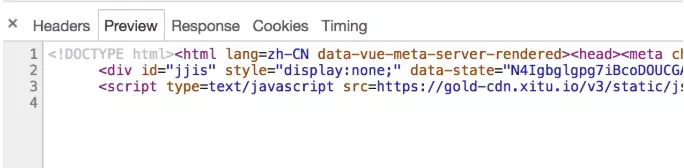
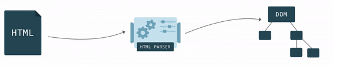
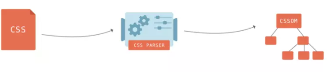
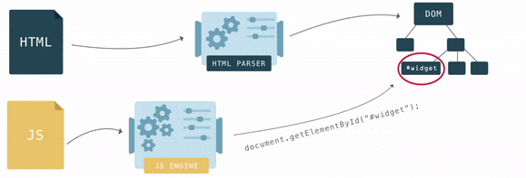
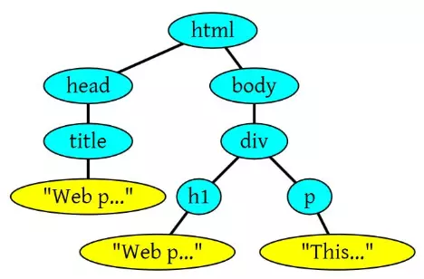
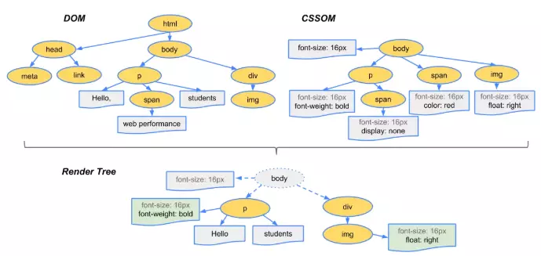
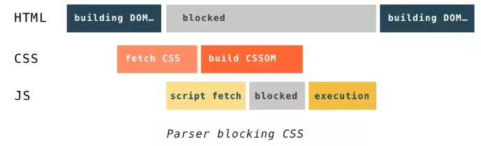
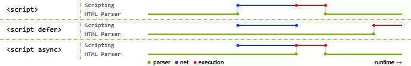

## 来源

转至掘金文章 [你不知道的浏览器页面渲染机制](https://juejin.im/post/5ca0c0abe51d4553a942c17d)

## 浏览器内核

浏览器的内核是指支持浏览器运行的最核心的程序，分为两个部分的，一是渲染引擎，另一个是JS引擎

目前市面上常见的浏览器内核可以分为这四种：Trident（IE）、Gecko（火狐）、Blink（Chrome、Opera）、Webkit（Safari）

## 页面加载过程

简明扼要介绍下页面的加载过程，有助于更好理解后续渲染过程：

1、浏览器根据 DNS 服务器得到域名的 IP 地址

2、向这个 IP 的机器发送 HTTP 请求

3、服务器收到、处理并返回 HTTP 请求

4、浏览器得到返回内容

在浏览器输入URL链接，然后经过 DNS 解析，得到对应的IP（不同时间、地点对应的 IP 可能会不同）。然后浏览器向该 IP 发送 HTTP 请求

服务端接收到 HTTP 请求，然后经过计算（向不同的用户推送不同的内容），返回 HTTP 请求，返回内容示例如下：

HMTL 格式的字符串，因为只有 HTML 格式浏览器才能正确解析，这是 W3C 标准的要求。接下来就是浏览器的渲染过程

## 浏览器渲染过程

### 浏览器解析内容

1、HTML/SVG/XHTML，把HTML结构字符串解析转换DOM树形结构

2、CSS，解析CSS，生成CSSOM规则树，和DOM解构想象

3、JavaScript，等JavaScript脚本文件加载后，通过DOM API 和CSSOM API来操作DOM Tree和CSS Rule Tree

### 浏览器构造Render Tree

解析完成后，浏览器引擎会通过DOM Tree 和 CSS Rule Tree 来构造 Render Tree：

1、Render Tree渲染树不等同于DOM树，渲染树只包括需要显示的节点和这些节点样式信息（如display: none不会在渲染树上）

2、CSS 的 Rule Tree主要是为了完成匹配并把CSS Rule附加上Render Tree上的每个Element（也就是每个Frame）

3、计算每个Frame 的位置，这又叫layout和reflow过程

### 绘制

最后通过调用操作系统Native GUI的API绘制

## 构建DOM

遵循一套步骤将HTML文件转换为DOM树：

1、字节数据 => 字符串

浏览器从磁盘或网络读取HTML原始字节（0和1这些字节数据），根据编码（如UTF-8）转为字符串（也就是我们写的代码）

2、字符串 => Token

将字符串转换为Token，如\<html>、\<body>等。Token中会标识出当前Token是“开始标签”或是“结束标签”亦或是“文本”等信息

Token通过“起始标签”和“结束标签”等标识，维护节点与节点之间的作用

    <head>
        <title>
            Hello
        </title>
    </head>
    
    "Hello" Token位于"title"开始标签与结束标签之间，表明"Hello" Token是"title" Token的子节点
    
    可以将Token理解为通过标识维护节点关系的数据
    
3、Token => Node => DOM

构建过程中，并不会等所有Token都转换完成再生成节点对象，而是一边生成Token一边消耗它来生成节点对象

即每个Token被生成，立即消耗它创建节点对象。**注意：带有结束标签标识的Token不会创建节点对象**

    <html>
    <head>
        <title>Web page parsing</title>
    </head>
    <body>
        

            <h1>Web page parsing</h1>
            
This is an example Web page.

        

    </body>
    </html>
    
    这段HTML会解析如下：
    

## 构建CSSOM

构建CSSOM的构成与构建DOM相似

浏览器接收到一段CSS，识别出Token，构建节点并生成CSSOM

这个过程中，浏览器会确定下一个节点样式，这个过程是很耗性能的，浏览器需要递归CSSOM树，确定具体元素的样式

**注：**

CSS匹配HTML元素是相当复杂和有性能问题的。所以DOM树要小，CSS尽量用id和class，不要过度层叠

## 构建Render Tree渲染树

### 构建过程

浏览器将生产的DOM树和CSSOM树组合为渲染树Render Tree

**渲染树只会包括需要显示的节点和这些节点的样式信息**，像display: none的节点不会在渲染树上显示

### 渲染过程遇到JS文件

渲染过程中，如果遇到\

浏览器不等待后续载入的文档元素，读到JS就立即加载并执行

### 异步\

加载是异步的，不阻止HTML解析过程

但是已经加载好，就会立即执行，无论此刻是HTML解析阶段还是DOMContentLoaded（DOMContentLoaded是在DOM内容加载完成时触发，不需要等待图片等其他资源加载完成，jQuery的$(funciton(){})就是监听它）触发之后

这种方式加载的JS依然会阻塞load事件，即async-script 可能在 DOMContentLoaded 触发之前或之后执行，但一定在 load（全部资源加载完成） 触发之前执行

### 延迟\

JS加载时HTML未停止解析，这2个过程是并行的

整个document解析完毕且defer-script也加载完成后，会执行所有由 defer-script 加载的 JS 代码，然后触发 DOMContentLoaded 事件

载入JS文件时不阻塞 HTML 的解析，执行阶段被放到 HTML 标签解析完成之后

在加载多个JS脚本的时候，async是无顺序的加载，而defer是有顺序的加载

## 为什么说操作DOM慢

DOM是属于渲染引擎的，JS是JS引擎的，我们用JS去操作DOM，这相当于引擎之间的“跨界交流”，这种跨界的交流实现并不简单，每次操作DOM都有开销，操作多了就会产生性能问题

并且不断的操作DOM，也会影响回流与重绘，这样开销是很大的

## 了解回流与重绘

### 浏览器绘制过程

计算CSS样式 => 构建渲染树 => Layout布局 => 绘制

### 重绘

当我们对 DOM 的修改导致了样式的变化、却并未影响其几何属性（比如修改了颜色或背景色）时，浏览器不需重新计算元素的几何属性、直接为该元素绘制新的样式（跳过了回流阶段）

### 回流

当我们对 DOM 的修改引发了 DOM 几何尺寸的变化（比如修改元素的宽、高或隐藏元素等）时，浏览器需要重新计算元素的几何属性（其他元素的几何属性和位置也会因此受到影响），然后再将计算的结果绘制出来。这个过程就是回流（也叫重排/布局）

### 重绘与回流的关联与成本

我们知道，当网页生成的时候，至少会渲染一次。在用户访问的过程中，还会不断重新渲染。重新渲染会重复回流+重绘或者只有重绘。
**回流必定会发生重绘，重绘不一定会引发回流**。重绘和回流会在我们设置节点样式时频繁出现，同时也会很大程度上影响性能。回流所需的成本比重绘高的多，改变父节点里的子节点很可能会导致父节点的一系列回流

### 常见引起回流属性和方法

任何会改变元素几何信息(元素的位置和尺寸大小)的操作，都会触发回流

    添加或者删除可见的DOM元素；
    元素尺寸改变——边距、填充、边框、宽度和高度；
    内容变化，比如用户在input框中输入文字；
    浏览器窗口尺寸改变——resize事件发生时；计算 offsetWidth 和 offsetHeight 属性；
    设置 style 属性的值；
    
### 常见引起重绘属性和方法

    color
    border-style
    visibility
    background
    background-image
    background-position
    background-repeat
    background-size
    text-decoration
    outline
    outline-color
    outline-style
    outline-width
    border-radius
    box-shadow
    
### 如何减少回流、重绘

    使用 transform 替代 top;
    使用 visibility 替换 display: none ，因为前者只会引起重绘，后者会引发回流（改变了布局）;
    不要把节点的属性值放在一个循环里当成循环里的变量。
    
## 性能优化策略

    // 1、使用文档碎片createDocumentFragment
    
    var oMain = document.getElementById('main');
    var frag = document.createDocumentFragment;
    var len = data.length;
    var i,li;
    for(i = 0; i < len; i++ ){
      li = document.createElement('li');
      li.innerText = data[i];
      frag.appendChild(li); // 所有的操作在内存中完成，这个时候不会触发回流
    }
    oMain.appendChild(frag); // 最后一次性添加到页面中，只触发浏览器一次回流

    // 2、innerHTML一次性添加DOM节点
    
    var oMain = document.getElementById('main');
    var sHtml = '';
    var len = data.length;
    var i,li;
    for(i = 0; i < len; i++ ){
      sHtml += '<li>'+ data[i] +'</li>';
    }
    oMain.innerHTMl = sHtml; // 最后一次性添加到页面中，只触发浏览器一次回流
    
    // 3、className来批量修改样式
    ele.style.width = 100 + 'px';
    ele.style.height = 100 + 'px';
    ele.style.backgroundColor = 'red';
    ele.style.border = '1px solid green';
    
    这样会多次触发浏览器重绘和回流，最好把这些样式都写在某个class下，通过className添加这个类名批量修改
    .open {
        width: 100px;
        height: 100px;
        background-color: red;
        border: 1px solid green;
    }
    ele.className += ' open';

