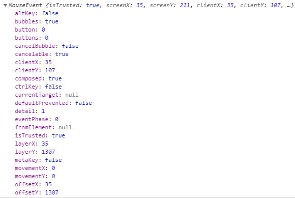
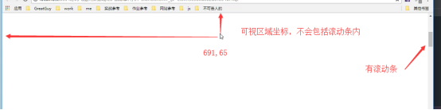
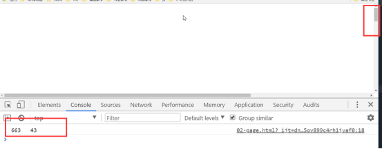
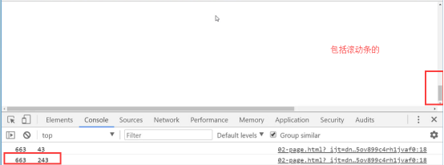
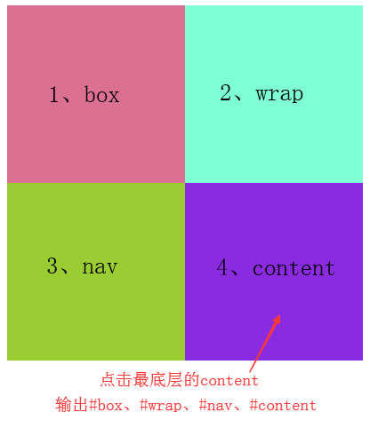

## 鼠标事件

### 事件对象event

    document.onclick = function(e) {
        console.log(e);
    }
    

    // 注
    IE8及其以下无法通过形参获取事件形参e
    
    // 兼容性处理
    document.onclick = function(e) {
        e = e || window.event;
    }
    
### clientX(Y)获取当前可视区域的坐标

    
    document.onclick = function(e) {
        e = e || window.event;
        console.log(e.clientX, e.clientY);
    }
    

### pageX(Y)获取鼠标至页面边缘的坐标

    document.onclick = function(e) {
        e = e || window.event;
        console.log(e.pageX, e.pageY);
    }

    // 注
    兼容性 > IE8
    
    // 解决兼容
    document.onclick = function(e) {
        e = e || window.event;
        console.log(document.body.scrollLeft || document.documentElement.scrollLeft + e.clientX);
        console.log(document.body.scrollTop || document.documentElement.scrollTop + e.clientY);
    }
    
## 事件冒泡

### 什么是事件冒泡？

当一个元素接收到事件时，首先会先触发自己的事件，然后把它接收到的事件往上传递，传给自己的父级，如果父级也有这个事件则触发，依次向上，一直到window

    // 示例
    

        

            ...
        

    

    
    var oBox = document.getElementById('box');
    // 1、分别给box、wrap、document绑定点击事件
    oBox.children[0].onclick = function() {
        console.log('wrap');
    }
    oBox.onclick = function() {
        console.log('box');
    }
    document.onclick = function() {
        console.log('document');
    }
    
    // 2、点击wrap
    输出'wrap'、'box'、'document'
    
    // 注
    只要元素层次关系是父子，就会往上传，即使wrap被定位到离父级box很远的地方
    
### 阻止冒泡
    
#### stopPropagation

    

        

            ...
        

    

    
    var oBox = document.getElementById('box');
    
    oBox.children[0].onclick = function(e) {
        e = e || window.event;
        e.stopPropagation(); // 1、阻止冒泡
        console.log('wrap');
    }
    oBox.onclick = function() {
        console.log('box');
    }
    document.onclick = function() {
        console.log('document');
    }
    
    // 2、点击wrap
    输出'wrap'，不会往上冒泡给box了（要从当前这个源对象上阻止才行）
    
    // 注
    兼容性 > IE8
    
#### cancelBubble

    

        

            ...
        

    

    
    var oBox = document.getElementById('box');
    
    oBox.children[0].onclick = function(e) {
        e = e || window.event;
        e.cancelBubble = true; // 1、阻止冒泡，默认是false
        console.log('wrap');
    }
    oBox.onclick = function() {
        console.log('box');
    }
    document.onclick = function() {
        console.log('document');
    }
    
    // 注
    IE都兼容，一些低版本的主流浏览器不兼容
    
## 事件监听addEventListener

### 原始的DOM 0级和addEventLister

    // 原始DOM 0级 （onclick那些onXXX）
    优点：兼容所有浏览器
    缺点：一个对象只能绑定一个事件
    
    // DOM 2级 addEventerLister
    优点：一个对象能可以绑定多个相同的事件
    缺点：兼容性 > IE8
    
    // 示例一
    
    // 1、绑定2个点击事件（addEventListener不带on前缀）
    oBox.addEventListener('click', function() {
        console.log(1);
    })
    oBox.addEventListener('click', function() {
        console.log(2);
    })
    
    // 2、点击box
    输出1、2（都可以打印出来）
    
    / 示例二
        
    // 1、绑定2个点击事件（addEventListener不带on前缀）
    oBox.onclick = function() {
        console.log(1);
    }
    oBox.addEventListener('click', function() {
        console.log(2);
    })
    
    // 2、点击box
    输出1、2（都可以打印出来，DOM 0级和2级互不影响，根据代码顺序执行）
    
### attachEvent

    addEventListener 兼容性前面提到 > IE8
    在IE下可以使用attachEvent来替代
    
    // 1、绑定2个attachEvent事件（attachEvent需要带上on前缀）
    oBox.attachEvent('onclick', function() {
        console.log(1);
    })
    oBox.attachEvent('onclick', function() {
        console.log(2);
    })
    
    // 2、点击box
    输出2、1（attachEvent先绑定的后执行）
    
### removeEventListener

    存在绑定事件，相反的就存在解绑事件，所以addEventListener尽量不要用匿名函数
    
    // 1、绑定事件
    oBox.addEventListener('click', fn);
    function fn() {
        console.log(1);
    }
    
    // 2、移除绑定
    oBox.removeEventListener('click', fn);
    
### detachEvent

    同removeEventListener，对IE下attachEvent的解绑函数为detachEvent
    
    // 1、绑定事件
    oBox.attachEvent('onclick', function() {
        console.log(1);
    })
    function fn() {
        console.log(1);
    }
    
    // 2、移除绑定
    oBox.detachEvent('onclick', fn);
    
## 事件捕获

事件捕获与冒泡相反，是从上往下捕获
    
    // 用法
    addEventListener('click', fn, true) 第3个参数设置true代表捕获
    
    // 示例
    

        

            

                

            

        

    

    
    div {
        position: absolute;
        width: 200px;
        height: 200px;
    }
    #box {
        background-color: palevioletred;
    }
    #wrap {
        background-color: aquamarine;
        left: 200px;
    }
    #nav {
        background-color: yellowgreen;
        left: -200px;
        top: 200px;
    }
    #content {
        background-color: blueviolet;
        left: 200px;
    }
    
    var box = document.getElementById('box');
    var wrap = document.getElementById('wrap');
    var nav = document.getElementById('nav');
    var content = document.getElementById('content');
    box.addEventListener('click', fn, true); // 1、设置box捕获
    wrap.addEventListener('click', fn, true); // 2、设置wrap捕获
    nav.addEventListener('click', fn, true); // 3、设置nav捕获
    content.addEventListener('click', fn, true); // 4、设置content捕获
    function fn() {
        console.log(this);
    }
    
    // 图示如下

    流程：点击content => 从上往下看 => box可捕获，触发 => wrap可捕获，触发
     => nav可捕获，触发 => content可捕获，触发
    
    
    // 调整代码一
    box.addEventListener('click', fn, false); // 最顶层box设置不可捕获
    wrap.addEventListener('click', fn, true);
    nav.addEventListener('click', fn, true);
    content.addEventListener('click', fn, true);
    
    输出：#wrap、#nav、#content、#box
    流程：点击content => 从上往下看 => box不可捕获，跳过 => wrap可捕获，触发
    => nav可捕获，触发 => content可捕获，触发 => 冒泡 => 冒泡到box，触发
    
    
    // 调整代码二
    box.addEventListener('click', fn, true);
    wrap.addEventListener('click', fn, false);
    nav.addEventListener('click', fn, true);
    content.addEventListener('click', function(e) {
        e = e || window.event;
        e.stopPropagation(); // 阻止冒泡
    }, false);
    
    输出：#box、#nav、#content
    流程：点击content => 从上往下看 => box可捕获，触发 => wrap不可捕获，跳过
    => nav可捕获，触发 => content不可捕获，但它是事件源，触发 => 冒泡 => 发现不可冒泡，结束
    
 