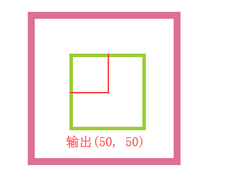

## 鼠标事件

### 事件对象event

    document.onclick = function(e) {
        console.log(e);
    }
    

    // 注
    IE8及其以下无法通过形参获取事件形参e
    
    // 兼容性处理
    document.onclick = function(e) {
        e = e || window.event;
    }
    
### clientX(Y)获取当前可视区域的坐标

    
    document.onclick = function(e) {
        e = e || window.event;
        console.log(e.clientX, e.clientY);
    }
    

### pageX(Y)获取鼠标至页面边缘的坐标

    document.onclick = function(e) {
        e = e || window.event;
        console.log(e.pageX, e.pageY);
    }

    // 注
    兼容性 > IE8
    
    // 解决兼容
    document.onclick = function(e) {
        e = e || window.event;
        console.log(document.body.scrollLeft || document.documentElement.scrollLeft + e.clientX);
        console.log(document.body.scrollTop || document.documentElement.scrollTop + e.clientY);
    }
    
### layerX(Y)获取鼠标点击位置与定位父级的偏移值

    从鼠标点击位置找到最近的定位父级，得到鼠标点击位置与其的偏移量；
    如果没有找到定位父级，则相对页面计算偏移，等同于pageX(Y);
    
    

        

            ...
        

    

    
    #wrap {
        position: relative; // 1、定位父级
        width: 200px;
        height: 200px;
        border: 10px solid palevioletred;
        ...
    }
    .content {
        width: 100px;
        height: 100px;
        border: 5px solid yellowgreen;
        ...
    }
    
    var content = document.querySelector('.content');
    // 2、content绑定点击事件
    content.onclick = function(e) {
        e = e || window.event;
        console.log(e.layerX, e.layerY);
    }
    

    // 将content自身也设置定位
    .content {
        position: relative;
        ...
    }
    

    // 注
    1、如果自身也设置定位，定位父级是会变成自己的，因为是找离鼠标最近的定位元素
    2、兼容性 > IE8
    
    // <= IE解决方法
    content.onclick = function(e) {
        e = e || window.event;
        console.log(e.layerX || e.x, e.layerY || e.y); // 使用e.x和e.y替代
    }

    
    
## 事件冒泡

### 什么是事件冒泡？

当一个元素接收到事件时，首先会先触发自己的事件，然后把它接收到的事件往上传递，传给自己的父级，如果父级也有这个事件则触发，依次向上，一直到window

    // 示例
    

        

            ...
        

    

    
    var oBox = document.getElementById('box');
    // 1、分别给box、wrap、document绑定点击事件
    oBox.children[0].onclick = function() {
        console.log('wrap');
    }
    oBox.onclick = function() {
        console.log('box');
    }
    document.onclick = function() {
        console.log('document');
    }
    
    // 2、点击wrap
    输出'wrap'、'box'、'document'
    
    // 注
    只要元素层次关系是父子，就会往上传，即使wrap被定位到离父级box很远的地方
    
### 阻止冒泡
    
#### stopPropagation

    

        

            ...
        

    

    
    var oBox = document.getElementById('box');
    
    oBox.children[0].onclick = function(e) {
        e = e || window.event;
        e.stopPropagation(); // 1、阻止冒泡
        console.log('wrap');
    }
    oBox.onclick = function() {
        console.log('box');
    }
    document.onclick = function() {
        console.log('document');
    }
    
    // 2、点击wrap
    输出'wrap'，不会往上冒泡给box了（要从当前这个源对象上阻止才行）
    
    // 注
    兼容性 > IE8
    
#### cancelBubble

    

        

            ...
        

    

    
    var oBox = document.getElementById('box');
    
    oBox.children[0].onclick = function(e) {
        e = e || window.event;
        e.cancelBubble = true; // 1、阻止冒泡，默认是false
        console.log('wrap');
    }
    oBox.onclick = function() {
        console.log('box');
    }
    document.onclick = function() {
        console.log('document');
    }
    
    // 注
    IE都兼容，一些低版本的主流浏览器不兼容
    
## 事件监听addEventListener

### 原始的DOM 0级和addEventLister

    // 原始DOM 0级 （onclick那些onXXX）
    优点：兼容所有浏览器
    缺点：一个对象只能绑定一个事件
    
    // DOM 2级 addEventerLister
    优点：一个对象能可以绑定多个相同的事件
    缺点：兼容性 > IE8
    
    // 示例一
    
    // 1、绑定2个点击事件（addEventListener不带on前缀）
    oBox.addEventListener('click', function() {
        console.log(1);
    })
    oBox.addEventListener('click', function() {
        console.log(2);
    })
    
    // 2、点击box
    输出1、2（都可以打印出来）
    
    / 示例二
        
    // 1、绑定2个点击事件（addEventListener不带on前缀）
    oBox.onclick = function() {
        console.log(1);
    }
    oBox.addEventListener('click', function() {
        console.log(2);
    })
    
    // 2、点击box
    输出1、2（都可以打印出来，DOM 0级和2级互不影响，根据代码顺序执行）
    
### attachEvent

    addEventListener 兼容性前面提到 > IE8
    在IE下可以使用attachEvent来替代
    
    // 1、绑定2个attachEvent事件（attachEvent需要带上on前缀）
    oBox.attachEvent('onclick', function() {
        console.log(1);
    })
    oBox.attachEvent('onclick', function() {
        console.log(2);
    })
    
    // 2、点击box
    输出2、1（attachEvent先绑定的后执行）
    
### removeEventListener

    存在绑定事件，相反的就存在解绑事件，所以addEventListener尽量不要用匿名函数
    
    // 1、绑定事件
    oBox.addEventListener('click', fn);
    function fn() {
        console.log(1);
    }
    
    // 2、移除绑定
    oBox.removeEventListener('click', fn);
    
### detachEvent

    同removeEventListener，对IE下attachEvent的解绑函数为detachEvent
    
    // 1、绑定事件
    oBox.attachEvent('onclick', function() {
        console.log(1);
    })
    function fn() {
        console.log(1);
    }
    
    // 2、移除绑定
    oBox.detachEvent('onclick', fn);
    
## 事件捕获

事件捕获与冒泡相反，是从上往下捕获
    
    // 用法
    addEventListener('click', fn, true) 第3个参数设置true代表捕获
    
    // 示例
    

        

            

                

            

        

    

    
    div {
        position: absolute;
        width: 200px;
        height: 200px;
    }
    #box {
        background-color: palevioletred;
    }
    #wrap {
        background-color: aquamarine;
        left: 200px;
    }
    #nav {
        background-color: yellowgreen;
        left: -200px;
        top: 200px;
    }
    #content {
        background-color: blueviolet;
        left: 200px;
    }
    
    var box = document.getElementById('box');
    var wrap = document.getElementById('wrap');
    var nav = document.getElementById('nav');
    var content = document.getElementById('content');
    box.addEventListener('click', fn, true); // 1、设置box捕获
    wrap.addEventListener('click', fn, true); // 2、设置wrap捕获
    nav.addEventListener('click', fn, true); // 3、设置nav捕获
    content.addEventListener('click', fn, true); // 4、设置content捕获
    function fn() {
        console.log(this);
    }
    
    // 图示如下

    流程：点击content => 从上往下看 => box可捕获，触发 => wrap可捕获，触发
     => nav可捕获，触发 => content可捕获，触发
    
    
    // 调整代码一
    box.addEventListener('click', fn, false); // 最顶层box设置不可捕获
    wrap.addEventListener('click', fn, true);
    nav.addEventListener('click', fn, true);
    content.addEventListener('click', fn, true);
    
    输出：#wrap、#nav、#content、#box
    流程：点击content => 从上往下看 => box不可捕获，跳过 => wrap可捕获，触发
    => nav可捕获，触发 => content可捕获，触发 => 冒泡 => 冒泡到box，触发
    
    
    // 调整代码二
    box.addEventListener('click', fn, true);
    wrap.addEventListener('click', fn, false);
    nav.addEventListener('click', fn, true);
    content.addEventListener('click', function(e) {
        e = e || window.event;
        e.stopPropagation(); // 阻止冒泡
    }, false);
    
    输出：#box、#nav、#content
    流程：点击content => 从上往下看 => box可捕获，触发 => wrap不可捕获，跳过
    => nav可捕获，触发 => content不可捕获，但它是事件源，触发 => 冒泡 => 发现不可冒泡，结束
    
## 事件代理

    <ul id='box'>
        <li>1</li>
        <li>2</li>
        <li>3</li>
        <li>4</li>
        <li>5</li>
        <li>6</li>
        <li>7</li>
        <li>8</li>
        <li>9</li>
        <li>10</li>
    </ul>
    
    var oBox = document.getElementById('box'),
        oLis = oBox.children,
        len = oLis.length;
    
    // 不好的做法
    for(var i = 0;i < len; i++) {
        oLis[i].onclick = function() {
            console.log(this.innerHTML);
        }
    }
    给每个li都循环绑定事件不仅耗性能，还占据大量内存空间
    
    // 使用事件委托
    oBox.onclick = function(e) {
        e = e || window.event;
        console.log(e.target); // e.target获取事件源
    }
    

    // 注
    兼容性 > IE8
    
    // 解决方式：IE下用srcElement代替
    oBox.onclick = function(e) {
        e = e || window.event;
        console.log(e.target || e.srcElement);
    }
    
## 阻止默认事件

DOM在操作时有许多默认事件

例如：当前焦点在input输入框中，点击某个div，input将失去焦点，如果不想让它失去焦点，可以给div的mousedown事件阻止默认行为

### DOM 0级的阻止默认
    
    // 禁止浏览器右键默认行为（右键出现菜单栏）
    document.oncontextmenu = function() {
        return false; // DOM 0级通过return false阻止默认行为
    }
    
    // 注
    这种方式只有DOM 0级有效，addEventListener无效
    
### addEventListener的阻止默认

    document.addEventListener('contextmenu', function(e) {
        e = e || window.event;
        e.preventDefault();
    })
    
    // 注
    兼容性 > IE8
    
### IE下兼容的阻止默认
    
    // 不要遗漏on前缀
    document.attachEvent('oncontextmenu', function(e) {
        e = e || window.event;
        e.returnValue = false;
    })
    
## 鼠标滚轮事件

### 常规鼠标滚轮事件

**对比onscroll：**

onmousewheel是鼠标滚轮事件

onscroll的滚动条滚动事件

在2个事件同时绑定的情况下，触发onmousewheel的同时也会触发onscroll

onscroll触发频率很高

onmousewheel鼠标滚轮滚动一格触发一次

**基本写法：**
    
    document.onmousewheel = function() {
        ...
    }
    document.addEventListener('mousewheel', function() {
        ...
    })
    
    // 注
    mousewheel在火狐下不兼容

### 火狐鼠标滚轮事件

    // 火狐下使用DOMMouseScroll来替代
    
    document.addEventListener('DOMMouseScroll', function() {
        ...
    })
    
    // 注
    只能用addEventListener来添加
    
### 获取滚动方向（非火狐）

    document.addEventListener('mousewheel', function(e) {
        e = e || window.event;
        console.log(e.wheelDelta); // 1、使用e.wheelDelta判断方向
    })
    
    // 2、慢慢向下滚动，输出-120，滚动快会变成-240、-480...（-120倍数）
    // 3、慢慢向上滚动，输出120，滚动快会变成240、480...（-120倍数）
    
    // 结论
    往上滚是正数120n、往下滚是负数-120n
    
    // 注
    IE下也兼容，也是用e.wheelDelta判断
    
### 获取滚动方向（火狐）

    document.addEventListener('DOMMouseScroll', function(e) {
        e = e || window.event;
        console.log(e.detail); // 1、使用e.detail判断方向
    })
    
    // 2、慢慢向下滚动，输出3，滚动快会变成6、9...（3倍数）
    // 3、慢慢向上滚动，输出-3，滚动快会变成-6、-9...（-3倍数）
    
    // 结论
    往上滚是负数-3n、往下滚是正数3n
    
### 封装鼠标滚轮事件
    
    // 封装滚轮函数
    function mouseWheel(dom, fn) {
        // 判断是否是火狐（非火狐是null、火狐是undefined）
        const type = document.onmousewheel === null ? 'mousewheel' : "DOMMouseScroll";
        // 判断是否兼容addEventListener
        window.addEventListener ? dom.addEventListener(type, transform)
            : dom.attachEvent('on ' + type, transform);

        function transform(e) {
            e = e || window.event;
            // 滚动方向统一
            const direction = e.wheelDelta / 120 || -e.detail / 3;
            fn.call(dom, e, direction);
        }
    }
    
    // 使用方式
    mouseWheel(document, function(e, direction) {
        direction > 0 ? console.log('向上滚动') : console.log('向下滚动');
    })