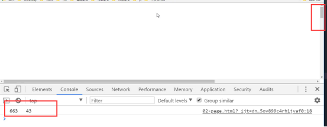
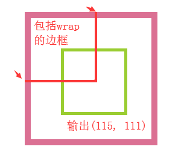
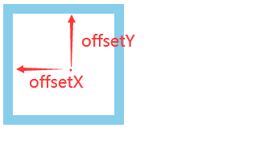
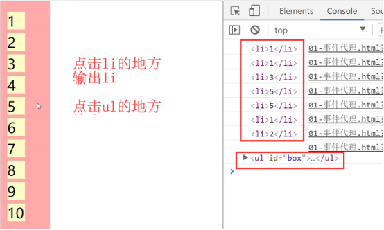

## 鼠标事件

### 事件对象event

```js
document.onclick = function(e) {
    console.log(e);
}
```
    


```js
// 注
IE8及其以下无法通过形参获取事件形参e

// 兼容性处理
document.onclick = function(e) {
    e = e || window.event;
}
```
    
### clientX(Y)获取当前可视区域的坐标

```js
document.onclick = function(e) {
    e = e || window.event;
    console.log(e.clientX, e.clientY);
}
```
    


### pageX(Y)获取鼠标至页面边缘的坐标

```js
document.onclick = function(e) {
    e = e || window.event;
    console.log(e.pageX, e.pageY);
}
```




```js
// 注
兼容性 > IE8

// 解决兼容
document.onclick = function(e) {
    e = e || window.event;
    console.log(document.body.scrollLeft || document.documentElement.scrollLeft + e.clientX);
    console.log(document.body.scrollTop || document.documentElement.scrollTop + e.clientY);
}
```
    
### layerX(Y)获取鼠标点击位置与定位父级的偏移值

```html
从鼠标点击位置找到最近的定位父级，得到鼠标点击位置与其的偏移量；
如果没有找到定位父级，则相对页面计算偏移，等同于pageX(Y);

<div id="wrap">
    <div class="content">
        ...
    </div>
</div>
```
    
```css
#wrap {
    position: relative; // 1、定位父级
    width: 200px;
    height: 200px;
    border: 10px solid palevioletred;
    ...
}
.content {
    width: 100px;
    height: 100px;
    border: 5px solid yellowgreen;
    ...
}
```

```js
var content = document.querySelector('.content');
// 2、content绑定点击事件
content.onclick = function(e) {
    e = e || window.event;
    console.log(e.layerX, e.layerY);
}
```
    


```css
// 将content自身也设置定位
.content {
    position: relative;
    ...
}
```
    


```js
// 注
1、如果自身也设置定位，定位父级是会变成自己的，因为是找离鼠标最近的定位元素
2、兼容性 > IE8

// <= IE解决方法
content.onclick = function(e) {
    e = e || window.event;
    console.log(e.layerX || e.x, e.layerY || e.y); // 使用e.x和e.y替代
}
```
    
### offsetX(Y) 获取鼠标至目标元素边缘的坐标

```css
div {
    width: 100px;
    height: 100px;
    border: 10px solid skyblue;
}
```

```html
<div />
```

```js
var div = document.querySelector('div');
div.onclick = function(e) {
    console.log(e.offsetX, e.offsetY);
}
```



值得注意的是：offsetX(Y) 是相对于**目标元素**，可以理解为 e.target，也就是说，如果是**事件代理**（此小节下面会讲到），是相对于目标节点，而不是事件绑定节点

```html
<ul>
    <li>1</li>
    <li>2</li>
    <li>3</li>
</ul>
```

```js
var ul = document.querySelector('ul');
ul.onclick = function(e) {
    // e.target 是 li
    // offsetX(Y) 是相当于 li 自身，而不是 ul
    console.log(e.target, e.offsetX, e.offsetY);
}
```

## 事件冒泡

### 什么是事件冒泡？

当一个元素接收到事件时，首先会先触发自己的事件，然后把它接收到的事件往上传递，传给自己的父级，如果父级也有这个事件则触发，依次向上，一直到window

```html
// 示例
<div id='box'>
    <div class='wrap'>
        ...
    </div>
</div>
```
    
```js
var oBox = document.getElementById('box');
// 1、分别给box、wrap、document绑定点击事件
oBox.children[0].onclick = function() {
    console.log('wrap');
}
oBox.onclick = function() {
    console.log('box');
}
document.onclick = function() {
    console.log('document');
}

// 2、点击wrap
输出'wrap'、'box'、'document'

// 注
只要元素层次关系是父子，就会往上传，即使wrap被定位到离父级box很远的地方
```
    
### 阻止冒泡
    
#### stopPropagation

```html
<div id='box'>
    <div class='wrap'>
        ...
    </div>
</div>
```
    
```js
var oBox = document.getElementById('box');

oBox.children[0].onclick = function(e) {
    e = e || window.event;
    e.stopPropagation(); // 1、阻止冒泡
    console.log('wrap');
}
oBox.onclick = function() {
    console.log('box');
}
document.onclick = function() {
    console.log('document');
}

// 2、点击wrap
输出'wrap'，不会往上冒泡给box了（要从当前这个源对象上阻止才行）

// 注
兼容性 > IE8
```
    
#### cancelBubble

```html
<div id='box'>
    <div class='wrap'>
        ...
    </div>
</div>
```
    
```js
var oBox = document.getElementById('box');

oBox.children[0].onclick = function(e) {
    e = e || window.event;
    e.cancelBubble = true; // 1、阻止冒泡，默认是false
    console.log('wrap');
}
oBox.onclick = function() {
    console.log('box');
}
document.onclick = function() {
    console.log('document');
}

// 注
IE都兼容，一些低版本的主流浏览器不兼容
```
    
## 事件监听addEventListener

### 原始的DOM 0级和addEventLister

```js
// 原始DOM 0级 （onclick那些onXXX）
优点：兼容所有浏览器
缺点：一个对象只能绑定一个事件

// DOM 2级 addEventerLister
优点：一个对象能可以绑定多个相同的事件
缺点：兼容性 > IE8

// 示例一

// 1、绑定2个点击事件（addEventListener不带on前缀）
oBox.addEventListener('click', function() {
    console.log(1);
})
oBox.addEventListener('click', function() {
    console.log(2);
})

// 2、点击box
输出1、2（都可以打印出来）

/ 示例二
    
// 1、绑定2个点击事件（addEventListener不带on前缀）
oBox.onclick = function() {
    console.log(1);
}
oBox.addEventListener('click', function() {
    console.log(2);
})

// 2、点击box
输出1、2（都可以打印出来，DOM 0级和2级互不影响，根据代码顺序执行）
```
    
### attachEvent

```js
addEventListener 兼容性前面提到 > IE8
在IE下可以使用attachEvent来替代

// 1、绑定2个attachEvent事件（attachEvent需要带上on前缀）
oBox.attachEvent('onclick', function() {
    console.log(1);
})
oBox.attachEvent('onclick', function() {
    console.log(2);
})

// 2、点击box
输出2、1（attachEvent先绑定的后执行）
```
    
### removeEventListener

```js
存在绑定事件，相反的就存在解绑事件，所以addEventListener尽量不要用匿名函数

// 1、绑定事件
oBox.addEventListener('click', fn);
function fn() {
    console.log(1);
}

// 2、移除绑定
oBox.removeEventListener('click', fn);
```
    
### detachEvent

```js
同removeEventListener，对IE下attachEvent的解绑函数为detachEvent

// 1、绑定事件
oBox.attachEvent('onclick', function() {
    console.log(1);
})
function fn() {
    console.log(1);
}

// 2、移除绑定
oBox.detachEvent('onclick', fn);
```
    
## 事件捕获

事件捕获与冒泡相反，是从上往下捕获
    
```js
// 用法
addEventListener('click', fn, true) 第3个参数设置true代表捕获
```

```html
// 示例
<div id="box">
    <div id="wrap">
        <div id="nav">
            <div id="content"></div>
        </div>
    </div>
</div>
```

```css
div {
    position: absolute;
    width: 200px;
    height: 200px;
}
#box {
    background-color: palevioletred;
}
#wrap {
    background-color: aquamarine;
    left: 200px;
}
#nav {
    background-color: yellowgreen;
    left: -200px;
    top: 200px;
}
#content {
    background-color: blueviolet;
    left: 200px;
}
```

```js
var box = document.getElementById('box');
var wrap = document.getElementById('wrap');
var nav = document.getElementById('nav');
var content = document.getElementById('content');
box.addEventListener('click', fn, true); // 1、设置box捕获
wrap.addEventListener('click', fn, true); // 2、设置wrap捕获
nav.addEventListener('click', fn, true); // 3、设置nav捕获
content.addEventListener('click', fn, true); // 4、设置content捕获
function fn() {
    console.log(this);
}

// 图示如下
```


```js
流程：点击content => 从上往下看 => box可捕获，触发 => wrap可捕获，触发
    => nav可捕获，触发 => content可捕获，触发


// 调整代码一
box.addEventListener('click', fn, false); // 最顶层box设置不可捕获
wrap.addEventListener('click', fn, true);
nav.addEventListener('click', fn, true);
content.addEventListener('click', fn, true);

输出：#wrap、#nav、#content、#box
流程：点击content => 从上往下看 => box不可捕获，跳过 => wrap可捕获，触发
=> nav可捕获，触发 => content可捕获，触发 => 冒泡 => 冒泡到box，触发


// 调整代码二
box.addEventListener('click', fn, true);
wrap.addEventListener('click', fn, false);
nav.addEventListener('click', fn, true);
content.addEventListener('click', function(e) {
    e = e || window.event;
    e.stopPropagation(); // 阻止冒泡
}, false);

输出：#box、#nav、#content
流程：点击content => 从上往下看 => box可捕获，触发 => wrap不可捕获，跳过
=> nav可捕获，触发 => content不可捕获，但它是事件源，触发 => 冒泡 => 发现不可冒泡，结束
```

## 事件反穿透

我们可能在如下场景时遇到困扰:

```css
.wrap {
    position: relative;
    width: 100px;
    height: 100px;
    background-color: #8AC763;
}
.content {
    box-sizing: border-box;
    height: 100%;
}
.mask {
    position: absolute;
    width: 100%;
    height: 100%;
    left: 0;
    top: 0;
    z-index: 2;
    background-color: rgba(0, 0, 0, .15);
}
```

```html
<div class="wrap">
    <div class="content">...</div>
    <div class="mask">...</div>
</div>
```

```js
var content = document.querySelector('.content');
content.onclick = function () {
    console.log(123);
}
```
    
由于遮罩层的阻挡，我们无法触发 content 的点击事件

**解决方法:**

```css
.mask {
    ...
    pointer-events: none; // 移除 mask 的事件
}
```


## 事件代理

```html
<ul id='box'>
    <li>1</li>
    <li>2</li>
    <li>3</li>
    <li>4</li>
    <li>5</li>
    <li>6</li>
    <li>7</li>
    <li>8</li>
    <li>9</li>
    <li>10</li>
</ul>
```

```js
var oBox = document.getElementById('box'),
    oLis = oBox.children,
    len = oLis.length;

// 不好的做法
for(var i = 0;i < len; i++) {
    oLis[i].onclick = function() {
        console.log(this.innerHTML);
    }
}
给每个li都循环绑定事件不仅耗性能，还占据大量内存空间

// 使用事件代理
oBox.onclick = function(e) {
    e = e || window.event;
    console.log(e.target); // e.target获取事件源
}
```
    


```js
// 注
兼容性 > IE8

// 解决方式：IE下用srcElement代替
oBox.onclick = function(e) {
    e = e || window.event;
    console.log(e.target || e.srcElement);
}

// 注
除了 e.target，还有 e.currentTarget

e.target 指向事件触发对象
e.currentTarget 指向绑定事件对象

如上：
oBox.onclick = function(e) {
    ...
}

这里 e.currentTarget 指向 oBox
```

> 如果 li 里又有 span 等其他元素，当我们只希望事件代理的 e.target 拿到的最底层只到 li 而非里面的子节点，要怎么做呢？可以在子节点加 pointer-events: none（不能给子节点的事件加 stopPropagation 阻止冒泡，这会导致 span 点击无法冒泡，都触发不了 li 的事件）
    
## 阻止默认事件

DOM在操作时有许多默认事件

例如：当前焦点在input输入框中，点击某个div，input将失去焦点，如果不想让它失去焦点，可以给div的mousedown事件阻止默认行为

### DOM 0级的阻止默认
    
```js
// 禁止浏览器右键默认行为（右键出现菜单栏）
document.oncontextmenu = function() {
    return false; // DOM 0级通过return false阻止默认行为
}

// 注
这种方式只有DOM 0级有效，addEventListener无效
```
    
### addEventListener的阻止默认

```js
document.addEventListener('contextmenu', function(e) {
    e = e || window.event;
    e.preventDefault();
})

// 注
兼容性 > IE8
```
    
### IE下兼容的阻止默认
    
```js
// 不要遗漏on前缀
document.attachEvent('oncontextmenu', function(e) {
    e = e || window.event;
    e.returnValue = false;
})
```
    
## 鼠标滚轮事件

### 常规鼠标滚轮事件

**对比onscroll：**

onmousewheel是鼠标滚轮事件

onscroll的滚动条滚动事件

在2个事件同时绑定的情况下，触发onmousewheel的同时也会触发onscroll

onscroll触发频率很高

onmousewheel鼠标滚轮滚动一格触发一次

**基本写法：**
    
```js
document.onmousewheel = function() {
    ...
}
document.addEventListener('mousewheel', function() {
    ...
})

// 注
mousewheel在火狐下不兼容
```

### 火狐鼠标滚轮事件

```js
// 火狐下使用DOMMouseScroll来替代

document.addEventListener('DOMMouseScroll', function() {
    ...
})

// 注
只能用addEventListener来添加
```
    
### 获取滚动方向（非火狐）

```js
document.addEventListener('mousewheel', function(e) {
    e = e || window.event;
    console.log(e.wheelDelta); // 1、使用e.wheelDelta判断方向
})

// 2、慢慢向下滚动，输出-120，滚动快会变成-240、-480...（-120倍数）
// 3、慢慢向上滚动，输出120，滚动快会变成240、480...（-120倍数）

// 结论
往上滚是正数120n、往下滚是负数-120n

// 注
IE下也兼容，也是用e.wheelDelta判断
```
    
### 获取滚动方向（火狐）

```js
document.addEventListener('DOMMouseScroll', function(e) {
    e = e || window.event;
    console.log(e.detail); // 1、使用e.detail判断方向
})

// 2、慢慢向下滚动，输出3，滚动快会变成6、9...（3倍数）
// 3、慢慢向上滚动，输出-3，滚动快会变成-6、-9...（-3倍数）

// 结论
往上滚是负数-3n、往下滚是正数3n
```
    
### 封装鼠标滚轮事件
    
```js
// 封装滚轮函数
function mouseWheel(dom, fn) {
    // 判断是否是火狐（非火狐是null、火狐是undefined）
    const type = document.onmousewheel === null ? 'mousewheel' : "DOMMouseScroll";
    // 判断是否兼容addEventListener
    window.addEventListener ? dom.addEventListener(type, transform)
        : dom.attachEvent('on ' + type, transform);

    function transform(e) {
        e = e || window.event;
        // 滚动方向统一
        const direction = e.wheelDelta / 120 || -e.detail / 3;
        fn.call(dom, e, direction);
    }
}

// 使用方式
mouseWheel(document, function(e, direction) {
    direction > 0 ? console.log('向上滚动') : console.log('向下滚动');
})
```