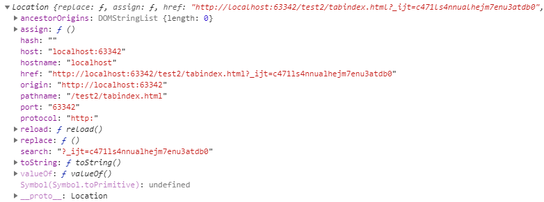
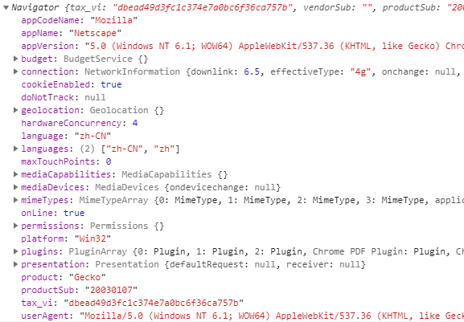
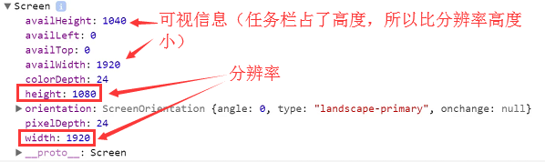
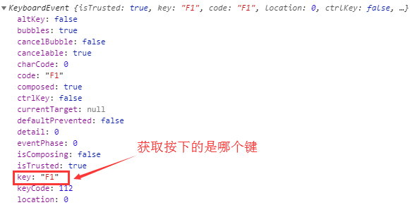
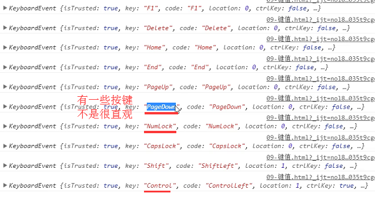
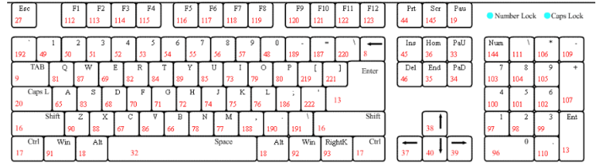
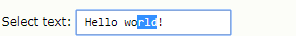

## BOM

浏览器对象模型

### location

浏览器信息对象，存储着浏览器的一些常规信息

    
    1、href    
    // 说明：设置或返回完整的URL
    // 示例URL：https://www.wangsucloud.com/#/help/search?search=yun
    
    console.log(window.location.href); // 'https://www.wangsucloud.com/#/help/search?search=yun'
    window.location.href = 'https://www.bilibili.com/'; // 跳转到bilibili.com
    
    2、search
    // 说明：设置或返回url?后面的内容
    // 示例URL：https://www.wangsucloud.com/#/help/search?search=yun

    console.log(window.location.search); // ''，这种/#/链接后面带的?，location.search取不到
    window.location.href = 'https://www.baidu.com/?tn=78040160_26_pg&ch=1';
    console.log(window.location.search); // '?tn=78040160_26_pg&ch=1'
    window.location.search = '?t=2019'; // 设置search，会刷新页面
    
    3、hash
    // 说明：设置或返回#后面的内容，hash值。像框架的SPA单页应用，就是利用hash值的改变配合H5的API，做到不刷新的切换不同页面
    // 示例URL：https://www.wangsucloud.com/#/help/search?search=yun
    
    console.log(window.location.hash); // '#/help/search?search=yun'
    window.location.hash = '#/home'; // 设置hash，不会刷新页面
    
    4、port
    // 说明：设置或返回当前URL的端口号
    // 示例URL：http://localhost:63342/test2/offsetTop.html?_ijt=3h0agqrui4veqtmv9nvko4g4m5
    
    console.log(window.location.port); // '63342'
    window.location.port = 8080; // 设置端口号，会刷新页面
    
    5、hostname
    // 说明：设置或返回当前URL主机名
    // 示例URL：https://www.wangsucloud.com/#/help/search?search=yun
    
    console.log(window.location.hostname); // 'www.wangsucloud.com'
    window.location.hostname = 'www.baidu.com'; // 切换主机名，URL变为'https://www.baidu.com/#/help/search?search=yun'，会刷新页面
    
    6、host
    // 说明：设置或返回主机名和当前URL端口号
    // 示例URL：http://localhost:63342/test2/offsetTop.html?_ijt=3h0agqrui4veqtmv9nvko4g4m5
    
    console.log(window.location.host); // 'localhost:63342'
    window.location.host = 'localhost:8080'; // 设置主机名和端口，会刷新页面
    window.location.href = 'https://www.wangsucloud.com';
    console.log(window.location.host); // 'www.wangsucloud.com'，没有端口号等于hostname
    
    7、pathname
    // 说明：设置或返回当前URL的路径部分
    // 示例URL：http://localhost:63342/test2/offsetTop.html?_ijt=60rnvbicsdht1uf4d9hig03tcf
    
    console.log(window.location.pathname); // '/test2/offsetTop.html'
    window.location.pathname = '/test2/jsonp.html'; // 设置pathname，会刷新页面
    
### history

历史对象，存储当前标签页访问过的网站

    1、length 
    // 说明：历史浏览网页的数量
    
    // 示例
    打开新标签页
    console.log(window.history.length); // 0
    打开百度
    console.log(window.history.length); // 1
    搜索XX，百度一下
    console.log(window.history.length); // 2
    后退
    console.log(window.history.length); // 2，后退不影响length
    前进
    console.log(window.history.length); // 2，前进不影响length
    刷新
    console.log(window.history.length); // 2，刷新不影响length
    
    2、go
    // 说明：驱动浏览器前进 / 后退 / 刷新
    
    // 示例
    window.history.go(1) / window.history.forward(); // 前进（不刷新页面）
    window.history.go(-1) / window.history.back(); // 后进（不刷新页面）
    window.history.go(0); // 刷新页面
    
### navigator

浏览器当前版本信息

    userAgent
    // 说明：获得当前浏览器信息（版本、浏览器、内核），一般通过这个属性做浏览器判断
    
    /**
     * 判断IE版本
     * @returns {number|boolean}
     */
    const validBrowser = function(){
        //取得浏览器的userAgent字符串
        var userAgent = navigator.userAgent;
        //判断是否IE浏览器
        var isIE = userAgent.indexOf("compatible") > -1 && userAgent.indexOf("MSIE") > -1;
        if (isIE) {
          var reIE = new RegExp("MSIE (\\d+\\.\\d+);");
          reIE.test(userAgent);
          var fIEVersion = parseFloat(RegExp["$1"]);
          return fIEVersion;
        } else {
          return false;
        }
    }
    
### screen

获取屏幕信息

## 键盘事件

**注：**

不是所有的元素都能有键盘事件，只有能**获得焦点**（页面上按tab会选中）的元素和**document**才有键盘事件

### onkeydown、onkeypress、onkeyup

    // 说明
    onkeydown 按键按下
    onkeypress 按键按下
    onkeyup 按键抬起
    
    // 示例
    document.onkeydown = function(e) {
        ...
    }
    document.onkeypress = function(e) {
        ...
    }
    document.onkeyup = function(e) {
        ...
    }
    
    // 注
    1、执行顺序：onkeydown -> onkeypress ->onkeyup
    2、onkeypress不能响应系统键（ctrl、shift、alt、insert、delete、page^等），不能想要中文输入法

### 事件对象

#### key

获取按键项

    document.onkeydown = function(e) {
        e = e || window.event;
        console.log(e.key);
    }
    

    // 缺点
    有些键不太直观
    

#### keyCode、which

获取按键键值，一般都会选择keyCode判断按键

which在IE8即以下不兼容

低版本FireFox，keyCode大部分会得到0，需要用which替代

    document.onkeydown = function(e) {
        e = e || window.event;
        console.log(e.keyCode, e.which);
        if(e.keyCode === 13) {
            // Enter键
            ...
        }
    }
    

## 表单事件

### onfocus、focus()

    // 说明
    onfocus 获取焦点时触发
    focus 触发获取焦点
    
    <input type='text' id='oInput'>
    
    oInput.onfocus = function(e) {
        ...
    }
    
    oInput.focus(); // 手动触发input的焦点获取
    
    // 注（下例onblur、blur一致）
    1、<a>、<area>、<button>、<input>、<object>、<select>、<textarea>等标签都可以获取焦点
    2、
、等无法获取焦点，如果需要，可以设置tabindex属性如
，这样div也可以获取焦点
    3、tabindex = -1无法通过键盘tab键获取焦点
    4、tabindex = 0 优先级排在最后
    5、tabindex = 1 - 32767，数值越大，排在越后面，即键盘tab切换获取焦点时，先选中tabindex=1，再选中tabindex=2 ... 最后选中tabindex=0    
    
### onblur、blur()

    // 说明
    onblur 失去焦点时触发
    blur 触发失去焦点
    
    <input type='text' id='oInput'>
        
    oInput.onblur = function(e) {
        ...
    }
    
    oInput.blur(); // 手动触发input的焦点获取

### onchange、oninput

    // 说明
    onchange 失去焦点时内容改变则触发
    oninput 输入框按键键入后触发（onkeydown、onkeypress是按键键入前）
    
    <input type='text' id='oInput'>
            
    oInput.onchange = function(e) { 
        // 只有在失去焦点时才会触发
        ...
    }
    oInput.oninput = function(e) { 
        // 键入后就会触发
        ...
    }
    
### onselect、select()

    // 说明
    onselect 文本框中的文本被选中后触发
    select 触发文本选中
    
    <input type='text' id='oInput'>
                
    oInput.onselect = function(e) { 
        ...
    }
    

    onInput.select(); // 触发文本内容被选中
    
    // 注
    <select>下拉选中，触发的不是onselect，是onchange
    
