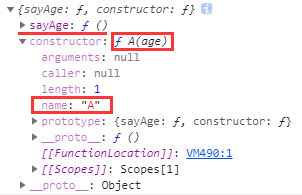
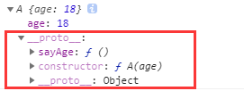
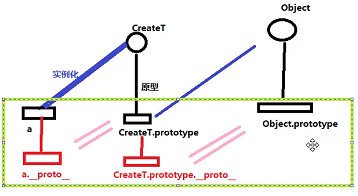
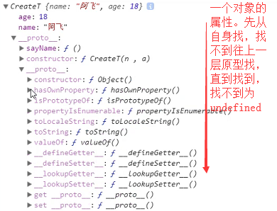

## 对象

### 面向对象的优缺点

    // 优点
    开发时间短、效率高、可靠性高。由于面向编程的可重用性，可以应用程序中大量采用成熟的类库，从而缩短开发时间；
    更易于维护、更新和升级。继承和封装使得应用程序的修改带来的影响更加局部化；
    
    // 缺点
    单纯的工具类不一定适用封装为类库，项目开发中可能只需要用到一两个功能，却需要将整个类库引入，会导致打出来的包
    平白增加几M。如jQuery，没有ES模块的jQuery，可能我们只用到了$()功能，却需要将整个jQuery包引入，代价较大
    
### 类、构造函数

    // 使用new function定义类实例对象
    function A(name, age) {
        // 函数在被new时，会执行一遍
        console.log(this); // new A时，this指向创建的对象
        this.name = name;
        this.age = age;
        var x = 10; // 只在new A时，函数执行过程中有效
    }
    var a = new A('karmiy', 18); // a === this
    console.log(a.name); // 'karmiy'
    console.log(a.age); // 18
    console.log(a.x); // undefined，实例化对象时，访问不到内部定义的对象
    
    // function return值的影响
    function A() {
        this.age = 18;
        return {id: 123};
    }
    var a = new A(); // {id: 123}，如果return的是个对象，则new出的实例会是这个对象，而不会是A的实例
    
### 原型prototype
    
    // 不好的做法
    function A() {
        this.age = 18;
        this.sayAge = function() { // 功能性一样，每次都创建一次，冗余
            console.log(this.age);
        }
    }
    var a1 = new A(),
        a2 = new A(),
        a3 = new A(),
        a4 = new A(),
        ...
    
    // 使用原型
    构造函数的一个属性prototype，该属性也是个对象
    构造函数的实例对象（new 出来的），可以直接.操作访问原型的属性
    
    // 示例
    function A(age) {
        this.age = age;
    }
    A.prototype.sayAge = function() { // 把这种功能性函数，不变的属性放在原型对象上
        console.log(this.age);
    }
    var a1 = new A(18),
        a2 = new A(16);
    console.log(a1.sayAge === a2.sayAge); // true，都是原型对象的sayAge
    console.log(a1.sayAge()); // 18
    console.log(a2.sayAge()); // 16
    console.log(A.prototype);
    

    
    // 谁拥有原型？
    函数才有原型
    
    // 原型里的this指向
    从个示例可以看出，原型里的this默认指向实例化对象
    
    // 什么应该放在构造函数内部，什么放在原型上？
    私有的属性写在构造函数的内部
    公共的方法写在构造函数的原型
    
    // 原型放置的位置
    var a1 = new A(18);
    console.log(a1.sayAge); // undefined，访问不到，原型要放在实例调用前
    A.prototype.sayAge = function() {
        console.log(this.age);
    }
    function A(age) {
        this.age = age;
    }
    
    // 实例对象.__proto__访问原型
    function A(age) {
        this.age = age;
    }
    A.prototype.sayAge = function() { // 把这种功能性函数，不变的属性放在原型对象上
        console.log(this.age);
    }
    var a1 = new A(18);
    console.log(a1.__proto__ === A.prototype); // true
    console.log(a1.__proto__.constructor === A); // true，构造函数的原型的constructor就是构造函数本身
    console.log(A.prototype.__proto__ === Object.prototype); // true
    console.log(a1);
    
 

(a1上没有sayAge，会往原型上找，所以a1.sayAge有效)

    // 给整个原型赋值
    A.prototype = {
        constructor: A,  // 给整个原型赋值时，要记得加上constructor
        sayAge: function() {
            console.log(this.age);
        }
    }
    
### 原型链

 

 

### delete

    // 说明
    删除对象某个属性值
    
    var obj = {id: 123, name: 'karmiy'};
    
    obj.id = null; 
    console.log(obj); // {id: null, name: 'karmiy'}，这样做只能置为null，无法彻底删除这个属性
    
    delete obj.id;
    console.log(obj); // {name: 'karmiy'}，彻底删除了id属性值

### defineProperty

    // 说明
    给对象添加属性
    value: 值，默认undefined
    writable: 是否可写，默认false
    enumerable: 是否可被枚举(for in)，默认false
    configurable: 是否可被删除，默认false
    
    // 示例
    var obj = {};
    Object.defineProperty(obj, 'name', {
        enumerable: false, // 不可枚举
        writable: false, // 不能被写入
        configuralble: false, // 不可被删除
        value: 'karmiy'
    })
    obj.name = 'karloy'; // 1、失败，因为writable为false
    console.log(obj.name); // 'karmiy'
    
    for(var key in obj) {
        console.log(key); // 2、不会有输出内容，因为enumerable为false不可枚举
    }
    
    delete obj.name; // 3、false，因为configuralble为false不可删除
    
### defineProperties

    // 说明
    批量给对象添加属性
    
    Object.defineProperties(obj, {
        age: {
            enumerable: false, // 不可枚举
            writable: false, // 不能被写入
            configuralble: false, // 不可被删除
            value: 18.
        },
        level: {
            enumerable: false, // 不可枚举
            writable: false, // 不能被写入
            configuralble: false, // 不可被删除
            value: 30,
        },
    })
    
### hasOwnProperty

    // 说明
    判断是否为自己的私有属性
    
    function A(name, age) {
        this.name = name;
        this.age = age;
    }
    A.prototype.x = 20;
    var a = new A('karmiy', 18);
    
    for(var key in a) {
        console.log(key); // 依次输出'name' 'age' 'x'，连原型上的x都输出了
    }
    
    // 如果我们不想输出原型上的属性，只想获取对象本身的属性，可以用hasOwnProperty过滤
    for(var key in a) {
        a.hasOwnProperty(key) && console.log(key); // 依次输出'name' 'age'
    }
    
    // 注
    for in可以遍历的是：可枚举属性，包括自身属性 + 原型属性
    
### isPrototypeOf

    // 说明
    判断对象是不是XX对象的原型
    
    function A(name, age) {
        this.name = name;
        this.age = age;
    }
    var a = new A('karmiy', 18);
    
    console.log(A.prototype.isPrototypeOf(a)); // true
    
### instanceof

    // 说明
    判断构造函数的原型prototype是否在对象的原型链上
    
    function A(name, age) {
        this.name = name;
        this.age = age;
    }
    var a = new A('karmiy', 18);
    
    console.log(a instanceof A); // true，因为A.prototype在a的原型上
    console.log(a instanceof Object); // true，因为Object.prototype在a的原型上

### Object.keys

    // 获取对象的属性值，返回数组
    
    function A(name, age) {
        this.name = name;
        this.age = age;
    }
    A.prototype.x = 20;
    var a = new A('karmiy', 18);
    Object.keys(a); // 'name' 'age'
    
    // 注
    Object.keys返回的是：可枚举的自身属性，不会返回原型上的
    
### Object.getPrototypeOf

    // 获取对象的原型
    function A(name, age) {
        this.name = name;
        this.age = age;
    }
    var a = new A('karmiy', 18);
    console.log(Object.getPrototypeOf(a)); // 相当于A.prototype和a.__proto__
    
    
    
    