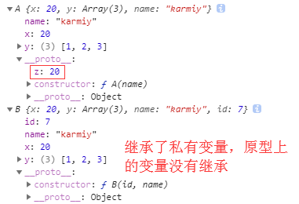
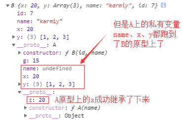
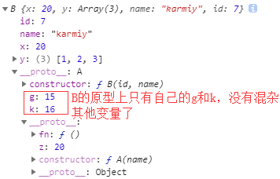

## ES5继承

继承父类，子类拥有父类的所有功能，并且子类可以进行扩展并且不影响父类

### 私有属性的继承

    function A(name) {
        this.x = 20;
        this.y = [1, 2, 3,];
        this.name = name;
    }
    A.prototype.z = 20;
    
    // B继承A
    function B(id, name) {
        A.call(this, name); // 继承私有属性
        this.id = id; // 扩展实例的私有属性
    }
    
    var a = new A('karmiy');
    var b = new B(7, 'karmiy');
    console.log(a, b);
    
 

### 原型的继承

    方式一（不好）：
    function A(name) {
        this.x = 20;
        this.y = [1, 2, 3,];
        this.name = name;
    }
    A.prototype.z = 20;
    
    function B(id, name) {
        A.call(this, name);
        this.id = id;
    }
    
    B.prototype = new A();
    B.prototype.constructor = B;
    B.prototype.g = 15;
    
    var b = new B(7, 'karmiy');
    console.log(b);

 

    方式二（较好）：
    function A(name) {
        this.x = 20;
        this.y = [1, 2, 3,];
        this.name = name;
    }
    A.prototype.z = 20;
    A.prototype.fn = function(){ console.log(1) };
    
    function B(id, name) {
        A.call(this, name);
        this.id = id;
    }
    
    // 使用一个空的（没有任变量）中间件转存原型
    function F(){}
    F.prototype = A.prototype;
    B.prototype = new F();
    B.prototype.constructor = B;
    B.prototype.g = 15;
    B.prototype.k = 16;
    
    var b = new B(7, 'karmiy');
    console.log(b);
    
 