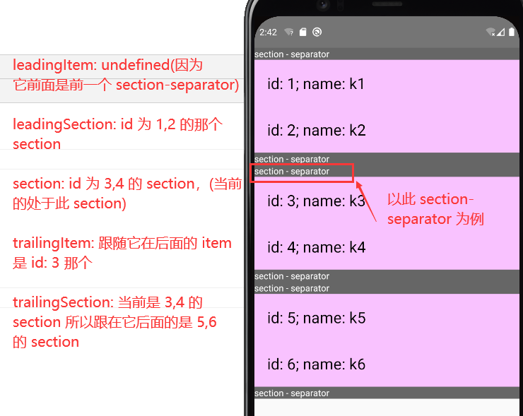
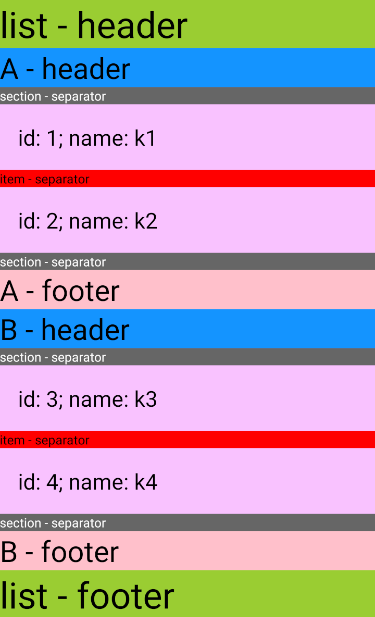

## SafeAreaView

在一个“安全”的可视区域内渲染内容

因为有 iPhoneX 这种刘海屏，所以需要避免内容渲染到不可见的刘海里

此组件**仅支持 iOS 即 iOS 11 或更高**

SafeAreaView 会根据系统的：

- 各种导航栏

- 工具栏

等预留出空间渲染内部内容，还会考虑设备屏幕局限（四周圆角或顶部中间不可显示的刘海区域）

```tsx
const App = () => {
    // 没有 SafeAreaView，Text 内容会在刘海屏置顶
    // 有 SafeAreaView，Text 内容会在刘海下面
    return (
        <SafeAreaView style={styles.container}>
            <Text>Page content</Text>
        </SafeAreaView>
    );
}

const styles = StyleSheet.create({
    container: {
        flex: 1,
    },
});
```

### props

继承了 ViewProps，**[不支持 padding 设置](https://github.com/facebook/react-native/issues/22211)，因为组件内部为了实现这个效果，使用了 padding**

## ScrollView

滚动视图，会简单粗暴地把所有子元素一次性全部渲染出来

需要注意：

- ScrollView 必须有一个确定的高度才能正常工作，通常会给它 flex: 1（没有设高度，自适应父级高貌似也可以）

### Props

继承至 View

- contentContainerStyle: 这些样式会应用到一个内层的内容容器上（貌似 ScrollView 本身相当于一个 View，children 还会多被一个内容容器 View 包裹，即 children 上是有 2 层父节点的），所有的子视图都会包裹在内容容器内

- disableScrollViewPanResponder: 默认情况下 ScrollView 会劫持 panResponders，防止滚动时触摸意外，但某些场景可能不希望 ScrollView 成为响应者，例如设置了 snapToInterval，这时可能要禁用这个行为，为了防止 ScrollView 阻塞触摸

- keyboardDismissMode: 用户拖拽滚动视图时是否要隐藏软键盘

    - 'none': 默认值，不隐藏

    - 'on-drag': 拖拽开始时隐藏

    - 'interactive'(iOS): 软键盘伴随拖拽操作同步地消失，并且如果往上滑动会恢复键盘

- keyboardShouldPersistTaps: 如果当前界面有软键盘，那么点击 scrollview 后是否收起键盘，取决于本属性的设置。（很多人反应 TextInput 无法自动失去焦点/需要点击多次切换到其他组件等等问题，其关键都是需要将 TextInput 放到 ScrollView 中再设置本属性）

    - 'never': 默认值，点击 TextInput 以外的子组件会使当前的软键盘收起。此时子元素不会收到点击事件

    - 'always': 键盘不会自动收起，ScrollView 也不会捕捉点击事件，但子组件可以捕获

    - 'handled': 当点击事件被子组件捕获时，键盘不会自动收起。这样切换 TextInput 时键盘可以保持状态。多数带有 TextInput 的情况下你应该选择此项

- onContentSizeChange: 在 ScrollView 内部可滚动内容的视图发生变化时调用，参数为内容视图的宽和高: (contentWidth, contentHeight)，它的原理是通过绑定内容容器上 onLayout 实现的

- onMomentumScrollBegin: 滚动动画开始时调用此函数

- onMomentumScrollEnd: 滚动动画结束时调用此函数（试了下 IOS 只有有惯性效果才能在停止时调用，而 Android 即使放手时已经静止也会在放手时调用）

- onScroll: 滚动的过程中，每帧最多调用一次此回调函数，频率可以用scrollEventThrottle属性来控制，event 结构如下

```tsx
{
    nativeEvent: {
        contentInset: {bottom, left, right, top},
        contentOffset: {x, y},
        contentSize: {height, width},
        layoutMeasurement: {height, width},
        zoomScale
    }
}
```

- onScrollBeginDrag: 当用户开始拖动此视图时调用此函数（差不多用户触屏开始 move 的那一刻），比 onMomentumScrollBegin 早

- onScrollEndDrag: 当用户停止拖动此视图时调用此函数（差不多用户放手时）

- pagingEnabled: 为 true 时，滚动条会停在滚动视图的尺寸的整数倍位置。这个可以用在水平分页上。默认 false

> 垂直分页在 Android 上不支持

- refreshControl: 指定 RefreshControl 组件，用于为 ScrollView 提供下拉刷新功能，只能用于垂直视图

- removeClippedSubviews(实验特性): 为 true 时，屏幕外的子视图（子视图的overflow样式需要设为hidden）会被移除，提升大列表的滚动性能

- scrollEnabled: 为 false 时内容不能滚动，注意即使禁止滚动，仍可以调用 scrollTo 来滚动

- showsHorizontalScrollIndicator: 为 true 时水平方向滚动条可以看到，false 则看不到滚动条，默认 true

- showsVerticalScrollIndicator: 为 true 时垂直方向滚动条可以看到，false 则看不到滚动条，默认 true

- stickyHeaderIndices: 指定哪些子成员会有 H5 的 sticky 滚动吸顶效果

```tsx
const App: React.FC = () => {
    return (
        <View style={styles.container}>
            <ScrollView
                style={styles.scrollView}
                stickyHeaderIndices={[1]}
            >
                <Text style={[styles.text, styles.bg_1]}>
                    Lorem ipsum dolor sit amet, consectetur adipiscing elit, sed
                    do eiusmod tempor incididunt ut labore et dolore magna
                    aliqua. Ut enim ad minim veniam, quis nostrud exercitation
                    ullamco laboris nisi ut aliquip ex ea commodo consequat.
                    Duis aute irure dolor in reprehenderit in voluptate velit
                    esse cillum dolore eu fugiat nulla pariatur. Excepteur sint
                    occaecat cupidatat non proident, sunt in culpa qui officia
                    deserunt mollit anim id est laborum.
                </Text>
                {/* 这一项会有 sticky 效果 */}
                <Text style={[styles.text, styles.bg_2]}>
                    Lorem ipsum dolor sit amet, consectetur adipiscing elit, sed
                    do eiusmod tempor incididunt ut labore et dolore magna
                    aliqua. Ut enim ad minim veniam, quis nostrud exercitation
                    ullamco laboris nisi ut aliquip ex ea commodo consequat.
                    Duis aute irure dolor in reprehenderit in voluptate velit
                    esse cillum dolore eu fugiat nulla pariatur. Excepteur sint
                    occaecat cupidatat non proident, sunt in culpa qui officia
                    deserunt mollit anim id est laborum.
                </Text>
                <Text style={[styles.text, styles.bg_3]}>
                    Lorem ipsum dolor sit amet, consectetur adipiscing elit, sed
                    do eiusmod tempor incididunt ut labore et dolore magna
                    aliqua. Ut enim ad minim veniam, quis nostrud exercitation
                    ullamco laboris nisi ut aliquip ex ea commodo consequat.
                    Duis aute irure dolor in reprehenderit in voluptate velit
                    esse cillum dolore eu fugiat nulla pariatur. Excepteur sint
                    occaecat cupidatat non proident, sunt in culpa qui officia
                    deserunt mollit anim id est laborum.
                </Text>
            </ScrollView>
        </View>
    );
};

const styles = StyleSheet.create({
    container: {
        flex: 1,
        marginTop: 44,
    },
    scrollView: {
        backgroundColor: 'pink',
        marginHorizontal: 20,
    },
    text: {
        fontSize: 42,
    },
    bg_1: {
        backgroundColor: 'skyblue',
    },
    bg_2: {
        backgroundColor: 'red',
    },
    bg_3: {
        backgroundColor: 'yellow',
    },
});
```

- horizontal: 为 true 则所有子视图会在水平方向排一行，而不是默认的垂直

- decelerationRate: 滚到放手时滚动视图减速停下的速度，即惯性效果，enum('fast', 'normal') 或 number，默认 'normal'（iOS 上是 0.998，Android 上是 0.985）

- snapToInterval: 接收一个数值，让滚动视图滚动停止后，停止在snapToInterval的倍数的位置（即小分页），这可以在一些子视图比滚动视图本身小的时候用于实现分页显示

- snapToAlignment: 设置了 snapToInterval 后，本配置定义停驻点与滚动视图之间的关系（即放手后会滚到分页的哪个位置，差不多意思是放手后在当前分页还是下一个页面）

    - 'start': 默认值，会将停驻点对齐在左侧（水平）或顶部（垂直）
    
    - 'center': 会将停驻点对齐到中间

    - 'end': 会将停驻点对齐到右侧（水平）或底部（垂直）

- snapToOffsets: 自定义式的 snapToInterval，与 snapToInterval 不同的是，snapToInterval 是设置固定的分页长度，snapToOffsets 是自定义每段分页的位置，如希望滚动视图在 100, 200, 300, 400 的位置为分页点，可以设置为 [100, 200, 300, 400]

- snapToStart: 配合 snapToOffsets 使用，默认 true，表示以列表的开始作为分页的第一个点，即如设置 snapToOffsets 为 [400, 500, 600]，那在 0 - 400 之间，已经算第一层分页了，在 0 - 400 之间放手还是会滚到 0 或 400 的位置，如果设置 snapToStart 为 false，那么 0 - 400 之间是可以随意滚动的，而不会放手时只能回到 0 或 400

- snapToEnd: 同 snapToStart，只是它是表示 snapToOffsets 的最后一个值与滚动视图底部之间可以随意滚动

- endFillColor(Android): 有时候滚动视图会占据比实际内容更多的空间，这时可以指定此属性填充多余空间的背景色

- overScrollMode(Android): 类似 iOS 的橡皮筋效果（试了下没有橡皮筋效果只有个波动特效？）

    - 'auto': 默认值，允许用户在内容超出视图高度之后可以滚动视图

    - 'always' - 无论内容尺寸，用户始终可以滚动视图

    - 'never' - 始终不允许用户滚动视图

- fadingEdgeLength(Android): 如果滚动视图的一侧方向有内容(即非置顶或置底))，边界会有淡出的效果，类似 shadow 的感觉，该配置用于设置 shadow 效果的范围长度

- nestedScrollEnabled(Android): 在 Android API level 21（5.0）以上启用嵌套滚动。iOS 上默认支持嵌套滚动

- alwaysBounceHorizontal(iOS): 为 true是时，即使水平方向内容比视图还小，也可以弹性的拉动（橡皮筋效果），当开启 horizontal 时默认 true，否则默认 false

- alwaysBounceVertical(iOS): 同 alwaysBounceHorizontal，只是它是垂直橡皮筋

- automaticallyAdjustContentInsets(iOS): 默认 true，当滚动视图放在一个导航条或者工具条后面的时候，iOS 系统是否要自动调整内容的范围（据说 ScrollView 自带了个类似 marginTop 的效果，如果发现头部出现莫名的白色，尝试设为 false）

- bounces(iOS): 是否要滚到边缘的橡皮筋效果，默认 true

- pinchGestureEnabled(iOS): 允许用户双指缩放操作，默认 true

- maximumZoomScale(iOS): 允许最大的缩放比例，默认 1

- minimumZoomScale(iOS): 允许最小的缩放比例，默认 1

- bouncesZoom(iOS): 默认 true，手势缩放内容可以超过 minimumZoomScale 与 maximumZoomScale 的限制，手指抬起后弹回 minx/max 的缩放比例，否则不能超过

- canCancelContentTouches(iOS): 默认 true，为 false 时，一旦有子节点响应触摸事件，即使手指开始移动也不会拖动滚到视图

- centerContent(iOS): 默认 false，为 true 时，如果滚动视图的内容比视图本身小，会自动把内容居中放置，内容比滚动视图大该配置没有作用

- contentInset(iOS): 内容范围相对滚动视图边缘的坐标。默认为{top: 0, left: 0, bottom: 0, right: 0}（貌似设了后滚动会飘）

- contentOffset(iOS): 设置初始滚到坐标，默认 {x: 0, y: 0}，如 {x: 0, y: 100} 则初始会已经滚到垂直 100 的位置了

- scrollEventThrottle(iOS): 对 scroll 事件被调用进行节流，默认 0

- scrollIndicatorInsets(iOS): 滚动条距离视图边缘的坐标，默认 {0, 0, 0, 0}，设置类型为 { top: number, left: number, bottom: number, right: number }

- directionalLockEnabled(iOS): 默认 false，为 true 时，滚动视图在拖拽的时候会锁定只有垂直或水平方向可以滚动

- indicatorStyle(iOS): 滚动条的样式，enum('default', 'black', 'white')，默认 default 也等同 black

- scrollsToTop(iOS): 默认 true，点击手机顶部状态栏，视图会滚回顶部

- zoomScale(iOS): 滚动容器内容当前的缩放比例。默认值为 1.0

### 方法

- scrollTo: 滚动到指定的 x, y 偏移处。第三个参数为是否启用平滑滚动动画。还有一个 duration 参数则是仅限 android 可以使用的滚动持续时间

    - scrollTo(y?: number, x?: number, animated?: boolean)

    - scrollTo({x?: number, y?: number, animated?: boolean})

    - scrollTo({x?: number, y?: number, animated?: boolean, duration?: boolean}): duration 只有 Android 才支持

- scrollToEnd: 滚到视图底部

    - scrollToEnd({animated?: boolean}) 

    - scrollToEnd({animated?: boolean, duration?: number}): duration 只有 Android 才支持

- flashScrollIndicators: 短暂的显示滚动条

##  Sectionlist

同 FlatList，多了个分组

```tsx
const App: React.FC = () => {
    return (
        <View style={styles.container}>
            <SectionList
                sections={[
                    {
                        header: 'A', // 不一定要叫 header
                        data: [ // data 是必需的
                            {id: 1, name: 'k1'},
                            {id: 2, name: 'k2'},
                        ],
                    },
                ]}
                renderItem={({item}) => (
                    <View style={styles.item}>
                        <Text style={styles.title}>
                            id: {item.id}; name: {item.name}
                        </Text>
                    </View>
                )}
                renderSectionHeader={({section}) => (
                    <Text style={styles.header}>{section.header}</Text>
                )}
            />
        </View>
    );
};

const styles = StyleSheet.create({
    container: {
        flex: 1,
        marginTop: 44,
    },
    item: {
        backgroundColor: '#f9c2ff',
        padding: 20,
        borderBottomWidth: 1,
        borderBottomColor: 'red',
    },
    header: {
        fontSize: 32,
        backgroundColor: '#1394ff',
    },
    title: {
        fontSize: 24,
    },
});
```

### Props

基于 VirtualizedList 的封装，继承其所有 props，也包括 ScrollView 的 props

- sections: 类似 FlatList 的 data

- initialNumToRender: 指定一开始渲染的元素数量，最好刚刚够填满一个屏幕，这样保证了用最短的时间给用户呈现可见的内容（性能优化的一种方案，如果指定少了，效果会是立即渲染出指定数量后再闪一下补空）。注意这第一批次渲染的元素不会在滑动过程中被卸载，这样是为了保证用户执行返回顶部的操作时，不需要重新渲染首批元素

- keyExtractor(item: object, index: number) => string: 指定 Item 的 key，默认取 item.key，没有则取数组下标

> 注意这只设置了每行（item）的 key，对于每个组（section）仍然需要另外设置 key

- renderItem({ item, index, separators }): section 中的数据将会循环执行 renderItem，具体参数意义看 FlatList

- renderSectionFooter(info: { section: Section }) => element: 每个组的尾部组件

- renderSectionHeader(info: { section: Section }) => element: 在每个 section 的头部渲染。在 iOS 上，这些 headers 是默认粘接在ScrollView的顶部的

- ItemSeparatorComponent: 同 FlatList

- SectionSeparatorComponent: 不同于 ItemSeparatorComponent，是渲染在一个组的 header 下与 footer 上的，具体效果可看后面的图，参数是对象，有如下属性:

    - highlighted: 是否高亮

    - leadingItem: 前面的 item 项

    - leadingSection: 前面 section

    - section: 当前隶属的 section

    - trailingItem: 跟随其后的 item

    - trailingSection: 跟随其后的 section



- ListFooterComponent: 将渲染在组件底部

- ListEmptyComponent: data 没有数据时将渲染该组件

- ListHeaderComponent: 将渲染在组件头部

以上各部位组件可以以如下示例看图理解:

```tsx
const App: React.FC = () => {
    // const scrollRef = useRef<ScrollView>(null);
    return (
        <View style={styles.container}>
            <SectionList
                sections={[
                    {
                        header: 'A - header',
                        footer: 'A - footer',
                        data: [
                            {id: 1, name: 'k1'},
                            {id: 2, name: 'k2'},
                        ],
                    },
                    {
                        header: 'B - header',
                        footer: 'B - footer',
                        data: [
                            {id: 3, name: 'k3'},
                            {id: 4, name: 'k4'},
                        ],
                    },
                ]}
                renderItem={({item}) => {
                    return (
                        <View style={styles.item}>
                            <Text style={styles.title}>
                                id: {item.id}; name: {item.name}
                            </Text>
                        </View>
                    );
                }}
                ItemSeparatorComponent={() => {
                    return (
                        <Text style={styles.separator}>item - separator</Text>
                    );
                }}
                renderSectionHeader={({section}) => (
                    <Text style={styles.header}>{section.header}</Text>
                )}
                renderSectionFooter={({section}) => (
                    <Text style={styles.footer}>{section.footer}</Text>
                )}
                SectionSeparatorComponent={() => {
                    return (
                        <View>
                            <Text style={styles.sectionSeparator}>
                                section - separator
                            </Text>
                        </View>
                    );
                }}
                ListHeaderComponent={
                    <Text style={styles.list}>list - header</Text>
                }
                ListFooterComponent={
                    <Text style={styles.list}>list - footer</Text>
                }
            />
        </View>
    );
};

const styles = StyleSheet.create({
    container: {
        flex: 1,
    },
    list: {
        backgroundColor: 'yellowgreen',
        fontSize: 40,
    },
    item: {
        backgroundColor: '#f9c2ff',
        padding: 20,
    },
    header: {
        backgroundColor: '#1394ff',
        fontSize: 32,
    },
    footer: {
        backgroundColor: 'pink',
        fontSize: 32,
    },
    title: {
        fontSize: 24,
    },
    separator: {
        backgroundColor: 'red',
    },
    sectionSeparator: {
        backgroundColor: '#666',
        color: '#fff',
    },
});
```


- onEndReachedThreshold: 阈值，决定距离底部多远时触发 onEndReached 回调，该参数的值是 0 - 1，如 0.5 是距离底部距离一半

- onEndReached(info: {distanceFromEnd: number}) => void: 滚到离底部 onEndReachedThreshold 时会触发该回调（滚上去又滚下来到阈值也会，不是只触发一次），distanceFromEnd 是触发时离底部的距离，此回调是异步调用的，即滚的越快，触发的会越晚，触发时 distanceFromEnd 的值会越小

- extraData: 传递给 extraData 的数据改变会让组件刷新，否则在 renderItem，头部、底部等代码里用到其他状态，由于组件 PureComponent 的原因，可能会有不刷新视图的问题

- inverted: 翻转滚动方向。实质是将 scale 变换设置为 -1

- onRefresh: 会在列表头部添加一个 RefreshControl 控件，实现下拉刷新，即下拉后的回调（先滚到到顶，再下拉，并不是正常滚动滚到负值，一定要在 scrollTop 0 的时候再重新拉一下才算），需要配合 refreshing 属性

- refreshing: 下拉刷新时，等待加载新数据则设为 true，加载后设为 false，同 FlatList

- progressViewOffset: 设置 RefreshControl 下拉加载指示器的位置

- onViewableItemsChanged: 可见行元素变化的回调（元素变为可见/不可见都会调用），同 FlatList

> 回调返回的 changed 比 FlatList 多了个 section

- stickySectionHeadersEnabled: boolean 类型，当下一个 section 把它的前一个 section 的可视区推离屏幕的时候，让这个 section 的 header 粘连在屏幕的顶端（如第一个 section 的 header A 置顶时，会变成 sticky 粘顶，继续滚动，第二个 section 的 header B 也要置顶时，A 则不再置顶，而是会往上滚到视图外，换 header B 粘顶，以此类推）

### 方法

- scrollToLocation: 滚到某个 item，参数 params 是个对象

    - animated: 是否要动画，默认 true

    - sectionIndex: 必需项，滚到哪个 section

    - itemIndex: 必需项，滚到指定 sectionIndex 那个 section 的第几个 item

    - viewOffset: 目标地的偏移量，如 20 就是到那个 item 再往下滚 20 的位置

    - viewPosition: 0 - 1，0 表示滚动目标位置 item 位于顶部，1 是底部，0.5 中间

> 注：如果没有设置 getItemLayout 或是 onScrollToIndexFailed，就不能滚动到位于外部渲染区的位置

- recordInteraction: 主动通知列表发生了一个事件，以使列表重新计算可视区域

- flashScrollIndicators: 短暂的显示一下滚动条

