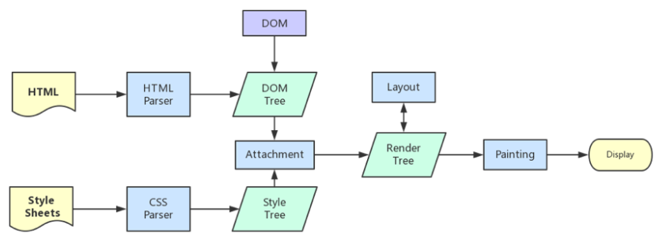
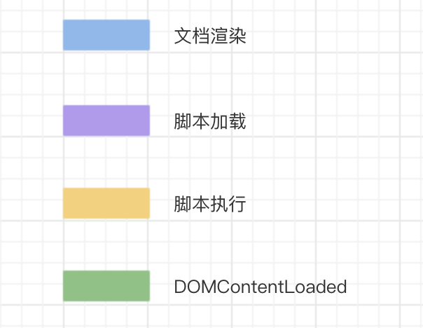
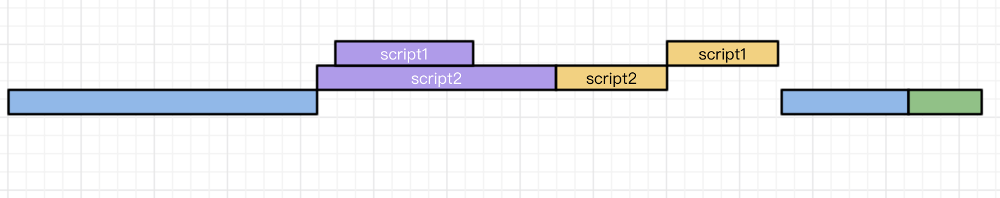
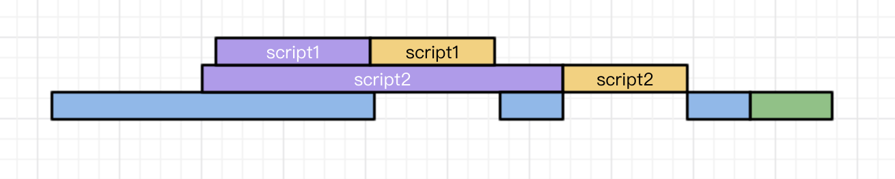
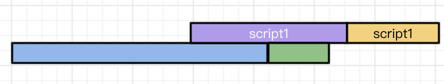
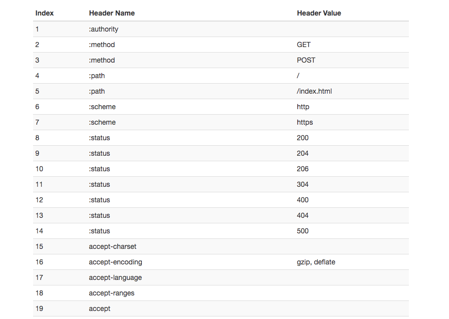
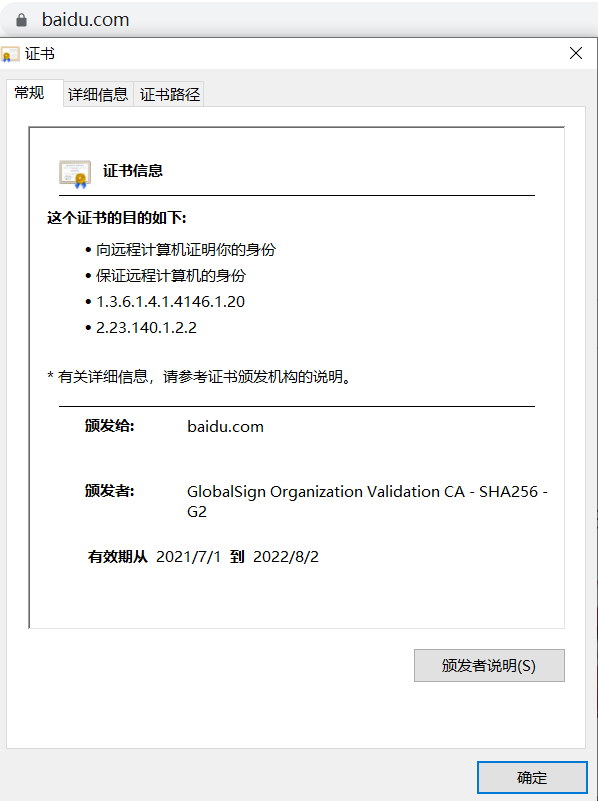

## 如何实现数组的去重

[Array常用的API](https://github.com/karmiy/learn/blob/master/JavaScript/16%E3%80%81Array%E5%B8%B8%E7%94%A8%E7%9A%84API.md) 文章底部

## this 指向如何理解

- 一般情况下，谁调用它，函数里 this 指向就是谁

- 全局环境中 this 指向 window，严格模式下 undefined

- new 构造函数（构造函数不返回 object 或 function）后的实例中，this 指向实例本身

- 可以通过 bind、apply、call 改变this指向，改变不了箭头函数的 this 指向

- 箭头函数本身没有 this，this 指向上下文环境

## 如何实现一个 new

```js
function _new(constructor, ...args) {
    const target = Object.create(null);
    target.__proto__ = constructor.prototype;

    const result = constructor.apply(target, args);
    if(result && (typeof result === 'object' || typeof result === 'function'))
        return result;
    return target;
}

function F(id) {
    this.id = id;
}

const f = _new(F, 10);
=>
const f = new F(10);
```

## 实现 instanceof

```js
function instanceOf(obj, constructor) {
    let proto = obj.__proto__;

    while(proto) {
        if (proto === constructor.prototype) return true;

        proto = proto.__proto__;
    }
    return false;
}
```

## call、apply、bind 的区别与实现

都是用来改变 this 指向

call 与 apply 会立即执行函数，bind 会返回一个已被改变 this 指向的函数而不会立即执行

call 接收函数的参数以参数位依次排列：fn.call(obj, 1, 2, 3)

apply 接收函数的参数以数组作为第二个参数：fn.call(obj, [1, 2, 3])

bind 与 call 参数相似

实现：

- call 的实现：

```js
Function.prototype._call = function(context, ...args) {
    context.func = this;
    const result = context.func(...args);
    delete context.func;
    return result;
}
```

- apply 的实现：

```js
Function.prototype._apply = function(context, args) {
    context.func = this;
    const result = args ? context.func(...args) : context.func();
    delete context.func;
    return result;
}
```

- bind 的实现：

```js
Function.prototype._bind = function(context, ...args) {
    context.func = this;
    return function F(...params) {
        let result = null;
        // 被用来 new 的情况
        if(this instanceof F) {
            result = new context.func(...args, ...params);
        } else {
            result = context.func(...args, ...params);
        }
        delete context.func;
        return result;
    }
}
```

## 深拷贝与浅拷贝的区别是什么

针对复杂数据类型，浅拷贝只拷贝一层，深拷贝是层层拷贝

浅拷贝是将对象每个属性进行依次拷贝，当对象属性值是引用类型时，拷贝其引用地址不重新生成新引用地址。Object.assign、扩展运算符 ...，Array.prototype.slice、Array.prototype.concat 都是浅拷贝：

```js
const o1 = {
    id: 1,
}
const o2 = {
    list: [1, 2, 3],
}
Object.assign(o1, o2); // 合并到 o1 上
console.log(o1.list === o2.list); // true，浅拷贝 list 属性值
```

深拷贝对原对象是递归拷贝的，生成的对象与原对象属性值互不影响，如 JSON.parse(JSON.stringify(obj)) 的配合结果就是深拷贝：

```js
const o1 = {
    list: [1, 2, 3],
}
const o2 = JSON.parse(JSON.stringify(o1));
console.log(o1.list === o2.list); // false
```

## 如何实现一个深拷贝

- 最简洁实现

最简单实现深拷贝的方法，就是使用 JSON.parse(JSON.stringify(obj))：

```js
const o1 = {
    list: [1, 2, 3],
}
const o2 = JSON.parse(JSON.stringify(o1));
console.log(o1.list === o2.list); // false
```

然而这个方法的局限性非常大，如拷贝其他引用类型、函数、循环引用等都存在缺陷

- 基础实现

```js
function clone(target) {
    if (typeof target === 'object') {
        const cloneTarget = Array.isArray(target) ? [] : {};
        for (const key in target) {
            cloneTarget[key] = clone(target[key]);
        }
        return cloneTarget;
    } else {
        return target;
    }
}
```

更深层的写法可以参考：[如何写出一个惊艳面试官的深拷贝](https://juejin.im/post/5d6aa4f96fb9a06b112ad5b1)

## 什么是柯里化，如何实现

**函数式编程**中一个重要的概念

函数柯里化是把接收多个参数的函数，转为为一系列使用一个参数的函数的技术：

```js
fn(1, 2, 3, 4);
=>
fn(1)(2)(3)(4);
```

作用:

- 实现延迟执行

- 参数复用

实现：

```js
function curry(fn, ...args) {
    return fn.length > args.length ? (...params) => curry(fn, ...args, ...params) : fn(...args);
}
function sum(a, b, c) {
    return a + b + c;
}
const _sum = curry(sum);
console.log(_sum(1)(2)(3)); // 6
```

## 什么是反柯里化，如何实现

柯里化是缩小适用范围，创建针对性更强的函数

反柯里化是扩大适用范围，创建一个应用范围更广的函数，让原本特定对象才能使用的方法，扩展到更多的对象也能使用

例如我们知道 arguments 是不能用数组的 push 去添加项的，这是因为 Array.prototype.push 只能让特定的对象（数组）使用

为了扩展到更多的对象，如 arguments 也能使用，可以这样做：

```js
Array.prototype.push.call(arguments, 4);
```

反柯里化就是利用这种操作来实现的：

```js
Function.prototype.uncurrying = function () { 
    const self = this; 
    return function() { 
        const obj = Array.prototype.shift.call(arguments); 
        return self.apply(obj, arguments); 
    }; 
};
```

使用：

```js
const push = Array.prototype.push.uncurrying();

(function(){ 
    push(arguments, 4); 
    console.log(arguments); // 输出：[1, 2, 3, 4] 
})(1, 2, 3);

const obj  = {
    length: 1,
    0: 10,
}

push(obj, 20);
console.log(obj); // {0: 10, 1: 20, length: 2}
```

如上，经过 uncurrying，数组的 push 变成了一个通用的 push，不仅仅局限于 array 对象，并且调用 push 函数的方式也显得更加简洁和意图明了

## 什么是防抖/节流函数，如何实现

防抖函数：控制函数在一定时间内的执行次数，如果这段时间内再次被触发，重新计算延迟时间。一般应用在输入框输入时连续查询，防止用户快速输入导致不断发起请求

节流：控制函数一段时间内只能触发一次。一般用于在执行动画时，控制执行间隔防止触发频率过高

- 防抖函数：

```js
function debounce(fn, delay) {
    let timer = null;
    return function(...args) {
        clearTimeout(timer);
        timer = setTimeout(() => {
            fn.call(this, ...args);
        }, delay);
    }
}
```

- 节流函数：

```js
function throttle(fn, delay) {
    let prevTime = Date.now();
    return function(...args) {
        if(Date.now() - prevTime < delay) return;
        
        fn.call(this, ...args);
        prevTime = Date.now();
    }
}
```

## 什么是闭包

内部函数调用外部函数的变量，并持续引用，就是闭包：

```js
function a() {
    let i = 0;
    return function() {
        console.log(i);
        i++;
    }
}

const _a = a();
_a(); // 0
_a(); // 1
```

作用：

- 持续访问函数定义时的变量，如做节流、防抖函数，把原时间、timer 放闭包中持续访问它

- 私有化变量

```js
function create() {
    let x = 1;
    return {
        getX() {
            return x;
        }
    }
}

const obj = create();
obj.getX(); // 私有化 x，只能调用 getX 访问
```

- 模块化独立作用域，如 webpack 模块化编译后都是一个个闭包

```js
const moduleA = (function() {
    ... 
}());
```

- 构建单例

```js
const createSingle = (function() {
    let single = null;
    return function(id) {
        single = single || Object.create(null);
        single.id = id;
        return single;
    }
}());

const o1 = createSingle(1);
const o2 = createSingle(1);
console.log(o1 === o2); // true
```

## 如何实现 flattenDeep 将嵌套数组扁平化

```js
[1, [2, 3, [4, 5, 6], 7], 8]

=>

[1, 2, 3, 4, 5, 6, 7, 8]
```

实现：

```js
function flattenDeep(arr) {
    return arr.reduce((prevArr, cur) => {
        return prevArr.concat(Array.isArray(cur) ? flattenDeep(cur) : cur);
    }, []);
}
const arr = [1, [2, 3, [4, 5, 6], 7], 8];
console.log(flattenDeep(arr));
```

## 什么是原型链

每个构造函数都有 prototype 属性获得原型

对象实例也有 \_\_proto\_\_ 属性获得原型 

查找一个对象的属性时，会先从自身找，找不到往上一层原型找，找到则返回，一直到顶层 Object 原型为止，找不到为 undefined

## ES5 如何实现继承

```js
function A(id) {
    this.id = id;
}
A.prototype.name = 'k'

function B(id) {
    A.call(this, id);
}

function F() {}
F.prototype = A.prototype;
B.prototype = new F();
B.prototype.constructor = B;
B.prototype.code = '902';
```

## 浏览器有哪些线程

对前端而言，浏览器主要进程是渲染进程，页面的渲染、JS 执行、事件循环等都在这个进程内执行

**浏览器的渲染进程是多线程的**，它主要包含了如下线程：

- GUI 渲染线程

负责渲染浏览器界面，解析 HTML、CSS，构建 DOM 树 render 树，布局绘制等

界面需要重绘或回流时，该线程会执行

**GUI 渲染线程和 JS 引擎线程是互斥的**，当 JS 引擎执行时 GUI 线程就会挂起，GUI 更新保存在一个队列中等 JS 引擎空闲时立即被执行

- JS 引擎线程

JS 内核，处理 JavaScript 脚本程序，解析并运行代码

**GUI 渲染线程和 JS 引擎线程是互斥的**，所以如果 JS 执行时间过长，就会造成页面渲染不连贯，页面渲染加载阻塞

- 事件触发线程

用来控制事件循环，当 JS 引擎执行代码如 setTimeout，会将对应任务添加到事件线程中

当对应事件符合触发条件被触发时，该线程会把事件添加到待处理队列的队尾，等待 JS 引擎处理

因为 JS 是单线程，这些待处理队列中的事件都得排队等待 JS 引擎处理，即要等 JS 引擎空闲

- 定时触发器线程

setInterval、setTimeout 所在线程

浏览器定时计数器并不是由 JS 引擎计数（因为 JS 是单线程，若阻塞状态会影响计时准确），因此通过单独线程来计时并触发定时（计时完毕添加到事件队列，等待 JS 引擎空闲执行）

W3C 在 HTML 标准中规定，要求 setTimeout 中低于 4ms 的时间间隔算 4ms

- 异步 http 请求线程

XMLHttpRequest 连接后通过浏览器新开一个线程请求

检测到状态变更时，若设置回调函数，异步线程就**产生状态变更事件**，将这个回调放入事件队列中，由 JS 引擎执行

## 浏览器的渲染流程是什么

- 解析 HTML 建立 DOM

- 解析 CSS 构建 CSSOM

- CSSOM 结合 DOM 合并成 render 树

- 布局 render 树（Layout / reflow），负责各元素尺寸、位置计算

- 绘制 render 树（paint），绘制页面像素信息

- 浏览器将各层的信息发送给 GPU，GPU 会将各层合成，显示在屏幕上



## JS 是否会阻塞页面加载

JS 可以操作 DOM，如果修改这些元素属性同时又渲染页面，那么渲染线程前后获得的元素数据可能不一致

为了防止这种情况，**GUI 渲染线程与 JS 引擎线程是互斥的**，当 JS 引擎执行 GUI 线程就会被挂起，GUI 更新会被保存在一个队列中等待 JS 引擎空闲立即被执行

结论：**JS 会阻塞页面加载**

## CSS 加载是否会阻塞 DOM 树解析

**CSS 是由单独的下载线程异步下载的**

根据浏览器的渲染流程，render 树是由 CSSOM 和 DOM 合并而成，而 CSSOM 和 DOM 解析过程是独立的

结论：**CSS 加载不会阻塞 DOM 树解析**

## CSS 加载是否会阻塞 render 树渲染

根据浏览器的渲染流程，render 树是由 CSSOM 和 DOM 合并而成

所以 render 树需要等待 CSSOM 和 DOM 都完成才能构建

结论：**CSS 加载会阻塞 render 树渲染**

## JS 的加载是否会阻塞 DOM 解析

因为 JS 的脚本可以操作 DOM

所以**每当浏览器遇到脚本标签，DOM 构造就会暂停，整个 DOM 构建过程都将停止，直到脚本执行完**

注意，并不是 \<script> 标签请求完 JS 文件开始执行时才开始停止 DOM 构建，而是一遇到标签就停止，包括请求时。即在网速很慢的情况下，假如请求 js 脚本用了几千毫秒，那么 DOM 构建也会暂停这几千毫秒

所以经常会说把 \<script> 放在 body 下面不要放在 head 中

结论：**JS 的加载会阻塞 DOM 解析**

## CSS 是否会阻塞 JS 执行

因为 JS 可以操作 DOM，也可以操作 CSS 样式

所以样式表会在后面的 JS 执行前先加载执行完毕

结论：**CSS 会阻塞后面 JS 的执行**

## DOMContentLoaded 和 load 的区别

- DOMContentLoaded：仅当 DOM 解析完成后触发，不包括 CSS 样式、图片

- load：页面上所有的 DOM、CSS 样式、脚本、图片等资源都已加载完成后触发

结论：**DOMContentLoaded => load**

注：我们知道 CSS 加载会阻塞 render 树渲染，也可以阻塞后面的 js 执行，js 又会阻塞 DOM 解析，所以可以得知：

- 当文档中没有 JS 脚本时，解析完文档就可以触发 DOMContentLoaded

- 当文档中有 JS 脚本时，JS 会阻塞 DOM 解析，JS 又需要等 CSSOM 解析完才能执行，所以在任何情况下，DOMContentLoaded 的触发不需要等待图片等其他资源加载完成，但是可能会需要等待 CSS 样式解析

## \<script> 标签上 defer 与 async 的区别



- \<script src="script.js">

常规加载，浏览器一遇到 script 标签，就会立即执行并加载，会阻塞文档解析



- \<script async src="script.js">

使用 async，加载 js 与解析、渲染文档会并行执行

js 在加载完毕后执行

js 的执行时间可能在 DOMContentLoaded 之前也可能在之后





- \<script defer src="script.js">

使用 defer，加载 js 与解析、渲染文档会并行执行

当页面解析渲染完成后，会等所有的 defer 脚本加载完毕并按顺序执行，执行完毕后再触发 DOMContentLoaded

**结论：**

- defer、async 在网络读取时都是异步的，不阻碍 HTML 解析

- defer 会在 HTML 解析后才执行脚本，更贴近我们对于应用脚本执行的要求

- defer 执行时会按顺序执行，与加载完毕先后无关，要善于利用

- async 是乱序执行，加载完就会立即执行，所以如果脚本之间有依赖，不要使用 async，一般用在互相不依赖的脚本

## 什么是重绘、回流

- 重绘：页面中元素的样式改变并不影响它在文档流中的位置时（color、background-color、visibility），浏览器将新样式赋予元素并重新绘制它

- 回流：当 render tree 中部分或全部元素的尺寸、结构、或某些属性发生变化时，浏览器重新渲染部分或全部文档的过程。如调用：

```js
clientWidth、clientHeight、clientTop、clientLeft

offsetWidth、offsetHeight、offsetTop、offsetLeft

scrollWidth、scrollHeight、scrollTop、scrollLeft

scrollIntoView()、scrollIntoViewIfNeeded()

getComputedStyle()

getBoundingClientRect()

scrollTo()
```

**对比：**

- 回流的代价比重绘更高，并且有时仅回流一个元素，它的父元素即跟随它的元素也会产生回流，要尽可能避免回流

- 回流一定会引起重绘，重绘不一定会引起回流


**浏览器的措施：**

浏览器会维护一个队列，把所有引起回流和重绘的操作放入，队列中任务数量或时间间隔达到阈值，浏览器会将队列清空，进行一次批处理，这样可以把多次回流和重绘变成一次

当访问以下属性，浏览器会立即清空队列，因为浏览器担心队列里可能会有影响这些属性或方法返回值的操作，为了确保你拿到最精确的值，浏览器会强制清空队列：

```js
clientWidth、clientHeight、clientTop、clientLef

toffsetWidth、offsetHeight、offsetTop、offsetLefts

crollWidth、scrollHeight、scrollTop、scrollLeft

width、height

getComputedStyle()

getBoundingClientRect()
```

**如何避免：**

- CSS 中将元素变成 absolute、fixed

- CSS 中避免使用表达式如 calc

- JS 避免频繁操作样式，最好一次性重写 style，或将要改变的样式构建成一个 class 一次性更新元素的 className

- JS 避免频繁操作 DOM，可以创建一个 documentFragment，在它上面应用所有 DOM 操作，再添加到文档上

- JS 频繁元素样式时，可以先设为 display: none，操作结束再设回来，因为 none 时，在元素上进行 DOM 操作不会引发回流和重绘

- JS 避免频繁读取会引发回流、重绘的属性

## 什么是事件循环

- 同步任务在主线程上执行，形成执行栈，异步任务的回调放入任务队列

- 主线程任务执行完，执行栈为空，检查任务队列是否为空，为空继续检查

- 不为空则任务队列一个事件队列，压入执行栈，执行任务

- 执行结束，执行栈为空，重复第 2 步

[事件循环与任务队列](https://github.com/karmiy/learn/blob/master/JavaScript/17%E3%80%81for%20in%E3%80%81%E5%AE%9A%E6%97%B6%E5%99%A8%E3%80%81requestAnimationFrame%E3%80%81%E4%BA%8B%E4%BB%B6%E5%BE%AA%E7%8E%AF%E4%B8%8E%E4%BB%BB%E5%8A%A1%E9%98%9F%E5%88%97.md#%E4%BA%8B%E4%BB%B6%E5%BE%AA%E7%8E%AF%E4%B8%8E%E4%BB%BB%E5%8A%A1%E9%98%9F%E5%88%97)

## 如何实现跨域：

[九种 “姿势” 让你彻底解决跨域问题](https://segmentfault.com/a/1190000016653873)

## CommonJs、AMD、CMD、ES 模块系统差异

目前流行的 js 模块化规范有 CommonJS、AMD、CMD、ES 模块系统

- CommonJS

Node.js是 CommonJS 主要实践者，一个文件就是一个模块，使用 module.exports（或直接 exports） 定义当前模块对外输出接口，required 加载模块：

```js
// math.js
var num = 0;
function add(a, b) {
    return a + b;
}
module.exports = {
    add: add,
    num: num
}

// app.js
var math = require('./math');
math.add(2, 5);
```

CommonJS 用**同步**的方式加载模块，只有加载完成才能执行后面的操作

在服务端，要加载的模块文件都存在本地磁盘，读取非常快，同步加载是可行的

在浏览器环境，需要从服务器加载模块，这就需要采用异步模块，所以有了 AMD CMD 方案

- AMD

AMD 采用异步加载模块，模块的加载不影响后面语句运行

依赖这个模块的语句，都定义在一个回调函数，等加载完成后执行回调

现在主要遵循 AMD 规范的是 RequireJS：使用 require.config() 指定引用路径等，define() 定义模块，require() 加载模块：

```js
// 页面中引入 require.js、main.js
<script src="js/require.js" data-main="js/main"></script>

// main.js 主模块
require.config({
    baseUrl: "js/lib",
    paths: {
        "jquery": "jquery.min",
        "underscore": "underscore.min",
    }
});

// 执行基本操作
require(["jquery","underscore"],function($,_){
    ...
}); 
```

定义的模块也依赖其他模块时：

```js
// 定义 math.js 模块
define(function() {
    var num = 0;
    function add(a, b) {
        return a + b;
    }
    return {
        add: add,
        num: num,
    }
})

// 定义 b.js 模块，依赖 math 模块
define(['math.js'], function(math) {
    ...
    return {
        ...
    }
})

// 引用
require(['jquery', 'math'], function($, math) {
    math.add(1, 2);
    ...
})
```


AMD 推崇的是依赖前置，提前执行，如 require.js 在申明依赖时会直接加载并执行模块代码：

```js
define(["jquery","math"],function($, math){
    if(false) {
        // 执行不到这里
        $('#app').animate();
    }
}); 
```

上例中，即使根本用不到 jquery，但是我们在 [] 里把它引入了，也会加载并执行它，这样如果引入了多余的模块没有使用，是浪费性能的

- CMD

AMD 推崇的是依赖前置，提前执行，而 CMD 推崇的是依赖就近，延迟执行：

```js
// AMD 写法
define(["jquery","math"],function($, math){
    math.add(1, 2);
    if(false) {
        $('#app').animate();
    }
}); 

// CMD 写法
define(function(require, exports, module) {
    var math = require('./math');
    math.add(1, 2);
    if(false) {
        var $ = require('./jquery');
        $('#app').animate();
    }
})
```

这样的做法可以看到，之前 AMD 中加载多余模块的问题就可以解决

CMD 规范其实是在 sea.js 推广过程中产生的：

```js
// sea.js
// 定义 math.js 模块
define(function(require, exports, module) {
    var add = function(a,b){
        return a+b;
    }
    exports.add = add;
})

// 加载模块
seajs.use(['math.js'], function(math) {
    var sum = math.add(1, 2);
})
```

- ES 模块系统

在 ES6 语音标准层面上实现了模块功能，旨在成为浏览器和服务器通用模块解决方案

主要由两个命令构成：import、export：

```js
// 定义 math.js 模块
var num = 0;
var add = function(a, b) {
    return a + b;
}

export {
    num,
    add,
}

// 引用模块
import { num, add } from './math';
add(1, 2);
```

也可以使用 export default 命令指定默认导出：

```js
// math.js
var add = function(a, b) {
    return a + b;
}

export default add;

// 引用模块
import add from './math.js';
add(1, 2);
```

ES 模块不是对象，import 命令会被 JavaScript 引擎静态分析，**在编译时就引入模块代码，而不是在代码运行时**，所以无法实现条件加载

**ES 模块系统和 CommonJS 差异：**

- CommonJS 输出的是值的拷贝，ES 模块系统输出的是值的引用

- CommonJS 是运行时加载，加载的是个对象，只有在脚本运行时才会生成，而ES 模块系统是编译时输出接口，不是对象，在代码静态编译阶段就会生成

## 如何实现大文件上传和断点续传

学习至 [字节跳动面试官：请你实现一个大文件上传和断点续传](https://juejin.im/post/5dff8a26e51d4558105420ed)

下面只整理思路：

- 大文件上传

前端：

 利用 **Blob.prototype.slice** 方法，将 file 进行切片（如切成 10 片）

 循环每一个分片，将每一个切片分别调用接口发送给后端（**并行**发送请求，Promise.all  等待上传结束）

每个分片发送结构如下：

```js
{
    chunk: file 分片
    hash: filename + '-' + index（如：不可描述的视频-1）
    filename: 文件名（不可描述的视频）
}
```

 结束后调用接口通知后端合并文件，传递参数：

```js
{
    filename: 文件名（不可描述的视频）
}
```


后端：

接收切片的接口（接收每一个切片，放在定义的文件夹中）

合并请求的接口（接口被调用后合并全部切片为完整文件）

- 显示上传进度条

前端：

各个分片的上传进度：每个切片的请求中，利用 onProgress 监听上传进度

整个文件的上传进度：如果在 Vue 库中，可以利用 computed 实时计算总进度，算法为：当前各个切片已上传 size / 总文件 size，而当前各个切片已上传 size 为该切片 size * 当前该切片进度 percentage

- hash 标识符优化

之前使用的标识符 hash，是 filename + '-' + index（如：不可描述的视频-1），这样文件名一旦修改就失去了效果，而事实上文件内容是不变的，正确的做法是将文件内容作为 hash

可以使用**spark-md5**库，将文件内容计算出 hash，由于考虑大文件计算的性能耗费，为了防止 UI 阻塞，可以使用 Web Worker 单独计算

这样传输的分片就会是如：9bd12088913asc12387f0964-1 的 hash 值

- 文件秒传

做到分片秒传，其实就是已经上传到服务端的资源，当用户再次上传时不再发起请求，直接上传成功

前端：

上传前，利用之前生成的 hash，请求后端判断文件是否已经上传过，若已经上传，直接提示上传成功，不需要发起请求上传文件

后端：

has 值校验文件是否已上传过的校验接口

- 断点续传-暂停上传

前端：

利用 XMLHttpRequest 的 abort 取消请求

- 断点续传-恢复上传

前端：

点击上传或续传时，调用后端接口，获取**该文件已上传的分片名（如 9bd12088913asc12387f0964-1、9bd12088913asc12387f0964-2）**，上传时进行过滤，只上传未上传的部分

后端：

获取已上传分片名列表的接口，可以与之前校验文件是否已上传完成的接口合并

- 进度条回退 BUG

前端：

因为暂停后直接取消请求，导致恢复上传时重新要上传的分片会从 0% 开始，就会出现进度条回退

切片进度条在点击上传或恢复时，需要将已上传的切片进度变为 100%

由于文件进度条是由各个切片进度条计算而来的，在点击上传或恢复时由于部分未上传完成的分片取消变回 0%，导致总文件进度条会倒退。可以用一个变量存储原本总进度条的进度值，当重新恢复上传时，如果计算结果小于存储值，则已存储值来显示

## 如何实现文本溢出省略

[可能是最全的 “文本溢出截断省略” 方案合集](https://juejin.im/post/5dc15b35f265da4d432a3d10)

## 前端性能优化方案有哪些

- 请求

    - 减少 HTTP 请求

    - 使用 CDN 加速

- 缓存

    - CSS、JS 放外部文件，可以缓存

- 资源 

    - CSS 放 \<head>，JS 放 \</body> 前，因为资源加载自上而下，CSS 放顶部能优先渲染，而 JS 会阻塞 DOM 解析，放底部

    - 小图标用 iconfont

    - 减少静态资源体积，如图片体积

    - CSS 编写高效，一般建议嵌 3 层即可，少用 CSS 表达式，表达式会持续在页面上计算样式影响性能

- 打包

    - 小图片 base64 格式转化

    - gzip 压缩 js、css

    - tree shaking 掉无用代码

- 页面

    - 代码切割，如 SPA 页面的路由按需加载，不要整个 js 就一个文件，首页一下子加载全部 js 脚本

- 运行时

    - 图片懒加载

    - 骨架屏，一开始视图外的先不渲染，用骨架屏形式展示，如手机上看淘宝商品为刷到的就骨架屏显示

    - 做好防抖节流，如滚动监听、动画

    - 大量数据分页或 select 长列表性能优化，只展示可视区域数据

    - 预加载，如弹框一开始进来不需要用来，点击才展示，可以弹框组件先不加载，空闲时预加载

- 方案

    - SSR 服务端渲染，减少 SPA 首页执行 JS 的白屏过程

## 什么是纯函数

纯函数是一个在**函数式编程中**重要的概念

- 相同的参数输入，总是相同的输出结果，即只依赖参数

- 不去改变传入的参数值，return 新值

- 没有副作用（http 请求、DOM 查询、DOM 修改、IO 文件操作、数据突变、console.log 打印、window.reload 刷新浏览器、Math.random()、获取 Date.now() 等）

如下：

```js
// 这是纯函数，只依赖参数
function add(x, y) {
    return x + y;
}

// 这不是纯函数，依赖了外部变量
const x = 10;
function add(y) {
    return x + y;
}

// 这不是纯函数，改变了参数数据
function mutation(item) {
    item.sum = 10;
    return item;
}
```

纯函数的优点：

- 引用透明性：输入相同的值总返回相同的结果。如果一段代码可以替换成它执行所得结果，且在不改变整个程序行为的前提下替换，那就可以说这段代码是引用透明的

```js
function add(x, y) {
    return x + y;
}

function main() {
    ...
    const a = add(1, 4);
    ...
}

以上可以直接替换为：

function main() {
    ...
    const a = 5;
    ...
}

而不影响整个程序
```

- 可复用性：只依赖传入的参数，意味着可以随意将这个函数移植到别的代码。如果我们在别的代码中引用了非纯函数，这个非纯函数可能引用的外部变量，那当外部变量改变时，就会导致非纯函数的结果可能改变，也间接导致引用的代码也受到影响

- 可测试性：方便单元测试，只需要关心参数和返回结果，不需要考虑上下文环境

- 健壮性：改变执行顺序不会对系统造成影响，可以**并行执行**。而非纯函数由于可能与外部关联，导致一个在执行时影响外部变量，另一个执行时也受影响，无法并行执行

- 可缓存性：纯函数只依赖输入，相同的输入映射出相同的输出，这让它可以根据输入来做缓存

## 什么是高阶函数

函数满足以下条件**之一**即为高阶函数：

- 函数作为参数被传递（Array.prototype.map/filter/forEach，回调函数等）

- 函数作为返回值被返回（节流、防抖函数等）

应用场景：

- AOP 切面

将一些与业务逻辑无关的功能抽离，如日志统计，异常处理等

做到业务与功能解耦，保持业务的内聚性，功能的复用性

如下实现函数执行前的打印：

```js
Function.prototype.before = function(fn) {
    const _this = this;
    return function() {
        fn.apply(this, arguments);
        return _this.apply(this, arguments);
    }
};

let func = function(){
    console.log(2);
};

func = func.before(function(){
    console.log(1);
});

func(); // 输出 1、2
```

- 柯里化

柯里化是**函数式编程**中一个重要的概念

函数柯里化是把接收多个参数的函数，转为为一系列使用一个参数的函数的技术

实现：

```js
function curry(fn, ...args) {
    return fn.length > args.length ? (...params) => curry(fn, ...args, ...params) : fn(...args);
}
```

作用：

参数复用

```js
function record(type, msg) {
    switch (type) {
        case 'log':
            console.log(msg);
            break;
        case 'warn':
            console.warn(msg);
            break;
    }
}

record('log', '1');
record('log', '2');
record('log', '3');
...
```

如上当使用 log 打印信息时，每次都要重新传入 'log'

其实可以使用 curry 分离参数，将同一种类型的分离出来，达到参数复用：

```js
const _curry = curry(record);

const log_record = _curry('log'); // 抽离 log 类型

log_record('1');
log_record('2');
log_record('3');
```

- 防抖、节流

防抖和节流函数的封装也需要用到高阶函数返回一个函数的特性：

```js
// 防抖
function debounce(fn, delay) {
    let timer = null;
    return function(...args) {
        const context = this;
        clearTimeout(timer);
        timer = setTimeout(() => {
            fn.call(context, ...args);
        }, delay);
    }
}

// 节流
function throttle(fn, delay) {
    let prevTime = Date.now();
    return function(...args) {
        if(Date.now() - prevTime < delay) return;
        
        fn.call(this, ...args);
        prevTime = Date.now();
    }
}
```

- 分时函数

有时一个列表可能有成百上千条数据，如果要渲染这个列表，就需要一次性向页面添加这么多的节点

一次性大量的 DOM 添加势必会导致页面卡顿

可以对添加操作进行拆分，例如原本一次性添加 1000 个节点，变成每 200ms 添加 10 个节点，这就可以构造一个分时函数来完成：

```js
const timeChunk = function(arr, fn, count = 1) {
    const start = function() {
        for (let i = 0; i < Math.min(count, arr.length); i++) {
            fn(arr.shift());
        }
    };
    return function () {
        const timer = setInterval(function() {
            if (arr.length === 0) { //如果全部的节点都已经被创建好了
                return clearInterval(timer)
            }
            start();
        }, 200);
    }
}

const arr = [1, 2, ..., 1000];
const _timeChunk = timeChunk(arr, item => {
    console.log(item);
}, 10);

_timeChunk();
```

- 惰性加载

因为浏览器之间的差异，我们在做兼容性处理，如绑定事件时，可能是这样处理的：

```js
const addEvent = function(elem, type, handler) {
    if (window.addEventListener) {
        return elem.addEventListener(type, handler, false);
    }
    if (window.attachEvent) {
        return elem.attachEvent('on' + type, handler);
    }
};
```

然而这种写法导致每次绑定新的事件，都要不断去重复判断，虽然判断的开销不大，但是也显得多余

可以使用高阶函数做惰性加载：

```js
const addEvent = (function() {
    if (window.addEventListener) {
        return function(elem, type, handler) {
            elem.addEventListener(type, handler, false);
        }
    }
    if (window.attachEvent) {
        return function(elem, type, handler) {
            elem.attachEvent('on' + type, handler);
        }
    }
})();
```

然而这样做还是有缺陷的，如果我们至始至终没有使用 addEvent 这个函数，addEvent 初始化执行就是在浪费加载时间

可以做如下处理重写，在第一次加载后就重置函数：

```js
let addEvent = function(elem, type, handler) {
    if (window.addEventListener) {
        addEvent = function(elem, type, handler) {
            elem.addEventListener(type, handler, false);
        }
    } else if (window.attachEvent) {
        addEvent = function(elem, type, handler) {
            elem.attachEvent('on' + type, handler);
        }
    }
    addEvent(elem, type, handler);
};
```

## localStorage、sessionStorage、cookie 区别

[Web Storage与Cookie](https://github.com/karmiy/learn/blob/master/H5/5%E3%80%81input%20file%E3%80%81contenteditable%E3%80%81storage%E7%BC%93%E5%AD%98%E3%80%81Web%20Worker%E3%80%81WebSocket.md)

- 传递

- 有效期

- 存储大小

- 作用域

## 什么是 XSS

XSS：Cross Site Script，跨站脚本攻击

利用恶意脚本对客户端网页进行篡改，从而在用户浏览页面时获取用户隐私数据的一种攻击方式

**分类：**

- 反射型

非持久型 XSS，将用户输入的数据“反射”给浏览器，一般是通过诱导用户去点击一个带有恶意脚本的链接

例如 http://a.jsp?name=k 是一个存在反射型 XSS 漏洞的网站，它的 jsp 页面会取name 参数并直接渲染到页面上

假如如果有人在论坛发了一个这样的链接：

```html
http://a.jsp?name=<script>document.write("")</script>
```

当我们去点击这个链接时，我们在 a 网站的 cookie 就被作为参数发送到了黑客的 b 网站，只要黑客在 b 网站里接收参数 key，就可以拿到你的 cookie，做到 XSS 攻击

- 存储型

持久型 XSS，将用户输入的数据“存储”在服务端（数据库）

一般是出现在发表文章的网站上，黑客发表一个带有恶意脚本的文章，发表后所有访问文章的用户都将执行恶意脚本

例如 http://a.im 网站是一个博客网站，用户可以在上面发表文章，点击提交时，会将 textarea 里的值作为文章的内容发送到服务端，存在数据库中

这时黑客在 textarea 中输入如下信息：

```html
<div>
    ...
</div>
<script>
    alert(document.cookie);
</script>
```

然后发表文章，文章 URL 为 http://a.im/article/10001

当每个用户打开这个文章阅读时，就会执行这个恶意脚本，被获取到 cookie 的信息

- Dom Based XSS

通过修改页面 DOM 节点形成 XSS，也是反射型的一种

例如页面 http://a.im?url=XXX 有如下结构：

```js
const s = location.search.substring(1);
const url = getParam(s, 'url'); // 从 ?name=XXX 获取值

document.getElementById("url").innerHTML = "<a href='" + url + "'>link</a>";
```

如果这时有个链接是：

```js
http://a.im?url=javascript:alert(document.cookie)
```

就会执行这个恶意脚本，被获取到 cookie 信息

**预防：**

- HttpOnly

可以看到，经常都会通过 JS 脚本获取 document.cookie 来盗取信息，给 cookie 设置 HttpOnly 属性，让脚本无法读取到 cookie

- 谨慎使用

.innerHTML、.outerHTML、document.write() 等直接输出 DOM 文本要谨慎使用

还有 location、onclick、onerror、onload、onmouseover、a 标签的 href、eval()、setTimeout()、setInterval() 都能将字符串作为代码进行

- 输入检查

检查用户输入的数据是否包含 <、> 等特殊字符，若存在特殊字符可以进行过滤或编码

- 输出检查

后端如使用 JSP 输出 HTML 时，若变量输出在 HTML 上，可以编码或转义

## 什么是 CSRF

CSRF：Cross Site Request Forgery，跨站请求伪造

劫持受信任用户向服务器发送非预期请求的攻击方式

假如有一个博客网站 http://www.c.im

用户**登录**后，可以删除自己的文章，删除时前端会调用接口：

```js
http://www.c.im/article/delete/:id
```

而用户在登录时，会设置包含自己身份信息的 cookie，伴随接口调用一起发送给后端

当**用户尚未关闭 c 网站时（或 c 网站 cookie 还未过期）**，他打开了恶意网站 b：

```js
http://www.b.im
```

而 b 网站有如下结构：

```html

```

这样，当用户打开 b 攻击网站时，就会发起一条 c 网站的删除请求（img 不会有跨域问题），而因为 c 网站的 cookie 依旧在有效期，会跟着这条请求一并被发送，导致用户 id 为 10 的文章就被删除了

这个过程中，攻击者**借助**受害者的 cookie 来骗取服务端的信任，但不能拿到 cookie，也看不到 cookie 内容，只是利用请求携带来修改服务端的数据

**预防：**

- 验证码

被认为是对抗 CSRF 最简洁有效的方法

从示例可以知道，CSRF 攻击是在用户不知情的情况下构造网络请求，攻击者主要利用已知的请求参数，利用受害者的 cookie 来骗取服务端信任，而对未知的东西攻击者也无法模仿，可以利用验证码强制用户进行交互才能完成请求

但是验证码并不能万能的，出于对用户考虑，不可能给所有操作都加上验证码而导致用户体验不佳

- Referer

根据 HTTP 协议，HTTP 头有个字段叫 Referer，记录了 HTTP 请求的来源

可以通过 Referer 检查请求是否来自合法的源，如上例中用户在 c 网站进行删除操作，请求是在 c 网站发起，Referer 为 http://www.c.im，而攻击者是在 b 网站发起的请求，Referer 则会是 http://www.b.im，这样可以根据 Referer 去校验是否是合法请求源

- Token

CSRF 可以攻击成功，是因为攻击者可以伪造请求，用户验证信息是存在 cookie 中的，攻击者可以在不知情这些验证信息的情况下直接利用用户自己的 cookie 通过验证

关键在于在请求中放入攻击者不能伪造的信息

可以在用户登录时，利用用户信息进行加密生成 token 后返回给前端，前端存储后每次请求可以作为参数带上发送给后端，后端再进行解密校验，校验不通过拒绝请求

## 对称加密、非对称加密

### 对称加密

加密解密都用同一把钥匙，即：
    
```
原文 + 密钥 = 密文
密文 - 密钥 = 原文
```

如作弊双方约定选择题 ABCD 即连敲桌子 N 声，传递答案的（发送方）将自己的 A 加密为敲桌子 1 下，接答案的（接收方）将桌子发出 1 声解析为 A

优点：
- 算法简单，主要是位运算，所以加密速度快，效率高

缺点：
- 双方需要商定好密钥，并且都需要保存好，一方泄露就不安全
- 每对用户每次使用对称加密，都需要其他人不知道的密钥，这会使双方拥有的钥匙数量大，存在密钥管理负担

### 非对称加密

对称是使用同一个密钥加密、解密

非对称便是使用不同密钥加密、解密

非对称有 2 把钥匙：
- 公钥：加密，每个人都能拿到这个公钥
- 私钥：解密，只有接收者有

发送方的原文通过接收方的公钥进行加密为密文

接收方拿到密文后使用自己的私钥解密

优点：
- 安全性高

缺点：
- 算法复杂，如 RSA（基于素数分解的难点：两个大素数相乘十分容易，但对乘积进行因式分解却非常困难。比如 79032091 要分解肯定没办法手算，需要借助计算机 8887*8893，但如果两个素数非常巨大，如 256 位，那么要想分解就非常困难了），加密解密速度慢

## HTTP1.0 与 1.1 差异

- 长连接：1.1 支持长连接和请求流水线处理，一个 TCP 连接上传送多个 HTTP 请求和响应，减少建立和关闭连接的消耗与延迟，1.1 默认开启长连接 keep-alive，弥补 1.0 每次请求都要创建连接的缺点，1.0 需要使用 keep-alive 参数告知服务端建立长连接

- 节约带宽：1.0 中客户端只需要某个对象的一部分，服务器却将整个对象送过来了，且不支持断点续传，1.1 支持只发送 header 不带 body，若服务器认为客户端有权请求则返回 100，客户端收到才把 body 发送到服务端，若返回 401 客户端就不用发送 body 节约了带宽

- HOST 域：1.0 请求信息没传递 hostname，1.1 的请求信息和响应信息都支持 host 域，且请求信息无 host 域会 400 报错

- 缓存处理：1.0 主要是 header 里 If-Modified-Since, Expires 作为缓存判断，1.1 引入更多策略如 Entity tag, If-Unmodified-Since, If-Match, If-None-Match

- 错误通知：1.1 新增 24 个错误状态码，如 409

## 简述 HTTP2

参考至： [你了解HTTP2.0吗](https://juejin.im/post/5e54da4ef265da57325529a0)

HTTP1.1 存在的问题：

- 阻塞：TCP 连接上只能发送一个请求，前面未完成的请求，后续请求要排队

- 多 TCP 连接：HTTP1.1 管线化支持请求并发，但是浏览器很难实现，Chrome、Firefox 等都禁用了。所以 HTTP1.1 请求并发依赖于多个 TCP 连接，而建立 TCP 连接成本很高，还会存在慢启动问题

- 头部冗余，采用文本格式：HTTP1.X 采用文本格式，首部未压缩，每个请求都会带上 cookie、user-agent等完全相同的首部

- 客户端需要主动请求

HTTP2：

- 二进制分帧：

性能提升的核心，采用二进制格式传输数据而不是文本格式，二进制协议解析更高效，主要是如下 3 个概念：

````````````````````
流：已建立的 TCP 连接上的双向字节流，可以承载一个或多个消息

消息：一个完整的 HTTP 请求或响应，由一个或多个帧组成

帧：通讯基本单位
````````````````````

- 多路复用

HTTP1.1 的阻塞和多个 TCP 连接，而浏览器为了控制资源会有 6-8 个 TCP 连接都限制

HTTP2 的多路复用可以解决

HTTP2 让所有通信都在一个 TCP 连接上完成，真正实现请求并发

HTTP2 建立一个 TCP 连接，一个连接上可以任意多个流，消息分割成一个或多个帧在流里传输，帧传输过去后再进行重组，形成完整的请求或响应

- 头部压缩

HTTP1.1 首部以文本格式传输，通常会给每个传输增加 500-800 字节开销

如今一个网址上百请求已是常态，且每个请求带的首部字段都是相同的，如 cookie、user-agent 等

HTTP2 采用 HPACK 压缩格式压缩首部

头部压缩需要在浏览器和服务器之间维护字典



如要传输 method: GET，只需要传递索引值 2 即可，一个字节搞定

而 user-agent、cookie 这类静态字典里只有首部名称没有值的，例如第一次传输 user-agent 需要它在字典里索引值和它的值，值采用静态 Huffman 编码减少体积，第一次传输 user-agent 后，就会把它添加到动态字典里，后续传输就也可以只传输索引值，同样一个字节搞定

- 服务端推送

服务端可以在发送页面 HTML 时主动推送其它资源，而不用等浏览器解析到相应位置，发起请求再相应

例如客户端请求 index.html，服务端能够额外推送 script.js 和 style.css，原理在于客户端发出页面请求，服务端能分析这个页面所依赖的其他资源，主动推送到客户端缓存

如果服务端推送的资源已经被浏览器缓存过，浏览器可以通过发送 RST_STREAM 帧来拒收

## HTTPS 通信原理

[HTTPS 中间人攻击原理](https://zhuanlan.zhihu.com/p/412540663)

使用非对称算法加密，即使中间人获得了公钥，仍然无法破解

如访问百度，客户端用百度的公钥加密

百度收到密文用自己的私钥解密，获取交互密码进行后续操作

那百度的公钥如何获得？

让浏览器访问百度获取，那如何保证浏览器拿到公钥就是百度的公钥？

中间人就可以利用这点进行攻击：
- 客户端访问百度公钥
- 中间人如知乎拦截请求，伪造百度公钥换成知乎公钥，同时知乎有自己的私钥
- 客户端后续通信由于都用知乎公钥加密，都可以被中间人解开内容

如何解决？

需要对获取公钥进行验证，这就是需要**证书验证机制**

如访问百度可以看到浏览器地址栏那有个🔒的图标，点开可以看到证书信息



证书原理相当于对网站下发的公钥做一次哈希校验，与本机预先存储的证书信息验证，一致说明公钥可信

那本机预先存储是怎么来的？

这就需要**证书颁发机构**

本质是个收钱的机构，收钱后颁发一个可信的证书给网站

同时操作系统厂商（Windows、Linux、Mac）信任颁发的证书，在浏览器或操作系统里默认集成了这些机构的根证书，这就保存了证书可信可靠

这样才访问时，要是证书校验不通过，如：
- 中间人攻击
- 网站证书被吊销了

浏览器地址栏的🔒就不见了，取而代之是个浏览警告

本机信任的证书可以 cmd 运行 `certmgr.msc` 查看 “受信任的根证书颁发机构”

这样通过操作系统预装信任的**证书颁发机构** + 非对称加密，就可以保证整个流程都是被加密不被窃听

## HTTPS 防火墙原理

HTTPS 防火墙是作为中间人存在的

但按照 HTTPS 通信原理，HTTPS 防火墙是不能截获客户端到服务器的通信内容的

HTTPS 防火墙是通过安装一个证书到 “受信任” 的列表里（HTTPS 防火墙为了能够工作，强制 IT 部门安装到每个公司的 PC 上的）

有了这个 “受信任” 的证书，HTTPS 防火墙即可把想要监听的网站的证书，都替换为这个 “受信任” 的证书，之后就可以通过 HTTPS 防火墙内置的私钥解开客户端到服务器之间全部加密通信

> 这也意味着，一旦 HTTPS 防火墙本身被攻击，私钥泄露，在公司上网就不安全了

## HTTP 有哪些方法

参考至： [可能是全网最全的http面试答案](https://juejin.im/post/5d032b77e51d45777a126183)

- GET：通常请求服务器发送某些资源

- POST：发送数据给服务器

- PUT：用于新增资源或使用请求中的有效负载替换目标资源的表现形式

- DELETE：删除指定资源

- PATCH：对资源进行部分修改

- HEAD：请求资源的头部信息，并且这些头部与 HTTP GET 请求时返回的一致。使用场景是下载一个大文件先获取其大小再决定是否要下载

- OPTIONS：获取目标资源所支持的通讯选项

- CONNECT：HTTP1.1 中预留给能够将连接改为管道方式的代理服务器

- TRACE：回显服务器收到的请求，主要用于测试或诊断

## GET 和 POST 都是给服务器发送新增资源，有什么区别

[get、post区别](https://github.com/karmiy/learn/blob/master/JavaScript/22%E3%80%81ajax%E3%80%81jsonp.md)

## PUT 和 POST 区别

PUT 是幂等的，连续调用一次或多次效果相同，POST 不是幂等的

PUT 的 URI 通常指向具体单一资源，POST 可以指向资源集合

```js
如我们创建一篇文章时往往 POST：https://www.xxx.com/articles

语义是在 articles 资源集合下创建一篇新文章，如果多次提交这个请求，会创建多个文章，不幂等

而 PUT：https://www.xxx.com/articles/4863 语义是更新对应文章下的资源，是幂等的，如把 karmiy 改为 karloy，发多少次都是改为 karloy
```

## PUT 和 PATCH 都是给服务器发送修改资源，有什么区别

PATCH 一般对已知资源进行局部更新

```js
如有个文章地址：https://www.xxx.com/articles/4863

这个文章可以表示为：

    article = {
        author: 'karmiy',
        createTime: '2012-01-12',
        content: 'aaaa',
        id: 10,
    }

当我们修改文章作者，发送 PUT 请求，这时数据应该是如下：

    article = {
        author: 'karloy',
        createTime: '2012-01-12',
        content: 'aaaa',
        id: 10,
    }

这种直接覆盖资源的修改方式用 PUT

但是你觉得每次带这么多无用信息，那么可以使用 PATCH，只需要发送数据：

    {
        author: 'karloy',
    }
```

## HTTP 有哪些状态码

[前端应该掌握的HTTP状态码](https://blog.csdn.net/qq_40717869/article/details/81454461)

## 什么是正向代理、反向代理

- 正向代理：

A 向 C 借钱，C 不认识 A 不借

A 就通过 B 像 C 借钱，B 借到再转给 A

这里 B 就是正向代理

像平时翻墙就是正向代理，如要访问 www.google.com，可以用 Shadowsocks 搭建代理服务器，代理帮我们请求后再把结果返回给我们

正向代理中，**真实服务器是不清楚客户端是谁的**

- 反向代理：

A 向 B 借钱，B 借给了他，但是实际上 B 这个钱是向 C 借的

这里 B 就是反向代理

反向代理**隐藏了真实服务端**，如我们访问 www.baidu.com，背后可能有成千上万服务器为我们服务，具体哪一台，你不知道，你只需要知道反向代理服务器是谁

## Nginx 是什么

Nginx 是一款轻量级的 HTTP 服务器，采用事件驱动的异步非阻塞处理方式框架，这让其具有极好的IO性能，时常用于服务端的反向代理和负载均衡

参考至 [Nginx与前端开发](https://juejin.im/post/5bacbd395188255c8d0fd4b2)

Nginx 能做什么：

- 快速实现简单的访问限制：

经常会遇到希望网站让某些特定用户群体访问，不让某个 URI 访问，可以配置：

```js
location / {
    deny  192.168.1.100;
    allow 192.168.1.10/200;
    allow 10.110.50.16;
    deny  all;
}

禁止 192.168.1.100 访问
允许 192.168.1.10 - 192.168.1.200 访问（除了 192.168.1.100）
允许 10.110.50.16 这个单独 ip 访问
剩余未匹配全部禁止访问
```

- 解决跨域：

如本地起一个 nginx server，server_name 是 mysite-base.com

要请求 http://www.kaola.com/getPCBannerList.html，这时会跨域请求失败

为了绕开跨域问题，需要将请求的域名改为 mysite-base.com

同时约定一个 url 规则来表明代理请求身份，Nginx 通过匹配规则，将请求代理回原来的域

```js
#请求跨域，这里约定代理请求url path是以/apis/开头
location ^~/apis/ {
    # 这里重写了请求，将正则匹配中的第一个()中$1的path，拼接到真正的请求后面，并用break停止后续匹配
    rewrite ^/apis/(.*)$ /$1 break;
    proxy_pass https://www.kaola.com/;
}
```

接着将请求从 http://www.kaola.com/getPCBannerList.html 变为 http://mysite-base.com/apis/getPCBannerList.html，就可以正常请求了

- 适配 PC 和 Mobile：

很多网站都有 PC 和 Mobile 两个站点，希望通过用户当前环境自动切换到正确的站点

Nginx 可以通过 $http_user_agent，获取到请求客户端的 userAgent，从而知道是 PC 还是 Mobile

如下配置：

```js
location / {
    # 移动、pc设备适配
    if ($http_user_agent ~* '(Android|webOS|iPhone|iPod|BlackBerry)') {
        set $mobile_request '1';
    }
    if ($mobile_request = '1') {
        rewrite ^.+ http://mysite-base-H5.com;
    }
}  
```

- 合并请求：

前端性能优化中其中一点就是减少请求量

可以通过 [nginx-http-concat](https://github.com/alibaba/nginx-http-concat)（淘宝开发的第三方模块，需要单独安装） 用特殊的请求 url 规则，前端将多个请求合并为一个请求

如下配置：

```js
# js资源http-concat
# nginx-http-concat模块的参数远不止下面三个，剩下的请查阅文档
location /static/js/ {
    concat on; # 是否打开资源合并开关
    concat_types application/javascript; # 允许合并的资源类型
    concat_unique off; # 是否允许合并不同类型的资源
    concat_max_files 5; # 允许合并的最大资源数目
}
```

其中本地 server mysite-base 下，static/js 有 3 个文件：

```js
// a.js
console.log('a');

// b.js
console.log('b');

// c.js
console.log('c');
```

当请求 http://mysite-base.com/static/js/??a.js,b.js,c.js，会发现 3 个请求合并为 1 个，返回如下：

```js
console.log('a');console.log('b');console.log('c');
```

- 图片处理

前端开发中，经常需要不同尺寸的图片

用 Nginx 可以搭建一个自己的本地图片服务，完全能够满足日常对图片的裁剪/缩放/旋转/图片品质等处理需求

需要安装 [ngx_http_image_filter_module](http://nginx.org/en/docs/http/ngx_http_image_filter_module.html)

配置如下：

```js
# 图片缩放处理
# 这里约定的图片处理url格式：以 mysite-base.com/img/路径访问
location ~* /img/(.+)$ {
    alias /Users/cc/Desktop/server/static/image/$1; #图片服务端储存地址
    set $width -; #图片宽度默认值
    set $height -; #图片高度默认值
    if ($arg_width != "") {
        set $width $arg_width;
    }
    if ($arg_height != "") {
        set $height $arg_height;
    }
    image_filter resize $width $height; #设置图片宽高
    image_filter_buffer 10M;   #设置Nginx读取图片的最大buffer。
    image_filter_interlace on; #是否开启图片图像隔行扫描
    error_page 415 = 415.png; #图片处理错误提示图，例如缩放参数不是数字
}
```

- cookie 配置

可以在 Nginx 上进行 cookie 常量配置，而不需要在前端手动设置一些常量 cookie：

```js
location /officialApp-ch {
    root   D:\\project\\main-cloud-official\\cloud-official\\pc;
    index  index.html index.htm;
    add_header Access-Control-Allow-Origin *;
    proxy_set_header Access-Control-Allow-Origin $http_origin;
    expires  1d;
    add_header  Set-Cookie 'service_language=zh-cn;path=/'; #设置 cookie
}
```

## CSR、SSR、同构渲染、预渲染

- CSR：前端渲染，即当下用 Vue、React 的 SPA 项目，前端拿到空 index.html 和 js，利用 js 渲染出页面 DOM 结构，渲染过程只在前端完成

- SSR：服务端渲染，渲染 html 的过程由服务端完成，如传统 JSP 渲染模板，服务端获取数据嵌入 JSP 模板生成 html 返回前端，渲染过程在后端完成，前端只负责出 UI 界面和 js 交互，SSR 返回的 html 是包含初始数据的，不单单的 DOM 节点，如页面上有 user 信息、list 信息，前端拿到 html 后不需要再去请求数据，SSR 返回的 html 是预先从数据库获取初始数据嵌入模板中在转换为 html 返回前端的，即返回的 html 上 user、list 部分已有数据

- 同构渲染：加入 node 中间层负责渲染逻辑，首次渲染由 node.js 渲染出 html 返回给前端，后续交互和路由切换都在前端完成，同构在于前端和服务端(node)的渲染是同一套代码，前端和服务端都要参与渲染

- 预渲染：在项目打包时预先渲染出 html，如 SPA 项目先把 /home、/about 打包出各自的 html，这样在访问 /home、/about 时获取到的就是完整的 html 模板，但是不像 SSR 那样有初始数据，还是需要请求初始数据的，预渲染的 html 只是完整的初始 DOM 结构。预渲染后的页面之后的交互和路由还是由前端控制，如对 home、about 做了预渲染，打出了 home、about 的 html 文件，打开 home 页面，原来 home.vue 的 mounted 还是在打开时执行，并且切换到 about 页面时，还是一样前端路由控制，并不是有了 about 的 html 文件，切换到 about 页面就会刷新，依旧是 SPA。也就是说用户打开 home 页面加载了 home 的 html，但是切换到 about 页面时依旧是 SPA 路由控制，about 的 html 在此时并没有作用，只是确保用户初始打开 about 页面时，拿到完整的 html，同样这种情况下，home 的 html 也就没有用了。SPA 预渲染可以利用 prerender-spa-plugin 插件实现

## 如何 js 动态设置 transform

getComputedStyle 拿到的是 matrix 矩阵，除了 translate 是 index 4、5 两位

其他如 scale rotate 计算较为复杂

推荐 [rematrix](https://www.npmjs.com/package/rematrix) 这个库

> 注：它的赋值操作，是基于原 transform 变化，如原节点的 translate 是 30, 30，再调用 Rematrix.translate(10, 10) 叠加后，将变为 40, 40，而非重置位 30, 30

## TCP 3次握手

- 客户端将标志位 SYN（TCP 状态，建立连接）置为 1，随机生成 seq = J，发送给服务端，等待服务端确认

- 服务端收到 SYN = 1 知道要建立连接，服务端将 SYN、ACK（确认值）都置为 1，ack（确认编号） = J + 1，随机生成 seq = K，发送给客户端等待确认

- 客户端收到后检查 ack 是不是 J + 1，ACK 是否为 1，正确则将 ACK 置为 1，ack = K + 1，发送给服务端，服务端检查 ACK 是否为 1，ack 是否为 K + 1，若正确则连接建立成功

> 为什么要 3 次握手？防止失效连接请求达到服务端，让服务端打开错误连接。有时请求可能因为网络等停滞，如果只有 2 次，服务端后面可能会又收到滞留的失效请求（先发了请求 A 因为网络问题，很久才到，此时 A 其实已经失效了），也给它建立连接，由于现在客户端并没有发出建立连接的请求，因此不会理会服务端，也不会给它发送数据，但连接却已建立，资源白白浪费

## TCP 4次挥手

- 客户端设置 seq 和 ACK，向服务端发送 FIN（关闭连接）报文段，客户端进入 FIN_WAIT_1 状态（表示客户端没数据要发了）

- 服务端收到 FIN 报文段，向客户端回了个 ACK 报文段，客户端进入 FIN_WAIT_2，服务端进入 CLOSE_WAIT

- 服务端向客户端发送 FIN 报文段，请求关闭连接，服务端进入 LAST_ACK 状态

- 客户端收到 FIN，向服务端发送 ACK，客户端进入 TIME_WAIT，服务端收到 ACK 后就关闭连接，客户端等待 2MSL（指一个片段在网络中最大的存活时间）后依然没收到回复，说明服务端已关闭，客户端就可以关闭连接

> 为什么要 4 次挥手？服务端收到 FIN 后进入 CLOSE_WAIT，这是为了让服务端发送还未传送完毕的数据，传送完毕后，服务端会再发送 FIN 报文

## 输入url到页面加载都发生了什么事情

- 输入地址

- 浏览器查找域名的 IP 地址。这一步包括 DNS 具体的查找过程，包括：浏览器缓存 -> 系统缓存 -> 路由器缓存...
  
    - 查看浏览器有无该域名 IP 缓存
    - 查看操作系统有无该域名 IP 缓存
    - 查看 HOST 文件有无该域名解析配置
    - DNS 根服务器查询，返回给 DNS 客户端并缓存

- 浏览器向 web 服务器发送一个 HTTP 请求，3 次握手建立 TCP 连接

- 服务器的永久重定向响应（从 http://example.com 到 http://www.example.com）

- 浏览器跟踪重定向地址

- 服务器处理请求

- 服务器返回一个 HTTP 响应

- 浏览器显示 HTML

- 浏览器发送请求获取嵌入在 HTML 中的资源（如图片、音频、视频、CSS、JS等等）

- 浏览器发送异步请求

## MD5

MD5 不是一个加密算法

MD5 是哈希算法，是散列函数，不可逆（通常网上说的破解是把常见的字符串的 MD5 存起来作为彩虹表直接反查）

通常用来校验文件，如官方推了个软件 A，用户自己去下了软件 A'，要怎么确认 A' 就是官方的那个 A，而不是第三方盗版，那就可以通过对 A' 进行 MD5 加密，跟官方给的 MD5 进行对比，如果一致说明是官方的

## 微前端优势

- 子应用独立开发与部署

- 增量更新，用新的框架做新的需求，并在保留原有功能的同时进行接入，更新不需要影响到旧功能

- 技术栈无关，独立子应用可用使用任何技术栈

## Virtual DOM

### 什么是 Virtual DOM

虚拟 DOM 是利用一个对象结构，来表示真实的 DOM 结构（一句话：**一个用来表示真实 DOM 的对象**）

虚拟 DOM 是真实 DOM 在内存中的表示，变化与真实 DOM 同步

因为大量操作 DOM 节点的开销是很大的，虚拟 DOM 以对象形式模拟真实 DOM 结构，将我们的实际操作映射到虚拟 DOM 的变化，计算出前后结构变化的部分，从而对应到真实 DOM，只更新产生变化的真实 DOM，不操作没有改变的 DOM 节点来减少开销

### Virtual DOM 实现原理

实现原理主要包括：

- JavaScript 对象模拟真实 DOM 树，对真实 DOM 进行抽象
- diff，比较两棵虚拟 DOM 树的差异
- patch，将两个虚拟 DOM 对象的差异应用到真正的 DOM 树

Diff 算法只会在同层级进行比较，是**深度优先算法**（广度优先算法可能会导致组件生命周期乱套）

[Diff 流程](https://juejin.cn/post/6994959998283907102#heading-9)：

- 同层级 patch
- patch 内 sameVNode（根据 key 是否相同、tagName 是否相同、是否都是注释节点、若位 input 看 type 是否相同、是否都定义了 data） 判断是否同一个节点
- 否：直接替换
- 是：执行 patchVNode
- patchVNode 判断
  - 同一个对象 return
  - 都是文本子节点则替换文本
  - 原来有子节点现在没则删除
  - 现在有子节点原来没则新增
  - 都不满足 updateChildren 比较子节点，并更新
- updateChildren 使用首位指针法更新节点

```ts
// 首尾指针法
// 新的子节点集合和旧的子节点集合，各有首尾两个指针
// sameVnode(oldS, newS)、sameVnode(oldS, newE)、sameVnode(oldE, newS)、sameVnode(oldE, newE) 对比，找到相同的则调整位置，且 S++ 或 E--
// 找不到则把旧节点映射位一个 key-index 表，新节点的 key 去这张表找复用的位置

/* ---------- 示例 ---------- */
/* 初始状态 */
// 真实 DOM
a       b       c
// oldCh
a(oldS) b       c(oldE)
// newCh
b(newS) c       e       a(newE)
```

```ts
/* 步骤一：比较到 oldS 和 newE 相同，移动节点 a，且 oldS++，newE-- */
// 真实 DOM
        b       c       a
// oldCh
a       b(oldS) c(oldE)
// newCh
b(newS) c       e(newE) a
```

```ts
/* 步骤二：比较到 oldS 和 newS 相同，把节点 b，且 oldS++，newS++ */
// 真实 DOM
b               c       a
// oldCh
a       b       c(oldS/E)
// newCh
b       c(newS) e(newE) a
```

```ts
/* 步骤三：比较到 oldS、oldE、newS 相同，移动节点 c，且 oldS++，newS++，oldE-- */
// 真实 DOM
b       c                 a
// oldCh
a       b(oldE) c          (oldS)
// newCh
b       c       e(newS/E) a
```

```ts
/* 步骤四：oldS > oldE，则 oldCh 先遍历完，而 newCh 还没遍历完，说明 newCh 比 oldCh 多。将多出来的节点插入到真实 DOM */
// 真实 DOM
b       c       e       a
// oldCh
a       b       c
// newCh
b       c       e       a
```

[更多详情图例](https://www.jianshu.com/p/081103a6276b)

### Virtual DOM 优缺点

优点：

- 保证了性能下限：框架的虚拟 DOM 需要适配任何上层 API 可能产生的操作，它的一些 DOM 操作的实现必须是普适的，所以它的性能不是最优的。但比起粗暴的 DOM 操作性能是好很多的，因为虚拟 DOM 至少可以保证在你不需要手动优化的情况下，依然可以提供不错的性能，保证性能下限

- 无需手动操作 DOM，开发效率提升：不需要再手动操作 DOM，只需要维护好 ViewModel 的代码逻辑。虚拟 DOM 和数据双向绑定，帮助我们以预期的方式更新视图，极大提升开发效率

- 跨平台：虚拟 DOM 本质是 JavaScript 对象，而 DOM 与平台强关联，相比之下虚拟 DOM 可以进行更方便的跨平台操作，例如服务端渲染等

缺点：

- 无法进行极致优化：在一些我们人眼明显可见的 DOM 变化下，我们人为操作可以很精确的操作到对应的 DOM 节点，且可以使用符合项目兼容性的高效 API 去获取和操作 DOM。而虚拟 DOM 无论如何都需要进行 diff、patch 等算法，这些都是需要性能且不可避免，这在一些性能要求极高的应用中无法进行针对性的极致优化

## webpack 构建流程

[简易实现](https://zhuanlan.zhihu.com/p/101541041)

- 初始化参数：从配置文件 webpack.config.js 与我们执行 shell 命令带的 -- xxx 读取与合并参数，得出最终参数
- 开始编译：用参数初始化 Compiler 对象，注册所有配置的 plugin（插件监听 webpack 构建生命周期的事件节点，webpack 走到相应节点时会广播插件做出相应反应），执行 run 开始编译
- 确认入口：根据配置的 entry 找出所有入口
- 编译模块：从入口出发，调用所有配置的 loader 对文件进行转换，再找出该模块依赖的模块，如此递归本步骤直到所有入口依赖的文件都经过了本步骤的处理（过程中会解析内部语法，生成 AST 抽象语法树，维护 AST 整体状态可以找出依赖模块，还可以转换为浏览器可执行的代码）
- 完成模块编译：递归后得到每个文件结果，包含每个模块及它们之间的依赖关系
- 输出资源：根据 entry、模块之间的依赖关系或分包配置生成一个包含多个模块的代码块 chunk，再把每个 chunk 转换成一个单独的文件加入到输出列表（这步是可以修改输出内容的最后机会）
- 输出完成：确认好输出内容后，根据配置确定输出的路径和文件名，把文件内容写入到文件系统

