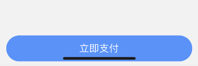
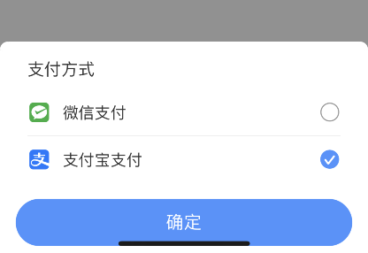

## 移动端控制台

```html
<script src="//cdn.jsdelivr.net/npm/eruda"></script>
<script>eruda.init();</script>
```

## 滚动穿透

当拖动没有滚动条的元素时，会直接拖动页面滚动

经常出现在我们创建了模态框遮罩层，拖动模态框时，整个页面会跟着滚动

解决方案: 

- 弹框时，固定页面不能滚动，实现略，下个案例提及

- 阻止模态框 touchmove 默认事件，但是会导致元素里有滚动元素也不能滚了

## 弹窗时固定页面不能滚动

```ts
/**
 * @description 是否为空值
 * @param value 
 */
export const isEmpty = function(value: any): value is undefined | null {
    return value === undefined || value === null;
}

/**
 * @description 阻止页面滚动
 * @param el 滚动元素
 */
export const preventPageScroll = (el?: HTMLElement | string) => {
    const ele = typeof el === 'string' ? (document.querySelector(el) as HTMLElement) : el;

    const top = document.documentElement.scrollTop || window.pageYOffset || document.body.scrollTop,
        body = document.body;

    // 原本的 style
    const prevPagePostion = body.style.position;
    const prevPageTop = body.style.top;
    const prevPageLeft = body.style.left;
    const prevOverflow = ele?.style.overflow;

    // 滚动元素非 body 也需要，防止 IOS 橡皮筋
    body.style.position = 'fixed';
    body.style.top = `${-top}px`;
    body.style.left = '0';

    // 普通元素只需超出 hidden
    ele && (ele.style.overflow = 'hidden');

    return () => {
        const top = Math.abs(parseFloat(body.style.top));
        !isEmpty(prevPagePostion) && (body.style.position = prevPagePostion);
        !isEmpty(prevPageTop) && (body.style.top = prevPageTop);
        !isEmpty(prevPageLeft) && (body.style.left = prevPageLeft);
        !isEmpty(prevOverflow) && ele && (ele.style.overflow = prevOverflow);
    
        document.documentElement.scrollTop = top;
        window.scrollTo(0, top);
    }
}
```

这种方式可以在弹框时控制页面滚动，防止滚动穿透

## IOS 输入框失去焦点时页面不回弹

移动端输入框聚焦时页面会弹起，页面高度过低时，输入框在失去焦点后可能出现页面不回弹的问题

```ts
setTimeout(() => {
    document.body.scrollTop = document.documentElement.scrollTop || document.body.scrollTop || 0;
}, 100);
```

IOS 13 需要赋值给 documentElement

```ts
setTimeout(() => {
    document.documentElement.scrollTop = document.documentElement.scrollTop || document.body.scrollTop || 0;
}, 100);
```

## IOS 橡皮筋

在 IOS 中，我们拖动页面, 某个滚动元素到边缘时会触发橡皮筋效果（Android 没有）

这原本是挺不错的体验效果，但是却引发了一些问题

**当我们在拖动一个可滚动元素时，在已经置顶或置底的情况下再次去拖动，会触发最外层整个页面的橡皮筋效果，而不是触发元素自身的橡皮筋**

这不仅可能体验上不好，还可能触发 BUG，如拖动页面橡皮筋时，模态框一些内容显示变空白

### 方案一

橡皮筋是在元素已经置顶或置底时，再次拖动会出现的现象

那么可以在开始拖动时判断是否滚动元素已经置顶或置底，如果是则阻止页面 touchmove 的默认事件，让页面无法滑动，如果滚动元素未置顶或置底，则不阻止页面 touchmove 默认事件，也就不会触发整个页面的橡皮筋: 

```ts
function noBounce(scrollBox: Element) {
    let startY = 0; // 初始 touchstart 的位置

    const touchstart = (e: TouchEvent) => {
        startY = e.touches[0].screenY || e.touches[0].pageY;
    };

    const touchmove = (e: TouchEvent) => {
        const targetEle = e.target;
        if(!targetEle) return;

        const curY = e.touches[0].screenY || e.touches[0].pageY;
        const isAtTop = (startY <= curY && scrollBox.scrollTop === 0);
        const isAtBottom = (startY >= curY && scrollBox.scrollHeight - scrollBox.scrollTop === scrollBox.clientHeight);
        
        if(!scrollBox.contains(targetEle as Node) || isAtTop || isAtBottom) e.preventDefault();
    }

    document.body.addEventListener('touchstart', touchstart, { passive: false });
    document.body.addEventListener('touchmove', touchmove, { passive: false });

    return () => {
        document.body.removeEventListener('touchstart', touchstart);
        document.body.removeEventListener('touchmove', touchmove);
    };
}

noBounce(document.querySelector('.list')); // 绑定滚动元素
```

优点: 

- 当滚动元素置顶或置顶时，再次拖动不会导致页面弹性拉伸

缺点: 

- 由于在非置顶/底的 touchmove 中，拉到顶部或底部在 IOS 依旧会触发自身的橡皮筋，这是无法取消的，所以如果现在置顶/底时拖动页面固定死了(如开头所述，元素置顶/底时再拖动 IOS 不会触发自身橡皮筋，会触发页面的橡皮筋，机制如此)，可能比较僵有点奇怪

### 方案二: 

使用 inobounce.js

inobounce.js 的源码只有 100+ 行，主要在于对 -webkit-overflow-scrolling: touch 的判断

inobounce 会在 window 下监听 touchmove 事件，并且只让具有如下条件的元素可以被拖动: 

1. 元素配置了 -webkit-overflow-scrolling: touch

2. 元素配置了 overflow: auto 或 scroll

3. 元素可以滚动(内容已经超出，出现滚动条了)

4. 元素未置顶/置底

同样，会阻止以下情况的默认事件，即页面会无法被拖动: 

1. 当前滑动的是页面(document, document.body)

2. 当前拖动的元素不是可以滚动的元素

3. 当前拖动的元素没有 -webkit-overflow-scrolling: touch

4. 当前拖动的元素已置顶/底

以上其实可以了解到，inobounce 的实现和方案一其实思路是一样的，只是 inobounce 是针对全局，方案一是绑定特定元素

inobounce 提供了 enable, disable, isEnabled 方法，用于开启，关闭，判断是否开启状态，并且页面一进来就会触发 enable 方法(如果页面支持 -webkit-overflow-scrolling: touch)

优点与缺点同方案一，不过封装了库，使用更方便

### 方案三

使用 better-scroll

better-scroll 是让元素假滚动，即父元素设置了 overflow: hidden 超出隐藏，配置 touchmove 事件监听滑动，使用 translateY 控制子元素偏移

优点: 

- 使用简单，可配置项多样

- 模拟了元素滚动的橡皮筋效果，甚至是置顶/底时拖动的橡皮筋效果，体验好

- 元素置顶/底后拖动完美解决触发页面橡皮筋的问题，因为它设置的是超出隐藏，页面橡皮筋是在有真实滚动条的元素置顶/底时再拖动触发的

缺点: 

- 滚动过程中点击让其停住时会抖动一下

- 默认点击事件等会失效，需要配置，对不熟悉者可能造成困扰

问题分析: 

better-scroll 是在 touchend 时算法得出终点位置，设置后通过 CSS transition 过渡效果实现的惯性

在重新触屏后瞬间获取当前的偏移量进行赋值并清除过渡

但是移动端 transition 过渡撤消存在延迟反应，这意味着在 200 的位置瞬间触屏，元素可能还会运动到 210 的位置，接着将元素偏移设置回 200，会出现瞬间倒退的瞬移问题

解决方案: 

不使用 CSS transition 完成惯性，使用 raf 按帧进行动画，每一帧通过计算前进相应的位置

## IOS 橡皮筋与 position: fixed

当我们页面的滚动元素不是文档本身时，即假设其他元素来实现页面进滚动的:

```html
<html>
    <body>
        <!-- 假设 html body 等都是 100% 高度 -->
        <!-- 页面由 #app 来做滚动，#app { overflow: auto } -->
        <div id='app'>
        </div>
    </body>
</html>
```

如果 #app 内有 fixed 的元素，固定在底部:

```html
<html>
    <body>
        <div id='app'>
            <!-- 该元素 position: fixed; bottom: 0 -->
            <div class='fixed'>...</div>
        </div>
    </body>
</html>
```

当 #app 滚到底部再次拖动触发 IOS 橡皮筋时，将会出现 .fixed 元素被遮挡的问题

解决方案:

将 .fixed 元素放到滚动元素外: 

```html
<html>
    <body>
        <div id='app'></div>
        <!-- 该元素 position: fixed; bottom: 0 -->
        <div class='fixed'>...</div>
    </body>
</html>
```

## Video

### 层级问题

在 Android 下，video 一旦播放，z-index 会变最高，无法靠遮罩层遮挡

在一些浏览器下可能有一些配置可以处理

也可以手动 display: none 在遮罩关闭前隐藏

### onCanPlay

- IOS: 在第一次播放时触发

- Android: 视频可以加载完可以触发，拖动时放手也会触发

### 切后台执行 play pause问题

- 相同点:

    - 对于正在播放的视频（本来就是暂停的不影响），Android 和 IOS 切到后台都会执行一次 pause，切回来的时候会执行一次 play

- 不同点:

    - Android: 在切回来之前 JS 执行 video.pause() 无意义（如切 4G 网络要暂停的需求），因为等等切回来后自动执行一次 play 又播放了

    - IOS: 在切回来之前 JS 执行 video.pause() 有效，IOS 监听到执行了 pause，回来后不会执行那一次 play

解决方案: 

- 监听客户端 pageShow 协议 或 document.addEventListener('visibilitychange')，切回来时再次检查网络判断是否要暂停

### 切后台时 visible hiden 事件顺序

- 切后台: 客户端 pageHide 协议 => pause => document.visibilitychange

- 唤醒 APP: document.visibilitychange => play => 客户端 pageShow 协议

存在问题: 

- 假设需求是从后台切回来唤醒 APP 要暂停 video，若在 pageShow 里执行 pause 暂停 video，在 IOS 低版本会出现先播放一小会再暂停的问题

解决方案:

- 由于 document.visibilitychange 在 play 前，可以在 document.visibilitychange 设置变量，在 onplay 事件中发现变量为 true 立即执行 pause 暂停

### duration 视频时长

- IOS: 在 onLoadedMetadata 事件中获取

- Android: 需要在第一次播放后才能获取，之前不管是 onLoadedMetadata 还是 onCanPlay 获取到的都是 0，可以在 play 里 setTimeout 一会获取

### 埋点注意

- 播放中拖动: 

    - IOS: 播放过程中拖动瞬间会先触发 1次 pause，在 seeking 之前，放手后再次触发 play

    - Android: 播放过程中拖动不会触发 pause，放手也不会触发 play

    - 作用: 判断 pause 触发是否为 IOS 拖动触发，可在 seeking 中设置正在拖动的变量，pause 里延迟个 300ms 再判断是否正在拖拽中，是则表示是拖动触发的 pause

- 拖动中:

    - IOS: 拖动过程中 seeking seeked 也会一直触发

    - Android: 在放手触发

- 暂停时拖动:

    - IOS: 在暂停时拖动放开不会 play

    - Android: 在暂停时拖动放开会自己 play，并触发 2 次 seeking，顺序 seeking - play - seeking - seeked

    - 作用: 设置变量判断安卓拖动前是否正在播放中

- 播放结束的 pause:

    - IOS Android 在播放结束都会触发 pause，在 ended 前

    - 作用: 在 pause 事件中通过 video.currentTime !== video.duration 判断是否是结束时触发的 pause

- 播放结束重新播放:

    - IOS Android 在播放结束后点击重新播放，会触发 seeking, seeked，结合播放结束的顺序 pause - ended - seeking -play - seeked

    - 作用: 在 seeking, seeked 中注意判断 video.currentTime 是否为 0，是则表示这次 seeking 是播放结束后重新播放触发的

- timeupdate 事件:

    - IOS: 拖动会带动 timeupdate 变化

    - Android: 在拖动过程中依旧是之前拖动瞬间位置在计时，放手后 seeking 在下一次新 timeupdate 前

    - 作用: 利用 Android timeupdate 事件在拖动时依旧是拖动瞬间的计时状态，记录 Android 拖动前的时间

## fixed 失效

在手机中点击 input 类输入框时弹出键盘，会导致页面中的 fixed 元素失效变为 absolute

这会导致很多问题：

- fixed 元素跟随滚动条滚动。解决方案：fixed 元素放到滚动元素外

- 用 fixed 做的 Nav 导致不再定位在屏幕定位，而是位移或跑到窗口外。目前没有什么解决方案

## translateZ 与 z-index

在 PC 端，translateZ 并不会影响元素层级高低

但是在移动端中，translateZ 比任何 z-index 都高，即一个 translateZ(1px) 的元素都在 z-index: 1000 的元素上面

## 键盘弹起时页面高度

- IOS: 键盘弹起时页面高度不变

- Android: 键盘弹起时页面高度会变小，即会被键盘挤上去

    - 存在问题：如果有 fixed 在底部一段距离的元素，键盘弹起时会顶上去，bottom 如果设的比较大会顶到屏幕外

## iPhoneX 底部横线遮挡问题

iPhoneX 底部的有一个横线，导致底部的内容被遮挡，大约 34px

- 场景一：

fixed 在底部的按钮被横线遮挡



解决方案：

控制按钮的 bottom 值 + 34

- 场景二：

点击按钮后从底部弹出 Popup 弹窗



解决方案：

同上，popup 上移 34

- 场景三：

列表滚动底部时被遮挡


解决方案：

给列表内部增加 padding-bottom: 34，使其滚动底部时最后一条不会被遮挡

```html
<div style='height: 200px; overflow: auto;'>
    <ul style='padding-bottom: 34px;'>
        <li>...</li>
        
        ...

        <li>...</li>
    </ul>
</div>
```

## 图片高度不能自适应

移动端中给 img 设置了 width，并不能像 PC 那样高度自适应

解决方案：

在 img 父级设置 flex 布局 + align-item: center


