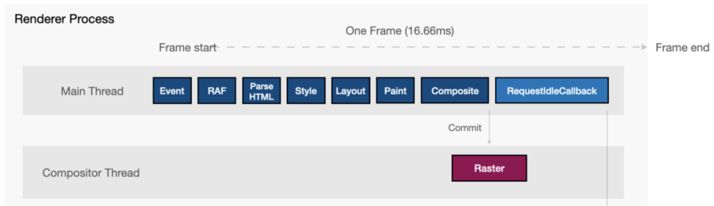

## 来源

学习至掘金小册：

- [React必须要知道的几个面试题](https://juejin.im/post/5df1ed0051882512400ad4b7)

- [React 开发必须知道的 34 个技巧](https://juejin.im/post/5dcb5a80e51d4520db19b906)

- [35 道咱们必须要清楚的 React 面试题](https://juejin.im/post/5dc20a4ff265da4d4e30040b)

- [2019年17道高频React面试题及详解](https://juejin.im/post/5d5f44dae51d4561df7805b4)

## setState 是异步还是同步

- 合成事件和钩子函数里是异步的

- 原生事件和 setTimeout 中是同步的

合成事件：

```jsx
import React, { Component } from 'react'

export default class Question extends Component {
    state = {
        id: 1,
    }
    click = () => {
        this.setState({
            id: 2,
        });
        console.log(this.state.id); // 输出 1
    }
    render() {
        return (
            <div>
                <p>id: {this.state.id}</p>
                <button onClick={this.click}>点击</button>
            </div>
        )
    }
}
```

钩子函数：

```jsx
import React, { Component } from 'react'

export default class Question extends Component {
    state = {
        id: 1,
    }
    componentDidMount() {
        this.setState({
            id: 2,
        });
        console.log(this.state.id); // 输出 1
    }
    render() {
        return (
            <div>
                <p>id: {this.state.id}</p>
                <button>点击</button>
            </div>
        )
    }
}
```

原生事件：

```jsx
import React, { Component, createRef } from 'react'

export default class Question extends Component {
    buttonRef = createRef();
    state = {
        id: 1,
    }
    componentDidMount() {
        this.buttonRef.current.onclick = () => {
            this.setState({
                id: 2,
            });
            console.log(this.state.id); // 输出 2
        }
    }
    render() {
        return (
            <div>
                <p>id: {this.state.id}</p>
                <button ref={this.buttonRef}>点击</button>
            </div>
        )
    }
}
```

setTimeout：

```jsx
import React, { Component } from 'react'

export default class Question extends Component {
    state = {
        id: 1,
    }
    click = () => {
        setTimeout(() => {
            this.setState({
                id: 2,
            });
            console.log(this.state.id); // 输出 2
        }, 0);
    }
    render() {
        return (
            <div>
                <p>id: {this.state.id}</p>
                <button onClick={this.click}>点击</button>
            </div>
        )
    }
}
```

setState 的批量更新优化也是建立在 '异步' 之上的，对同一个值多次 setState，批量更新策略会进行覆盖，取最后一次执行。同时 setState 多个不同的值，更新时也会对其进行合并批量更新

React 的 setState 更新原理和 Vue 的 $nextTick 相似，都是将更新操作后置执行

## React 生命周期有哪些

旧版生命周期：


新版 16.4 后生命周期：


React16 之后移除的生命周期（未删除，17 后准备完全移除，保留 UNSAFE_ 前缀）：

- componentWillMount：组件渲染之前执行，还无法拿到真实 DOM 节点

- componentWillReceiveProps：componentWillReceiveProps(nextProps)，组件初始化时不会执行，组件接收到新的 props 时触发

- componentWillUpdate：componentWillUpdate(nextProps, nextState)，组件即将更新前调用，在 props 或 state 更新后都会触发，在 componentWillReceiveProps 之后，render 之前

目前 React16.8+ 的生命周期分为 3 个阶段：**挂载阶段、更新阶段、卸载阶段**

挂载阶段：

- constructor：构造函数，最先被执行，通常在构造函数里初始化 state 或绑定 this

- getDerivedStateFromProps：static getDerivedStateFromProps(nextProps, prevState)，是个**静态方法**，在组件初始化、prop 或 state 改变时都会调用，需要一个返回值为新的 state 状态，即使 state 不变也要返回 null。一般用于接收新 props 而修改 state

```jsx
static getDerivedStateFromProps(nextProps, prevState) {
    console.log(nextProps, prevState);
    // return null; // 返回 null 表示 state 不变
    return {
        ...prevState,
        id: 11,
    };
}
```

- render：纯函数，返回渲染的内容

- componentDidMount：组件挂载后调用，此时可以操作 DOM 节点

更新阶段：

- getDerivedStateFromProps：...

- shouldComponentUpdate：shouldComponentUpdate(nextProps, nextState)，需要返回一个 boolean，**表示是否重新渲染**。通常用来优化 React 性能

- render：...

- getSnapshotBeforeUpdate：getSnapshotBeforeUpdate(prevProps, prevState)，在 render 后 componentDidUpdate 前调用。这个函数返回值会作为componentDidUpdate 的第 3 个参数，若不需要也要返回 null，此生命周期必须与 componentDidUpdate 搭配，此生命周期时 **DOM 还未更新**，一般将对比或计算的过程放在这里，将结果传递给 componentDidUpdate

- componentDidUpdate：componentDidUpdate(prevProps, prevState, snapshot)，在组件更新完成后调用，**此时 DOM 已更新**。一般将对比或计算的过程迁移至 getSnapshotBeforeUpdate，然后在 componentDidUpdate 中统一触发回调或更新状态

卸载阶段：

- componentWillUnmount：当组件被卸载或销毁就会调用，可以在这个生命周期里清除定时器，取消请求，清理无效 DOM 等清理工作

## 什么是状态提升

当几个组件需要共同的状态数据时，可以将这部分状态提升至它们最近的同一父组件中管理，再通过 props 传递给它们，这就是状态提升

## 什么是受控组件、非受控组件

受控组件：

```jsx
// 通过 value 状态 和 changeValue 合并事件控制显示的值
<input value={this.state.value} onChange={this.changeValue} />
```

非受控组件：

```jsx
// 直接通过 ref 获取原生 DOM，而不是用组件 state 去控制它
ref = createRef();

<input ref={this.ref} />
```

## React 的事件机制是什么

当我们在 React 中写如下代码：

```jsx
<div onClick={this.click}>...</div>
```

React 并没有将这个 click 事件绑定到这个 div 上，React 内部自定义了一套事件系统，在这个系统上进行事件订阅和分发

React 利用事件代理，在 document 监听所有支持的事件，再通过 target 将事件分发到具体的组件实例，且我们接收到的 e 是一个合成事件对象（SyntheticEvent），而不是原生的 event

自定义事件系统的优势：

- 抹平浏览器之间兼容性差异

- 事件自定义：如 React 的 onChange，为表单元素定义了统一的值变动事件

- 抽象跨平台

- 优化：利用事件代理，而不是直接在 DOM 本身绑定事件，减少了内存开销，但这也意味着 React 需要直接模拟一套事件冒泡机制

- 干预事件分发：React16 引入了 Fiber 架构，React 为了优化用户的交互体验，会干预事件分发。不同类型的事件有不同的优先级，如高优先级的事件可以中断渲染，让用户代码可以及时响应用户交互

## React 组件之间如何通讯

- 父 => 子：父组件向子组件传递 props

- 子 => 父：父组件传递回调函数的 props 给子组件，子组件调用回调传递参数，父组件接收

- context

利用 Context 的 Consumer 和 Provider 进行通讯，可以实现父子组件**跨级通讯**

```jsx
const { Consumer, Provider } = React.createContext();

// 父组件
<Provider value={name}>
    <Child />
</Provider>

// 子组件
<Consumer>
    {
        name => (
            <div>{name}</div>
        )
    }
</Consumer>
```

- EventEmitter

使用 events 插件定义全局事件机制

```jsx
npm install events --save

// event.js
import { EventEmitter } from 'events';

export default new EventEmitter();

// 组件 A
import eventEmitter from './event';

componentDidMount() {
    this.emitter = eventEmitter.addListener('changeEvent', mes => {
        console.log(mes);
    });
}

// 组件 B
import eventEmitter from './event';

click = () => {
    eventEmitter.emit('changeEvent', 'something');
}

<div>
    <button onClick={this.click}>点击</button>
</div>
```

- 路由传参

组件页面之间通过路由传参也算是一种通讯方式：

```jsx
// 示例一
<Route path='/path/:name' component={Path}/>
<link to="/path/2">xxx</Link>

this.props.history.push({ pathname: '/path/' + name });
this.props.match.params.name

// 示例二
<Route path='/query' component={Query}/>
<Link to={{ pathname: '/query' , query: { name: 'k' }}}>

this.props.history.push({ pathname: '/query', query: { name: 'k' } });
this.props.location.query.name

// 示例三
<Route path='/state ' component={State}/>
<Link to={{ pathname: '/state ' , state: { name: 'k' }}}> 

this.props.history.push({ pathname: '/state', state: { name: 'k' } })
this.props.location.query.state

// 示例四
<Route path='/web/search ' component={Search}/>
<link to="web/search?id=1">xxx</Link>

this.props.history.push({ pathname:'/web/search?id=1' });
this.props.location.search
```

- onRef

父组件传递一个 onRef 函数的 props 给子组件，子组件将自己的 this 作为参数传递，这样父组件就可以调用子组件的 this，从而调用子组件里的状态和方法

```jsx
// 子组件
componentDidMount() {
    this.props.onRef(this);
}
query = () => {
    ...
}

// 父组件
childRef = ref => {
    console.log(ref); // 子组件实例
    ref.query();
};

<Child onRef={this.childRef} />
```

- ref

直接利用 ref 获取整个子组件实例

```jsx
// 父组件
childRef = null;

click = () => {
    console.log(this.childRef); // 子组件实例
}

<Child ref={r => this.childRef = r} />
```

- redux

React 可以配合 Redux 实现全局状态，各个组件都可以使用


## React 请求应该放在哪个生命周期

有人认为应该将请求放在 componentWillMount，这样可以提前请求，避免白屏

这样是可以做到提前请求，但是和白屏关系不大

当 React 渲染一个组件时，不会去等待 componentWillMount 里做的事情，React 继续前进渲染 render，所以放在哪个生命周期做请求，React 该渲染都是一样照常渲染，不会影响白屏时长

而 componentWillMount 里做请求也存在一些问题：

- 在服务端渲染时，fetch data 会执行 2 次，一次在服务端一次在客户端，造成多余的请求

- React16 进行 React Fiber 重写后，componentWillMount 可能在一次渲染中多次调用

官方推荐异步请求在**componentDidMount**，有特殊需求需要提前，也可以在 constructor 里

## React 中的 ref 怎么使用

ref 可以获取组件实例或 DOM 节点

无法用在函数组件上，除非使用 forwardRef 把 ref 当做普通变量

- 回调形式

```jsx
inputRef = null;
componentDidMount() {
    this.inputRef; // input DOM 节点
}

<input ref={input => this.inputRef = input} />
```

- createRef

React16.3 后使用 createRef 创建 ref，该 ref 的 current 可以拿到 DOM 节点或组件实例

```jsx
inputRef = React.createRef();
componentDidMount() {
    this.inputRef.current; // input DOM 节点
}

<input ref={inputRef} />
```

- forwardRef

React.forwardRef 可以将 ref 作为普通 prop 传递，一般用于高阶组件

```jsx
function withinButton(Comp) {
    return React.forwardRef((props, ref) => {
        return <Component {...props} myRef={ref} />
    })
}

class FancyButton extends React.Component {
    ...
}

const Fb = withinButton(FancyButton);

// 使用
class Wrap extends React.Component {
    ref = React.createRef();
    render() {
        return <Fb ref={this.ref} />
    }
}
```

## React 怎么为 props 定义类型

使用 propTypes 可以为组件的 props 定义类型：

```jsx
class Wrap extends React.Component {
    ...
}

Wrap.propTypes = {
    id: number,
    name: string,
    ...
}

或直接 static 定义：

class Wrap extends React.Component {
    static propTypes = {
        id: number,
        name: string,
        ...
    }
    ...
}
```

## React 有哪些定义组件方法的方式

```jsx
// 方式一
export default class Question extends Component {
    click() {
        console.log(this);
    }
    render() {
        return (
            <div>
                <button onClick={this.click.bind(this)}>点击</button>
            </div>
        )
    }
}

// 方式二
export default class Question extends Component {
    constructor() {
        super();
        this.click = this.click.bind(this);
    }
    click() {
        console.log(this);
    }
    render() {
        return (
            <div>
                <button onClick={this.click}>点击</button>
            </div>
        )
    }
}

// 方式三
export default class Question extends Component {
    click() {
        console.log(this);
    }
    render() {
        return (
            <div>
                <button onClick={() => this.click()}>点击</button>
            </div>
        )
    }
}

// 方式四
export default class Question extends Component {
    click = () => {
        console.log(this);
    }
    render() {
        return (
            <div>
                <button onClick={this.click}>点击</button>
            </div>
        )
    }
}
```

方式一中，每次组件 render 都会重新 bind(this)，会生成新的函数引用，可能导致子组件重复渲染

方式二中，函数引用不变，需要在 constructor 中先 bind，在方法较多时显得比较繁琐

方式三与方式一相同，每次会产生新的函数引用

方式四较为推荐

## React 中如何创建异步组件

- 自定义异步加载组件

```jsx
 export default class Bundle extends React.Component {
    state = {
        mod: null,
    }

    componentWillMount() {
        this.toLoad(this.props.load);
    }

    toLoad = (load) => {
        load && load().then((mod) => {
            this.setState({
                mod: mod.default ? mod.default : mod,
            });
        });
    }

    render() {
        const Component = this.state.mod;
        const { load, ...others } = this.props;
        return this.state.mod ? <Component {...others} /> : null;
    }
}

// 使用
const AsyncQuestion = props => <Bundle {...props} load={() => import('./components/todo/question')} />

class App extends Component {
    render() {
        return (
            <div>
                <AsyncHelp />
            </div>
        )
    }
}
```

- 使用 react-loadable

```jsx
npm install react-loadable --save
```

```jsx
import Loadable from 'react-loadable';

function Loading({error, pastDelay}) {
    if(error) {
        return <div>Error</div>
    } else if(pastDelay) {
        return <div>Loading ...</div>
    } else {
        return null;
    }
}

const AsyncQuestion = Loadable({
    loader: () => import('./components/todo/question'),
    loading: Loading,
    delay: 300,
})

// 使用
class App extends Component {
    render() {
        return (
            <div>
                <AsyncHelp />
            </div>
        )
    }
}
```

- 使用 React.lazy

React16.6 新出的 API，可以实现懒加载组件

```jsx
const AsyncQuestion = React.lazy(() => import('./components/todo/question'));

// 使用
class App extends Component {
    render() {
        return (
            <React.Suspense fallback={<div>Loading ...</div>}>
                <AsyncQuestion/>
            </React.Suspense>
        )
    }
}
```

React.lazy 与 react-loadable 差别：

suspense 可以实现多 lazy 多级应用，不仅仅可以包裹一个 lazy 组件，会等作用域内全部 lazy 组件加载完成，可以提升任意组件级的 loading，实现 loading 聚合

## 什么是 HOC 高阶组件

高阶组件是一个纯函数，接收一个组件并返回一个新的组件

作用：

- 代码重用、逻辑抽象

```jsx
如许多组件都需要响应一个鼠标移动事件，可以封装一个高阶组件保存 mouse 状态向下传递：

    function withinMouse(Comp) {
        return class extends React.Component {
            state = {
                x: 0,
                y: 0,
            };
            handleMouseMove = (event) => {
                this.setState({
                    x: event.clientX,
                    y: event.clientY,
                })
            }
            render() {
                return (
                    <div onMouseMove={this.handleMouseMove}>
                        <Comp {...this.props} mouse={this.state} />
                    </div>
                )
            }
        }
    }

    class Wrap extends React.Component {
        const { x, y } = this.props.mouse;
        render() {
            return (
                <div>
                    Mouse Position: {x} {y}
                </div>
            )
        }
    }

    const WithinWrap = withinMouse(Wrap);

    class App extends React.Component {
        render() {
            <WithinWrap />
        }
    }
```

- 渲染劫持

用高阶组件控制组件生成的效果，可以读取、添加、修改、删除任何一个将被渲染的 React Element 的 props，修改 render tree 等

如利用反向继承，做到条件型渲染：

```jsx
function withinRender(Comp) {
    return class extends Comp {
        render() {
            return this.props.isLogged ? super.render() : null;
        }
    }
}

const RenderQuestion = withinRender(Question);

class App extends React.Component {
    render() {
        <RenderQuestion isLogged={true} />
    }
}
```

利用反向继承修改 React ElementS Tree：

```jsx
function withinRender(Comp) {
    return class extends Comp {
        render() {
            const renderTree = super.render();
            return React.cloneElement(renderTree, { 
                info: 'something',
            })
        }
    }
}
```


## 什么是 render props

render props 同样是提高组件复用和抽象的手段

它将函数作为名 render 的 prop 传入抽象组件，在函数的参数中获取状态，实现自定义渲染

它更多的用在**组件行为上的依赖**

例如：

- 模态框的开启和关闭，可能是依赖于一个开启、关闭的按钮

- 一个区域内显示与隐藏详情，也依赖于一个开启、关闭的按钮

甚至项目里有更多的地方有这种依赖于开启、关闭按钮操作的场景

那这时，这些组件都依赖于这个按钮是状态，就可以封装成一个抽象组件，使用 render props 来调用其它组件

```jsx
// 抽象按钮
class ToggleButton extends React.Component {
    state = {
        open: false,
    };
    toggle = () => {
        this.setState(state => ({
            open: !state.open,
        }));
    }
    render() {
        return (
            <div>
                <button onClick={this.toggle}>{this.state.open ? '关闭' : '开启'}</button>
                {this.props.render(this.state.open)}
            </div>
        )
    }
}

// 使用，显示隐藏模态框
class App extends React.Component {
    render() {
        return (
            <ToggleButton
                render={isOpen => {
                    return isOpen ? <div>This is Dialog</div> : null;
                }}
            />
        )
    }
}
```

## HOC、render props、hooks 的优劣

**HOC 高阶组件：**

优点：

- 抽离组件公共部分，提高复用性

- 利用外层组件以 props 影响内部组件 state，而不是直接影响其 state，降低耦合度

缺点：

- 扩展性限制：无法从外部访问子组件 state

- ref：ref 存在隔离，需要用 React.forwardRef 将 ref 变为普通变量再二次绑定到子组件上

- 嵌套问题：可能出现多层嵌套包裹组件的情况，多层抽象增加了复杂度和理解成本

**render props：**

优点：

- 可以解决 HOC 的问题

缺点：

- 使用繁琐：HOC 可以借助装饰器语法进行复用使用便捷，render props 无法这么简洁

- 嵌套问题：虽然摆脱了 HOC 的组件多层嵌套，但是也转化成了函数回调的嵌套

**hooks：**

优点：

- 简洁：解决了 HOC 与 render props 的嵌套问题

- 解耦：可以把逻辑和 UI 更彻底的解耦，甚至是逻辑与逻辑直接解耦

- 组合：hook 中可以引用其他的 hook，组合变化万千

- 优化细粒度：类组件使用 shouldComponentUpdate 去优化整个组件渲染，hooks 可以利用 React.memo 与 React.callback 更细粒度的优化组件渲染

- 函数组件：hooks 用在函数组件，可以解决类组件中的问题：

    - this 指向问题，函数组件中没有 this

    - 类组件中在生命周期函数中存在毫无关联的逻辑操作，在 hooks 中可以分离至各个自定义 hook 更为解耦

缺点：

- 额外学习成本

- hooks 主要是利用闭包，适当不当可以会造成大量的闭包占用内存

- 更细粒度的优化同样也有缺陷，需要更精确的判断决定是否某一块需要这样优化，且使用不当也会造成闭包内存占用

- 使用 React.memo，无法使用 React.PureComponent，React.memo 只能浅比较 props，不能像 React.PureComponen 可以浅比较 state 控制渲染

- 函数组件无组件实例，ref 的使用上有局限性

## React.PureComponent 与 React.memo

React.PureComponent 与 React.Component 类似，用于定义一个类组件

React.Component 需要使用 shouldComponentUpdate 手动去对比 state 或 props 的变化来告诉 React 是否更新组件

React.PureComponent 可以自动通过 state 与 props 进行浅比较，判断是否需要更新组件，提供组件性能

```jsx
class Child extends React.Component {
    ....
}

class App extends React.Component {
    ...
    render() {
        return (
            <div>
                <button onClick={this.toggle}>{this.state.open ? '关闭' : '开启'}</button>
                <Child id='1' />
            </div>
        )
    }
}
```

如上，当 App 组件中 open 状态改变时，APP 组件重新 render，其实 Child 组件的 state 和 props 是没有改变的，但是它还是会重新 render，这显然对性能有影响

而使用 React.PureComponent 了后，就可以自动浅比较 state 与 props，如不需要 render，组件将不会耗费性能重新渲染：

```jsx
class Child extends React.PureComponent {
    ....
}
```

React.PureComponent 并不适用于函数组件，且函数组件也没有 shouldComponentUpdate 可以手动对比

React16.6 新增了 React.memo 用于函数组件：

```jsx
function Child(props) {
    ...
}

// 第二个参数可选
export default React.memo(Child, (prevProps, nextProps) => {
    return prevProps.seconds === nextProps.seconds
})
```

## ReactDOM.createPortal 的作用是什么

一般在组件 render 中，我们写如下代码：

```jsx
render() {
    return (
        <div>
            <Modal />
        </div>
    )
}
```

Modal 是一个模态框，绝对定位在 body 之下

然而因为组件的特性，这个 Modal 的内容最终会被渲染在当前组件所属位置的 DOM 结构之下，无法挂载到 body 之下

ReactDOM.createPortal 就是为了解决这个问题而存在，它提供了让子节点渲染到存在于父节点之外的 DOM 节点的方案

```jsx
import React, { Component } from 'react';
import ReactDOM from 'react-dom';

export default class modal extends Component {
    el = document.createElement('div');

    componentDidMount() {
        document.body.appendChild(this.el);
    }
    componentWillUnmount() {
        document.body.removeChild(this.el);
    }

    render() {
        //  props.children 挂载到 el 这个 DOM 下
        return ReactDOM.createPortal(this.props.children, this.el);
    }
}

// 使用
    class App extends React.Component {
    ...
    render() {
        return (
            <div>
                <Modal>
                    This is Modal Content ...
                </Modal>
            </div>
        )
    }
}
```

## 如何在 React 中使用 innerHTML

```jsx
<div dangerouslySetInnerHTML={{__html: '<span>content</span>'}}></div>
```

## 什么是 React.createElement

React.createElement( type, [props], [...children] )

JSX 即是 React.createElement 的语法糖，JSX 编译后生成的 js 都是 React.createElement：

```jsx
// jsx
<div id='wrap'>
    <span id="item">something</span>
</div>

// js
React.createElement(
    "div",
    { id: "one" },
    React.createElement("span", { id: "item" }, "something")
);
```

## React.cloneElement 的作用是什么

一般用于克隆一个 React 元素，或为 React 元素添加或修改 props，会返回一个新的 React 元素

```jsx
React.cloneElement(
    element,
    [props],
    [...children]
)

// 为 props.children 里每个 React 元素修改 props
React.Children.map(this.props.children, child => {
    return React.cloneElement(child, {
        title: 'something',
    })
})
```

## 构造函数中调用 super 并传入 props 的作用是什么

- 在调用 super() 之前，子类构造函数无法使用 this 引用

```jsx
constructor() {
    console.log(this); // 报错
    super();
}
```

- 将 props 作为参数传入 super，主要原因是子构造函数里能通过 this.props 获取传入的 props

传入 props：

```jsx
class MyComponent extends React.Component {
    constructor(props) {
        super(props);
        console.log(this.props);  // { name: 'k',age: 18 }
    }
}
```

没传入 props：

```jsx
class MyComponent extends React.Component {
    constructor(props) {
        super();
        console.log(this.props); // undefined
        // 但是 Props 参数仍然可用
        console.log(props); // Prints { name: 'k',age: 18 }
    }

    render() {
        // 构造函数外部不受影响
        console.log(this.props) // { name: 'k',age: 18 }
    }
}
```

## React 中 StrictMode 是什么

React 的 StrictMode 是一种辅助函数，可以帮助开发者编写更好的 React 组件

使用 \<StrictMode/> 包裹组件，可以检查：

- 内部组件是否遵循某些推荐做法，如果没有会在控制台给出警告

- 是否使用已废弃的方法，如果有会在控制台给出警告

- 识别潜在的风险预防一些副作用

## 什么是 prop drilling

即多层嵌套组件中，底层子元素要使用顶层父元素的数据，最简单的做法是将 prop 从每个组件一层层传递下来，从源组件传递到深层嵌套组件，这就是 prop drilling

缺点：原本不需要数据的组件也被迫需要添加这个需要传递的 prop，变得不必要的复杂，难以维护

解决：使用 React Context，利用 Provider 组件传递数据，Consumer 组件或 contextType 接收类组件的数据，函数组件可以用 useContext 接收数据

## React 中 constructor 和 getInitialState 的区别是什么

constructor 是 React 使用 ES6 class 定义组件初始状态时使用

getInitialState 是在 React.createClass 中使用

```jsx
class MyComponent extends React.Component {
    constructor(props) {
        super(props);
        this.state = {
            ...
        };
    }
}

等价于：
var MyComponent = React.createClass({
    getInitialState() {
        return {
            ...
        };
    },
});
```

## 什么是错误边界

错误边界是一种 React 组件，可以**捕获并打印发生在其子组件树任何位置的 JS 错误，渲染出备用 UI**

如果一个组件有 static getDerivedStateFromError() 或 componentDidCatch 中的任何一个（或两个），就变成一个错误边界

```jsx
class ErrorBoundary extends Component {
    state = { hasError: false };
    static getDerivedStateFromError(error) {
        console.log(error);
        return { hasError: true };
    }
    componentDidCatch(error, errorInfo) {
        console.log(error);
        console.log(errorInfo);
    }
    render() {
        if(this.state.hasError) {
            return <p>Something Error</p>
        }
        return this.props.children;
    }
}

class Question extends Component {
    ...
    render() {
        if(this.state.id === 2) {
            throw new Error('error............');
        }
        ...
    }
}

// 使用
class App extends Component {
    render() {
        return (
            <div>
                <ErrorBoundary>
                    <Question />
                </ErrorBoundary>
            </div>
        )
    }
}
```

错误边界无法捕获以下错误：

- 事件处理，与 render 和生命周期不同，事件处理器不会在渲染期间触发，因为事件处理中抛出错误时，React 依旧知道要显示什么，就不需要错误边界捕获了，事件处理中的错误一般 try catch 即可

- 异步代码，如 setTimeout 或 requestAnimationFrame

- 服务端渲染

- 组件自身的错误（因为只能捕获子组件树上的）

> 注：开发模式下捕获了错误依旧页面会报错，生产模块可以正常显示

## React Hooks 有什么优势

- 函数式组件中使用，函数组件相比类组件更轻量

- 更好的重用，相比 HOC 高阶组件，避免了组件深处嵌套问题

- 将逻辑也做到了解耦，类组件中我们可能在生命周期中实现一系列的逻辑操作，然而这些逻辑操作相互不关联却放在一个生命周期里强行耦合，而 hooks 让我们提取自定义 hook，更好的分离逻辑

- class 组件初学者需要了解 this 指向问题，存在学习障碍，hooks 中不存在这个问题

## Reac Hooks 原理

[React Hooks 原理](https://github.com/brickspert/blog/issues/26)

## redux 工作流程是什么

核心概念：

- Store：数据仓库，整个应用只有一个 Store

- State：仓库中包含的数据状态

- Action：State 不能直接操作，需要 Action 发出通知，表示 State 要发生变化

- Action Creator：要发送多少种消息，就有多少种 Action，每次都手写是不利于维护的，可以定义一个函数来生成 Action，即 Action Creator

- Reducer：Store 接收到 Action 后，需要由 Reducer 根据 Action 的指令得出一个新的 State。Reducer 是一个函数，接收 Action 与当前 State，返回一个新 State

- dispatch：派发 Action 的方法

工作流程：

- 用户通过界面操作，发出 Action，发出方式就用了 dispatch，即 dispatch(action)

- Store 自动调用 Reducer，传入参数，当前 State 与接收到的 Action，经过计算返回新的 State

- State 发生了变化，Store 就会调用 subscribe 监听函数，更新视图

## react-redux 的原理

react-redux 的核心模块：

- Provider：一个组件，用来传递 store 给子组件

- connect：一个函数，负责连接 Redux 与 React，合并 state 和 dispatch 到组件的 props 中，让组件可以从 props 中获取 store 的 state，也可以 dispatch 派发 action

示例：

```jsx
// app.jsx
import { Provider } from 'react-redux';

class App extends Component {
    ...
    render() {
        return (
            <Provider store={store}>
                <Child />
            </Provider>
        )
    }
}

// child.jsx
import { connect } from 'react-redux';

class Child extends Component {
    ...
    render() {
        return (
            <div>
                <p>cart count: {this.props.cartCount}</p>
                <button onClick={this.props.onCartCountChange}>add</button>
            </div>
        )
    }
}

const stateToProps = (state)=>{
    return {
        cartCount : state.count,
    }
}

const dispatchToProps = (dispatch) =>{
    return {
        onCartCountChange(e){
            const action = changeCartCountAction(e.target.value);
            dispatch(action);
        }
    }
}

export default connect(stateToProps, dispatchToProps)(Child);
```

原理：

- \<Provider> 组件接收 store 作为 props，利用 context 将 store 向下传递，让子孙组件都可以通过 context 获取到 store

- 根据 export default connect(stateToProps, dispatchToProps)(Child) 可以看出，connect 函数的结构应该是：

```jsx
function connect(mapStateToProps, mapDispatchToProps, ...) {
    return function wrapWithConnect(WrappedComponent) {
        class Connect extends Component {
            ...
            constructor() {
                // context 获取 store，将 state 存在自己的 state 上
                ...
            }
            render() {
                // 结合 mapStateToProps、mapDispatchToProps、this.props 得到新的 props 传递给 WrappedComponent
                ...
            }
        }
        return ...
    }
}
```

- Connect 组件会根据 context 获取到 store，然后将 store.getState() 放在 state 状态中

- Connect 组件会将 mapStateToProps、mapDispatchToProps 与组件原有的 props 合并组成新的 props 后传递给 WrappedComponent

- Connect 组件利用 store.subscribe 订阅，监听 state 的变化，在回调中 this.setState 更新 store.getState()，实时更新组件状态并渲染子组件

## Redux 异步中间件之间的优劣

现在比较主流的 Redux 中间件有：redux-thunk、redux-saga

redux-thunk：

优点：

- 体积小：redux-thunk 实现方式简单，实现代码很少

- 使用方便：redux-thunk 使用便捷，只是将 dispatch 从参数从接收对象变成可以接收一个参数是 dispatch 的异步函数

缺点：

- 耦合问题：异步操作与 redux 的 action 结合在了一起，不利于管理

- 功能弱：一些实际开发中常用的功能需要自己进行封装

redux-saga：

优点：

- 异步解耦：异步操作被单独挡在 saga.js 的文件，不再掺杂在 action 与组件中

- 保持了 action 的原始形态：action 不再变成 thunk function，dispatch 的参数依然是纯粹的 action

- 功能强大：redux-saga 提供了大量 Saga 辅助函数和 Effect 创建器

- 灵活：可以将多个 Saga 串行/并行联合起来，形成非常实用的异步 flow

- 易测试：提供各种 case 测试方案，包括 mock task，分支覆盖等

缺点：

- 额外学习成本：redux-saga 使用比较难以理解的 generator，且有数十个 API，学习成本远超 redux-thunk

- 体积庞大：体积较大，代码近 2000 行，min 版 25KB 左右

- 功能过剩：并发控制等功能一般比较少用到

- ts 友好性：generator yield 在 typescript 中不能很好的返回类型

## React 与 Vue 的差异

- 数据绑定：

Vue 采用数据劫持-发布-订阅模块的方式，通过 Object.defineProperty（后面改为 Proxy） 对数据进行操作，动态添加 getter、setter，当获取数据时触发 getter，设置数据时触发 setter，从而触发相应 的 watcher 进行 update 操作更新 DOM 从而更新视图

React 中的状态是不允许直接修改的（不像 Vue 那样直接 this.XXX 赋值），需要通过 setState 进行更改

- 重新渲染：

Vue 会跟踪每一个组件的依赖关系，不需要重新渲染整个组件树

React 在状态变更时，该组件及子组件都会重新渲染，需要 shouldComponentUpdate 控制，或 React.memo、PureComponent

- 性能优化：

Vue 中每个组件都自动实现了 shouldComponentUpdate，当任意数据改变时，每一个组件都可以精确知道是否需要重绘，不需要手动优化（特例，Vue 做的不够好的点：只要组件有向子组件传递事件（如 @click）、$listeners、$attrs，那当父组件重新渲染时都会导致子元素重新渲染）。但是在数据非常多时 Vue 中的 watcher 也会非常多，从而可能造成页面卡顿，所以有的人说大型项目更倾向用 React

React 中当组件的 props 或 state 改变时触发组件更新，都会重新渲染，需要手动使用 shouldComponentUpdate 控制。且组件渲染都会造成子组件更新，可以使用 React.memo 或 PureComponent 减少子组件的不必要更新

简而言之，Vue 已经将性能优化做好了，React 在性能优化上更灵活

## 如何理解 Fiber

[这可能是最通俗的 React Fiber(时间分片) 打开方式](https://juejin.cn/post/6844903975112671239#heading-8)

### Fiber 的原理是什么

React Fiber 是对核心算法的一次重新实现

原来 React 的更新过程是同步的，递归执行的，也就是说这是基于函数调用栈的 Reconcilation 算法

递归容易理解，只不过这种依赖于调用栈的方式不能随意中断、也很难被恢复, 不利于异步处理。 这种调用栈，不是程序所能控制的， 如果你要恢复递归现场，可能需要从头开始, 恢复到之前的调用栈

这可能会导致性能问题，因为当 React 要加载或更新组件树时，有很多事要做：调用生命周期，计算对比 Virtual DOM、更新 DOM 树，整个过程是同步的，只要一个更新（如调用 this.setState），React 会**遍历**应用的所有节点，这些操作就要一步到底走下去，这可能会造成界面卡顿问题

React Fiber 就是为了解决这个 JS 单线程引起的问题，它将更新过程碎片化，把耗时长的任务分为很多小片，虽然总时长依旧，但每个小片执行完成后，就把控制权交还给浏览器，让浏览器有时间进行页面的渲染，主要基于的是浏览器的 **requestIdleCallback** API（其实并不是直接用原生 requestIdleCallback，由于该 API 的兼容性局限，React 团队自己实现了一套）

并且更新分片后，每次执行新的分片前还可以查看是否存在优先级高的任务要做，没有就继续更新，主要做的优势在于可以灵活的暂停、继续和丢弃执行的任务

这样的做法也让浏览器主线程得以释放，保证了渲染了帧数

### React 怎么定义任务优先级

- Immediate(-1)：这个优先级的任务会同步执行, 或者说要马上执行且不能中断

- UserBlocking(250ms)：这些任务一般是用户交互的结果, 需要即时得到反馈

- Normal(5s)：应对哪些不需要立即感受到的任务，例如网络请求

- Low(10s)：这些任务可以放后，但是最终应该得到执行. 例如分析通知

- Idle(没有超时时间)：一些没有必要做的任务 (e.g. 比如隐藏的内容), 可能会被饿死

### 每次分片后如何知道下一段从哪个组件开始渲染

每个 React 元素都有一个对应的 Fiber 节点，用于描述需要完成的工作，且 Fiber 节点拥有 return、child、sibling 三个属性，分别表示父节点、子节点、兄弟节点，这就可以从树结构转而构建出一个**链表**


### Fiber 使用链表的好处

- 使用了链表结构，即使处理流程被中断了，也随时可以从上次未处理完的 Fiber 继续遍历下去

- 节点异常时，我们可以打印出完整的“节点栈”，只需要沿着节点的 return 回溯即可

### Fiber 对现有代码的影响

Fiber 将更新进行分片，并且可以让优先级高的任务打断更新，这可能造成低优先级的更新任务完全作废，等待时机重头再来

因为更新可能被打断，Fiber 的更新过程分为两个阶段：

- Reconciliation Phase

- Commit Phase

Reconciliation Phase 会找到需要更新哪些 DOM，可以认为是 Diff 阶段，这个阶段是可以被打断的，会调用如下生命周期：**constructor、componentWillMount、componentWillReceiveProps、shouldComponentUpdate、componentWillUpdate、render**

Commit Phase 将上一阶段计算出来需要处理的一次性执行了，即会一鼓作气把 DOM 更新完，不会被打断，因为要正确的处理各种副作用，如 DOM 变更，componentDidMount 中发起的请求，必须保证按顺序只调用一次，会调用如下生命周期：**componentDidMount、componentDidUpdate、componentWillUnmount**

可以看出，由于 Fiber 的机制，**现在第一阶段的生命周期在一次加载或更新中可能被多次调用，造成不必要的 BUG，不安全**

所以 React16 后推出了新的生命周期：

- static getDerivedStateFromProps：处于 Reconciliation 阶段，但因为是静态方法，用户无法做如 this.XXX 等操作，强迫这个函数变成纯函数，逻辑相对简单，就没那么多错误了

- getSnapShotBeforeUpdate：处于 Commit 阶段，不会有重复调用问题（严格来说，这个是在进入 commit 阶段前调用）
### Fiber 结构与 Reconciliation 阶段实现理解

Fiber 属性可以分为 5 个部分：

```ts
interface Fiber {
    /** ⚛️ 结构信息 */ 
    return: Fiber | null;
    child: Fiber | null;
    sibling: Fiber | null;
    // 子节点的唯一键, 即我们渲染列表传入的key属性
    key: null | string;

    /** ⚛️ 节点的类型信息 */
    // 标记 Fiber 类型, 例如函数组件、类组件、宿主组件（内置组件，即 ReactDOM 提供的 div, span 等）
    tag: WorkTag;
    // 节点元素类型, 是具体的类组件、函数组件、宿主组件（字符串）
    type: any;

    /** ⚛️ 节点的状态 */
    // 节点实例(状态)：
    // - 对于宿主组件，这里保存宿主组件的实例, 例如DOM节点。
    // - 对于类组件来说，这里保存类组件的实例
    // - 对于函数组件说，这里为空，因为函数组件没有实例
    stateNode: any;
    // 新的、待处理的props
    pendingProps: any;
    // 上一次渲染的props
    memoizedProps: any; // The props used to create the output.
    // 上一次渲染的组件状态
    memoizedState: any;


    /** ⚛️ 副作用 */
    // 当前节点的副作用类型，例如节点更新、删除、移动
    // Reconciliation 过程中发现的 '副作用' 就保存在节点的 effectTag 中
    effectTag: SideEffectTag,
    // 将本次渲染的所有节点副作用都收集起来
    // 和节点关系一样，React 同样使用链表来将所有有副作用的 Fiber 通过 nextEffect 连接起来（即 nextEffect 指向的还是一个 Fiber 节点，而不是此 Fiber 节点的 effect 内容）
    nextEffect: Fiber | null,

    /** ⚛️ 替身，指向旧树中的节点 */
    // Reconciliation 过程中会构建一颗新的树（官方称为 workInProgress tree，WIP 树），可以认为是一颗表示当前工作进度的树
    // 还有一颗表示已渲染界面的旧树，React 就是一边和旧树比对，一边构建 WIP 树的
    // alternate 指向旧树的同等节点
    alternate: Fiber | null,
}
```

Reconciliation 阶段会对 Fiber 进行 Diff，不会再递归去对比，也不会马上提交变更

Reconciliation 简单实现可见 [粗略过程还原](https://juejin.cn/post/6844903975112671239#heading-8)

### WIP 双缓冲

类似于图形化领域的 “双缓冲”（先将图片绘制到一个缓冲区，在一次行传递给屏幕显示，防止屏幕抖动，优化渲染性能）

WIP 树是一个缓冲，在 Reconciliation 完毕后一次性提交给浏览器进行渲染

WIP 的节点并非完全是新的，比如某棵子树不需要变动，React 会克隆复用旧树的子树

双缓冲技术可以：

- 减少内存分配和垃圾回收
- 一个节点抛出异常，仍然可以继续沿用旧树的节点避免整棵树挂掉

可以比喻为 Git 来理解它：WIP 树是从旧树 Fork 出来的功能分支，在这个新分支添加或移除特性，即使是误操作也不会影响旧的分支，当这个分支经过测试和完善就可以合并到旧分支将其替换掉

### 怎么理解 requestIdleCallback

[实现 React requestIdleCallback 调度能力](https://blog.csdn.net/LuckyWinty/article/details/121154921)

简单的说，判断一帧有空闲时间，则去执行某个任务，见下图



目的是为了解决任务需要长时间占用主线程，导致更高优先级的任务无法及时响应，带来页面丢帧问题

React 即用这个来做分片

```ts
interface Deadline {
    timeRemaining: () => number; // 当前剩余时间，即该帧剩余时间
    didTimeout: boolean; // 是否超时
}

type RequestIdleCallback = (cb: (deadline: Deadline) => void, options?: Options) => number;
```

但原生的 requestIdleCallback 有缺陷：

- 兼容性

- FPS 只有 20，高于页面流畅诉求

React 则自己实现了 requestIdleCallback，需要解决的问题：

- 如何判断一帧是否空闲

可以利用 requestAnimationFrame，它的回调会接收一个参数

```ts
// rafTime 是回调被执行的时间，可以当作这一帧开始的时间，结束时间可以当作是 rafTime + 16.667ms（即 60FPS 的下的一帧时长）
type RequestAnimationFrame = (cb: (rafTime: number) =>  void);
```

- 空闲，那在一帧的哪执行任务

可以用宏任务 postMessage 处理，因为可以把主线程让出，在下一次事件循环前，让浏览器去更新页面

Q：为什么不用微任务
A：在一次事件循环，页面更新前会将全部微任务执行完，无法把主线程让出

Q：为什么不用 setTimeout
A：会有最小阈值，通常浏览器是 4ms

简单实现：

```ts
let deadlineTime;
let callback;

const channel = new MessageChannel();
const port1 = channel.port1;
const port2 = channel.port2;

port2.onmessage = () => {
    // 判断当前帧是否还有空闲，即剩余时间
    const timeRemaining = () => deadlineTime - performance.now();
    
    if (timeRemaining() > 0 && callback) {
        const deadline = {
            timeRemaining,
            didTimeout: timeRemaining() < 0,
        };

        callback(deadline);
    }
};

const requestIdleCallback = cb => {
    requestAnimationFrame(rafTime => {
        deadlineTime = rafTime + 16.667;
        callback = cb;
        port1.postMessage(null);
    });
};
```

## useState 原理理解

React Hooks 保存状态的位置其实与类组件的一致，形式不同：

- 两者的状态都挂载在组建实例对象 `FiberNode` 的 `memoizedState`

- 两者保存状态值的数据结构完全不同，类组件是直接把 this.state 这个对象保存到 memoizedState 属性中，而 hooks 是用链表来保存状态的，memoizedState 属性保存的实际上是这个链表的头指针

```ts
// react-reconciler/src/ReactFiberHooks.js
export type Hook = {
    memoizedState: any, // 最新的状态值
    baseState: any, // 初始状态值，如 `useState(0)`，则初始值为 0
    baseUpdate: Update<any, any> | null,
    queue: UpdateQueue<any, any> | null, // 临时保存对状态值的操作，更准确来说是一个链表数据结构中的一个指针
    next: Hook | null,  // 指向下一个链表节点
};
```

Q：为什么 hooks 只能放在函数组件/自定义 hooks 函数体的顶层？
A：如上所言，是以链表来保存状态的，可以把理解为每个 hook 都是一个 Hook 上述对象，next 链式链接，每次取也是这样按顺序取的。要是一开始链接的是 h1 => h2 => h3，下次 if 判断中 h2 没了，那还说以 h1 => h2 => h3 取出来的话，第 3 个 hook 就会拿到第 h2 的值

Q：hooks 如何更新状态
A：setState 时调用 dispatcher，不会立即对状态值修改，而是创建一条修改操作，在对应 hook 对象的 queue 属性挂载的链表上加一个新节点。下次执行函数组建再次走到 useState 时，React 根据每个 hook 上挂载的更新操作链表来计算最新值（为什么不只存最新的操作？可能会有 `setName(prevName => prevName + 'xx')` 这种操作）