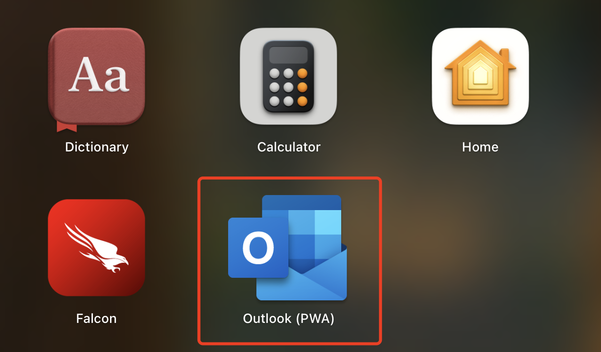

## PWA 是什么

PWA 的核心作用就是让网页像 App 一样被“安装”和“独立打开”，而不是改变网页本身的功能逻辑

PWA 不会自动让网页“更快”或“更强”，它只是：

- 允许用户把网页“安装”成桌面图标
- 提供类似原生 App 的体验（全屏、无地址栏、独立窗口）
- 通过 Service Worker 实现资源缓存，能让你“手动设计离线体验”
- 支持 Push Notification（需要额外开发）
- 可以“伪装成 App”，但底层还是浏览器环境

如 https://outlook.office365.com/mail/ 在 Chrome 打开会一个 install app 的 action button

安装后电脑就会有一个对应的 App

打开后可以像原生应用一样使用它

如果要删除 PWA 应用，可以在 chrome://apps 里找到对应的 app 右键删除

