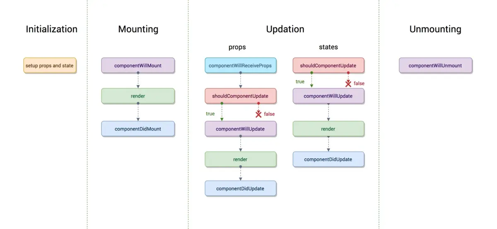

## 来源

学习至掘金小册：

- [React必须要知道的几个面试题](https://juejin.im/post/5df1ed0051882512400ad4b7)

- [React 开发必须知道的 34 个技巧](https://juejin.im/post/5dcb5a80e51d4520db19b906)

- [35 道咱们必须要清楚的 React 面试题](https://juejin.im/post/5dc20a4ff265da4d4e30040b)

## setState 是异步还是同步

- 合成事件和钩子函数里是异步的

- 原生事件和 setTimeout 中是同步的

合成事件：

    import React, { Component } from 'react'

    export default class Question extends Component {
        state = {
            id: 1,
        }
        click = () => {
            this.setState({
                id: 2,
            });
            console.log(this.state.id); // 输出 1
        }
        render() {
            return (
                <div>
                    <p>id: {this.state.id}</p>
                    <button onClick={this.click}>点击</button>
                </div>
            )
        }
    }

钩子函数：

    import React, { Component } from 'react'

    export default class Question extends Component {
        state = {
            id: 1,
        }
        componentDidMount() {
            this.setState({
                id: 2,
            });
            console.log(this.state.id); // 输出 1
        }
        render() {
            return (
                <div>
                    <p>id: {this.state.id}</p>
                    <button>点击</button>
                </div>
            )
        }
    }

原生事件：

    import React, { Component, createRef } from 'react'

    export default class Question extends Component {
        buttonRef = createRef();
        state = {
            id: 1,
        }
        componentDidMount() {
            this.buttonRef.current.onclick = () => {
                this.setState({
                    id: 2,
                });
                console.log(this.state.id); // 输出 2
            }
        }
        render() {
            return (
                <div>
                    <p>id: {this.state.id}</p>
                    <button ref={this.buttonRef}>点击</button>
                </div>
            )
        }
    }

setTimeout：

    import React, { Component } from 'react'

    export default class Question extends Component {
        state = {
            id: 1,
        }
        click = () => {
            setTimeout(() => {
                this.setState({
                    id: 2,
                });
                console.log(this.state.id); // 输出 2
            }, 0);
        }
        render() {
            return (
                <div>
                    <p>id: {this.state.id}</p>
                    <button onClick={this.click}>点击</button>
                </div>
            )
        }
    }

setState 的批量更新优化也是建立在 '异步' 之上的，对同一个值多次 setState，批量更新策略会进行覆盖，取最后一次执行。同时 setState 多个不同的值，更新时也会对其进行合并批量更新

React 的 setState 更新原理和 Vue 的 $nextTick 相似，都是将更新操作后置执行

## React 生命周期有哪些

旧版生命周期：



React16 之后移除的生命周期（未删除，17 后准备完全移除，保留 UNSAFE_ 前缀）：

- componentWillMount：组件渲染之前执行，还无法拿到真实 DOM 节点

- componentWillReceiveProps：componentWillReceiveProps(nextProps)，组件初始化时不会执行，组件接收到新的 props 时触发

- componentWillUpdate：componentWillUpdate(nextProps, nextState)，组件


## 什么是受控组件、非受控组件

受控组件：

    // 通过 value 状态 和 changeValue 合并事件控制显示的值
    <input value={this.state.value} onChange={this.changeValue} />

非受控组件：

    // 直接通过 ref 获取原生 DOM，而不是用组件 state 去控制它
    ref = createRef();

    <input ref={this.ref} />

## React 组件之间如何通讯

- 父 => 子：父组件向子组件传递 props

- 子 => 父：父组件传递回调函数的 props 给子组件，子组件调用回调传递参数，父组件接收

- context

利用 Context 的 Consumer 和 Provider 进行通讯，可以实现父子组件**跨级通讯**

    const { Consumer, Provider } = React.createContext();

    // 父组件
    <Provider value={name}>
        <Child />
    </Provider>

    // 子组件
    <Consumer>
        {
            name => (
                <div>{name}</div>
            )
        }
    </Consumer>

- EventEmitter

使用 events 插件定义全局事件机制

    npm install events --save

    // event.js
    import { EventEmitter } from 'events';

    export default new EventEmitter();

    // 组件 A
    import eventEmitter from './event';

    componentDidMount() {
        this.emitter = eventEmitter.addListener('changeEvent', mes => {
            console.log(mes);
        });
    }

    // 组件 B
    import eventEmitter from './event';

    click = () => {
        eventEmitter.emit('changeEvent', 'something');
    }

    <div>
        <button onClick={this.click}>点击</button>
    </div>

- 路由传参

组件页面之间通过路由传参也算是一种通讯方式：

    // 示例一
    <Route path='/path/:name' component={Path}/>
    <link to="/path/2">xxx</Link>

    this.props.history.push({ pathname: '/path/' + name });
    this.props.match.params.name

    // 示例二
    <Route path='/query' component={Query}/>
    <Link to={{ pathname: '/query' , query: { name: 'k' }}}>

    this.props.history.push({ pathname: '/query', query: { name: 'k' } });
    this.props.location.query.name

    // 示例三
    <Route path='/state ' component={State}/>
    <Link to={{ pathname: '/state ' , state: { name: 'k' }}}> 

    this.props.history.push({ pathname: '/state', state: { name: 'k' } })
    this.props.location.query.state

    // 示例四
    <Route path='/web/search ' component={Search}/>
    <link to="web/search?id=1">xxx</Link>

    this.props.history.push({ pathname:'/web/search?id=1' });
    this.props.location.search

- onRef

父组件传递一个 onRef 函数的 props 给子组件，子组件将自己的 this 作为参数传递，这样父组件就可以调用子组件的 this，从而调用子组件里的状态和方法

    // 子组件
    componentDidMount() {
        this.props.onRef(this);
    }
    query = () => {
        ...
    }

    // 父组件
    childRef = ref => {
        console.log(ref); // 子组件实例
        ref.query();
    };

    <Child onRef={this.childRef} />

- ref

直接利用 ref 获取整个子组件实例

    // 父组件
    childRef = null;

    click = () => {
        console.log(this.childRef); // 子组件实例
    }

    <Child ref={r => this.childRef = r} />

- redux

React 可以配合 Redux 实现全局状态，各个组件都可以使用


## React 请求应该放在哪个生命周期

有人认为应该将请求放在 componentWillMount，这样可以提前请求，避免白屏

这样是可以做到提前请求，但是和白屏关系不大

当 React 渲染一个组件时，不会去等待 componentWillMount 里做的事情，React 继续前进渲染 render，所以放在哪个生命周期做请求，React 该渲染都是一样照常渲染，不会影响白屏时长

而 componentWillMount 里做请求也存在一些问题：

- 在服务端渲染时，fetch data 会执行 2 次，一次在服务端一次在客户端，造成多余的请求

- React16 进行 React Fiber 重写后，componentWillMount 可能在一次渲染中多次调用

官方推荐异步请求在**componentDidMount**，有特殊需求需要提前，也可以在 constructor 里

## React 中的 ref 怎么使用

ref 可以获取组件实例或 DOM 节点

无法用在函数组件上，除非使用 forwardRef 把 ref 当做普通变量

- 回调形式

````````
    inputRef = null;
    componentDidMount() {
        this.inputRef; // input DOM 节点
    }

    <input ref={input => this.inputRef = input} />
````````

- createRef

React16.3 后使用 createRef 创建 ref，该 ref 的 current 可以拿到 DOM 节点或组件实例

    inputRef = React.createRef();
    componentDidMount() {
        this.inputRef.current; // input DOM 节点
    }

    <input ref={inputRef} />

- forwardRef

React.forwardRef 可以将 ref 作为普通 prop 传递，一般用于高阶组件

    function withinButton(Comp) {
        return React.forwardRef((props, ref) => {
            return <Component {...props} myRef={ref} />
        })
    }

    class FancyButton extends React.Component {
        ...
    }

    const Fb = withinButton(FancyButton);

    // 使用
    class Wrap extends React.Component {
        ref = React.createRef();
        render() {
            return <Fb ref={this.ref} />
        }
    }

## React 怎么为 props 定义类型

使用 propTypes 可以为组件的 props 定义类型：

    class Wrap extends React.Component {
        ...
    }

    Wrap.propTypes = {
        id: number,
        name: string,
        ...
    }

    或直接 static 定义：

    class Wrap extends React.Component {
        static propTypes = {
            id: number,
            name: string,
            ...
        }
        ...
    }

## React 有哪些定义组件方法的方式

    // 方式一
    export default class Question extends Component {
        click() {
            console.log(this);
        }
        render() {
            return (
                <div>
                    <button onClick={this.click.bind(this)}>点击</button>
                </div>
            )
        }
    }

    // 方式二
    export default class Question extends Component {
        constructor() {
            super();
            this.click = this.click.bind(this);
        }
        click() {
            console.log(this);
        }
        render() {
            return (
                <div>
                    <button onClick={this.click}>点击</button>
                </div>
            )
        }
    }

    // 方式三
    export default class Question extends Component {
        click() {
            console.log(this);
        }
        render() {
            return (
                <div>
                    <button onClick={() => this.click()}>点击</button>
                </div>
            )
        }
    }

    // 方式四
    export default class Question extends Component {
        click = () => {
            console.log(this);
        }
        render() {
            return (
                <div>
                    <button onClick={this.click}>点击</button>
                </div>
            )
        }
    }

方式一中，每次组件 render 都会重新 bind(this)，会生成新的函数引用，可能导致子组件重复渲染

方式二中，函数引用不变，需要在 constructor 中先 bind，在方法较多时显得比较繁琐

方式三与方式一相同，每次会产生新的函数引用

方式四较为推荐

## React 中如何创建异步组件

- 自定义异步加载组件

`````````
 export default class Bundle extends React.Component {
    state = {
        mod: null,
    }

    componentWillMount() {
        this.toLoad(this.props.load);
    }

    toLoad = (load) => {
        load && load().then((mod) => {
            this.setState({
                mod: mod.default ? mod.default : mod,
            });
        });
    }

    render() {
        const Component = this.state.mod;
        const { load, ...others } = this.props;
        return this.state.mod ? <Component {...others} /> : null;
    }
}

// 使用
const AsyncQuestion = props => <Bundle {...props} load={() => import('./components/todo/question')} />

class App extends Component {
    render() {
        return (
            <div>
                <AsyncHelp />
            </div>
        )
    }
}
`````````

- 使用 react-loadable

`````````
npm install react-loadable --save
`````````

    import Loadable from 'react-loadable';

    function Loading({error, pastDelay}) {
        if(error) {
            return <div>Error</div>
        } else if(pastDelay) {
            return <div>Loading ...</div>
        } else {
            return null;
        }
    }

    const AsyncQuestion = Loadable({
        loader: () => import('./components/todo/question'),
        loading: Loading,
        delay: 300,
    })

    // 使用
    class App extends Component {
        render() {
            return (
                <div>
                    <AsyncHelp />
                </div>
            )
        }
    }

- 使用 React.lazy

React16.6 新出的 API，可以实现懒加载组件

    const AsyncQuestion = React.lazy(() => import('./components/todo/question'));

    // 使用
    class App extends Component {
        render() {
            return (
                <React.Suspense fallback={<div>Loading ...</div>}>
                    <AsyncQuestion/>
                </React.Suspense>
            )
        }
    }

React.lazy 与 react-loadable 差别：

suspense 可以实现多 lazy 多级应用，不仅仅可以包裹一个 lazy 组件，会等作用域内全部 lazy 组件加载完成，可以提升任意组件级的 loading，实现 loading 聚合

## 什么是高阶组件

高阶组件是一个纯函数，接收一个组件并返回一个新的组件

作用：

- 代码重用、逻辑抽象

`````````
如许多组件都需要获取一个 loading 状态，可以封装一个高阶组件保存 loading 状态向下传递：

    function withinLoading(Comp) {
        return class extends React.Component {
            state = {
                loading: true,
            };
            render() {
                return <Comp loading={this.state.loading} {...this.props} />
            }
        }
    }

    class Question extends React.Component {
        render() {
            return (
                <div>
                    Question: {this.props.info}
                    Answer: {this.props.loading ? '...' : 'nothing'}
                </div>
            )
        }
    }

    const WithinQuestion = withinLoading(Question);

    class App extends React.Component {
        render() {
            <WithinQuestion info='something' />
        }
    }
`````````

- 渲染劫持

用高阶组件控制组件生成的效果，可以读取、添加、修改、删除任何一个将被渲染的 React Element 的 props，修改 render tree 等

如利用反向继承，做到条件型渲染：

    function withinRender(Comp) {
        return class extends Comp {
            render() {
                return this.props.isLogged ? super.render() : null;
            }
        }
    }

    const RenderQuestion = withinRender(Question);

    class App extends React.Component {
        render() {
            <RenderQuestion isLogged={true} />
        }
    }

利用反向继承修改 React ElementS Tree：

    function withinRender(Comp) {
        return class extends Comp {
            render() {
                const renderTree = super.render();
                return React.cloneElement(renderTree, { 
                    info: 'something',
                })
            }
        }
    }


## 什么是 render props

render props 同样是提高组件复用和抽象的手段

它将函数作为名 render 的 prop 传入抽象组件，在函数的参数中获取状态，实现自定义渲染

它更多的用在**组件行为上的依赖**

例如：

- 模态框的开启和关闭，可能是依赖于一个开启、关闭的按钮

- 一个区域内显示与隐藏详情，也依赖于一个开启、关闭的按钮

甚至项目里有更多的地方有这种依赖于开启、关闭按钮操作的场景

那这时，这些组件都依赖于这个按钮是状态，就可以封装成一个抽象组件，使用 render props 来调用其它组件

    // 抽象按钮
    class ToggleButton extends React.Component {
        state = {
            open: false,
        };
        toggle = () => {
            this.setState(state => ({
                open: !state.open,
            }));
        }
        render() {
            return (
                <div>
                    <button onClick={this.toggle}>{this.state.open ? '关闭' : '开启'}</button>
                    {this.props.render(this.state.open)}
                </div>
            )
        }
    }

    // 使用，显示隐藏模态框
    class App extends React.Component {
        render() {
            return (
                <ToggleButton
                    render={isOpen => {
                        return isOpen ? <div>This is Dialog</div> : null;
                    }}
                />
            )
        }
    }

## React.PureComponent 与 React.memo

React.PureComponent 与 React.Component 类似，用于定义一个类组件

React.Component 需要使用 shouldComponentUpdate 手动去对比 state 或 props 的变化来告诉 React 是否更新组件

React.PureComponent 可以自动通过 state 与 props 进行浅比较，判断是否需要更新组件，提供组件性能

    class Child extends React.Component {
        ....
    }

    class App extends React.Component {
        ...
        render() {
            return (
                <div>
                    <button onClick={this.toggle}>{this.state.open ? '关闭' : '开启'}</button>
                    <Child id='1' />
                </div>
            )
        }
    }

如上，当 App 组件中 open 状态改变时，APP 组件重新 render，其实 Child 组件的 state 和 props 是没有改变的，但是它还是会重新 render，这显然对性能有影响

而使用 React.PureComponent 了后，就可以自动浅比较 state 与 props，如不需要 render，组件将不会耗费性能重新渲染：

    class Child extends React.PureComponent {
        ....
    }

React.PureComponent 并不适用于函数组件，且函数组件也没有 shouldComponentUpdate 可以手动对比

React16.6 新增了 React.memo 用于函数组件：


    function Child(props) {
        ...
    }

    // 第二个参数可选
    export default React.memo(Child, (prevProps, nextProps) => {
        return prevProps.seconds === nextProps.seconds
    })

## ReactDOM.createPortal 的作用是什么

一般在组件 render 中，我们写如下代码：

    render() {
        return (
            <div>
                <Modal />
            </div>
        )
    }

Modal 是一个模态框，绝对定位在 body 之下

然而因为组件的特性，这个 Modal 的内容最终会被渲染在当前组件所属位置的 DOM 结构之下，无法挂载到 body 之下

ReactDOM.createPortal 就是为了解决这个问题而存在，它提供了让子节点渲染到存在于父节点之外的 DOM 节点的方案

    import React, { Component } from 'react';
    import ReactDOM from 'react-dom';

    export default class modal extends Component {
        el = document.createElement('div');

        componentDidMount() {
            document.body.appendChild(this.el);
        }
        componentWillUnmount() {
            document.body.removeChild(this.el);
        }

        render() {
            //  props.children 挂载到 el 这个 DOM 下
            return ReactDOM.createPortal(this.props.children, this.el);
        }
    }

    // 使用
     class App extends React.Component {
        ...
        render() {
            return (
                <div>
                    <Modal>
                        This is Modal Content ...
                    </Modal>
                </div>
            )
        }
    }

## 如何在 React 中使用 innerHTML

    <div dangerouslySetInnerHTML={{__html: '<span>content</span>'}}></div>

## 什么是 React.createElement

React.createElement( type, [props], [...children] )

JSX 即是 React.createElement 的语法糖，JSX 编译后生成的 js 都是 React.createElement：

    // jsx
    <div id='wrap'>
        <span id="item">something</span>
    </div>

    // js
    React.createElement(
        "div",
        { id: "one" },
        React.createElement("span", { id: "item" }, "something")
    );

## React.cloneElement 的作用是什么

一般用于克隆一个 React 元素，或为 React 元素添加或修改 props，会返回一个新的 React 元素

    React.cloneElement(
        element,
        [props],
        [...children]
    )

    // 为 props.children 里每个 React 元素修改 props
    React.Children.map(this.props.children, child => {
        return React.cloneElement(child, {
            title: 'something',
        })
    })

## 什么是 Virtual DOM

虚拟 DOM 是利用一个对象结构，来表示真实的 DOM 结构

虚拟 DOM 是真实 DOM 在内存中的表示，变化与真实 DOM 同步

因为大量操作 DOM 节点的开销是很大的，虚拟 DOM 以对象形式模拟真实 DOM 结构，将我们的实际操作映射到虚拟 DOM 的变化，计算出前后结构变化的部分，从而对应到真实 DOM，只更新产生变化的真实 DOM，不操作没有改变的 DOM 节点来减少开销

实现原理主要包括：

- JavaScript 对象模拟真实 DOM 树，对真实 DOM 进行抽象

- diff 算法，比较两棵虚拟 DOM 树的差异

- patch 算法，将两个虚拟 DOM 对象的差异应用到真正的 DOM 树

优点：

- 保证了性能下限：框架的虚拟 DOM 需要适配任何上层 API 可能产生的操作，它的一些 DOM 操作的实现必须是普适的，所以它的性能不是最优的。但比起粗暴的 DOM 操作性能是好很多的，因为虚拟 DOM 至少可以保证在你不需要手动优化的情况下，依然可以提供不错的性能，保证性能下限

- 无需手动操作 DOM，开发效率提升：不需要再手动操作 DOM，只需要维护好 ViewModel 的代码逻辑。虚拟 DOM 和数据双向绑定，帮助我们以预期的方式更新视图，极大提升开发效率

- 跨平台：虚拟 DOM 本质是 JavaScript 对象，而 DOM 与平台强关联，相比之下虚拟 DOM 可以进行更方便的跨平台操作，例如服务端渲染等

缺点：

- 无法进行极致优化：在一些我们人眼明显可见的 DOM 变化下，我们人为操作可以很精确的操作到对应的 DOM 节点，且可以使用符合项目兼容性的高效 API 去获取和操作 DOM。而虚拟 DOM 无论如何都需要进行 diff、patch 等算法，这些都是需要性能且不可避免，这在一些性能要求极高的应用中无法进行针对性的极致优化

## 构造函数中调用 super 并传入 props 的作用是什么

- 在调用 super() 之前，子类构造函数无法使用 this 引用

```````````````
constructor() {
    console.log(this); // 报错
    super();
}
```````````````

- 将 props 作为参数传入 super，主要原因是子构造函数里能通过 this.props 获取传入的 props

传入 props：

    class MyComponent extends React.Component {
        constructor(props) {
            super(props);
            console.log(this.props);  // { name: 'k',age: 18 }
        }
    }

没传入 props：

    class MyComponent extends React.Component {
        constructor(props) {
            super();
            console.log(this.props); // undefined
            // 但是 Props 参数仍然可用
            console.log(props); // Prints { name: 'k',age: 18 }
        }

        render() {
            // 构造函数外部不受影响
            console.log(this.props) // { name: 'k',age: 18 }
        }
    }

## React 中 StrictMode 是什么

React 的 StrictMode 是一种辅助函数，可以帮助开发者编写更好的 React 组件

使用 \<StrictMode/> 包裹组件，可以检查：

- 内部组件是否遵循某些推荐做法，如果没有会在控制台给出警告

- 是否使用已废弃的方法，如果有会在控制台给出警告

- 识别潜在的风险预防一些副作用

## 什么是 prop drilling

即多层嵌套组件中，底层子元素要使用顶层父元素的数据，最简单的做法是将 prop 从每个组件一层层传递下来，从源组件传递到深层嵌套组件，这就是 prop drilling

缺点：原本不需要数据的组件也被迫需要添加这个需要传递的 prop，变得不必要的复杂，难以维护

解决：使用 React Context，利用 Provider 组件传递数据，Consumer 组件或 contextType 接收类组件的数据，函数组件可以用 useContext 接收数据

## React 中 constructor 和 getInitialState 的区别是什么

constructor 是 React 使用 ES6 class 定义组件初始状态时使用

getInitialState 是在 React.createClass 中使用

    class MyComponent extends React.Component {
        constructor(props) {
            super(props);
            this.state = {
                ...
            };
        }
    }

    等价于：
    var MyComponent = React.createClass({
        getInitialState() {
            return {
                ...
            };
        },
    });

## React Hook 有什么优势

- 函数式组件中使用，函数组件相比类组件性能更好

- 更好的重用，相比 HOC 高阶组件，避免了组件深处嵌套问题

- 将逻辑也做到了解耦，类组件中我们可能在生命周期中实现一系列的逻辑操作，然而这些逻辑操作相互不关联却放在一个生命周期里强行耦合，而 hooks 让我们提取自定义 hook，更好的分离逻辑

- class 组件初学者需要了解 this 指向问题，存在学习障碍，hook 中不存在这个问题