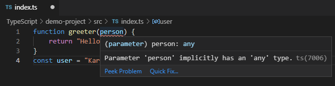

## 使用 TypeScript

准备工作：

- Node.js > 8.0
- 一个包管理工具 npm 或者 yarn

### 安装 TypeScript
    
    // 全局安装，安装后可以在使用 tsc 命令
    npm install -g typescript
    
### 开发环境
    
    linux 命令:
    
    // 1、项目结构
    mkdir demo-project && cd demo-project
    
    // 2、创建src/index.ts
    mkdir src && touch src/index.ts
    
    // 3、初始化package.json
    npm init
    
    // 4、初始化tsconfig.json
    tsc --init
    
    // 5、修改tsconfig.json配置
    生成的 sconfig.json 中已经包含了默认配置
    我们可以进行自定义配置：
    
    {
        "compilerOptions": {
            "target": "es5",                            // 指定 ECMAScript 目标版本: 'ES5'
            "module": "commonjs",                       // 指定使用模块: 'commonjs', 'amd', 'system', 'umd' or 'es2015'
            "moduleResolution": "node",                 // 选择模块解析策略
            "experimentalDecorators": true,             // 启用实验性的ES装饰器
            "allowSyntheticDefaultImports": true,       // 允许从没有设置默认导出的模块中默认导入。
            "sourceMap": true,                          // 把 ts 文件编译成 js 文件的时候，同时生成对应的 map 文件
            "strict": true,                             // 启用所有严格类型检查选项
            "noImplicitAny": true,                      // 在表达式和声明上有隐含的 any类型时报错
            "alwaysStrict": true,                       // 以严格模式检查模块，并在每个文件里加入 'use strict'
            "declaration": true,                        // 生成相应的.d.ts文件
            "removeComments": true,                     // 删除编译后的所有的注释
            "noImplicitReturns": true,                  // 不是函数的所有返回路径都有返回值时报错
            "importHelpers": true,                      // 从 tslib 导入辅助工具函数
            "lib": ["es6", "dom"],                      // 指定要包含在编译中的库文件
            "typeRoots": ["node_modules/@types"],
            "outDir": "./dist",
            "rootDir": "./src"
        },
        "include": [                                  // 需要编译的ts文件一个*表示文件匹配**表示忽略文件的深度问题
            "./src/**/*.ts"
        ],
        "exclude": [
            "node_modules",
            "dist",
            "**/*.test.ts",
        ]
    }
    
    // 6、package.json加入命令
    {
        "name": "demo-project",
        "version": "1.0.0",
        "description": "",
        "main": "src/index.ts",
        "dependencies": {},
        "devDependencies": {},
        "scripts": {
            "build": "tsc", // 编译
            "build:w": "tsc -w" // 监听文件，有变动即编译
        },
        "author": "",
        "license": "ISC"
    }
    
### 编写 TypeScript 程序

    // src/index.ts
    function greeter(person) {
        return "Hello, " + person
    }
    
    const user = "Jane User"
    

    这是由于我们开启了 noImplicitAny: true 的配置

    修改代码如下：

    function greeter(person: string) {
        return "Hello, " + person
    }
    const user = "Karmiy"

    报错消失
    

    
    
    