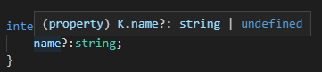

## interface 接口

接口是 Typescript 对一系列抽象方法的声明，是一些方法特征的集合，对形状的描述

### 使用接口

当我们定义一个函数，接收 User 对象（含有id、name、age属性），返回 name 属性，JavaScript 中会这样定义：

    function getUserName(user) {
        return user.name;
    }

    这在 Typescript 下是会报错的

我们需要有一个类型来表示 User，但是在 Typescript 基本类型中又没有满足条件的类型可用

这时我们可以用接口 interface 来描述这个类型

    interface User {
        id: string;
        name: string;
        age: number;
    }
    function getUserName(user: User): string {
        return user.name;
    }
    const user1: User = {id: '01', name: 'karmiy', age:}; // ok
    const user2: User = {id: '02', name: 'karloy'}; // Error，缺少 age 属性

### 可选属性

上面可以看到，接口里的属性都是必须的，假如上面的 age 不是必填的，应该如何描述？

Typescript 给与了接口可选属性的写法：

    interface User {
        id: string;
        name: string;
        age?: number; // ?: 表示可选
    }

    function getUserName(user: User): string {
        return user.name;
    }

设为可选属性，Typescript 将会把 age 作为 number | undefined

> 注意，这是在开启严格模式下，TypeScript 会自动给可选属性的值类型联合上一个 undefined 类型，如果关闭严格模式是不会联合上 undefined 类型的

开启严格模式（前面我们一直都是开启严格模式）：

关闭严格模式（tsconfig.json 中 strict: false）：

**造成的影响：**

在之后的高级类型 - 条件类型中，使用 undefined 来判断属性值是否是可选类型是不严谨的

### 只读属性

当 User 的 id 属性一旦创建，可能就不允许被修改，这时这个 id 对我们而言就是一个只读属性

Typescript 提供了 readonly 让我们将属性设为只读，一旦只读，我们将无法修改它：

    interface User {
        readonly id: string;
        name: string;
        age?: number;
    }

    const user: User = {id: '01', name: 'karmiy'};

    user.id = '001'; // Error: Cannot assign to 'id' because it is a read-only property

### 函数属性

当 User 的对象拥有函数时，如：

    user.say = (content: string) => `---${content}---`;

这时接口有如下2种方式描述：

    // 方式一
    interface User {
        readonly id: string;
        name: string;
        age?: number;
        say: (content: string) => string;
    }

    // 方式二
    interface User {
        readonly id: string;
        name: string;
        age?: number;
        say(content: string): string;
    }

    // 方式三
    interface Say {
        (content: string): string;
    }
    interface User {
        readonly id: string;
        name: string;
        age?: number;
        say: Say;
    }
    
    // 使用
    const user: User = {
        id: '101',
        name: 'karmiy',
        say: (content: string) => `---${content}---`,
    }

### 可索引类型

假如 User 还有一个属性 emails 是邮箱的集合，但是这个集合里有多少成员是不确定的：

    // user1
    const user_1 = {
        id: '101',
        name: 'karmiy',
        emails: {
            '163': 'abc@163.com',
            'qq': 'abc@qq.com',
            'yeah': 'abc@yeah.com',
        }
    }

    // user2
    const user_2 = {
        id: '101',
        name: 'karloy',
        emails: {
            'qq': 'bcd@qq.com',
        }
    }

可以看出，emails 属性的特征在于，key、value 都是 string 类型，虽然数量不定

Typescript 的接口提供了可索引类型来表示描述这种场景：

    interface Email {
        [name: string] : string;
    }
    interface User {
        readonly id: string;
        name: string;
        age?: number;
        emails: Email;
    }

    const user: User = {
        id: '101',
        name: 'karmiy',
        emails: {
            '163': 'abc@163.com',
            'qq': 'abc@qq.com',
            'yeah': 'abc@yeah.com',
        }
    }

### 继承接口

当有一个新的需求，如创建一个子用户 SubUser，它拥有 User 的所有属性，与自己特有的属性，是否需要在定义 interface SubUser 时，将 User 的全部属性重新写一次？

显然这样是多余的做法，Typescript 提供了 extends 让我们可以在接口上做到继承

    interface User {
        readonly id: string;
        name: string;
        age?: number;
    }

    interface SubUser extends User {
        readonly parentId: string;
    }

    const subUser: SubUser = {
        id: '10101',
        name: 'zero',
        parentId: '101'
    }

    甚至可以继承多个接口：
    interface SubUser extends User, AdminUser {
        readonly parentId: string;
    }

### 类 类型接口

在类章节提及

