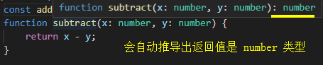
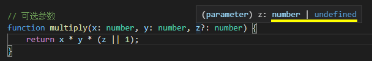

## function 函数

### 定义函数类型

TypeScript 中的函数一般在参数与返回值中定义类型：

    // 函数表达式
    const add = (x: number, y: number):number => x + y;

    // 函数声明
    function subtract(x: number, y: number):number {
        return x - y;
    }

返回值甚至可以省去，TypeScript 的**类型推断**会根据我们的逻辑处理，帮我们推导出返回的类型：

    const add = (x: number, y: number) => x + y;
    function subtract(x: number, y: number) {
        return x - y;
    }

我们还可以在函数名后面**定义整个函数表达式的类型**

    const add: (x: number, y: number) => number = (x, y) => x + y;

还可以用**接口定义函数表达式类型**

    interface Add {
        (x: number, y: number): number;
    }
    const add: Add = (x, y) => x + y;

### 无返回值

没有返回值的函数可以使用 void 表示返回值类型

    function fn():void {
        console.log('1');
    }

### 可选参数

与接口相同，当我们的参数可能是不存在的时，可以使用 ? 来描述

    function multiply(x: number, y: number, z?: number) {
        return x * y * (z || 1);
    }

    multiply(1, 2);
    multiply(1, 2, 3);

### 默认参数

TypeScript 默认参数与 JavaScript 用法相同

    function divide(x: number, y:number = 10) {
        return x / y;
    }

### 剩余参数

TypeScript 剩余参数与 JavaScript 相同使用 ... 表示，类似是个数组

    function plus(...rest: Array<number>) {
        return rest.reduce((sum, cur) => sum + cur, 0);
    }
    console.log(plus(1,2,3));

### 重载

当我们有一个函数，接收1、2、4个参数时，如下的做法是不严谨的：

    function assign(a:number, b?:number, c?:number, d?:number) {
        ...
    }

因为上例函数，不论是传递1、2、3、4个参数都不会报错，我们更希望能够有严谨的限制

而**函数重载**就为了解决这个问题而诞生：

    function assign(all: number):number
    function assign(a:number, b:number):number
    function assign(a:number, b:number, c:number, d:number):number
    function assign(a:number, b?:number, c?:number, d?:number) {
        return a + (b || 0) + (c || 0) + (d || 0);
    }

    assign(1);
    assign(1, 2);
    assign(1, 2, 3); // Error
    assign(1, 2, 3, 4);

    达到了参数控制在1、2、4的效果