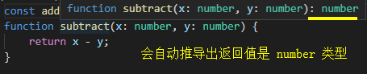

## function 函数

### 定义函数类型

TypeScript 中的函数一般在参数与返回值中定义类型：

```ts
// 函数表达式
const add = (x: number, y: number): number => x + y;

// 函数声明
function subtract(x: number, y: number): number {
    return x - y;
}
```

返回值甚至可以省去，TypeScript 的**类型推断**会根据我们的逻辑处理，帮我们推导出返回的类型：

```ts
const add = (x: number, y: number) => x + y;
function subtract(x: number, y: number) {
    return x - y;
}
```



我们还可以在函数名后面**定义整个函数表达式的类型**

```ts
const add: (x: number, y: number) => number = (x, y) => x + y;
```

还可以用**接口定义函数表达式类型**

```ts
interface Add {
    (x: number, y: number): number;
}
const add: Add = (x, y) => x + y;
```

### 无返回值

没有返回值的函数可以使用 void 表示返回值类型

```ts
function fn(): void {
    console.log('1');
}
```

### 可选参数

与接口相同，当我们的参数可能是不存在的时，可以使用 ? 来描述

```ts
function multiply(x: number, y: number, z?: number) {
    return x * y * (z || 1);
}

multiply(1, 2);
multiply(1, 2, 3);
```


### 默认参数

TypeScript 默认参数与 JavaScript 用法相同

```ts
function divide(x: number, y:number = 10) {
    return x / y;
}
```

### 剩余参数

TypeScript 剩余参数与 JavaScript 相同使用 ... 表示，类似是个数组

```ts
function plus(...rest: Array<number>) {
    return rest.reduce((sum, cur) => sum + cur, 0);
}
console.log(plus(1,2,3));
```

### 重载

当我们有一个函数，接收1、2、4个参数时，如下的做法是不严谨的：

```ts
function assign(a: number, b?: number, c?: number, d?: number) {
    ...
}
```

因为上例函数，不论是传递1、2、3、4个参数都不会报错，我们更希望能够有严谨的限制

而**函数重载**就为了解决这个问题而诞生：

```ts
function assign(all: number):number
function assign(a: number, b: number): number
function assign(a: number, b: number, c: number, d: number): number
function assign(a: number, b?: number, c?: number, d?: number) {
    return a + (b || 0) + (c || 0) + (d || 0);
}

assign(1);
assign(1, 2);
assign(1, 2, 3); // Error
assign(1, 2, 3, 4);

达到了参数控制在1、2、4的效果
```

### this指向

与 JavaScript 相同，TypeScript 中的 this 也是一个让人困扰的问题

看如下示例：

```ts
const deck = {
    suits: ["hearts", "spades", "clubs", "diamonds"],
    cards: Array(52),
    createCardPicker: function() {
        return function(){
            let pickedCard = Math.floor(Math.random() * 52);
            let pickedSuit = Math.floor(pickedCard / 13);

            return {suit: this.suits[pickedSuit], card: pickedCard % 13};
        }
    }
}

const cardPicker = deck.createCardPicker();
const pickedCard = cardPicker();
```

当运行程序时我们会发现报了错

因为 this 指向的是 window

为了解决指向问题可以利用箭头函数中 this 指向当前上下文来做如下修改：

```ts
const deck = {
    suits: ["hearts", "spades", "clubs", "diamonds"],
    cards: Array(52),
    createCardPicker: function() {
        return () => {
            let pickedCard = Math.floor(Math.random() * 52);
            let pickedSuit = Math.floor(pickedCard / 13);

            return {suit: this.suits[pickedSuit], card: pickedCard % 13};
        }
    }
}

const cardPicker = deck.createCardPicker();
const pickedCard = cardPicker();
```

这时运行不再报错

但这在配置 noImplicitThis 后可能还是会显示 this 存在隐式 any 类型

#### this 参数

TypeScript 允许我们提供一个显示的 this 参数

this 参数是个假参数，它出现在参数列表最前面，我们可以为 this 指定类型：

```ts
interface Card {
    suit: string;
    card: number;
}
interface Deck {
    suits: string[];
    cards: number[];
    createCardPicker(this: Deck): () => Card;
}
const deck:Deck = {
    suits: ["hearts", "spades", "clubs", "diamonds"],
    cards: Array(52),
    createCardPicker: function(this: Deck) {
        return () => {
            let pickedCard = Math.floor(Math.random() * 52);
            let pickedSuit = Math.floor(pickedCard / 13);

            return {suit: this.suits[pickedSuit], card: pickedCard % 13};
        }
    }
}
```

这使编辑器得知，createCardPicker 被调用时需要保证里面的 this 是 Deck 类型

我们执行如下代码，让 createCardPicker 被调用后 this 指向 window（严格模式 undefined）：

```ts
const createCardPicker = deck.createCardPicker;
const cardPicker = createCardPicker(); // Error
const pickedCard = cardPicker();

报错：
The 'this' context of type 'void' is not assignable to method's 'this' of type 'Deck'
```

当我们调用时，createCardPicker 将要接收到的 this 不是 Deck 时，便会报错，增加类型安全性

#### 回调中的 this

我们经常会看到回调函数中的 this 报错问题

当我们将一个普通函数传递至某个库，因为在回调中使用，this 将为 window（严格模式 undefined），导致库中使用到了 this 会报错

同上 this 参数，我们也可以显示的指定 this 类型

假设我们是库的作者，开发了一个 UIElement 库，指定 addClickListener 接收的函数 this 需要是 void：

```ts
interface UIElement {
    addClickListener(onClick: (this: void, e: Event) => void): void;
}

const uiElement: UIElement = {
    addClickListener() {},
}
```

当我们传递如下函数时就会报错：

```ts
class Handler {
    info: string = 'info';
    onClick(this: Handler, e: Event) {
        this.info = e.type;
    }
}
const handler = new Handler();
uiElement.addClickListener(handler.onClick);
```

因为 handler 的 onClick 中 this 我们指明了它是 Handler 类型，而 addClickListener 希望我们传入的函数 this 是 void 类型

做出如下调整就不会报错了：

```ts
class Handler {
    info: string = 'info';
    onClick(this: void, e: Event) {
    }
}
const handler = new Handler();
uiElement.addClickListener(handler.onClick);
```

> 这种情况下 onClick 中无法调用 this.info 如何解决

```ts
// 方式一：使用箭头函数
class Handler {
    info: string = 'info';
    onClick = (e: Event) => {
        this.info = e.type;
    }
}
const handler = new Handler();
uiElement.addClickListener(handler.onClick)

// 方式二：不知道 onClick 的 this 类型
class Handler {
    info: string = 'info';
    onClick(e:Event) {
        this.info = e.type;
    }
}
const handler = new Handler();
uiElement.addClickListener(handler.onClick);
```


