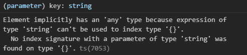
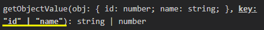
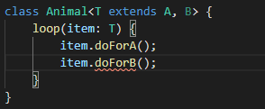

## 泛型

### 基本用法

假设我们有一个函数，接收参数 number 类型，返回值也是 number

    function add(x: number):number {
        return x;
    }

这样的写法是没有问题的，但是当我们又有一个需求，它还可以接收 string 并返回 string，是否需要又重写一遍呢？

    function add(x: string):string {
        return x;
    }

显然这样做的不合理的，我们可能的需求是接收参数与返回值类型一致

这种类型变量在 TypeScript 中称为**泛型**

我们在函数名后声明泛型变量\<T>，它用于捕获开发者传入的类型，我们可以使用 T 做参数类型和返回值类型

如数组中就有泛型的定义法：

    const a: Array<number> = [1, 2];

上述的需求使用泛型可以改写为：

    function add<T>(x: T):T {
        return x;
    }

    或
    const add = <T>(x: T):T => x;
    
    add<number>(1);
    add<string>('a');

### 多个泛型变量

可以一次定义多个类型参数

    function swap<T, U>(tuple: [T, U]): [U, T] {
        return [tuple[1], tuple[0]];
    }
    swap([1, 'a']);

### 泛型变量

假设有一个需求，接收一个参数数组，要把数组的长度打印出来，并返回这个数组

如果要按前面提到的泛型写法：

    function logArrayLength<T>(arr: T): T {
        console.log(arr.length);
        return arr;
    }

这时将会报错：

    Property 'length' does not exist on type 'T'

    即编辑器并不清楚变量上是否存在 length 属性

我们已经明确知道要传入的是数组，可以改成：

    function logArrayLength<T>(arr: Array<T>): Array<T> {
        console.log(arr.length);
        return arr;
    }

### 泛型接口

泛型也可用于接口声明：

    // 方式一
    interface ReturnItem<T> {
        (item: T): T;
    }
    const returnItem: ReturnItem<number> = item => item;
    returnItem(1);

    // 方式二
    interface ReturnItem {
        <T>(item: T): T;
    }
    const returnItem: ReturnItem = item => item;
    returnItem<number>(1);

### 泛型类

泛型既可以在函数中使用，还可以在类中使用

假设我们有一个类 Stack，用于存储数据在数据中：

    class Stack {
        private arr: number[] = []

        public push(item: number) {
            this.arr.push(item)
        }

        public pop() {
            this.arr.pop()
        }
    }

这里同样限制了只能传递 number 类型的参数，我们可以改为泛型类来达到不同类型需求的效果：

    class Stack<T> {
        private arr: T[] = []

        public push(item: T) {
            this.arr.push(item)
        }

        public pop() {
            this.arr.pop()
        }
    }

    const stack = new Stack<number>();
    stack.push(1);

### 泛型约束

在上面的泛型类 Stack 中，我们的泛型现在可以是任意类型

假如我们希望传入的泛型属于 number 与 string 之一，应该如何约束？

TypeScript 提供了泛型约束 \<T extends number | string> 

如下我们将泛型约束为 number 或 string：

    class Stack<T extends number | string> {
        private arr: T[] = []

        public push(item: T) {
            this.arr.push(item)
        }

        public pop() {
            this.arr.pop()
        }
    }
    const stack1 = new Stack<boolean>(); // Error
    const stack2 = new Stack<number>(); // ok

此外，前面泛型变量提及的输出 length，还可以利用泛型约束来实现：

    // 保证传入的参数有 length 属性，否则报错
    interface Lengthwise {
        length: number;
    }

    function logLength<T extends Lengthwise>(arr: T): T {
        console.log(arr.length);
        return arr;
    }
    logLength({
        0: 'a',
        1: 'b',
        length: 2,
    });

### 泛型约束与索引类型

可能有一个需求是，创建一个函数，用于获取一个对象上某个属性的值，我们可能这样设计：

    function getObjectValue(obj: object, key: string) {
        return obj[key];
    }

这时会发现报了错：

TypeScript 表示，**参数 obj 实际上是 {}**，因此 key 无法在上面取到任何值

我们给参数 obj 定义的类型就是 object，默认情况它只能是 {}，我们需要定义一个泛型来表示传入的对象类型：

    function getObjectValue<T extends object>(obj: T, key: string) {
        return obj[key];
    }

但是这依旧有问题，因为 key 是否存在于 obj 上是不确定的，因此我们需要对 key 也进行约束，将其约束为只存在于 obj 属性中

我们要如何获取到 obj 的属性来将 key约束在其中呢？

TypeScript 提供了 keyof 索引类型把传入的对象的属性类型取出生成一个联合类型：

    function getObjectValue<T extends object, U extends keyof T>(obj: T, key: U) {
        return obj[key];
    }

    getObjectValue({id: 1, name: 'karmiy'}, 'id');

这个时候 key 的类型就被约束为一个联合类型 'id' | 'name'

### 多重类型进行泛型约束

假如我们的泛型需要被约束，只允许实现以下2个接口的类型：

    interface A {
        doForA(): number;
    }
    interface B {
        doForB(): number;
    }

或许我们在类中会这样使用泛型约束：

    class Animal<T extends A, B> {
        loop(item: T) {
            item.doForA();
            item.doForB();
        }
    }

这时我们会发现只有 A 的约束生效了

泛型约束并不能像接口继承那样，用 , 分割约束多项

可以使用 & 来实现我们想要的效果：

    class Animal<T extends A & B> {
        loop(item: T) {
            item.doForA();
            item.doForB();
        }
    }

除此之外，我们还可以再定义一个接口作为2个接口的超接口来解决：

    interface A {
        doForA(): number;
    }
    interface B {
        doForB(): number;
    }

    interface C extends A, B {}

    class Animal<T extends C> {
        loop(item: T) {
            item.doForA();
            item.doForB();
        }
    }
    const animal = new Animal();
    animal.loop({
        doForA: () => 123,
        doForB: () => 123,
    }); // ok
    animal.loop({
        doForA: () => 123,
        doForB: () => 123,
        a: 123,
    }); // Error

### 泛型与 new

假设我们需要声明一个生产函数：

    function factory<T>(constructor: T): T {
    return new constructor() // This expression is not constructable.
    }

TypeScript 表示这个表达式不能构造，我们没有声明 T 是构造函数

这种情况，TypeScript 提供了 {new(): T} 或 new () => T 表示此泛型 T 是可被构造的

    function factory<T>(constructor: {new(): T}): T {
        return new constructor();
    }

    或

    function factory<T>(constructor: new () => T): T {
        return new constructor();
    }

    class Person {
        name:string = 'k';
    }
    const person = factory(Person);
    console.log(person.name);

### 泛型参数默认类型

在 TypeScript2.3 后，我们可以为泛型中的类型参数指定默认类型。**当使用泛型时没有在代码中指定类型参数，从实际值参数中也无法推测出时**，这个默认参数将起作用：

    function createArr<T = string>(value: T, length: number): Array<T> {
        let arr:T[] = [];
        for(let i = 0; i < length; i++) {
            arr.push(value);
        }
        return arr;
    }