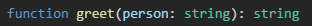
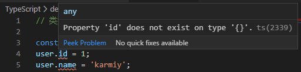

## 类型推导

在前面的章节我们就可以看出 TypeScript 是具有类型推导的：

    function greet(person:string) {
        return 'Hello, ' + person;
    }

我们并不需要指定函数返回值，TypeScript 自动帮我们推导出了返回值应该是 string 类型，这就是 TypeScript 的类型推导

### 多类型联合推导

    const arr = [1, 'one', true];
    arr.push({}); // Error

    推导结果：
    const arr: (string | number | boolean)[]

    被推导为联合类型 string | number | boolean

### 解构推导

    const bar = [1, '2'];
    let [a, b] = bar;
    a = 2; // ok
    a = '2'; // ok
    a = true; // Error

    推导结果：
    let a: string | number
    let b: string | number

### 类型推导的不足

从解构推导中其实已经提现了一点不足，我们可能更希望被推导为：

    let a: number
    let b: string

并在，如果变量初始没有赋值，变会被推导为 any 而不被类型检查：

    let myFavoriteNumber;
    myFavoriteNumber = 'k';
    myFavoriteNumber = 2;

    推导结果：
    let myFavoriteNumber: any

除此之外，在下面这种情况下也存在不足：

    const action = {
        type: 'update',
        payload: {
            id: 10,
        }
    }

    推导结果：
    const action: {
        type: string;
        payload: {
            id: number;
        };
    }

这似乎没什么问题，但是如果我们更希望的是推导出字符串字面量类型时可能这个结果就不理想

我们可以在一些场景下更希望推导出如下结果：

    const action: {
        type: 'update';
        payload: {
            id: number;
        };
    }

 
## 类型断言

### 基本使用

有些情况下 TypeScript 并不能正确或精确的推断类型，这时可能会产生不必要的警告与错误

如下类问题经常会在项目开发中接触：

    const user = {};
    user.id = 1;
    user.name = 'karmiy';

由于类型推断，user 就是 {}，上面不存在 id 与 name 属性，对于开发者而言，我们是知道上面有这些属性，只是一开始还没有声明，但 TypeScript 并不清楚，所以就需要**类型断言**：

    interface User {
        id: number;
        name: string;
    }
    const user = {} as User;
    user.id = 1;
    user.name = 'karmiy';

除了 as 实现类型断言，还可以使用 \<> 来断言：

    function getLength(r: string | number) {
        if((<string>r).length) {
            return (<string>r).length;
        } else {
            return r.toString().length;
        }
    }

类型断言不能滥用，强制把某类型断言会造成 TypeScript 丧失代码提示能力

### 双重断言

虽然类型断言是强制的，但并不是万能的，有些情况还是会失效：

    interface User {
        id: number;
        name: string;
    }

    const u = 'karmiy' as User;

这时会显示报错，显然不能把 string 强制断言成接口 User

如果刻意为之，可以使用双重断言：

    const u = 'karmiy' as unknown as User;
    或
    const u = 'karmiy' as any as User;

先把类型断言为 unknown / any，就可以实现双重断言

同样，双重断言更不建议滥用

## 类型守卫

类型守卫简而言之就是缩小类型范围

### instanceof

instanceof 用于判断构造函数原型 prototype 是否在对象原型链上，一般用来判断对象是否是某个类的实例

TypeScript 中用来缩小类型范围，将类型从几个可能的构造函数类型上缩小为某一个类型：

    class Person {
        id:number = 1;
        name: string = 'karmiy';
    }

    class Animal {
        type: string = 'cat';
        name: string = 'blackWhite';
    }

    function logInfo(r: Person | Animal) {
        if(r instanceof Person) {
            console.log(r.id);
            console.log(r.name);
        } else {
            console.log(r.type);
            console.log(r.name);
        }
    }

    logInfo(new Animal());

这里初始 r 的类型是 Person 或 Animal，在判断了 instanceof Person 后，就将 r 的类型缩小为 Person 类型，自然可以操作 id 与 name 属性。而 else 表示排除 Person 类型，剩下的只有 Animal 了，TypeScript 智能的得出当前它只有 Aninal 类型，自然可以操作 type 与 name

### in

in 用于判断 x 属性是否存在 y 中，从而缩小类型范围：

    interface Per {
        id: number;
        name: string;
    }
    interface Ani {
        type: string;
        name: string;
    }

    function logInf(r: Per | Ani) {
        if('id' in r) {
            console.log(r.id);
            console.log(r.name);
        }
        if('type' in r) {
            console.log(r.type);
            console.log(r.name);
        }
    }
    logInf({
        id: 1,
        name: 'karmiy',
    });

### typeof

    interface F{
        (): string;
    }
    function getName(r: string | F) {
        if(typeof r === 'string') {
            return r;
        } else {
            return r();
        }
    }
    
### 字面量类型守卫

当类型是字面量是，可以直接判断是否与类型值相等来缩小范围：

    interface P {
        kind: 'p',
        name: string;
    }
    interface A {
        kind: 't',
        content: string;
    }
    function logMes(r: P | A) {
        if(r.kind === 'p') {
            console.log(r.kind);
            console.log(r.name);
        }
        if(r.kind === 't') {
            console.log(r.kind);
            console.log(r.content);
        }
    }

### is 关键字

我们可以自定义类型守卫，创建一个函数，返回类型谓词 x is Y：

    interface Fish {
        swim():void;
    }
    interface Bird {
        fly():void;
    }

    function isFish(r: any): r is Fish {
        return (r as Fish).swim !== undefined;
    }

    function motion(pet: Fish | Bird) {
        if(isFish(pet)) {
            pet.swim();
        } else {
            pet.fly();
        }
    }

在项目开发中，可以用在 JavaScript 基础数据类型的判断中：

    function isString(r: any): r is string {
        return Object.prototype.toString.call(r) === '[object String]';
    }

    function isNumber(r: any): r is number {
        return Object.prototype.toString.call(r) === '[object Number]';
    }

    function logType(r: any) {
        if(isString(r)) {
            r.split('');
            console.log('is string');
        }
        if(isNumber(r)) {
            r.toFixed(2);
            console.log('is number');
        }
    }

## 赋值断言

TypeScript2.7 中引入了新的控制严格性的标志：--strictPropertyInitialization

作用是保证变量声明和实例属性都会有初始值：

    class Person {
        id:number = 10;
        name:string; // Error
    }

这个功能是帮助开发者写出更严格的代码的

但是有时确实不可避免：

- 该属性本身就可以是 undefined

- 属性被间接初始化了

然而编辑器并没有那么智能，所以我们需要提醒它这里并不需要初始值，这就需要**赋值断言**

如下示例：

    let x:number;
    init();
    console.log(x + x);
    function init() {
        x = 10;
    }

这就是之前提到的间接初始化问题

这种情况下 TypeScript 提供了赋值断言，讲 ! 放置在属性或变量后来解决这类问题：

    let x:number;
    init();
    console.log(x! + x!);
    function init() {
        x = 10;
    }