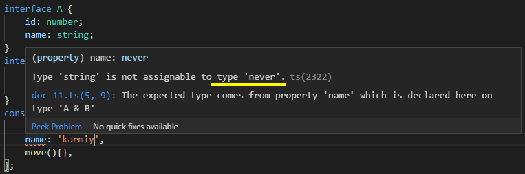

## 交叉类型

交叉类型是将多个类型合并为一个类型，生成的类型包含所有类型的特性

交叉类型使用 & 符号连接：

    interface A {
        id: number;
        name: string;
    }
    interface B {
        name: string;
        move():void;
    }
    const cross:A & B = {
        id: 1,
        name: 'karmiy',
        move(){},
    }; 

当交叉的多个类型，出现同一个属性名但类型不同时，会导致 TypeScript 无法识别准确的结果输出 never 类型：

    interface A {
        id: number;
        name: string;
    }
    interface B {
        name: number;
        move():void;
    }
    const cross:A & B = {
        id: 1,
        name: 'karmiy', // Error
        move(){},
    }; 



所以在使用交叉类型时不要出现合并的同一个属性类型不同的情况

下面试着用交叉类型实现一个 mixin 混入函数：

    interface IObject {
        [prop:string]:any;
    }
    function mixin<T extends IObject, U extends IObject>(first:T, second:U):T & U {
        const result = <T & U>{};
        for(let id in first) {
            (<T>result)[id] = first[id];
        }
        for(let id in second) {
            if(!result.hasOwnProperty(id)) {
                (<U>result)[id] = second[id];
            }
        }
        return result;
    }
    const result = mixin(
        {id: 1, name: 'k'},
        {code: '0123'}
    )

## 联合类型

当我们希望类型是多个类型中的某一个时，就可以使用联合类型

联合类型使用 | 符号连接：

    let union:string | number;
    union = 'k'; // ok
    union = 123; // ok
    union = true; // Error

当一个值是联合类型时，我们只能访问此联合类型的所有类型里共有的成员：

    interface Bird {
        fly():void;
        layEggs():void;
    }
    
    interface Fish {
        swim():void;
        layEggs():void;
    }
    function getSmallPet(pet: Bird | Fish): Bird | Fish {
        pet.layEggs(); // ok
        pet.fly(); // Error
        pet.swim(); // Error
        return pet;
    }

## 类型别名

类型别名会给类型取一个新名称

类型别名与接口很相似，但是可以作用于原始值、联合类型、元组以及其他任何需要手写的类型

类型别名使用 type 关键字定义新别名：

    type UnPlainStr = string | number;
    const str_1:UnPlainStr = '1'; // ok
    const str_2:UnPlainStr = 1; // ok
    const str_3:UnPlainStr = true; // Error

类型别名可以使用泛型，也可以在属性中引用自己：

    type Tree<T> = {
        name: T;
        tree?: Tree<T>
    }
    const tree: Tree<string> = {
        name: 'karmiy',
        tree: {
            name: 'kamriy',
        }
    }

配合交叉类型可以创建各种特色类型：

    type LinkedList<T> = T & { next?: LinkedList<T> }
    interface Person {
        name: string;
    }
    let person:LinkedList<Person>;
    person = { name: 'karmiy' };
    person = { name: 'karmiy', next: { name: 'karmiy' } };
    person = { name: 'karmiy', next: { name: 'karmiy', next: { name: 'kamriy' } } };

> 类型别名与接口的区别

- interface 用于定义对象类型，type 出来对象外还可以定义交叉、联合、原始类型等，适用范围更广泛

- interface 可以 extends、implements，而 type 不行

- interface 会创建新名字，可以在任何地方使用，而 type 并不创建新名字：

```````````````
type Alias = { num: number }
interface Interface {
    num: number;
}
当鼠标指到 Interface 时，可以看到显示的是 interface InterFace，但是指到 Alias 显示的是对象字面量 { num: number }，并没有为对象字面量创建新名称 Alias

```````````````