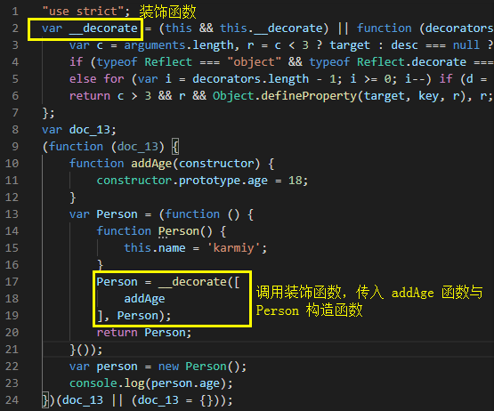

## 装饰器

装饰器主要作用是给一个已有的方法或类**扩展一些新行为**，而不是直接修改它本身

在 ES2015 加入 class 后，当我们需要在不同的类之间共享或扩展一些方法或行为时，代码会变得错综复杂不优雅，这也就是装饰器被提出的一个很重要的原因

目前 JavaScript 对装饰器推进的较慢，在 JavaScript 中使用我们需要 babel-plugin-transform-decorators-legacy 支持 decorator

在 TypeScript 中，我们需要在 tsconfig.json 中配置 "experimentalDecorators": true 来支持装饰器

> 装饰器的语法是个语法糖，本质上是函数

目前装饰器本质上是个函数，@expression 的形式其实个语法糖，expression 求值后也必须是个函数，它会在运行时被调用，被装饰的声明信息作为参数传入

如同 JavaScript 的 class 其实也只是语法糖：

    class Person{
        say() {
            console.log('hello')
        }
    }

    本质上是：

    function Person() {}
    Object.defineProperty(Person.prototype, 'say', {
        value: function() { console.log('hello'); },
        enumerable: false,
        configurable: true,
        writable: true
    });

### 类装饰器

比如我们可以声明一个函数 addAge 作为装饰器为 class 的属性 age 赋值：

    function addAge(constructor: Function) {
        constructor.prototype.age = 18;
    }

    @addAge
    class Person {
        name!: string;
        age!: number;
        constructor() {
            this.name = 'karmiy';
        }
    }
    const person = new Person();
    console.log(person.age); // 18

这段代码在编译后其实是：

可以看到，其实就是将 Person **构造函数传入一个装饰函数中进行加工**

所以我们在 addAge 中接收的参数 constructor 即为 Person 构造函数

> 注意：装饰器在类定义时就立即调用了，并不是在 new 实例时才调用

### 可传参装饰器

装饰器是可以自定义参数传参的，需要做的是，将原本的函数当做返回值返回：

    function addAge(age:number) {
        return function(constructor: Function) { // 真正的装饰器当返回值放回
            constructor.prototype.age = age;
        }
    }

    @addAge(18)
    class Person {
        name!: string;
        age!: number;
        constructor() {
            this.name = 'karmiy'; 
        }
    }

其他装饰器亦可这样传参

### 方法装饰器

除了类可以使用装饰器，其方法也可以使用装饰器：

    function method(target:any, propertyKey:string, descriptor: PropertyDescriptor) {
        console.log(target);
        console.log('prop: ' + propertyKey);
        console.log('desc: ' + JSON.stringify(descriptor));
        descriptor.writable = false; // 设为只读
    }
    class Animal {
        @method
        move() {
            console.log('move');
        }

        @method
        static run() {
            console.log('run');
        }
    }
    const animal = new Animal();
    animal.move = function() {};

    输出结果：
    // 1、move 部分输出：
    Animal { move: [Function] }
    prop: move
    desc: {"writable":true,"enumerable":true,"configurable":true}

    // 2、run 部分输出：
    { [Function: Animal] run: [Function] }
    prop: run
    desc: {"writable":true,"enumerable":true,"configurable":true}

    // 3、将 animal.move 重写后报错输出（因为设置了 writable = false）
    animal.move = function () { };
                ^

    TypeError: Cannot assign to read only property 'move' of object '#<Animal>

    注意：
    Animal { move: [Function] } 是 Animal.prototype
    { [Function: Animal] run: [Function] } 是 Animal

> 静态类型接收的是构造函数，成员变量接收的是原型

利用方法装饰器实现方法重构：

    function method(target:any, propertyKey:string, descriptor: PropertyDescriptor) {
        const originMethod = descriptor.value;
        descriptor.value = function(...args:any[]) {
            console.log('new method');
            return originMethod.apply(this, args);
        }
    }
    class Animal {
        @method
        move() {
            console.log('move');
        }

        @method
        static run() {
            console.log('run');
        }
    }
    const animal = new Animal();
    animal.move();

    输出结果：
    'new method'、'move'

### 属性装饰器

与方法属性修饰器不同的是，它只接收前2个参数

    function log(target: any, propertyKey: string) {
        console.log(target);
        console.log('prop: ' + propertyKey);
        
        let value = 0;
        const get = function() {
            console.log('Getter: ' + value);
            return value;
        }
        const set = function(val: number) {
            console.log('Setter: ' + val);
            value = val;
        }
        Object.defineProperty(target, propertyKey, {
            get,
            set,
            enumerable: true,
            configurable: true,
        })
    }
    class Calculator {
        @log
        public num!: number;
        square() {
            return this.num * this.num;
        }
    }
    const cal = new Calculator();
    cal.num = 2;
    cal.num;

    输出结果：
    Calculator { square: [Function] } 即 Calculator.prototype
    prop: num
    Setter: 2
    Getter: 2
    

### 访问装饰器

访问装饰器即修饰类中的 get、set，用法与属性

    function configurable(target: any, propertyKey: string, descriptor: PropertyDescriptor) {
        console.log(target);
        console.log('prop: ' + propertyKey);
        console.log('desc: ' + JSON.stringify(descriptor));
    }
    class Point {
        private _x:number = 100;
        private _y:number = 200;
        
        @configurable
        get x() {
            return this._x;
        }
        
        @configurable
        set y(val:number) {
            this._y = val;
        }
    }

    输出结果：
    // 1、get x() 部分输出：
    Point { x: [Getter], y: [Setter] }
    prop: x
    desc: {"enumerable":true,"configurable":true}

    // 2、set y() 部分输出：
    Point { x: [Getter], y: [Setter] }
    prop: y
    desc: {"enumerable":true,"configurable":true}

    Point { x: [Getter], y: [Setter] } 即 Point.prototype

### 参数装饰器

参数选择器接收3个参数：

- target：对象的原型，与其他选择器相同

- propertyKey：该参数处于的方法名

- index：参数数组中的位置，即当前参数是这个方法第几个参数

如下示例：

    function parse(target:any, propertyKey:string, index:number) {
        console.log(target);
        console.log('prop: ' + propertyKey);
        console.log('index: ' + index);
    }
    class Modal {
        add(@parse num:number | string | boolean) {
            return <number>num + 1;
        }
    }

    输出结果：
    Modal { add: [Function] }
    prop: add
    index: 0

使用参数装饰器实现参数格式化：

    const modalParseConf:Array<'number' | 'string' | 'boolean'> = [];
    function parse(type:'number' | 'string' | 'boolean') {
        return function(target:any, propertyKey:string, index:number) {
            modalParseConf[index] = type;
        }
    }
    function parseFunc(target:any, propertyKey:string, descriptor:PropertyDescriptor) {
        const originMethod = descriptor.value;
        descriptor.value = function(...args:any[]) {
            modalParseConf.forEach((type, index:number) => {
                switch (type) {
                    case 'number':
                        args[index] = Number(args[index]);
                        break;
                    case 'string':
                        args[index] = String(args[index]);
                        break;
                    case 'boolean':
                        args[index] = !!args[index];
                        break;
                }
            });
            return originMethod.apply(this, args);
        }
    }
    class Modal {
        @parseFunc
        add(@parse('number') prev:number | string | boolean, @parse('string') next:number | string | boolean) {
            console.log(prev);
            console.log(next);
            return <number>prev + <string>next;
        }
    }
    const modal = new Modal();
    console.log(modal.add('8', 9));

    输出结果：
    8、'9'、'89'

### 多个装饰器

同一个成员可以修饰多个装饰器

执行顺序是：从上往下先执行全部传参部分逻辑，从下往上执行装饰器内部逻辑

    function printName_1() {
        console.log('1');
        return function(target: any, propertyKey: string) {
            console.log('4');
        }
    }
    function printName_2() {
        console.log('2');
        return function(target: any, propertyKey: string) {
            console.log('3');
        }
    }
    class Wrap {
        @printName_1()
        @printName_2()
        name:string = 'wrap';
    }

    输出结果：
    '1'、'2'、'3'、'4'

### 装饰器执行顺序

- 从上至下顺序执行 属性/方法/访问法 执行装饰器，再执行静态成员的装饰器，最后执行构造函数和类的装饰器（注意：构造函数和类当成一个大成员顺序执行）

- 同一个成员属性上装饰器执行顺序：参数装饰器 => 方法/访问符装饰器

- 同一个成员方法，多个参数装饰器执行顺序：从右往左执行

- 装饰器传参的逻辑处理执行顺序与该成员装饰器执行顺序相反

示例如下：

    function logClass(param:string) {
        console.log('class logic: ' + param);
        return function(target:any) {
            console.log('class decorator: ' + param);
        }
    }
    function logProperty(param:string) {
        console.log('property logic: ' + param);
        return function(target: any, propertyKey: string) {
            console.log('property decorator: ' + param);
        }  
    }
    function logAccess(param:string) {
        console.log('access logic: ' + param);
        return function(target: any, propertyKey: string, descriptor: PropertyDescriptor) {
            console.log('access decorator: ' + param);
        } 
    }
    function logMethod(param:string) {
        console.log('method logic: ' + param);
        return function(target: any, propertyKey: string, descriptor: PropertyDescriptor) {
            console.log('method decorator: ' + param);
        } 
    }
    function logParameter(param:string) {
        console.log('parameter logic: ' + param);
        return function(target: Object, propertyKey: string, index: number) {
            console.log('parameter decorator: ' + param);
        } 
    }
    @logClass('group')
    class Group {
        @logMethod('run')
        static run(@logParameter('num') num:number) {}

        @logAccess('x')
        get x() {
            return 10;
        }
        @logMethod('push')
        push(@logParameter('option') option:string, @logParameter('index') index:number) {

        }
        constructor(@logParameter('constructor') code:string) {
            this.code = code;
        }
        @logProperty('code')
        code!:string;
    }

    输出结果：
    ------------- 成员：get x() -------------
    access logic: x
    access decorator: x

    ------------- 成员：push 方法 -------------
    method logic: push
    parameter logic: option
    parameter logic: index
    parameter decorator: index
    parameter decorator: option
    method decorator: push

    ------------- 成员：code 变量 -------------
    property logic: code
    property decorator: code

    ------------- 静态成员：run 方法 -------------
    method logic: run
    parameter logic: num
    parameter decorator: num
    method decorator: run

    ------------- 大成员：构造函数 + 类 -------------
    class logic: group
    parameter logic: constructor
    parameter decorator: constructor
    class decorator: group
