## 索引类型

假设我们需要一个 pick 函数，用于从对象上取出指定属性

JavaScript 中是这样实现的：

```ts
function pick(object, keys) {
    return keys.map(key => object[key]);
}

const user = {
    id: 1,
    name: 'karmiy',
    role: 'manager',
}
pick(user, ['id']);
```

这在 TypeScript 应该如何描述？

我们可能很容易想到接口中的**可索引类型**：

```ts
interface Obj {
    [key:string]:any;
}
function pick(object:Obj, keys:string[]) {
    return keys.map(key => object[key]);
}
```

虽然没有是报错警告，但是很明显可以看出存在一些问题：

- keys 应该是 object 的键数组，而不是 string[] 这么宽泛的定义

- pick 函数返回值是 any[] 类型，实际上应该更加精确在 object 所取的属性中

### 索引类型查询操作符

为了达到上述要求，TypeScript 提供了索引类型查询操作符 keyof，这在泛型篇章也有接触过

主要用于**获取所有的 public 属性名并构成联合类型**

```ts
class Images {
    public src:string = 'xxx';
    public alt:string = 'yyy';
    public width:number = 200;
    private title:string = 'zzz';
}
type props = keyof Images;
```

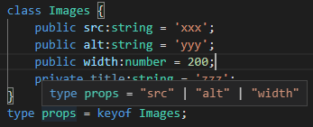

> keyof会获取属性名字符串列表，并将它们组合成**字面量类型**后联合

### 索引访问操作符

我们可以通过 keyof 查询索引类型的属性名，那如何获取对应属性值的类型？

TypeScript 提供了索引访问符来解决这个问题，使用方式与 JavaScript 访问属性值相似，使用 \[] 访问：

```ts
class Images {
    public src:string = 'xxx';
    public alt:string = 'yyy';
    public width:number = 200;
    private title:string = 'zzz';
}
type props = keyof Images;
type values = Images[props];
```

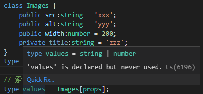

可以看出，TypeScript 的类型可以根据**字符串字面量类型**以形如 JavaScript 访问的形式去获取**值类型**

即 keyof 获取到的是类型（字面量类型）联合，索引访问符是以类型T[K类型]来获取值类型

T[K]除了可以接收字符串字面量类型来得到值类型，也可以接收纯字符串来得到值类型：

```ts
interface Wrap {
    width:number;
    height:number;
    content:string;
}
type widthStr = 'width';
type widthType_1 = Wrap[widthStr]; // ok
type widthType_2 = Wrap['width']; // ok

得到的都是：
type widthType_1 = number
type widthType_2 = number
```

> 上面在解释时一直提及是类型，不要把它当做一个真正的对象去思考，这样很容易在复杂的类型操作中混乱

回到最开始的 pick 函数，现在我们有了**索引类型查询操作符**与**索引访问操作符**，就可以重构我们的 pick 了。

因为我们无法确定传入的 object 的类型结构，使用我们需要使用泛型 T 来定义它

第二个参数 keys 是由 object 的成员属性名组成的数组，那么 keys 的约束应该是 keyof T

使用 pick 函数最后调整应为：

```ts
function pick<T, K extends keyof T>(object:T, keys:K[]):T[K][] {
    return keys.map(key => object[key]);
}
```

这样，TypeScript 版的 pick 函数就完成了，不仅具有严谨的约束，还有良好的提示功能

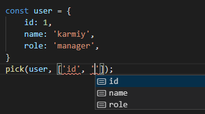

## 映射类型

我们有如下接口：

```ts
interface Person {
    id:number;
    name:string;
    code:string;
    age:number;
}
```

如果我们要将这个接口的属性都变为可选，难道只能一个改成 ?: 吗

这种场景下，TypeScript 为我们提供了映射类型 [K in Keys]：

- K：类型变量，依次绑定到每个属性上

- Keys：一组联合类型

这就相当于 JavaScript 的 for in 循环

我们看如下示例：

```ts
type Plain = 'a' | 2;
type Loop = {
    [K in Plain]:K;
}
```

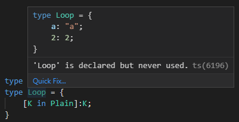

可以看到映射类型循环取出了 Plain 的字面量类型 'a'、2，将它们作为新类型的属性

接着修改 Plain 的类型：

```ts
type Plain = 'a' | 2 | number;
type Loop = {
    [K in Plain]:K;
}
```

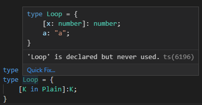

为什么会变成 [x:number]:number？

这是因为 Plain 的类型是 number | 'a'

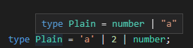

而 number 作为 K 被取出后在 [K in Plain]:K 中相当于 [number]:number，即**可索引类型**

再回到 Person 接口，我们要如何将它的属性都变为可选？

首先需要做的是拿到属性名的联合类型，假设我们传入泛型 T，那 keyof T 就是属性名的联合类型

接着需要将属性名一一映射，即 [K in keyof T]，并利用 ?: 设为可选类型，T[K] 获取属性值类型即可：

```ts
type partial<T> = {
    [K in keyof T]?:T[K];
}

type partialPerson = partial<Person>;
```

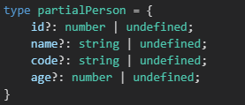

## 映射类型修饰符

TypeScript 有一类控制映射的类型修饰符

-? 将映射类型变为必选

+? 将映射类型变为可选

在使用映射类型时，当我们使用 [K in Keys]: T[K] 时，会保留原必选/可选状态：

```ts
interface Car {
    id:number;
    name:string;
    type?:string;
}
type Car_2 = {
    [K in keyof Car]:Car[K];
}
```

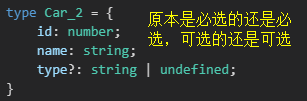

当使用 -?: 后将都映射为必选：

```ts
interface Car {
    id:number;
    name:string;
    type?:string;
}

type RequiredCar = {
    [K in keyof Car]-?:Car[K];
}
```

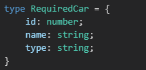

当使用 +?: 后（或直接 ?:）将都映射为可选：

```ts
interface Car {
    id:number;
    name:string;
    type?:string;
}

type PartialCar = {
    [K in keyof Car]+?:Car[K];
}
```

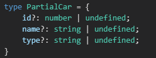

> never 就相当于没有，可选类型的属性，值类型是 never 时会是 undefined 而不是 never | undefined

```ts
interface Car {
    id:number;
    name:string;
    type?:string;
    empty?: never;
}

type PartialCar = {
    [K in keyof Car]+?:Car[K];
}
```

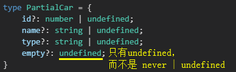