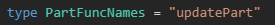
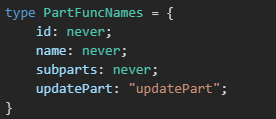

## 条件类型

条件类型表示非统一类型，以条件表达式进行关系检测，从而两者择一

    T extends U ? X : Y

这就像 JavaScript 的三目表达式

如果 T 可以赋值给 U，则类型取 X 反之取 Y

例如我们声明一个函数 func，参数接收 boolean 类型，当是 true 时返回 string 类型反之返回 number 类型

这类参数与返回值有关联的显然需要使用到泛型：

    declare function func<T extends boolean>(param: T):string | number;

而我们需要返回值根据 T 的真假而决定类型，这就要使用上述条件类型 T extends U ? X : Y：

    declare function func<T extends boolean>(param: T): T extends true ? string : number;

    const x = func(Math.random() < .5);
    const y = func(false);
    const z = func(true);

    x、y、z 类型:
    const x: string | number
    const y: number
    const z: string

其他示例：

    type e_1 = boolean extends boolean ? boolean : number;
    type e_2 = true extends boolean ? boolean : number;
    type e_3 = 'k' extends string ? number : boolean;
    type e_4 = string extends string ? number : boolean;
    type e_5 = string | number extends string ? number : boolean;
    type e_6 = {name:string; id:number} extends {name:string} ? string : number;
    type e_7 = ((a:number) => void) extends ((a:number, b:number) => void) ? string : number;
    type e_8 = (() => {name:string; id:number}) extends (() => {name:string}) ? string : number;

    结果：
    type e_1 = boolean
    type e_2 = boolean
    type e_3 = number
    type e_4 = number
    type e_5 = boolean
    type e_6 = string
    type e_7 = string
    type e_8 = string

> 需要更好的去理解 TypeScript 的类型兼容性

### 条件类型与联合类型

条件类型有一个特性：**分布式有条件类型**

而分布式有条件类型的前提是：条件类型里检查的类型必须是 **naked type parameter**
    
naked type parameter：裸参数类型

裸参数类型是指类型参数**没有被包装在其他类型**中，如没有被数组、元组、函数、Promise 等等包裹

如下示例：

    // 裸类型参数,没有被任何其他类型包裹即T
    type NakedUsage<T> = T extends boolean ? 'YES' : 'NO';
    // 参数类型被包装在数组中即Array<T>
    type WrappedUsage<T> = Array<T> extends Array<boolean> ? 'YES': 'NO';

而**分布式有条件类型在实例化时会自动分发成联合类型**

如下示例：

    type Distributed = NakedUsage<number | boolean>;
    type NotDistributed = WrappedUsage<number | boolean>;

这2个结果是不同，NakedUsage 是分布式有条件类型，它会自动分发成联合类型，所以这2个结果分别是：

    type Distributed = NakedUsage<number> | NakedUsage<boolean> = (number extends boolean ? 'YES' : 'NO') | (boolean extends boolean ? 'YES' : 'NO') = 'NO' | 'YES';

    type NotDistributed = WrappedUsage<number | boolean> = Array<number | boolean> extends Array<boolean> ? 'YES': 'NO' = 'NO';

我们可以把分布式条件类型当成 JavaScript 的 **Array.map**

接着设计一个类型工具 Diff<T, U>，用于找出 T 中不包含 U 的类型

即：

    type R = Diff<'a' | 'b' | 'c' | 'd', 'a' | 'c' | 'f'>;

    结果为：
    type D = 'b' | 'd';

借助条件类型，很容易可以得出工具类型：

    type Diff<T, U> = T extends U ? never : T;

同样，还可以产出工具类型 Filter 与 NonNullable：

    type Filter<T, U> = T extends U ? T : never;
    type F = Filter<string | number | (() => void), Function>;

    type NonNullable<T> = Diff<T, undefined | null>;
    type N = NonNullable<string | number | null> 

### 条件类型与映射类型

假设我们需要一个工具类型，将接口中**函数类型**的**名称**都取出

如下示例：

    interface Part {
        id: number;
        name: string;
        subparts: Part[];
        update(name: string): void;
    }

我们希望有一个工具类型 FunctionPropertyNames 从 Part 中获得如下结果：

    type PartFuncNames = FunctionPropertyNames<Part>



FunctionPropertyNames 工具类型应该为如下设计：

    type FunctionPropertyNames<T> = {
        [K in keyof T]: T[K] extends Function ? K : never;
    }[keyof T];

    type PartFuncNames = FunctionPropertyNames<Part>;

分析：

- 首先拿到接口 Part 的每一个属性名，即 keyof T

- 循环遍历每一项，需要使用映射类型 K in keyof T

- 利用索引访问符 T[K] 获取值，如果值是函数类型则返回，到目前为止应得到如下结果：

``````
    type FunctionPropertyNames<T> = {
        [K in keyof T]: T[K] extends Function ? K : never;
    }
    type PartFuncNames = FunctionPropertyNames<Part>;
``````


- 最后为了得到 'updatePart'，我们只需要利用索引访问符 FunctionPropertyNames['id' | 'name' | 'subparts' | 'updatePart'] 去获取值即可，所以最终就得到：

``````
    type FunctionPropertyNames<T> = {
        [K in keyof T]: T[K] extends Function ? K : never;
    }[keyof T]
``````

> never类型表示不会是任何值,即什么都没有,甚至不是null类型


