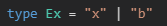
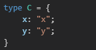

## 常用工具类型

JavaScript 的编程中总是离不开一些工具库如 lodash，而 TypeScript 的编程也同样离不开类型工具的帮忙

如 ReturnType、Partial、ConstructorParameters、Pick 都是官方的内置类型工具

### Partial

将属性全部变为可选：

    type Partial<T> = {
        [K in keyof T]?:T[K];
    };
    interface Person {
        id:number;
        name:string;
        code?:string;
        age?:number;
    }
    type P = Partial<Person>;

### DeepPartial

Partial 无法将深处属性变为可选：

    interface Company {
        id:number;
        name:string;
    }
    interface Person {
        id:number;
        name:string;
        code?:string;
        age?:number;
        company: Company;
    }
    type P = Partial<Person>;

利用递归做到深层可选：

    type DeepPartial<T> = {
        [K in keyof T]?: T[K] extends object ? DeepPartial<T[K]> : T[K];
    }
    type D = DeepPartial<Person>;

### Required

将属性全部变为必选：

    interface Person {
        id:number;
        name:string;
        code?:string;
        age?:number;
    }
    type Required<T> = {
        [K in keyof T]-?: T[K];
    }
    type R = Required<Person>;

### Extract

从 T 中抽取可分配给 U 的属性

    type Extract<T, U> = T extends U ? T : never;

    type Ex = Extract<'x' | 'a' | 'b', 'x' | 'y' | 'b'>;

### Pick

获取对象中的某些属性项

    interface Person {
        id:number;
        name:string;
        code?:string;
        age?:number;
    }
    type Pick<T, U extends keyof T> = {
        [K in U]: T[K];
    }
    type PK = Pick<Person, 'id' | 'name'>;

### Exclude

从 T 中排除出可分配给 U的元素

    type Exclude<T, U> = T extends U ? never : T;
    type E = Exclude<'x' | 'a' | 'b', 'x' | 'y' | 'z'>;

### Omit

忽略 T 中某些属性

Omit = Exclude + Pick

    interface Person {
        id:number;
        name:string;
        code?:string;
        age?:number;
    }
    type Omit<T, U> = Pick<T, Exclude<keyof T, U>>;
    type O = Omit<Person, 'name' | 'code'>;

### Merge

将两个对象的属性进行合并

    type Compute<A extends any> =
    A extends Function
    ? A
    : { [K in keyof A]: A[K] };
    type C = Compute<{x: 'x'} & {y: 'y'}>;

    type Merge<T extends object, U extends object> = Compute<T & Omit<U, keyof T>>;
    type M = Merge<{id:number; name:string}, {id:number; age?:number}>;

### Intersection

提取 T 中的属性，此属性 U 中也存在

    type Intersection<T extends object, U extends object> = Pick<T, Extract<keyof T, keyof U>>
    
    type I = Intersection<{id:number; name:string}, {name:string; age?:number}>;

### Diff

排除 T 中的属性，此属性 U 中也存在

    type Diff<T extends object, U extends object> = Pick<T, Exclude<keyof T, keyof U>>;

    type Df = Diff<{ name: string; age: number; visible: boolean }, { age: number }>;

### Overwrite

用 U 中的属性覆盖 T 中相同的属性

    type Overwrite<
        T extends object, 
        U extends object,
        I = Diff<T, U> & Intersection<U, T>
    > = Pick<I, keyof I>;
    type Ov = Overwrite<{ name: string; age: number; visible: boolean }, { age: string }>;

### Mutable

移除所有属性的 readonly

    type Mutable<T> = {
        -readonly [K in keyof T]: T[K];
    };
    type Mu = Mutable<{
        readonly id: number;
        readonly name: string;
        code: string;
    }>;

