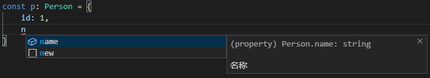

## 注释

可以通过 /** */ 注释 TypeScript 的类型

    interface Person{
        id: number;
        /** 名称 */
        name: string;
    }

## ReturnType 与 typeof

根据 ReturnType 与 typeof 获取一些函数的返回类型

先利用 typeof 获取函数整体的类型

ReturnType 获取函数类型的返回值

这在一些复杂的编码时很适用

    function add(a: number, b: number) {
        return a + b;
    }
    type addReturn = ReturnType<typeof add>;

    结果：
    type addReturn = number;

## 巧用 Omit

在一些场景如 React 组件的 props

有时子组件的 props 与父组件大致相同只是去除了一些项时就可以利用 Omit 移除

    type Collapse = {
        value: string | number | Array<string | number>;
        accordion: boolean;
        iconLeft: boolean;
        name: string;
    }
    type CollapseItem = Omit<Collapse, 'iconLeft' | 'accordion'>;

    // 结果：
    type CollapseItem = {
        value: string | number | (string | number)[];
        name: string;
    }

## 运用 Record

Record 是 TypeScript 的一个高级类型，但是相关的文档并不多，所以经常被人忽略，但是是一个非常强大的高级类型

Record 允许从 Union 类型中创建新类型，Union 类型中的值用作新类型的属性

    type Car = 'Audi' | 'BMW' | 'MercedesBenz'

    const cars = {
        Audi: { age: 119 },
        BMW: { age: 113 },
        MercedesBenz: { age: 133 },
    }

可以使用 Record 来规范这个写法的类型安全：

    type Car = 'Audi' | 'BMW' | 'MercedesBenz'
    type CarList = Record<Car, {age: number}>

    const cars: CarList = {
        Audi: { age: 119 },
        BMW: { age: 113 },
        MercedesBenz: { age: 133 },
    }

## 巧用类型约束