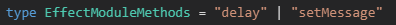
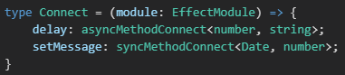

## 几个实用技巧

### 注释

可以通过 /** */ 注释 TypeScript 的类型

```ts
interface Person{
    id: number;
    /** 名称 */
    name: string;
}
```


### ReturnType 与 typeof

根据 ReturnType 与 typeof 获取一些函数的返回类型

先利用 typeof 获取函数整体的类型

ReturnType 获取函数类型的返回值

这在一些复杂的编码时很适用

```ts
function add(a: number, b: number) {
    return a + b;
}
type addReturn = ReturnType<typeof add>;

结果：
type addReturn = number;
```

### 巧用 Omit

在一些场景如 React 组件的 props

有时子组件的 props 与父组件大致相同只是去除了一些项时就可以利用 Omit 移除

```ts
type Collapse = {
    value: string | number | Array<string | number>;
    accordion: boolean;
    iconLeft: boolean;
    name: string;
}
type CollapseItem = Omit<Collapse, 'iconLeft' | 'accordion'>;

// 结果：
type CollapseItem = {
    value: string | number | (string | number)[];
    name: string;
}
```

### 运用 Record

Record 是 TypeScript 的一个高级类型，但是相关的文档并不多，所以经常被人忽略，但是是一个非常强大的高级类型

Record 允许从 Union 类型中创建新类型，Union 类型中的值用作新类型的属性

```ts
type Car = 'Audi' | 'BMW' | 'MercedesBenz'

const cars = {
    Audi: { age: 119 },
    BMW: { age: 113 },
    MercedesBenz: { age: 133 },
}
```

可以使用 Record 来规范这个写法的类型安全：

```ts
type Car = 'Audi' | 'BMW' | 'MercedesBenz'
type CarList = Record<Car, {age: number}>

const cars: CarList = {
    Audi: { age: 119 },
    BMW: { age: 113 },
    MercedesBenz: { age: 133 },
}
```

### 巧用类型约束

在 React 的 tsx 文件中，泛型可能会被当做 jsx 标签：

```ts
const toArray = <T>(element: T) => [element]; // Error in .tsx file.
```

可以使用 extends 解决：

```ts
const toArray = <T extends {}>(element: T) => [element]; // No errors.
```

### as const 断言

const 断言是 TypeScript 3.4 引入的新构造

它表示该表达式中的字面类型不应被扩展

- 字面类型

当我们使用 const 声明变量时，该类型会声明为字面量类型：

```ts
const x = 'x'; // const x: "x"
```

但如果是 let 定义，表示该变量会被重新分配，那么将被扩展为字符串类型：

```ts
let x = 'x'; // let x: string
```

而使用 as const，就可以将类型断言，表示不应该被扩展：

```ts
let x = 'x' as const; // let x: "x"
```

- 对象字面量获取只读属性

在如下场景，即使声明为 const，属性值类型依旧存在类型扩展：

```ts
const action = { type: 'INCREMENT' };
// const action: { type: string }
```

这在一些场景将造成困扰，例如在 redux 中，我们的 actionCreator 是这样的：

```ts
const setCount = (num: number) => ({
    type: 'SET_COUNT',
    payload: num,
});

const action = setCount(1);
```

然而我们得到的 action 中 type 却是 string 类型

这时 as const 就可以解决这个问题：

```ts
const setCount = (num: number) => (<const>{
    type: 'SET_COUNT',
    payload: num,
});

const action = setCount(1);
```

值得注意的是现在 action 类型为：

```ts
const action: {
    readonly type: "SET_COUNT";
    readonly payload: number;
}
```

- 数组字面量成为只读元组

此外，当数组遇到 as const，将会成为元组类型：

```ts
const hoursAction = {
    type: 'SET_HOURS',
    payload: [10, 12, '9'],
} as const;

// =>
const hoursAction: {
    readonly type: "SET_HOURS";
    readonly payload: readonly [10, 12, "9"];
}
```

## LeetCode 思考题

有一个类 EffectModule，它上面的方法**只可能**有2种类型签名：

```ts
interface Action<T> {
    payload?: T
    type: string
}

type asyncMethod<T, U> = (input: Promise<T>) => Promise<Action<U>>;
type syncMethod<T, U> = (action: Action<T>) => Action<U>;
```

还可能有一些任意的**非函数属性**：

```ts
class EffectModule {
    count = 1;
    message = "hello!";

    delay(input: Promise<number>) {
        return input.then(i => ({
            payload: `hello ${i}!`,
            type: 'delay'
        }));
    }

    setMessage(action: Action<Date>) {
        return {
            payload: action.payload!.getMilliseconds(),
            type: "set-message"
        };
    }
}
```

现在有一个 connect 函数，接收参数 EffectModule 实例，将它变为另一个对象，这个对象上只有 EffectModule 的**同名方法**，但是方法的类型签名改变了：

```ts
type asyncMethod<T, U> = (input: Promise<T>) => Promise<Action<U>>;
变成：
type asyncMethod<T, U> = (input: T) => Action<U>;

type syncMethod<T, U> = (action: Action<T>) => Action<U>;
变成：
type syncMethod<T, U> = (action:T) => Action<U>;
```

示例：

```ts
type Connected = {
    delay(input: number): Action<string>
    setMessage(action: Date): Action<number>
};
const effectModule = new EffectModule();
const connected: Connected = connect(effectModule);
```

要求：

有一个 type Connect = (module: EffectModule) => any

将 any 替换为题目的解答

简而言之，就是要设计一个工具类型：

```ts
type Connect = (module: EffectModule) => xxx
```

xxx 部分返回：

```ts
type Connected = {
    delay(input: number): Action<string>
    setMessage(action: Date): Action<number>
};
```

分析：

其实这个题目主要是就分为两步：

- EffectModule 中过滤出方法（EffectModule 中存在其他类型的变量，但是只可能有题中的 2 种类型签名）

- 遍历过滤后的方法，将它们转换为目标类型

步骤一：

设计一个过滤方法的工具类型 methodsPick，用于获取 EffectModule 中的方法名：

```ts
type methodsPick<T> = {
    [K in keyof T]: T[K] extends Function ? K : never;
}[keyof T];
```

步骤二：

将方法转换为目标类型

```ts
// 转换前
type asyncMethod<T, U> = (input: Promise<T>) => Promise<Action<U>>;
// 转换后
type asyncMethodConnect<T, U> = (input: T) => Action<U>;

// 转换前
type syncMethod<T, U> = (action: Action<T>) => Action<U>;
// 转换后
type syncMethodConnect<T, U> = (action: T) => Action<U>;
```

我们设计一个工具类型 EffectModuleMethodsConnect 用来对方法进行转换：

```ts
type EffectModuleMethodsConnect<T> = 
    T extends asyncMethod<infer U, infer V>
    ?
    asyncMethodConnect<U, V>
    :
    T extends syncMethod<infer U, infer V>
    ?
    syncMethodConnect<U, V>
    :
    never;
```

现在有了2个工具类型 methodsPick、EffectModuleMethodsConnect

先利用 methodsPick 把方法取出：

```ts
type EffectModuleMethods = methodsPick<EffectModule>;
```



最后 EffectModuleMethodsConnect 转化方法类型签名即可：

```ts
type Connect = (module: EffectModule) => {
    [K in EffectModuleMethods]: EffectModuleMethodsConnect<EffectModule[K]>;
}
```

