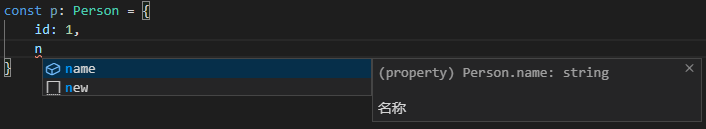

## 几个实用技巧

### 注释

可以通过 /** */ 注释 TypeScript 的类型

    interface Person{
        id: number;
        /** 名称 */
        name: string;
    }

### ReturnType 与 typeof

根据 ReturnType 与 typeof 获取一些函数的返回类型

先利用 typeof 获取函数整体的类型

ReturnType 获取函数类型的返回值

这在一些复杂的编码时很适用

    function add(a: number, b: number) {
        return a + b;
    }
    type addReturn = ReturnType<typeof add>;

    结果：
    type addReturn = number;

### 巧用 Omit

在一些场景如 React 组件的 props

有时子组件的 props 与父组件大致相同只是去除了一些项时就可以利用 Omit 移除

    type Collapse = {
        value: string | number | Array<string | number>;
        accordion: boolean;
        iconLeft: boolean;
        name: string;
    }
    type CollapseItem = Omit<Collapse, 'iconLeft' | 'accordion'>;

    // 结果：
    type CollapseItem = {
        value: string | number | (string | number)[];
        name: string;
    }

### 运用 Record

Record 是 TypeScript 的一个高级类型，但是相关的文档并不多，所以经常被人忽略，但是是一个非常强大的高级类型

Record 允许从 Union 类型中创建新类型，Union 类型中的值用作新类型的属性

    type Car = 'Audi' | 'BMW' | 'MercedesBenz'

    const cars = {
        Audi: { age: 119 },
        BMW: { age: 113 },
        MercedesBenz: { age: 133 },
    }

可以使用 Record 来规范这个写法的类型安全：

    type Car = 'Audi' | 'BMW' | 'MercedesBenz'
    type CarList = Record<Car, {age: number}>

    const cars: CarList = {
        Audi: { age: 119 },
        BMW: { age: 113 },
        MercedesBenz: { age: 133 },
    }

### 巧用类型约束

在 React 的 tsx 文件中，泛型可能会被当做 jsx 标签：

    const toArray = <T>(element: T) => [element]; // Error in .tsx file.

可以使用 extends 解决：

    const toArray = <T extends {}>(element: T) => [element]; // No errors.

## LeetCode 思考题

有一个类 EffectModule，它上面的方法**只可能**有2种类型签名：

    interface Action<T> {
        payload?: T
        type: string
    }

    type asyncMethod<T, U> = (input: Promise<T>) => Promise<Action<U>>;
    type syncMethod<T, U> = (action: Action<T>) => Action<U>;

还可能有一些任意的**非函数属性**：

    class EffectModule {
        count = 1;
        message = "hello!";

        delay(input: Promise<number>) {
            return input.then(i => ({
                payload: `hello ${i}!`,
                type: 'delay'
            }));
        }

        setMessage(action: Action<Date>) {
            return {
                payload: action.payload!.getMilliseconds(),
                type: "set-message"
            };
        }
    }

现在有一个 connect 函数，接收参数 EffectModule 实例，将它变为另一个对象，这个对象上只有 EffectModule 的**同名方法**，但是方法的类型签名改变了：

     type asyncMethod<T, U> = (input: Promise<T>) => Promise<Action<U>>;
    变成：
    type asyncMethod<T, U> = (input: T) => Action<U>;

    type syncMethod<T, U> = (action: Action<T>) => Action<U>;
    变成：
    type syncMethod<T, U> = (action:T) => Action<U>;

示例：

    type Connected = {
        delay(input: number): Action<string>
        setMessage(action: Date): Action<number>
    };
    const effectModule = new EffectModule();
    const connected: Connected = connect(effectModule);

要求：

有一个 type Connect = (module: EffectModule) => any

将 any 替换为题目的解答

简而言之，就是要设计一个工具类型：

    type Connect = (module: EffectModule) => xxx

xxx 部分返回：

    type Connected = {
        delay(input: number): Action<string>
        setMessage(action: Date): Action<number>
    };

分析：

其实这个题目主要是就分为两步：

- EffectModule 中过滤出方法（EffectModule 中存在其他类型的变量，但是只可能有题中的 2 种类型签名）

- 遍历过滤后的方法，将它们转换为目标类型

步骤一：

设计一个过滤方法的工具类型 methodsPick，用于获取 EffectModule 中的方法名：

    type methodsPick<T> = {
        [K in keyof T]: T[K] extends Function ? K : never;
    }[keyof T];

步骤二：

将方法转换为目标类型

    // 转换前
    type asyncMethod<T, U> = (input: Promise<T>) => Promise<Action<U>>;
    // 转换后
    type asyncMethodConnect<T, U> = (input: T) => Action<U>;

    // 转换前
    type syncMethod<T, U> = (action: Action<T>) => Action<U>;
    // 转换后
    type syncMethodConnect<T, U> = (action: T) => Action<U>;

我们设计一个工具类型 EffectModuleMethodsConnect 用来对方法进行转换：

    type EffectModuleMethodsConnect<T> = 
        T extends asyncMethod<infer U, infer V>
        ?
        asyncMethodConnect<U, V>
        :
        T extends syncMethod<infer U, infer V>
        ?
        syncMethodConnect<U, V>
        :
        never;

现在有了2个工具类型 methodsPick、EffectModuleMethodsConnect

先利用 methodsPick 把方法取出：

    type EffectModuleMethods = methodsPick<EffectModule>;

最后 EffectModuleMethodsConnect 转化方法类型签名即可：

    type Connect = (module: EffectModule) => {
        [K in EffectModuleMethods]: EffectModuleMethodsConnect<EffectModule[K]>;
    }

