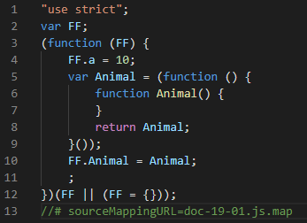

## 模块与命名空间

### 全局模块

当我们在 TypeScript 工程下建立一个文件 doc-19-01.ts：

    const a:number = 10;

又在相同的工程下再建立 doc-19-02.ts：

    const a:number = 10;

我们会发现这时将会报错提示重复声明了变量

虽然两个变量在不同的文件中，但是它们所处的空间是**全局**的

我们需要引入模块系统来规避这个情况

### 模块系统

任何包含顶级 **import** 或 **export** 的文件都会被当做一个**模块**

反之，如果一个文件不带有顶级的 **import** 或 **export** 声明，那么它的内容会被视为**全局**可见

上例代码中如果我们修改如下：

    export const a:number = 10;

报错就消失了，因为 **export 使 a 变量处在了局部空间内**，与另一个文件的全局变量 a 不再产生冲突

### 模块语法

export 关键字导出：

    export const a:number = 10;
    export interface Person {
        id: number;
        name: string;
    }
    export type Block = 'div' | 'ul';
    export enum Direct {
        Up,
        Down,
        Left,
        Right,
    }
    export function fn() {};

一次性导出：

    const a:number = 10;
    interface Person {
        id: number;
        name: string;
    }
    type Block = 'div' | 'ul';
    enum Direct {
        Up,
        Down,
        Left,
        Right,
    }
    function fn() {};

    export {
        a,
        Person,
        Block,
        Direct,
        fn,
    }

重命名：

    const a:number = 10;
    export {
        a as num,
    }

默认导出：

    export default a;

import 关键字导入：

    import { a, Person, Block, Direct, fn } from './doc-19-01';

也可以为导入重命名：

    import { a as num, Person, Block, Direct, fn } from './doc-19-01';

默认导入：

    import a from './doc-19-01';

如果不希望一个个导入，可以将模块整体导入：

    import * as P from './doc-19-01';

甚至可以导入后导出

    export { a } from './doc-19-01';

### 命名空间

TypeScript 命名空间 namespace 是 ts 早期时为了解决模块化而创造的关键字

早期还没有 ES6 时，TypeScript 提供了一种模块化方案，使用 module 关键字表示**内部模块**，后来由于 ES6 也使用了 module 关键字，TypeScript 为了兼容 ES6，使用 namespace 替代了自己的 module，更名为命名空间

    namespace FF {
        export const a:number = 10;
        export interface Person {
            id: number;
            name: string;
        };
        export class Animal {};
    }

如果我们需要在外部调用 FF 里的变量、类等时需要如上添加 export 关键字

命名空间本质上是个 IIFE（函数自执行）对象

查看编译后的 js 可以看到：

### 命名空间的用处

namespace 在现代 TypeScript 的开发者重要性不高

主要是因为 ES6 引入了模块系统

现在 namespace 一般出现在声明文件中 declare namespace，用来表示全局变量是一个对象，如 jQuery 在没有 TypeScript 类型文件时可以使用 namespace 声明全局变量

