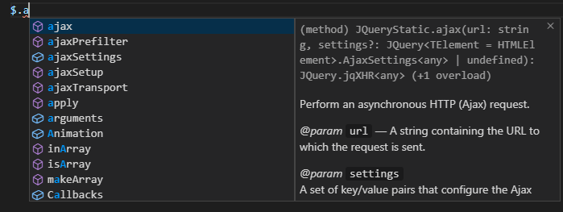
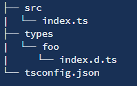

## 声明文件

虽然 TypeScript 已经逐渐进入主流，但是市面上大部分库还是以 JavaScript 为主

由于这些库没有像 TS 一样定义类型，因此我们需要一个声明文件来帮助库的使用者来获取库的类型提示

### 第三方 d.ts

Github 上有一个库 [DefinitelyTyped](https://github.com/DefinitelyTyped/DefinitelyTyped) 它定义了市面上主流的JavaScript 库的 d.ts

可以在 [TypeSearch](https://microsoft.github.io/TypeSearch/) 中搜索是否有需要的声明库

如安装 jQuery 的 d.ts：

```ts
npm install @types/jquery --save-dev
```

在使用 jQuery 便有了提示：



而当库不存在对应的声明库时，我们就需要为它书写对应的声明文件

### 什么是声明语句

假如我们想使用第三方库 jQuery，一种常见的方式是在 html 中通过 \<script> 标签引入，然后就可以在全局使用 $ 或 jQuery

```ts
$('#foo');

jQuery('#foo');
```

但是在 TypeScript 中，编译器并不能理解 $ 与 jQuery 是什么：

```ts
jQuery('#foo');
// Error: Cannot find name 'jQuery'
```

这时，我们需要使用 declare var 来定义它的类型：

```ts
declare var jQuery:(selector: string) => any;

jQuery('#foo');
```

上例中，declare var 并没有真正定义了一个变量，只是定义了**全局**变量 jQuery 的类型，仅仅用于编译时的检查，编译结果中删除

上方编译结果：

```ts
jQuery('#foo');
```

> 注意，声明 declare 只能纯声明类型，不能有具体实现

### 什么是声明文件

通常我们会把声明语句放到一个单独的文件（jQuery.d.ts）

```ts
// src/jQuery.d.ts
declare var jQuery: (selector: string) => any;


// src/doc-20.ts
const a = jQuery('#foo');
```

**声明文件需以 .d.ts 为后缀**

一般来说，TS 会解析项目中所有的 *.ts 文件，当然也包括 .d.ts 结尾的文件

所以当我们将 jQuery.d.ts 放到项目中时，其他所有 *.ts 文件都可以获得 jQuery 的类型了

如果仍然无法解析，可以检查 **tsconfig.json** 中的 files、include 和 exclude 配置，确保包含了 jQuery.d.ts

### 书写声明文件的场景

前面介绍的是最简单的全局变量声明文件，而真正书写一个声明文件却有不同的场景的区别

一般库的使用场景主要有以下几种：

- 全局变量：通过 \<script> 标签引入第三方库，注入全局变量

- npm 包：通过 import foo from 'foo' 引入，ES6 模块规范

- UMD 库：即可以 \<script> 标签引入，也可以 import

- 直接扩展全局变量：通过 \<script> 标签引入后，改变一个全局变量的结构

- 在 npm 包或 UMD 库中扩展全局变量：引用 npm 或 umd 库后，改变一个全局变量的结构

- 模块插件：通过 \<script> 或 import 导入后，改变另一个模块结构

### 全局变量

全局变量是最简单的一种场景，前面声明文件示例中就是 \<script> 标签引入 jQuery，注入全局变量 $ 或 jQuery

全局变量的声明文件主要有以下几种语法：

- declare var 声明全局变量

- declare function 声明全局方法

- declare class 声明全局类

- declare enum 声明全局枚举类型

- declare namespace 声明全局对象（含有子属性）

- interface、type 声明全局类型

> 注：在模块与命名空间章节提过，不带有顶层 import export 会被当成全局模块，所以下方侵全局变量的声明示例，只需要定义一个 tsconfig.json 能编译到的 d.ts 文件，其他文件自然就可以拥有它声明的变量类型

#### declare var

用来定义一个全局变量的类型

与其类似的，还有 declare let 与 declare const

```ts
// src/jQuery.d.ts
declare let jQuery: (selector: string) => any;

// src/doc-20.ts
jQuery('#foo');
jQuery = function(selector) {
    return document.querySelector(selector);
}
```

#### declare function

用来定义一个全局函数的类型

jQuery 其实就是个函数，可以用 function 来定义：

```ts
// src/jQuery.d.ts
declare function jQuery(selector: string): any;

// src/doc-20.ts
jQuery('#foo');
```

函数类型的声明语句中，函数重载也是支持的：

```ts
// src/jQuery.d.ts
declare function jQuery(selector: string): any;
declare function jQuery(callback: () => any): any;

// src/doc-20.ts
jQuery('#foo');
jQuery(function() {});
```

#### declare class

当全局变量是个类时，可以用 declare class 定义类型：

```ts
// src/Popper.d.ts
declare class Popper {
    constructor(reference: Element, popper: Element, options?: object);
    update(): void;
}

// src/doc-20.ts
new Popper(document.querySelector('.a')!, document.querySelector('.b')!);
```

#### declare enum

定义外部枚举类型，当第三方库定义的全局变量结构可以用枚举结构表示时，可以使用 declare enum

```ts
// src/Direct.d.ts
declare enum Direct {
    Up,
    Down,
    Left,
    Right,
}

// src/doc-20.ts
const directions = [
    Direct.Up,
    Direct.Down,
    Direct.Left,
    Direct.Right,
]
```

declare enum 仅用来定义类型，而不是具体的值

编译结果是：

```ts
var directions = [
    Direct.Up,
    Direct.Down,
    Direct.Left,
    Direct.Right,
];

其中 Direct 是第三方库定义好的全局变量
```

#### declare namespace

namespace 是 TypeScript 早期为了解决模块化而创造的关键字

现在由于 ES 模块的使用 namespace 的使用较少

一般都用在 declare namespace 声明文件中

表示一个全局对象，包含很多子属性

如 jQuery 是一个全局变量，同时也是一个对象，提供了如 jQuery.ajax 等方法，还有 verson 版本号等，就可以使用 namespace 来表示它：

```ts
// src/jQuery.d.ts
declare namespace jQuery {
    const version: string;
    function ajax(url: string, setting?: any): void;
    enum EventType {
        CustomClick,
    }
    class Event {
        blur(eventType: EventType): void;
    }
}

// src/doc-20.ts
jQuery.ajax('/api/getUser');
console.log(jQuery.version);
new jQuery.Event();
```

如果对象拥有深层的层级，则需要用嵌套的 namespace 来声明深层的属性类型：

```ts
// src/jQuery.d.ts
declare namespace jQuery {
    namespace fn {
        function extend(obj: any): void;
    }
}

// src/doc-20.ts
jQuery.fn.extend({
    check() {},
});
```

倘若 jQuery 下仅有 fn 这一属性，则可以不进行嵌套：

```ts
declare namespace jQuery.fn {
    function extend(obj: any): void;
}
```

#### interface、type

除了全局变量外，可能有一些类型我们也希望可以暴露出来，在类型声明文件中，可以直接使用 interface 或 type 来声明一个全局接口或类型，这样在其他文件也可以使用这个接口或类型：

```ts
// src/jQuery.d.ts
interface AjaxSettings {
    method?: 'GET' | 'POST'
    data?: any;
}
declare namespace jQuery {
    function ajax(url: string, setting?: AjaxSettings): void;
}

// src/doc-20.ts
const settings: AjaxSettings = {
    method: 'POST',
    data: {
        name: 'foo'
    }
};
jQuery.ajax('/api/getUser', settings);
```

> 注意：interface 与 type 不需要 declare 前缀

暴露在最外层的 interface 或 type 会作为全局类型作用于整个项目中，所以一般我们会将 interface 与 type 放在 namespace 中：

```ts
// src/jQuery.d.ts
declare namespace jQuery {
    interface AjaxSettings {
        method?: 'GET' | 'POST'
        data?: any;
    }
    function ajax(url: string, setting?: AjaxSettings): void;
}

// src/doc-20.ts
const settings: jQuery.AjaxSettings = {
    method: 'POST',
    data: {
        name: 'foo'
    }
};
jQuery.ajax('/api/getUser', settings);
```

### npm 包

一般我们通过 import foo from 'foo' 导入一个 npm 包，这是符合 ES6 模块规范的

在我们尝试给一个 npm 包创建声明文件前，需要先看它的声明文件是否存在

一般 npm 包的声明文件可能存在两个地方：

- 与该 npm 包绑在一起，判断该 npm 包的 package.json 中是否有 types 或 typings 字段，或有一个 index.d.ts 的声明文件。这种模式不需要额外安装其他包，最为推荐

- 发布到 @types，尝试安装如 npm install @types/foo --save-dev

假如以上两种都没有找到对应的声明文件，就需要自己为它写声明文件了

由于是通过 import 语句导入的模块，声明文件存在的位置也有所约束：

- 创建一个 node_modules/@types/foo/index.ts 文件，存放 foo 模块的声明文件。这种方式不需要额外配置，但是 node_modules 不稳定，故不建议

- 创建一个 types 目录，专门管理自己写的声明文件，将 foo 声明文件放到 types/foo/index.d.ts 中。这种方式需要配置 tsconfig.json 中的 paths 和 baseUrl



tsconfig.json 配置：

```ts
{
    "compilerOptions": {
        "module": "commonjs",
        "baseUrl": "./",
        "paths": {
            "*": ["types/*"]
        }
    }
}
```

这样配置后，当 import foo from 'foo' 时，* 将匹配 foo，然后转为 types/foo，即会去找如下文件：

- types/foo.ts

- types/foo.d.ts

- types/foo/index.ts

- types/foo/index.d.ts

> 注：配置 paths 后，匹配到符合的文件就会停止，如我们 types 下有 react.d.ts，那么在 import react from 'react' 后，会先找到 types/react.d.ts，那么 react 的类型声明就是这里定义的，而 node_modules/@types/react 的声明就无效了

```ts
// types/react/index.d.ts
declare namespace react {
    function fn(): void;
}
export default react;

// src/doc-20.ts
import React from 'react';
React.fn; // ok
React.Children; // error，因为匹配到了 types/react/index.d.ts, 而 node_modules/@types/react 下声明文件失效了
```

npm 包的声明文件主要有以下几种语法：

- export 导出变量

- export namespace 导出对象

- export default 默认导出

- export = commonjs 导出模块

#### export

npm 包的声明文件与全局变量声明文件不同

使用 declare 不再声明一个全局变量，只会在当前文件声明一个**局部变量**

通过 export 导出，使用方 import 导入应用这些类型声明:

```ts
// types/foo/index.d.ts
export const name: string;
export function getName(): string;
export class Animal {
    constructor(name: string);
}
export enum Direct {
    Up,
    Down,
    Left,
    Right,
}

export interface Option {
    data: {
        id: number;
        name: string;
    },
}

// src/doc-20.ts
import { name, getName, Animal, Direct, Option } from 'foo';

console.log(name);
getName();
const animal = new Animal('q');
const directions = [Direct.Up, Direct.Down, Direct.Left, Direct.Right];
const option: Option = {
    data: {
        id: 1,
        name: 'k',
    }
}
```

也可以使用 declare 先声明多个变量，最后再 export 一次性导出：

```ts
// types/foo/index.d.ts
declare const name: string;
declare function getName(): string;
declare class Animal {
    constructor(name: string);
}
declare enum Direct {
    Up,
    Down,
    Left,
    Right,
}

interface Option {
    data: {
        id: number;
        name: string;
    },
}

export {
    name,
    getName,
    Animal,
    Direct,
    Option,
}
```

> 注意：与全局声明相同，interface 与 type 不需要 declare 关键字

#### export namespace

当 npm 包的引入项是个对象时，可以使用 export namespace 表示

与 declare namespace 类似，export namespace 用来导出一个拥有子属性的对象：

```ts
// types/foo/index.d.ts
export namespace bar {
    const name: string;
    function baz(): void;
}

// src/doc-20.ts
import { bar } from 'foo';
bar.baz();
```

#### export default

有的 npm 包是默认导出的，这时可以配合它利用 export default：

```ts
// types/foo/index.d.ts
declare namespace foo {
    function init(): void;
}

export default foo;

// src/doc-20.ts
import foo from 'foo';
foo.init();
```

> 注意：只有 function、class 和 interface 可以直接默认导出，其他都需要如上，先定义，再导出

```ts
export default function foo(): void; // ok
export default class foo{} // ok
export default interface foo {} // ok

export default enum foo {
    Up,
    Down,
    Left,
    Right
} // Error
export default namespace foo {} // Error
```

针对这种默认导出，我们一般会将导出语句放在整个声明文件的最前面：

```ts
export default foo;

declare namespace foo {
    function init(): void;
}
```

#### export =

在 commonjs 规范中，我们用以下方式来导出一个模块：

```ts
function foo() {};
const bar = 10;

module.exports = foo;
或
exports.bar = bar; // 注意 modules.exports 与 exports. 不能同时在，否在 exports.bar 将无效
```

在 TypeScript 中，针对这种模块导出，有很多导入方式：

```ts
// 1、const ... = require
const foo = require('foo');
const bar = require('foo').bar;

// 2、import ... from
import * as foo from 'foo';
import { bar } from 'foo';

// 3、import ... require （TS 官方推荐）
import foo = require('../utils/foo')
import bar = foo.bar;
```

对于这种使用 commonjs 规范的库，如果要为它书写类型声明文件，就需要使用 export = 这种语法：

```ts
export = foo;

declare function foo(): void;
declare namespace foo {
    const bar: number;
}
```

> 注意：export = 之后，不能再单个导出 export { bar }，所以需要通过声明合并，使用 declare namespace foo 来将 bar 合并到 foo 里

实际上，import ... require 和 export = 都是 ts 为了兼容 AMD 规范和 commonjs 规范而创立的新语法

由于很多第三方库是 commonjs 规范的，所以声明文件也就不得不用到 export = 这种语法了

但相比 export = ，还是更推荐使用 ES6 标准的 export default、export

### UMD 库

既可以 \<script> 标签引入，又可以 import 引入的库，称为 UMD 库

相比于 npm 包的类型声明文件，我们需要额外声明一个全局变量

为了实现这种方式，TypeScript 提供了新语法 export as namespace

一般使用 export as namespace，都是先有了 npm 包的声明文件，再基于它添加一条 export as namespace 语句，即可将声明好的一个变量声明为全局变量：

```ts
export as namespace foo;
export = foo;

declare function foo(): void;
declare namespace foo {
    const bar: number;
}
```

> 注：为 umd 包创建声明文件，以上面 path 配置的 "*": \["types/*"\]，似乎文件结构只能是 types/foo/index.d.ts，其他如 types/foo.d.ts 无法让 foo 被编译为全局变量

### 直接扩展全局变量

有的第三方库扩展了一个全局变量

可是此全局变量的类型没有相应的更新，就会导致 TS 编译错误

如有一个 string-plugin 库在 \<script> 引入后为 String 扩展了 prepend 方法

这时我们如果字符串调用 prepend 方法就会报错：

```ts
'foo'.prepend();
// Property 'prepend' does not exist on type '"foo"'
```

这时就可以通过声明合并，使用 interface String 为 String 添加属性或方法：

```ts
// types/string-plugin/index.d.ts
interface String {
    prepend(): void;
}
```

### 在 npm 包或 UMD 库中扩展全局变量

对于一个 npm 包或者 UMD 库的声明文件，只有 export 导出的类型声明才能被导入

所以对于 npm 包或 UMD 库，如果导入此库后会扩展全局变量，则需要使用 declare global 语法在声明文件中扩展全局变量的类型，**declare global 可以让我们从模块中扩展全局变量类型**：

```ts
export default foo;

declare function foo(): void;
declare namespace foo {
    const bar: number;
}
declare global {
    interface String {
        prepend(): void;
    }
}
```

这样在未导入 foo 库之前调用 prepend：

```ts
'foo'.prepend();
// Property 'prepend' does not exist on type '"foo"'
```

导入后：

```ts
import foo from 'foo';
console.log(foo.bar);

'foo'.prepend(); // ok
```

除此之外，还可以用 declare global 声明全局变量，如 index.html 引入 jQuery cdn 后就会在全局有 $、jQuery 变量，这时可以在声明文件中:

```ts
export default foo;

declare function foo(): void;
declare global {
    interface IJquery {
        ajax(url: string): void
    }
    const $: IJquery;
    const jQuery: IJquery;
}
```

当然，上面用 global 声明 $ 是因为**含有 export 导致文件变为模块文件而不是全局文件**（加了 export 这种会使文件变为模块文件，常规为全局文件），所以需要用 global 把 $ 变为全局

如果**本身就是全局文件，直接声明 namespace 或声明全局变量也不是不行**：

```ts
declare namespace $ {
    function ajax(url: string): void;
}
```
或
```ts
declare const $: {
    ajax(url: string): void;
}
```

### 模块声明

上面的各个示例，都是基于我们配置了 tsconfig.json:

```json
{
    "compilerOptions": {
        "paths": {
            "*": ["types/*"],
        }
    },
}
```

这是我们利用一种巧妙的方式，使得 import xxx from 'xxx' 模块导入语法会去加载 types/xxx 的声明文件(xxx.d.ts、xxx/index.d.ts 等)，如果找不到才去默认去 node_modules 下找

然而这并不一定是比较规范的做法

通常**对于非 typescript 编写的，也没有 @types 对应的 npm 包**，我们更多的会使用模块声明的方式 **declare module**

下面假设我们使用了 jquery 的 npm 包，并且假设这个包没有 @types/jquery 声明包

```js
npm install --save jquery

// 此处假设没有 @types/jquery，其实是有的，但是我们不安装
```

tsconfig.json 配置 **typeRoots**：

```json
{
    "compilerOptions": {
        "typeRoots": ["./node_modules/@types/", "./types/"],
    },
    "include": [
        "./src/**/*",
    ]
}
```

> 注：为什么这里要配置 include 是 src 下，不包含 types，后面会在 'typeRoots 与 include' 中会讲到

```js
// 文件夹结构
- root
    - src
    - types
    - tsconfig.json
```

> 注：typeRoots 告诉 typescript 在编译过程中去哪里加载声明文件，默认 @types 包会在编译时被包含进来，node_modules/@types 文件夹下以及上层的所有包都会，也就是说 ./node_modules/@types/、../node_modules/@types/ 和 ../../node_modules/@types/ 等等

这里我们配置 typeRoots 多了个 ./types，告诉 typescript 在编译时也去加载 ./types 下的声明文件(**./types/jquery/index.d.ts，不能是 ./types/jquery.d.ts**)

```ts
// types/jquery/index.d.ts
declare module 'jquery' {
    interface jQuery {
        (selector: string): void;
        ajax(): void;
    }
    let $: jQuery;
    export default $;
}
```

```ts
// src/doc-20.ts
import $ from 'jquery'; // ok
$.ajax(); // ok
$(''); // ok
```

除此之外，**declare module 甚至可以用于为一个不存在的库声明模块类型**

假如有一个库 icon-pro 是引入 iconfont，它没有任何变量或方法，导入即可，我们可以为它声明一个全局模块：

```ts
// types/icon-pro/index.d.ts
declare module 'icon-pro';

// src/doc-20.ts
import iconPro from 'icon-pro';
```

如果它有一个 fn 方法：

```ts
// types/icon-pro/index.d.ts
declare module 'icon-pro' {
    export function fn(a: number): boolean; 
    // 也可以 function fn(a: number): boolean;
    // declare 中有无 export 效果相同
}

// src/doc-20.ts
import iconPro from 'icon-pro';
iconPro.fn();

或
import { fn } from 'icon-pro';
```


declare module 还可用于在一个文件中一次性声明多个模块的类型:

```ts
// types/foo-bar.d.ts
declare module 'foo' {
    export interface Foo {
        foo: string;
    }
}

declare module 'bar' {
    export function bar(): string;
}

// src/doc-20.ts
import { Foo } from 'foo';
import * as bar from 'bar';

let f: Foo;
bar.bar();
```

### 模块插件

有时通过 import 导入一个模块插件，可以改变另一个模块原有模块的结构

如果原模块已有类型声明文件，而插件模块没有，就会导致类型不完整，缺少插件部分的类型

TS 提供了 declare module，可以用来扩展原有模块的类型：

```ts
// types/moment-plugin/index.d.ts
import * as moment from 'moment';

declare module 'moment' {
    export function foo(): moment.CalendarKey;
}

// src/doc-20.ts
import * as moment from 'moment';
import 'moment-plugin';

moment.foo();
```

> 注：moment-plugin/index.d.ts 中的 import * as moment from 'moment'; 这种导入模块的操作是必须的，如果没有导入模块，该文件会是**全局声明**，新的 declare module 'moment' 将会覆盖原 moment 声明，即 import 了 moment 后，此时 moment 只有一个 foo 方法，其他方法都会丢失，如下示例：

```ts
// types/moment-plugin/index.d.ts
declare module 'moment' {
    export function foo(): moment.CalendarKey;
}

// src/doc-20.ts
import * as moment from 'moment';
import 'moment-plugin';

moment.foo();
moment.invalid(); // error
```

主要要保证的是：**moment-plugin/index.d.ts 需要是外部模块，不能是全局文件，否则会像上例一样直接覆盖原声明。同样可以推理出，只要是外部模块就行，不一定导入的要是原模块**：

```ts
// types/moment-plugin/index.d.ts
import 'jquery'; // 随意导入个模块，保证这是外部模块文件
declare module 'moment' {
    export function foo(): moment.CalendarKey;
}

// src/doc-20.ts
import * as moment from 'moment';
import 'moment-plugin';

moment.foo(); // ok
moment.invalid(); // ok
```

### typeRoots 与 include 的区分

#### 相同点

typeRoots 与 include 其实都是**告诉 typescript 编译时去加载哪些文件**，这样文件里一开始声明好的如全局类型等，就可以让我们在编写代码时直接使用

```json
{
    "compilerOptions": {
        "typeRoots": ["./node_modules/@types/", "./types/"],
    },
    "include": [
        "./src/**/*",
    ]
}
```
```ts
// types/foo/index.d.ts
// 全局声明 foo
declare function foo(): void;
declare namespace foo {
    const bar: number;
}
```

```ts
// src/string.d.ts
// 为全局字符串新增 test 方法
interface String {
    test(): void;
}
```

```ts
// src/doc-20.ts
foo(); // ok
foo.bar; // ok
''.test(); // ok
```

#### 不同点

- 目的性不同

include 在于告诉 typescript 该项目要编译哪些文件，包括 .ts .tsx .d.ts 文件(后面这些统称 typescript 文件)

typeRoots 在于告诉 typescript 要去编译哪些声明文件，一般是 .d.ts 声明文件

- 默认编译路径不同

include 默认编译当前文件夹下所有 typescript 文件

typeRoots 默认编译 ./node_modules/@types/、../node_modules/@types/ 和 ../../node_modules/@types/ 等文件

- 文件编译指向不同

include 会编译配置路径下所有 typescript 文件，如 ./src/**/* 会编译 src 下所有 typescript 文件

typeRoots 会编译配置路径下 **xxx/index.d.ts**，不会编译路径下直属文件，如下结构：

```js
- types

    - foo
        - foo.d.ts
        - index.ts
        - index.d.ts

    - km 
        - index.d.ts

    jquery.d.ts
    index.d.ts
```

只会编译 types/foo/index.d.ts 和 types/km/index.d.ts，即只有 xxx/index.d.ts 这样的结构会被编译，而其他文件如 types/foo/index.ts、types/foo/foo.d.ts、types/jquery.d.ts 和 types/index.d.ts 不会被编译

更细致的说，如下 2 个文件做了全局声明后

```ts
// types/foo/index.d.ts
declare function foo(): void;
declare namespace foo {
    const bar: number;
}
```

```ts
// types/index.d.ts
declare namespace bry {
    function open(): void;
}
```

我们在项目中：

```ts
// src/index.ts
foo(); // ok
foo.bar; // ok
bry; // error，types/index.d.ts 没有被编译，所以全局没有 bry
```

### include 深入扩展

对于 declare module 进行模块扩展时 include 有**特殊效果**

我们知道，当文件中带有 import export 后会变成外部模块，里面的声明不再是全局的，需要我们手动 import 导入

而 include 如果包含为**原有模块**进行拓展的 declare module ，可以**无视模块限制**，无需导入

例如我们对 axios 进行拓展，增加一个 test 方法：

```ts
// types/axios-plugin.d.ts
import 'axios';

declare module 'axios' {
    function test(): number;
}
```

如果将 include 配置改为：

```json
{
    "include": [
        "./src/**/*",
        "./types/"
    ]
}
```

在项目中使用：

```ts
// src/index.ts
import axios, { test } from 'axios'; // ok，成功扩展了 test 方法
axios.get; // ok，原模块功能不变
```

我们知道 types/axios-plugin 带有 import export 里面的声明不再是全局的，按理是需要 import 导入 axios-plugin.d.ts 的，但是实际上竟不需要手动引入：

```ts
// src/index.ts
// import '../types/axios-plugin'; // 不需要这样引入
import axios, { test } from 'axios';
axios.get;
```

甚至 axios-plugin.d.ts 不是 import 'axios' 而是其他模块：

```ts
// types/axios-plugin.d.ts
import 'jquery';

declare module 'axios' {
    function test(): number;
}

// src/index.ts
// 竟扩展 axios 模块还是成功了！
import axios, { test } from 'axios'; // ok
axios.get; // ok
```

**试验发现：**

- 被 include 包含的 typescript 文件，只要是个外部模块文件(带 import export)，但是内部有对原模块(如 axios) 使用 declare module 进行扩展，都可以自动识别进行扩展，无需导入

- 如果不是外部模块(即全局的)，对原模块(如 axios) 的 declare module，会直接覆盖原模块声明文件，如下

```ts
// types/axios-plugin.d.ts
declare module 'axios' {
    function test(): number;
}

// src/index.ts
import axios, { test } from 'axios'; // ok
axios.get; // error，原 axios 的声明被覆盖了，现在只有一个 test 方法
```

### typeRoots 深入扩展

typeRoots 前面说过，默认编译 ./node_modules/@types/、../node_modules/@types/ 和 ../../node_modules/@types/ 下的声明文件

如果我们配置为 **"typeRoots": ["./types/"]**，编译时就不会再去编译 node_modules/@types/ 了：

```json
{
    "compilerOptions": {
        "typeRoots": ["./types/"],
    }
}
```

```js
- node_modules
    - @types
        - kealm
            index.d.ts
            package.json

- src
    - index.ts

- types // 配置只编译这里的声明文件

- tsconfig.json
```

```ts
// node_modules/@types/kealm/index.d.ts
export as namespace kealm;
export = kealm;

declare function kealm(): void;
declare namespace kealm {
    const bar: number;
}
```

```ts
// src/index.ts
kealm.bar; // error，typeRoots 配置只编译 types 下的声明文件，@types/kealm 的 umd 库没有被编译，所以全局不能识别 kealm 变量
```

### 关于 import 时如何编译

当我们 import xxx from 'xxx' 时，如果我们没有 declare module 声明模块过

typescript 会这些路径下找是否有声明文件：

- node_modules/xxx/ 看 package.json 是否有配置 types 或 typings，指向哪个声明文件

- node_modules/xxx/index.d.ts 

- node_modules/@types/xxx/ 看 package.json 配置

- node_modules/@types/xxx/index.d.ts

都没有的话，还会去找上层 ../node_modules 的，../../node_modules 等

### 关于 umd 库的引入

umd 库的使用与我们文件是否是外部模块有关

- 如果我们在全局下使用，可以直接使用 umd 库暴露的变量

- 如果我们在外部模块使用，只能同样以 import 的形式导入

例如有一个 kealm 的 umd 库：

```js
- node_modules
    - @types
        - kealm
            index.d.ts
            package.json

- src
    - index.ts
```

```ts
export as namespace kealm;
export = kealm;

declare function kealm(): void;
declare namespace kealm {
    const bar: number;
}
```

当我们在全局下(文件中不包含 import export)使用时：

```ts
// src/index.ts
kealm.bar; // ok
```

当我们在外部模块使用时：

```ts
import React from 'react';

kealm.bar; // error
```

```ts
import React from 'react';
import kealm from 'kealm';

kealm.bar; // ok
```

### 三斜杠指令

与 namespace 类似，三斜线指令也是 ts 在早期版本中为了描述模块之间的依赖关系而创造的语法

类似声明文件中 import，用来导入另一个声明文件

随着 ES6 的广泛应用，现在已经不建议再使用 ts 中的三斜线指令

但是在声明文件中，它还是有一定用武之地

现在仅在以下几个场景，才需要使用三斜杠代替 import：

- 当我们在书写一个全局变量的声明文件时

- 当我们需要依赖一个全局变量的声明文件时

#### 书写一个全局变量的声明文件

在书写全局变量的声明文件时，不允许出现 import、export 的，因为会导致变成局部变量，全局失效，被视为一个一个 npm 包或 UMD 库

所以我们在书写一个全局变量的声明文件时，如果需要引入另一个库，就需要使用三斜杠指令

如下，我们在写一个全局函数 foo 的声明文件时，它的参数需要引入 jQuery 的 AjaxSettings 类型，就需要使用三斜杠 \<reference> 引入

```ts
// types/jquery-plugin/index.d.ts

/// <reference types="jquery" />
declare function foo(options: JQuery.AjaxSettings): string;
```

> 注意：三斜线指令必须放在文件的最顶端，三斜线指令的前面只允许出现单行或多行注释

#### 依赖一个全局变量的声明文件

当我们的声明文件需要依赖一个全局变量的声明文件时，由于这个全局变量的声明文件不支持我们 import 导入，所以需要使用三斜杠指令来导入：

```ts
// types/node-plugin/index.d.ts

/// <reference types="node" />
export function foo(p: NodeJS.Process): string;


// src/doc-20.ts
import { foo } from 'node-plugin';

foo(global.process);
```

#### 拆分声明文件

当我们的全局变量的声明文件太大，可以通过拆分为多个文件，然后在一个入口文件中将它们引入，提高代码可读性

如 jQuery 的声明文件就是这样：

```ts
// node_modules/@types/jquery/index.d.ts

/// <reference types="sizzle" />
/// <reference path="JQueryStatic.d.ts" />
/// <reference path="JQuery.d.ts" />
/// <reference path="misc.d.ts" />
/// <reference path="legacy.d.ts" />

export = jQuery;
```

其中 types 用于声明对另一个库的依赖，path 用于声明对另一个文件的依赖

### 自动生成声明文件

如果库的源码本身就是由 ts 写的，那么在使用 tsc 脚本将 ts 编译为 js 的时候，添加 declaration 选项，就可以同时也生成 **.d.ts** 声明文件了

我们可以在命令行中添加 **--declaration**（简写 -d），或者在 tsconfig.json 中添加 **declaration** 选项

```ts
{
    "compilerOptions": {
        "module": "commonjs",
        "outDir": "lib",
        "declaration": true,
    }
}
```

上例中我们添加了 outDir 选项，将 ts 文件的编译结果输出到 lib 目录下，然后添加了 declaration 选项，设置为 true，表示将会由 ts 文件自动生成 .d.ts 声明文件，也会输出到 lib 目录下

### 发布声明文件

我们为一个开源库编写了声明文件后应该如何发布？

- 向开源库提 PR,声明文件与源码放在一起,作为第一方声明

- 发布到 DefinitelyTyped,作为第三方声明文件

#### 将声明文件和源码放在一起

如果是手动写的声明文件，那么需要满足以下条件之一，才能被正确的识别：

- 给 package.json 中 types 或 typings 字段指定一个类型声明文件地址

- 在项目根目录下，编写一个 index.d.ts 文件

- 针对入口文件（package.json 中 main 字段指定的入口文件），编写一个同名不同后缀的 .d.ts 文件（如 main 指定 foo.js，那就编写一个 foo.d.ts）

第一种方式是给 package.json 中 types 或 typings 指定一个类型声明文件地址：

```ts
{
    "name": "foo",
    "version": "1.0.0",
    "main": "lib/foo.js",
    "types": "foo.d.ts",
}
```

指定后，当导入这个库时，就会去找 foo.d.ts 作为此库的类型声明文件

如果没有指定 types 或 typings，那么就会在根目录下找 index.d.ts

如果也没有，就会找 main 字段对应文件名不同后缀的 .d.ts

如果都没有，就会被当做一个没有声明文件的库了

有的库为了支持导入子模块，如 import bar from 'foo/lib/bar'

这时就需要额外编写一个类型声明文件 lib/bar.d.ts 或 lib/bar/index.d.ts

#### 将声明文件发布到DefinitelyTyped

如果我们是在给别人的库写声明文件，但原作者不愿意合并，那么就需要将声明文件发布到 @types 下

与普通的 npm 模块不同，@types 是统一由 [DefinitelyTyped](https://github.com/DefinitelyTyped/DefinitelyTyped) 管理的。要将声明文件发布到 @types 下，就需要给 DefinitelyTyped 创建一个 pull-request，其中包含了类型声明文件，测试代码，以及 tsconfig.json 等

pull-request 需要符合它们的规范，并且通过测试，才能被合并，稍后就会被自动发布到 @types 下

在 DefinitelyTyped 中创建一个新的类型声明，需要用到一些工具，DefinitelyTyped 的文档中已经有了详细的介绍，这里就不赘述了，以官方文档为准