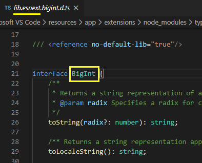

## tsconfig.json 配置

tsconfig.json 文件中指定了用来编译这个项目的根文件和编译选项

一个项目可以通过以下方式之一来编译：

- 不带任何输入文件的情况下调用 tsc，编译器会从当前目录查找 tsconfig.json，逐级向上搜索父目录

- 不带任何输入文件的情况下调用 tsc，且使用命令行参数 --project（或 -p）指定一个包含 tsconfig.json 文件的目录

- 当命令行上指定了输入文件时，tsconfig.json文件会被忽略

### 文件指定

tsconfig.json 主要配置：

    {
        "files": [],
        "include": [],
        "exclude": [],
        "compileOnSave": false,
        "extends": "",
        "compilerOptions": {}
    }

#### 编译文件

什么才是 TypeScript 编译器眼中的文件：

TS 文件指拓展名为 .ts、.tsx 或 .d.ts 的文件

如果开启了 allowJs 配置，.js、.jsx 也属于 TS 文件

#### files 配置项

一个数组列表，包含指定**文件**（不能指定文件夹）相对或绝对路径

指定编译文件，编译器编译时只会包含包含在 files 里的文件

待编译文件指入口文件，被依赖的文件不需要（如入口文件 foo.ts，里面有 import bar.ts，则 bar.ts 不需要），会自动把所有依赖文件都纳为编译对象

如果不指定 files，则取决于有没有配 include，没有则默认编译根目录及所有子目录文件

#### include / exclude 配置项

include：指定编译某些文件

exclude：指定排除某些文件

include / exclude 也是数组，数组元素是支持通配符的：

- *：匹配 0 或多个字符（不含路径分隔符）

- ?：匹配任意单个字符（不含路径分隔符）

- **/：递归匹配任何子路径

include / exclude 可以指定文件（夹），files 只能指定文件

#### include / exclude / files 关系

exclude 有默认值：node_modules 、bower_components、jspm_packages 和编译选项 outDir 指定的路径

**优先级：files > exclude > include**

所以在指定的文件在 files 中又在 exclude 中，那么排除无效，如果同时在 include 与 exclude，则 include 无效

### tsconfig.json 配置复用 extends

tsconfig.json 有个 extends 配置，用于实现配置复用

如创建一个基础配置文件 configs/base.json：

    {
        "compilerOptions": {
            "noImplicitAny": true,
            "strictNullChecks": true,
            "composite": true,
            "incremental": true
        }
    }

我们可以使用 extends 继承这个基础文件的配置：

    {
        "extends": "./configs/base"
    }

注意：

- 继承者中的同名配置会覆盖被继承者

- 所有相对路径都被解析为其所在文件的路径

### compileOnSave

可以让 IDE 在保存文件时根据 tsconfig.json 重新生成文件

    {
        "compileOnSave": true,
        "compilerOptions": {
            "noImplicitAny" : true
        }
    }

要想支持这个特性需要Visual Studio 2015， TypeScript1.8.4以上并且安装atom-typescript插件

### compilerOptions 编译选项

compilerOptions 是重点配置项，可以分为六大类：

- 基础选项

- 类型检查选项

- 额外检测选项

- 模块解析选项

- Source Map 选项

- 实验选项

完全配置可以查看[官方编译选项](https://www.tslang.cn/docs/handbook/compiler-options.html)

#### 基础选项

- target：指定编译后的目标代码，如我们想编译为 ES5 或 ES2015

`````````````````
    // 代码内容
    const a:number = 100;

    // 配置 "target": "ES2015" 的生成代码
    const a = 100;

    // 配置 "target": "ES5" 的生成代码
    var a = 100;
`````````````````

- module：指定模块的标准，如 amd、umd、commonjs、esnext 等

`````````````````
    // 代码内容
    import jQuery from 'jQuery';
    const a:number = 100;
    const b = jQuery('#foo');

    // 配置 "module": "ESNext" 的生成代码
    import jQuery from 'jQuery';
    var a = 100;
    var b = jQuery('#foo');

    // 配置 "module": "ESNext" 的生成代码
    Object.defineProperty(exports, "__esModule", { value: true });
    var jQuery_1 = require("jQuery");
    var a = 100;
    var b = jQuery_1.default('#foo');
`````````````````

- lib：指定在编译过程中需要包含的库文件，如需要编译一些与 DOM 相关的代码，需要引入 DOM 库，如需要编译 ES2015 的 Proxy、Reflect 等，需要引入 ES2015 的库，如需要引入尚未提案阶段的代码，如 bigint，就需要 esnext 库



- allowJs：指定是否允许编译 js 文件，默认 false

- checkJs：指定是否检查与报告 js 文件的错误，默认 false

- jsx：指定 jsx 代码用于的开发环境：'preserve'、'react'、'react-native'，用于编译 jsx 代码。默认 'preserve'，保留 jsx 代码，如果设为 'react'，将编译 React.createElement，输出将具有.js文件扩展名

- jsxFactory：指定生成目标为 react jsx 时，使用 jsx 工程函数，如 React.createElement 或 h，默认 React.createElement

- declaration：指定是否在编译时生成相应 .d.ts 声明文件，一般在发布 npm 包时需要打开这个选项来生成对应的声明文件，如开发了一个 npm 包，入口文件是 foo.js，那就会生成一个对应的 foo.d.ts 声明文件，让我们 npm 包被使用时在 TypeScript 中可以直接使用有提示。默认 false，但是 declaration 不能与 allowJs 同时设为 true

- declarationMap：指定是否为声明文件 .d.ts 生成 map 文件

- outFile：指定将输出文件合并为一个文件，它的值为一个文件路径名，如 "./dist/index.js"，则将所有文件输出为一个名为 index.js 的单一文件。注意，只有 module 为 amd 和 system 才支持此配置

- outDir：指定输出的文件夹，如 "./dist"，输出的文件都将放在 dist 文件夹中

- rootDir：指定编译文件的根目录，如 "./src"，编译器会在 src 文件夹下查找入口文件。如果编译器发现以rootDir的值作为根目录查找入口文件并不会把所有文件加载进去的话会报错，但是不会停止编译

- removeComments：删除所有注释，除了以 /!*开头的版权信息

- noEmit：不生成输出文件，默认 false

#### 类型检查选项

类型检查选项主要是配置对 TypeScript 类型的检查严苛程度

通常我们建议选择更为严苛的检查程度，如建议开启 strict 模式

- strict：指定是否启动所有类型检查，如果设为 true 会同时开启下面这几个严格类型检查，默认 false

- noImplicitAny：如果我们没有为一些值设置明确的类型，编译器会默认认为它为 any，默认 false，如果设为 true，没有明确类型会报错

- strictNullChecks：在严格的 null 检查下，null 和 undefined 值不包含在任何类型里，只允许自己和 any 赋值，默认 false

- strictPropertyInitialization：确保类的非 undefined 属性可以在构造函数里初始化，默认 false。若要此选项生效，需要同时启用 strictNullChecks

- strictBindCallApply：对 bind、apply、call 更严格的类型检测，例如如下可以检测出 apply 函数参数数量和类型的错误：

````````````````````
    function foo(a: number, b: string): string {
        return a + b;
    }
    foo.apply(undefined, [1]); 
    // Error: Property '1' is missing in type '[number]' but required in type '[number, string]'
````````````````````

特别对一些 react 老代码，函数需要自己 bind(this)，在没有箭头函数时，可能经常使用 this.foo = this.foo.bind(this)，这时类型可能会不准，现在则可以准确捕获到错误

- alwaysStrict：始终以严格模式解析并为每个源文件生成 "use strict" 语句，默认 false，可以帮助我们规避很多 JavaScript 遗留的一些怪异现象，开启这个选项是个好的习惯

#### 额外检测选项

- noUnusedLocals：当一个变量声明，但是未使用则抛错，默认 false

- noUnusedParameters：当一个参数声明后未使用则抛错，默认 false

- noImplicitReturns：当函数有返回路径没有返回值则抛错，默认 false

- noImplicitThis：当 this 为 any 类型时抛错，默认 false

- noFallthroughCasesInSwitch：当 switch 语句中没有 break 跳出时抛错，默认 false

#### 模块解析选项

模块解析非常常用，当要用到路径别名时就需要对模块解析选项进行配置

- baseUrl：解析非相对模块名的基准路径，设置 baseUrl 告诉编译器到哪去查找模块，所有非相对模块导入都会被当做相对于 baseUrl

- paths：路径映射，前提是 baseUrl 必须指定

如我们要映射 src/views 目录，如何映射取决于 baseUrl 是什么

若 baseUrl 为 './'：

    {
        "compilerOptions": {
            "baseUrl": "./",
            "paths": {
                "views": ["views"]
            }
        }
    }

若 baseUrl 为 './src'：

    {
        "compilerOptions": {
            "baseUrl": "./src",
            "paths": {
                "views": ["views"]
            }
        }
    }

在声明文件的章节，我们也在为 npm 包书写声明文件中配置过baseUrl 与 paths，使得在访问 npm 包时，编译器可以去 types 下找对应声明文件：

     {
        "compilerOptions": {
            "module": "commonjs",
            "baseUrl": "./",
            "paths": {
                "*": ["types/*"]
            }
        }
    }

- rootDirs：指定一个路径列表，列表里的内容会在运行时被合并，应用场景可以参考官方[模块解析](https://www.tslang.cn/docs/handbook/module-resolution.html#virtual-directories-with-rootdirs)

- typeRoots：默认所有可见的 "@types" 包会在编译过程被包含进来，node_modules/@types 文件夹下及它们子文件夹下的所有包都是可见的。但如果指定了 typeRoots，只有 typeRoots 下面的包才会被包含进来

- types：如果指定了 types，只有被列出来的包才会被包含进来

````````
    {
        "compilerOptions": {
            "types" : ["node", "lodash", "express"]
        }
    }
````````

#### Source Map 选项

- sourceRoot：指定 TypeScript 源文件的路径，以便调试器定位

- sourceMap：指定编译时是否生成 .map 文件，默认 false

- inlineSourceMap：生成单个 sourcemaps 文件，而不是将每个 sourcemaps 生成不同的文件，默认 false

- inlineSources：将代码与 sourcemaps 生成到一个文件中，要求同时设置了 inlineSourceMap 或 sourceMap，默认 false

#### 实验选项

控制是否开启一些实验性质的语法

- experimentalDecorators：启用实验性的 ES 装饰器

- emitDecoratorMetadata：给源码里的装饰器声明加上设计类型元数据

### 配置速查表

    {
        "compilerOptions": {
            /* Basic Options */
            "target": "es5" /* target用于指定编译之后的版本目标: 'ES3' (default), 'ES5', 'ES2015', 'ES2016', 'ES2017', 'ES2018', 'ES2019' or 'ESNEXT'. */,
            "module": "commonjs" /* 用来指定要使用的模块标准: 'none', 'commonjs', 'amd', 'system', 'umd', 'es2015', or 'ESNext'. */,
            "lib": ["es6", "dom"] /* lib用于指定要包含在编译中的库文件 */,
            "allowJs": true,                       /* allowJs设置的值为true或false，用来指定是否允许编译js文件，默认是false，即不编译js文件 */
            "checkJs": true,                       /* checkJs的值为true或false，用来指定是否检查和报告js文件中的错误，默认是false */
            "jsx": "preserve",                     /* 指定jsx代码用于的开发环境: 'preserve', 'react-native', or 'react'. */
            "declaration": true,                   /* declaration的值为true或false，用来指定是否在编译的时候生成相应的".d.ts"声明文件。如果设为true，编译每个ts文件之后会生成一个js文件和一个声明文件。但是declaration和allowJs不能同时设为true */
            "declarationMap": true,                /* 值为true或false，指定是否为声明文件.d.ts生成map文件 */
            "sourceMap": true,                     /* sourceMap的值为true或false，用来指定编译时是否生成.map文件 */
            "outFile": "./dist/main.js",                       /* outFile用于指定将输出文件合并为一个文件，它的值为一个文件路径名。比如设置为"./dist/main.js"，则输出的文件为一个main.js文件。但是要注意，只有设置module的值为amd和system模块时才支持这个配置 */
            "outDir": "./dist",                        /* outDir用来指定输出文件夹，值为一个文件夹路径字符串，输出的文件都将放置在这个文件夹 */
            "rootDir": "./",                       /* 用来指定编译文件的根目录，编译器会在根目录查找入口文件，如果编译器发现以rootDir的值作为根目录查找入口文件并不会把所有文件加载进去的话会报错，但是不会停止编译 */
            "composite": true,                     /* 是否编译构建引用项目  */
            "removeComments": true,                /* removeComments的值为true或false，用于指定是否将编译后的文件中的注释删掉，设为true的话即删掉注释，默认为false */
            "noEmit": true,                        /* 不生成编译文件，这个一般比较少用 */
            "importHelpers": true,                 /* importHelpers的值为true或false，指定是否引入tslib里的辅助工具函数，默认为false */
            "downlevelIteration": true,            /* 当target为'ES5' or 'ES3'时，为'for-of', spread, and destructuring'中的迭代器提供完全支持 */
            "isolatedModules": true,               /* isolatedModules的值为true或false，指定是否将每个文件作为单独的模块，默认为true，它不可以和declaration同时设定 */

            /* Strict Type-Checking Options */
            "strict": true /* strict的值为true或false，用于指定是否启动所有类型检查，如果设为true则会同时开启下面这几个严格类型检查，默认为false */,
            "noImplicitAny": true,                 /* noImplicitAny的值为true或false，如果我们没有为一些值设置明确的类型，编译器会默认认为这个值为any，如果noImplicitAny的值为true的话。则没有明确的类型会报错。默认值为false */
            "strictNullChecks": true,              /* strictNullChecks为true时，null和undefined值不能赋给非这两种类型的值，别的类型也不能赋给他们，除了any类型。还有个例外就是undefined可以赋值给void类型 */
            "strictFunctionTypes": true,           /* strictFunctionTypes的值为true或false，用于指定是否使用函数参数双向协变检查 */
            "strictBindCallApply": true,           /* 设为true后会对bind、call和apply绑定的方法的参数的检测是严格检测的 */
            "strictPropertyInitialization": true,  /* 设为true后会检查类的非undefined属性是否已经在构造函数里初始化，如果要开启这项，需要同时开启strictNullChecks，默认为false */
        "noImplicitThis": true,                /* 当this表达式的值为any类型的时候，生成一个错误 */
            "alwaysStrict": true,                  /* alwaysStrict的值为true或false，指定始终以严格模式检查每个模块，并且在编译之后的js文件中加入"use strict"字符串，用来告诉浏览器该js为严格模式 */

            /* Additional Checks */
            "noUnusedLocals": true,                /* 用于检查是否有定义了但是没有使用的变量，对于这一点的检测，使用eslint可以在你书写代码的时候做提示，你可以配合使用。它的默认值为false */
            "noUnusedParameters": true,            /* 用于检查是否有在函数体中没有使用的参数，这个也可以配合eslint来做检查，默认为false */
            "noImplicitReturns": true,             /* 用于检查函数是否有返回值，设为true后，如果函数没有返回值则会提示，默认为false */
            "noFallthroughCasesInSwitch": true,    /* 用于检查switch中是否有case没有使用break跳出switch，默认为false */

            /* Module Resolution Options */
            "moduleResolution": "node",            /* 用于选择模块解析策略，有'node'和'classic'两种类型' */
            "baseUrl": "./",                       /* baseUrl用于设置解析非相对模块名称的基本目录，相对模块不会受baseUrl的影响 */
            "paths": {},                           /* 用于设置模块名称到基于baseUrl的路径映射 */
            "rootDirs": [],                        /* rootDirs可以指定一个路径列表，在构建时编译器会将这个路径列表中的路径的内容都放到一个文件夹中 */
            "typeRoots": [],                       /* typeRoots用来指定声明文件或文件夹的路径列表，如果指定了此项，则只有在这里列出的声明文件才会被加载 */
            "types": [],                           /* types用来指定需要包含的模块，只有在这里列出的模块的声明文件才会被加载进来 */
            "allowSyntheticDefaultImports": true,  /* 用来指定允许从没有默认导出的模块中默认导入 */
            "esModuleInterop": true /* 通过为导入内容创建命名空间，实现CommonJS和ES模块之间的互操作性 */,
            "preserveSymlinks": true,              /* 不把符号链接解析为其真实路径，具体可以了解下webpack和nodejs的symlink相关知识 */

            /* Source Map Options */
            "sourceRoot": "",                      /* sourceRoot用于指定调试器应该找到TypeScript文件而不是源文件位置，这个值会被写进.map文件里 */
            "mapRoot": "",                         /* mapRoot用于指定调试器找到映射文件而非生成文件的位置，指定map文件的根路径，该选项会影响.map文件中的sources属性 */
            "inlineSourceMap": true,               /* 指定是否将map文件的内容和js文件编译在同一个js文件中，如果设为true，则map的内容会以//# sourceMappingURL=然后拼接base64字符串的形式插入在js文件底部 */
            "inlineSources": true,                 /* 用于指定是否进一步将.ts文件的内容也包含到输入文件中 */

            /* Experimental Options */
            "experimentalDecorators": true /* 用于指定是否启用实验性的装饰器特性 */
            "emitDecoratorMetadata": true,         /* 用于指定是否为装饰器提供元数据支持，关于元数据，也是ES6的新标准，可以通过Reflect提供的静态方法获取元数据，如果需要使用Reflect的一些方法，需要引入ES2015.Reflect这个库 */
        }
        "files": [], // files可以配置一个数组列表，里面包含指定文件的相对或绝对路径，编译器在编译的时候只会编译包含在files中列出的文件，如果不指定，则取决于有没有设置include选项，如果没有include选项，则默认会编译根目录以及所有子目录中的文件。这里列出的路径必须是指定文件，而不是某个文件夹，而且不能使用* ? **/ 等通配符
        "include": [],  // include也可以指定要编译的路径列表，但是和files的区别在于，这里的路径可以是文件夹，也可以是文件，可以使用相对和绝对路径，而且可以使用通配符，比如"./src"即表示要编译src文件夹下的所有文件以及子文件夹的文件
        "exclude": [],  // exclude表示要排除的、不编译的文件，它也可以指定一个列表，规则和include一样，可以是文件或文件夹，可以是相对路径或绝对路径，可以使用通配符
        "extends": "",   // extends可以通过指定一个其他的tsconfig.json文件路径，来继承这个配置文件里的配置，继承来的文件的配置会覆盖当前文件定义的配置。TS在3.2版本开始，支持继承一个来自Node.js包的tsconfig.json配置文件
        "compileOnSave": true,  // compileOnSave的值是true或false，如果设为true，在我们编辑了项目中的文件保存的时候，编辑器会根据tsconfig.json中的配置重新生成文件，不过这个要编辑器支持
        "references": [],  // 一个对象数组，指定要引用的项目
    }