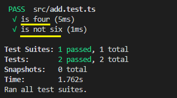

## TypeScript 单元测试

单元测试是现代软件工程必备环节之一

单元测试可以保证我们逻辑的健壮性。例如开发组件库时，已完成的组件开发一般不会再回头测试，而后开发的组件是否会影响到先前的组件也是不可控的，这时对每一个组件书写单元测试就是很有效的保障措施

### 单元测试工具

如今有非常多的测试框架可供选择：

- Mocha

Mocha 可能是当前使用最多的单元测试工具

最大的优点是灵活，提供给开发者的只有一个基础测试结构

而它的优点也是它的缺点，我们需要额外引入众多辅助库和插件来实现一些功能，这无形中增加了不少的学习成本与配置成本

除此之外，Mocha 另一个亮点是对异步的强大支持

Mocha 是为 Node.js 而生的单元测试框架，对浏览器的支持并不如其对服务器做的那么好

如果需要一款高度定值的测试框架，Mocha 是非常好的选择

- Jasmine

相比于 Mocha 需要额外配置，Jasmine 主打的则是开箱即用，它内置了一些断言库和 mocks 工具，并提供全局变量非常方便我们测试

- Jest

Jest 是个真正意义上开箱即用的测试框架，它集成了几乎单元测试中所需要的所有功能，如：断言、测试覆盖率统计、快照等一系列功能

目前三大框架都采用了 Jest 作为测试工具

优点：

1. 性能：Jest 基于并行测试多文件，在大项目中运行速度相当快

2. UI：清晰且操作简单

3. Ready-To-Go - 有断言、spies、mocks，和 Sinon 能做的事差不多。和其他库的结合使用也很方便

4. Globals - 和 Jasmine 一样，默认创建全局环境。但这一个特性确实会降低代码灵活性和健壮性，但是非常方便测试者调用

5. 快照测试：Jest 快照功能由 FB 开发和维护，它还可以平移到别的框架上作为插件使用。 更强大的模块级 mocking 功能 - Jest 允许开发者用非常简单的方法 mock 很重的库，达到提高测试效率的目的。比如可以模拟一个 promise 的 resolve，而不是真的进行网络请求

6. 代码覆盖率：内置了一个基于 Istanbul 的代码覆盖工具，功能强大且性能高

7. 支持性：大部分主流 IDE 和工具都已支持

8. 开发：Jest 仅仅更新被修改的文件，所以在监控模式 (watch mode) 下它的运行速度非常快

Jest 正是基于 Jasmine 开发而来，它比 Jasmine 更大而全，更开箱即用

**选择：**

学习成本陡峭的 Mocha 与大而全开箱即用，却没那么灵活的 Jest

多数没有特殊要求时 Jest 会更适合我们，我们选择一个几乎不需要配置、开箱即用的框架可以大大提高生产效率

### Jest 配置

#### 安装

全局安装：

    npm i jest -g

项目中安装：

    npm i -D jest ts-jest @types/jest

#### 初始化

    根目录执行：
    jest --init

问答：

- Choose the test environment that will be used for testing? **node**

- Do you want Jest to add coverage reports? **y**

- Automatically clear mock calls and instances between every test? **y**

第一个问题需要我们选择测试执行环境，有浏览器和 Node 两个选项，我们这次在简单的 Node 环境下测试，所以选择了 node。

第二个问题问我们是否需要测试覆盖率报告，通常情况下这个报告很重要，使我们整体测试情况的写一个报告，我选择了“是”。

第三个问题问我们是否在测试结束后帮我们自动清除一些模拟的实例等等，我选择了“是”，避免这些东西影响我们的下次测试。

#### 配置项

这时根目录生成了 jest.config.js 的文件，里面有非常多的配置项

如 clearMocks: true 是问答中的用于清除模拟残留，coverageDirectory: 'coverage' 是问答中的测试覆盖率报告，testEnvironment: 'node' 是问答中的环境

如果想在 TypeScript 中使用，需要进一步配置：

    {
        moduleFileExtensions: [
            'ts',
            'tsx',
            'js',
            'json',
            'jsx',
            'node',
        ],
        transform: {
            '^.+\\.tsx?$': 'ts-jest',
        },
        testMatch: [
            '**/__tests__/**/*.[jt]s?(x)',
            '**/?(*.)+(spec|test).[tj]s?(x)',
        ],
    }

- moduleFileExtensions：模块文件扩展名，如当我们 import 'foo' 没有带后缀，会依次尝试这些拓展名

- transform：转换器配置，由于 Jest 默认不支持 TypeScript，需要 ts-jest 把 .ts、.tsx 转成 js

- testMatch：设置识别哪些文件是测试文件（glob形式）

以上就是我们需要配置的配置项，更多配置可以移步官方[配置 Jest](https://doc.ebichu.cc/jest/docs/zh-Hans/configuration.html)

### Jest 使用

Jest 有很多强大的功能，这里只示例一般会用到的部分，更多资料可以查看 [Jest 官网](https://doc.ebichu.cc/jest/docs/zh-Hans/getting-started.html#content)

#### 匹配器使用

新建 src 文件夹，创建 add.ts：

    export function add(item: number, ...rest: number[]) {
        return rest.reduce((a: number, b: number) => a + b, item)
    }

我们对这个累加器进行一个测试

新建 add.test.ts 文件：

    import { add } from './add';

    test('is four', () => {
        expect(add(2, 2)).toBe(4);
    });

    test('is not six', () => {
        expect(add(2, 2)).not.toBe(6);
    });

此代码中，expect(add(2, 2)) 返回一个"期望"对象，toBe(4) 是匹配器，期望这个函数运行结果是 4，not.toBe(6) 是期望运行结果不等于 6。如果匹配失败， Jest 会跟踪所有失败的匹配器，以便打印出错误信息

    执行 npm run test

控制台将打印出如上的提示测试是否通过

#### 对象测试

新建 person.ts：

    export class Person {
        public name: string;
        public age: number;
        constructor(name: string, age: number) {
            this.age = age;
            this.name = name;
        }

        public say() {
            return 'hello';
        }
    }

新建 person.test.ts：

    import { Person } from './person';

    test('test person', () => {
        const person = new Person('karmiy', 18);

        expect(person).toBeInstanceOf(Person);
        expect(person).not.toEqual({
            name: 'karloy',
        })
    });

toBeInstanceOf 用于匹配实例是否由 Person 创建，toEqual 比较两个对象是否相等

#### 异步测试

新建 async.ts：

    export const getUsers = () => new Promise(resolve => resolve(['karmiy', 'karloy']));

新建 async.test.ts：

    import { getUsers } from './async';

    test('test async', async () => {
        const users = await getUsers() as Array<string>;
        expect(users).not.toBeUndefined();
        expect(users.length).toEqual(2);
    })

使用 async 关键字传递到 test 是测试场景中非常常见的

#### 函数测试

新建 func.ts：

    export function myForEach(items: number[], callback: (a: number) => void) {
        for (let index = 0; index < items.length; index++) {
            callback(items[index]);
        }
    }

新建 func.test.ts：

    import { myForEach } from './func';

    test('test func', () => {
        const callback = jest.fn();
        myForEach([0, 1], callback);
        
        // 模拟函数被调用 2 次
        expect(callback.mock.calls.length).toBe(2);
        // 第一次调用，第一个参数是 0
        expect(callback.mock.calls[0][0]).toBe(0);
        // 第二次调用，第一个参数是 1
        expect(callback.mock.calls[1][0]).toBe(1);
    })

除此之外上面测试中用到的模拟函数 callback 有一个 mock 属性，它保存了此函数被调用的一系列信息，打印 callback.mock 为如下结果：

    {
        calls: [[0], [1]],
        instances: [undefined, undefined],
        invocationCallOrder: [1, 2],
        results: [
            { type: 'return', value: undefined },
            { type: 'return', value: undefined }
        ]
    }