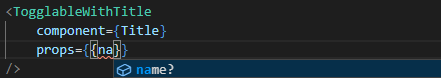

## TypeScript 与 React

单独使用 TypeScript 时一般没有太大的问题，但是一旦配合框架使用，往往会遇到很多的坑，如使用 React、Vue 这些框架时与 TypeScript 结合就经常会出现障碍

这里会对 TypeScript 与 React 的结合使用进行一些简单的示例

### TypeScript 版 React

可以使用官方的 create-react-app 来构建项目，也可以自己搭 webpack 环境

- 官方脚手架

```ts
create-react-app react-ts-app --scripts-version=react-scripts-ts
```

- 本地搭建 webpack 环境

除了 jsx 需要的脚手架配置外，要使用 TypeScript 还需要额外的内容

安装依赖包：

```ts
npm install -D @types/react @types/react-dom ts-loader typescript
```

webpack 的 rules 配置：

```ts
{
    test:/\.tsx?$/,
    exclude: /node_modules/,
    loader:"ts-loader"
},
```

根目录 tsconfig.json：

```ts
{
    // 编译选项
    "compilerOptions": {
        "target": "es5",                            // 指定 ECMAScript 目标版本: 'ES5'
        "module": "commonjs",                       // 指定使用模块: 'commonjs', 'amd', 'system', 'umd' or 'es2015'
        "moduleResolution": "node",                 // 选择模块解析策略
        "experimentalDecorators": true,             // 启用实验性的ES装饰器
        "allowSyntheticDefaultImports": true,       // 允许从没有设置默认导出的模块中默认导入。
        "sourceMap": true,                          // 把 ts 文件编译成 js 文件的时候，同时生成对应的 map 文件
        "strict": true,                             // 启用所有严格类型检查选项
        "noImplicitAny": true,                      // 在表达式和声明上有隐含的 any类型时报错
        "alwaysStrict": true,                       // 以严格模式检查模块，并在每个文件里加入 'use strict'
        "declaration": true,                        // 生成相应的.d.ts文件
        "removeComments": true,                     // 删除编译后的所有的注释
        "noImplicitReturns": true,                  // 不是函数的所有返回路径都有返回值时报错
        "noImplicitThis": true,
        "importHelpers": true,                      // 从 tslib 导入辅助工具函数
        "lib": ["es6", "dom", "ESNext"],                      // 指定要包含在编译中的库文件
        "typeRoots": ["node_modules/@types"],
        "outDir": "./dist",
        "jsx": "react", // jsx的版本,使用这个就不需要额外使用babel了，会编译成React.createElement
    },
    // 为了加快整个编译过程，我们指定相应的路径
    "include": [
        "./src/**/*"
    ]
}
```
    
### 无状态组件

无状态组件是非常常见的 React 组件，主要用于展示 UI

假设要封装一个 Logo 组件，在 jsx 中一般是这样封装的：

```tsx
// logo.tsx
import * as React from 'react';

function Logo(props) {
    const { className, src, alt } = props;
    return 
}

export default Logo;
```

然而仅仅这样，在 tsx 中是会报错的：


因为我们没有定义 props 的类型，接着使用 interface 定义 props 的类型：

```tsx
import * as React from 'react';

interface ILogoProps {
    src: string;
    className?: string;
    alt?: string;
}

function Logo(props: ILogoProps) {
    const { className, src, alt } = props;
    return 
}

export default Logo;
```

可以看到，报错消失了，似乎没有问题

但是让我们要用到 children 时，是不是又需要定义 children 类型：

```ts
interface ILogoProps {
    src: string;
    className?: string;
    alt?: string;
    children?: React.ReactNode;
}
```

其实 React 的提供了更规范的用法, **type FC\<P>**，这个工具类型里已经定义了 children 类型：

```tsx
import * as React from 'react';

interface ILogoProps {
    src: string;
    className?: string;
    alt?: string;
}

const Logo: React.FC<ILogoProps> = (props) => {
    const { className, src, alt } = props;
    return 
}

export default Logo;
```

还可以在 interface 上加注释：

```ts
interface ILogoProps {
    /**
    * logo 地址
    */
    src: string;
    className?: string;
    alt?: string;
}
```

在使用时不仅 props 会有提示，还会显示注释信息：


### 有状态组件

假设需要编写一个有状态组件 Todo，在 jsx 的写法为：

```tsx
import * as React from 'react';

export default class Todo extends React.Component {
    constructor(props) {
        super(props);
        this.state = {
            itemText: '',
        }
    }
}
```

这同样会报错：


有状态组件除了 props 之外还需要 state，对于 class 组件，React 的 Component 提供了泛型支持，即 **Component<P, S>**

并且 React 的声明文件已经自动帮我们加上了 **readonly** 标记，不需要我们手动为 props 与 state 加只读标记：

```tsx
import * as React from 'react';

interface ITodoProps {
    handleSubmit: (value: string) => void
}

interface ITodoState {
    itemText: string
}

export default class Todo extends React.Component<ITodoProps, ITodoState> {
    constructor(props: ITodoProps) {
        super(props);
        this.state = {
            itemText: '',
        }
    }
}
```

接着还可以为组件添加方法

因为大多情况下，该方法是组件的私有方法，这时需要使用 **private** 访问控制符：

```tsx
export default class TodoInput extends React.Component<ITodoInputProps, ITodoInputState> {
    constructor(props: ITodoInputProps) {
        super(props);
        this.state = {
            itemText: '',
        }
    }

    private updateValue = (value: string) => {
        this.setState({ itemText: value })
    }

    render() {
        return (
            <div>
                {this.state.itemText}
            </div>
        )
    }
}
```

### 非受控组件

一般我们在编写非受控组件时，需要用到 ref

如在 Input 组件更新完毕后，要让 input 输入框 focus 聚焦：

```tsx
import * as React from 'react';

interface IInputProps {
    autoFocus?: boolean;
}
interface IInputState {
    currentValue: string;
}

export default class Input extends React.Component<IInputProps, IInputState> {
    private inputRef:React.RefObject<HTMLInputElement> = React.createRef<HTMLInputElement>();
    state = {
        currentValue: '',
    }

    componentDidUpdate() {
        const inputEl = this.inputRef.current as HTMLInputElement;
        inputEl.focus();
        this.setState({
            currentValue: inputEl.value,
        })
    }

    render() {
        return (
            <div>
                {this.state.currentValue}
                <input type="text" ref={this.inputRef} />
            </div>
        )
    }
}
```

需要注意的是 createRef 需要一个泛型

因为是 input，类型是 HTMLInputElement，如果是div，则为 HTMLDivElement

### 受控组件

将上例的 Input 组件改为受控组件：

```tsx
import * as React from 'react';

interface IInputProps {
    autoFocus?: boolean;
}
interface IInputState {
    value: string;
}

export default class Input extends React.Component<IInputProps, IInputState> {
    state = {
        value: '',
    }

    private onChange = (e: React.ChangeEvent<HTMLInputElement>) => {
        this.setState({
            value: e.target.value,
        })
    }

    render() {
        return (
            <div>
                <input type="text" value={this.state.value} onChange={this.onChange} />
            </div>
        )
    }
}
```

### 事件处理

可以看到，对于事件 e 的类型定义，需要用到 **React.ChangeEvent\<T>**，同样，对于表单事件需要用到 **React.FormEvent\<T>**：

```tsx
export default class Input extends React.Component<IInputProps, IInputState> {
    state = {
        value: '',
    }

    private onChange = (e: React.ChangeEvent<HTMLInputElement>) => {
        this.setState({
            value: e.target.value,
        })
    }
    private onSubmit = (e: React.FormEvent<HTMLFormElement>) => {

    }

    render() {
        return (
            <div>
                <form onSubmit={this.onSubmit}>
                    <input type="text" value={this.state.value} onChange={this.onChange} />
                </form>
            </div>
        )
    }
}
```

> React 在合成事件上有这么多的定义，在遇到各种事件时应该如何搜索正确的类型？技巧：在组件上输入事件对应的名称通过提示了解事件类型


下面列出一些常用 Event 对象类型：

- ClipboardEvent<T = Element> 剪贴板事件对象

- DragEvent<T = Element> 拖拽事件对象

- ChangeEvent<T = Element>  Change 事件对象

- KeyboardEvent<T = Element> 键盘事件对象

- MouseEvent<T = Element> 鼠标事件对象

- TouchEvent<T = Element>  触摸事件对象

- WheelEvent<T = Element> 滚轮事件对象

- AnimationEvent<T = Element> 动画事件对象

- TransitionEvent<T = Element> 过渡事件对象

当我们定义事件处理函数时有没有更方便定义其函数类型的方式呢？

React 声明文件所提供了 EventHandler 类型别名，通过不同事件的 EventHandler 的类型别名来定义事件处理函数的类型：

```ts
type EventHandler<E extends SyntheticEvent<any>> = { bivarianceHack(event: E): void }["bivarianceHack"];
type ReactEventHandler<T = Element> = EventHandler<SyntheticEvent<T>>;
type ClipboardEventHandler<T = Element> = EventHandler<ClipboardEvent<T>>;
type DragEventHandler<T = Element> = EventHandler<DragEvent<T>>;
type FocusEventHandler<T = Element> = EventHandler<FocusEvent<T>>;
type FormEventHandler<T = Element> = EventHandler<FormEvent<T>>;
type ChangeEventHandler<T = Element> = EventHandler<ChangeEvent<T>>;
type KeyboardEventHandler<T = Element> = EventHandler<KeyboardEvent<T>>;
type MouseEventHandler<T = Element> = EventHandler<MouseEvent<T>>;
type TouchEventHandler<T = Element> = EventHandler<TouchEvent<T>>;
type PointerEventHandler<T = Element> = EventHandler<PointerEvent<T>>;
type UIEventHandler<T = Element> = EventHandler<UIEvent<T>>;
type WheelEventHandler<T = Element> = EventHandler<WheelEvent<T>>;
type AnimationEventHandler<T = Element> = EventHandler<AnimationEvent<T>>;
type TransitionEventHandler<T = Element> = EventHandler<TransitionEvent<T>>;
```

即 onChange 事件可以从:

```tsx
private onChange = (e: React.ChangeEvent<HTMLInputElement>) => {
    this.setState({
        value: e.target.value,
    })
}
```

改为：

```tsx
private onChange:React.ChangeEventHandler<HTMLInputElement> = (e) => {
    this.setState({
        value: e.target.value,
    })
}
```


### 默认属性

React 中有时会运用很多默认属性，我们可以直接为 defaultProps 赋值，还有一种方法是利用 class 同时声明类型和初始值

```tsx
import * as React from 'react';

interface InputSetting {
    placeholder: string
    maxlength: number
}

class IInputProps {
    public autoFocus?: boolean = false;
    public inputSetting?: InputSetting = {
        placeholder: '请输入',
        maxlength: 10,
    }
}

interface IInputState {
    value: string;
}

export default class Input extends React.Component<IInputProps, IInputState> {
    public static defaultProps = new IInputProps();
    state = {
        value: '',
    }

    private onChange = (e: React.ChangeEvent<HTMLInputElement>) => {
        this.setState({
            value: e.target.value,
        })
    }

    render() {
        const { autoFocus, inputSetting } = this.props;
        return (
            <div>
                <input 
                    type="text" 
                    value={this.state.value} 
                    onChange={this.onChange}
                    maxLength={inputSetting!.maxlength}
                    placeholder={inputSetting!.placeholder}
                />
            </div>
        )
    }
}
```

可以看到，我们将 class 直接作为类型传入了 React.Component 的泛型第一个参数中，又在 defaultProps 中直接 new 这个 class 来作为初始值

利用 class 作为 props 类型及默认属性实例的好处：

- 代码量少：一次编写，既可以作为类型也可以实例化作为值使用

- 避免错误：分开编写一旦有一方造成书写错误不易察觉

但是在使用过程中会有一个问题，虽然我们已经设置了默认属性，使用时依旧显示 inputSetting 可能未定义

解决方式：

- 如代码所示利用 ! 告诉编译器这里不是 undefined

- 利用三目运算 inputSetting ? inputSetting.maxlength | undefined

- 利用高级类型将 props 可选默认属性改为必选

第三种方案，我们可以创建一个函数，帮助我们将 props 中拥有默认值的可选属性，转为必选类型：

```tsx
const createPropsGetter = <DP extends object>(defaultProps: DP) => {
    return <P extends Partial<DP>>(props: P) => {
        type PropsExcludingDefaults = Omit<P, keyof DP>;
        type RecomposedProps = DP & PropsExcludingDefaults;

        return (props as any) as RecomposedProps
    }
}
```

完整使用：

```tsx
import * as React from 'react';

interface InputSetting {
    placeholder: string
    maxlength: number
}

const defaultProps = {
    autoFocus: false,
    inputSetting: {
        placeholder: '请输入',
        maxlength: 10,
    }
}

class IInputProps {
    public autoFocus?: boolean;
    public inputSetting?: InputSetting;
}

interface IInputState {
    value: string;
}

const createPropsGetter = <DP extends object>(defaultProps: DP) => {
    return <P extends Partial<DP>>(props: P) => {
        type PropsExcludingDefaults = Omit<P, keyof DP>;
        type RecomposedProps = DP & PropsExcludingDefaults;

        return (props as any) as RecomposedProps
    }
}

const getProps = createPropsGetter(defaultProps);

export default class Input extends React.Component<IInputProps, IInputState> {
    public static defaultProps = new IInputProps();
    state = {
        value: '',
    }

    private onChange = (e: React.ChangeEvent<HTMLInputElement>) => {
        this.setState({
            value: e.target.value,
        })
    }

    render() {
        const { autoFocus, inputSetting } = getProps(this.props);
        return (
            <div>
                <input 
                    type="text" 
                    value={this.state.value} 
                    onChange={this.onChange}
                    maxLength={inputSetting.maxlength}
                    placeholder={inputSetting.placeholder}
                />
            </div>
        )
    }
}
```

### Render Props

实现组件复用的其中一种方式是将组件的 children 作为函数，或利用 render 属性，让复用组件的内部去调用这个函数，即 render props 的用法

下面实现一个 render props 的 Togglable 组件：

```tsx
import * as React from 'react';

const isFunc = (f: any): f is Function => Object.prototype.toString.call(f) === '[object Function]';

const initialState = {
    show: false,
}

type State = typeof initialState;

type Props = Partial<{
    children: RenderCb;
    render: RenderCb;
}>

interface ToggleParams {
    show: State['show'];
    toggle: Togglable['toggle'];
}

type RenderCb = (args: ToggleParams) => JSX.Element;

const updateShowState = (prevState: State) => ({ show: !prevState.show });

export default class Togglable extends React.Component<Props, State> {
    state: State = initialState;
    
    render() {
        const { render, children } = this.props;
        const renderProps = {
            show: this.state.show,
            toggle: this.toggle,
        };

        if(render) {
            return render(renderProps);
        }

        return isFunc(children) ? children(renderProps) : null;
    }

    private toggle = (event: React.MouseEvent<HTMLElement>) => this.setState(updateShowState);
}
```

上例中 type RenderCb = (args: ToggleParams) => JSX.Element 返回了 JSX.Element

JSX.Element 与 React.ReactNode 的差别在于：React.ReactNode 可以是 React 元素，字符串，布尔值等等，而 JSX.Element 只能是 React 元素如 \<div>...\</div>，也可以是 React.Fragment

使用时，提示功能非常友好：


### 组件注入与泛型组件

在使用 react-router 时有着组件注入的模式：

```tsx
<Route path="/foo" component={MyView} />
```


组件注入即将组件传入：

```tsx
type Props = Partial<{
    children: RenderCb;
    render: RenderCb;
    component: React.ComponentType<ToggleParams>;
}>;

// 用法
const { component: InjectComp } = this.props;
const renderProps = {
    show: this.state.show,
    toggle: this.toggle,
};
return <InjectComp {...renderProps} />;
```

除此之外，我们可能还会传递一个 props 用于 component 中：

```tsx
const { component: InjectComp, props } = this.props;
const renderProps = {
    show: this.state.show,
    toggle: this.toggle,
};
return <InjectComp {...renderProps} {...props} />;
```

这时我们可能需要改写 type Props 为：

```ts
type Props<T extends object = {}> = Partial<{
    children: RenderCb;
    render: RenderCb;
    component: React.ComponentType<ToggleParams & T>;
    props: T
}>;
```

我们期望 props 与组件 component 是对应的，即如果 component 这个组件是 ToggleParams & { name?: string }，那传入的 props 也应该只能是 { name?: string }，而不能传别的属性

这就需要用到**泛型组件**

```tsx
export default class Togglable<T extends object = {}> extends React.Component<Props<T>, State> {
    ...
}
```

但是我们可以在 JSX 上使用泛型类型吗？不幸的是，并不行

但我们可以在泛型组件上引入一个静态方法，用于注入组件的类型：

```tsx
type Constructor<T = {}> = new (...args: any[]) => T;

export default class Togglable<T extends object = {}> extends React.Component<Props<T>, State> {
    static ofType<T extends object>() {
        return Togglable as Constructor<Togglable<T>>;
    }
}
```

使用方式：

```tsx
type ITitleProps = {
    name?: string;
} & ToggleParams;

const Title: React.FC<ITitleProps> = (props) => {
    return (
        <div>
            {props.name}
        </div>
    )
}

const TogglableWithTitle = Togglable.ofType<Omit<ITitleProps, keyof ToggleParams>>();

function App() {
    return (
        <div>
            <TogglableWithTitle 
                component={Title}
                props={{name: 'k'}}
            />
        </div>
    )
}
```

完整代码：

```tsx
import * as React from 'react';

const isFunc = (f: any): f is Function => Object.prototype.toString.call(f) === '[object Function]';

const initialState = {
    show: false,
}

type State = typeof initialState;

type Props<T extends object = {}> = Partial<{
    children: RenderCb;
    render: RenderCb;
    component: React.ComponentType<(ToggleParams & Partial<T>) | ToggleParams>;
    props: Partial<T>;
}>;


export type ToggleParams = {
    show: State['show'];
    toggle: Togglable['toggle'];
};

type RenderCb = (args: ToggleParams) => JSX.Element;

type Constructor<T = {}> = new (...args: any[]) => T;

const updateShowState = (prevState: State) => ({ show: !prevState.show });

export default class Togglable<T extends object = {}> extends React.Component<Props<T>, State> {
    state: State = initialState;
    static ofType<T extends object>() {
        return Togglable as Constructor<Togglable<T>>;
    }
    render() {
        const { render, children, component: InjectComp, props } = this.props;
        const renderProps = {
            show: this.state.show,
            toggle: this.toggle,
        };

        if(InjectComp) {
            return props ?
                <InjectComp {...renderProps} {...props} />
                :
                <InjectComp {...renderProps} />;
        }

        if(render) {
            return render(renderProps);
        }

        return isFunc(children) ? children(renderProps) : null;
    }

    private toggle = (event: React.MouseEvent<HTMLElement>) => this.setState(updateShowState);
}
```



可以看到，注入组件后，传 props 时也会后非常友好的提示

### 高阶组件

假设有一些组件，有通用的 setting 这个 props，可以封装一个高阶组件来为组件传递通用属性：

```tsx
import * as hoistNonReactStatics from 'hoist-non-react-statics'
import * as React from 'react'

const hocProps = {
    setting: {
        maxLength: 30,
        placeholder: '请输入',
    }
}

type InjectProps = Partial<typeof hocProps>;

const withTodoInput = <P extends InjectProps>(UnwrappedComponent: React.ComponentType<P>) => {
    type Props = Omit<P, keyof InjectProps>;

    class WithToggleable extends React.Component<Props> {
        public static readonly UnwrappedComponent = UnwrappedComponent;

        public render() {
            const props = {
                ...hocProps,
                ...this.props,
            } as P;
            return (
                <UnwrappedComponent 
                    {...props}
                />
            )
        }
    }

    return hoistNonReactStatics(WithToggleable, UnwrappedComponent)
}
```

render 函数中需要 **as P** 的原因，可以了解 26 节 **泛型与条件类型 extends 的保守推导问题**

> 注意：如果在 export default 导出时报错，需要把 declaration: true 配置去掉

### React Hooks

react 提供的 hooks 使用在 typescript 中一般没什么大问题，只是有一些细节点要注意

#### 自定义 Hook 返回数组

比较常见的问题是自定义 hook 中返回数组：

```ts
// src/hooks/useController.ts
import { useState } from 'react';

function useController(val: string) {
    const [value, setValue] = useState(val);
    // ...
    return [value, setValue];
}

export default useController;

// src/app.tsx
function App() {
    const [value, setValue] = useController('');
    // ...
}
```
这时可以当我们在使用 value 时，会发现 value 并不是 string 类型：


原因：我们返回的是数组，会被 typescript 解析成：

```ts
Array<string | React.Dispatch<React.SetStateAction<string>>>
```

所以正确的做法应该是返回**元组**：

```ts
// src/hooks/useController.ts
import { useState } from 'react';

function useController(val: string) {
    const [value, setValue] = useState(val);

    return [value, setValue] as [typeof value, typeof setValue];
}

export default useController;
```
#### useRef 使用 null 初始值

我们经常会将 useRef 初始赋值为 null：

```ts
const ref = useRef<string>(null);
```

但是这在我们试图为 ref 赋值时将会报错：

```ts
ref.current = '1'; // 报错：Cannot assign to 'current' because it is a read-only property.ts
```

可以看到，ref.current 被当成了 **readonly**

查看 useRef 的类型声明，可以看到 useRef 有 2 种声明，如下：


而我们使用到的是上面那种，该声明的 current 是 readonly 的

这是因为 react 中，我们一般会这样是使用初始为 null 的 ref：

```ts
const ref = useRef(null);

<div ref={ref}></div>
```

所以当我们使用 null 作为 useRef 初始值时，current 作为一个 readonly 应该是更合理的

那如果我们就希望初始赋为 null 要怎么解决呢？

可以这样做：

```ts
const ref = useRef<string | null>(null);

ref.current = '1';
```

### Redux

在项目中仅仅组件之间传递属性是不够的，经常还会涉及到对状态的管理，React 中一般用 redux 来作为状态管理工具

```ts
npm i --save redux
```

#### Model

在 model 中定义数据模型接口，假设有 2 个状态 Item 与 Shop：

```ts
// src/store/model.ts
export interface ItemState {
    inputValue: string;
    list: Array<string>;
}

export interface ShopState {
    count: number;
    name: string;
}
```

#### ActionType

通过**枚举**定义 ActionType **常量**：

```ts
// src/store/action-type.ts
export enum ItemActionConstants {
    CHANGE_INPUT_VALUE = 'changeInputValue',
    ADD_ITEM = 'addItem',
    GET_LIST = 'getList',
    GET_MY_LIST = 'getMyList',
}

export enum ShopActionConstants {
    INCREMENT = 'increment',
    DECREMENT = 'decrement',
    RENAME = 'rename',
}
```

#### Action

根据 ActionType 创建用于 dispatch 的 Action

分别合并出 ItemAction 与 ShopAction

```ts
// src/store/action-type.ts
/** ItemAction */
export type ChangeInputAction = {
    type: ItemActionConstants.CHANGE_INPUT_VALUE;
    value: string;
};

export type AddItemAction = {
    type: ItemActionConstants.ADD_ITEM;
    item: string;
};

export type GetListAction = {
    type: ItemActionConstants.GET_LIST;
    data: Array<string>;
};

export type ItemAction = ChangeInputAction | AddItemAction | GetListAction;

/** ShopAction */
export type IncrementShopAction = {
    type: ShopActionConstants.INCREMENT;
}

export type DecrementShopAction = {
    type: ShopActionConstants.DECREMENT;
}

export type RenameShopAction = {
    type: ShopActionConstants.RENAME,
    value: string;
}

export type ShopAction = IncrementShopAction | DecrementShopAction | RenameShopAction;
```

#### ActionCreator

构建 ActionCreator 函数：

```ts
// src/store/action-creator.ts
import { ActionCreator } from 'redux';
import { 
    ItemActionConstants, 
    ShopActionConstants,
    ChangeInputAction,
    AddItemAction,
    GetListAction,
    IncrementShopAction,
    DecrementShopAction,
    RenameShopAction,
} from './action-type';

/** Item */
export const changeInput: ActionCreator<ChangeInputAction> = (value) => ({
    type: ItemActionConstants.CHANGE_INPUT_VALUE,
    value,
});

export const addItem: ActionCreator<AddItemAction> = () => ({
    type: ItemActionConstants.ADD_ITEM,
    item: 'New Item',
});

export const getList: ActionCreator<GetListAction> = (data) => ({
    type: ItemActionConstants.GET_LIST,
    data,
});

/** Shop */
export const incrementShop: ActionCreator<IncrementShopAction> = () => ({
    type: ShopActionConstants.INCREMENT,
});

export const decrementShop: ActionCreator<DecrementShopAction> = () => ({
    type: ShopActionConstants.DECREMENT,
});

export const renameShop: ActionCreator<RenameShopAction> = ({ value }) => ({
    type: ShopActionConstants.RENAME,
    value,
});
```

#### Reducer

创建 reducer 执行工厂

利用 **combineReducers** 合并多个 reducer

利用类型工具 **ReturnType** 获取 **rootState**

```ts
import { ItemActionConstants, ShopActionConstants, ItemAction, ShopAction } from './action-type';
import { Reducer, combineReducers } from 'redux';
import { ItemState, ShopState } from './model';

// Item
const defaultItemState: ItemState = {
    inputValue: 'something',
    list: [
        '4:00 起床',
        '5:00 跑步'
    ]
};

const itemReducer: Reducer<ItemState, ItemAction> = (state = defaultItemState, action) => {
    switch (action.type) {
        case ItemActionConstants.CHANGE_INPUT_VALUE:
            return {
                ...state,
                inputValue: action.value,
            }
        case ItemActionConstants.ADD_ITEM:
            return {
                ...state,
                list: [
                    ...state.list,
                    action.item,
                ]
            }
        case ItemActionConstants.GET_LIST:
            return {
                ...state,
                list: action.data,
            }
        default:
            return state;
    }
}

// Shop
const defaultShopState: ShopState = {
    count: 0,
    name: 'k013'
};

const shopReducer: Reducer<ShopState, ShopAction> = (state = defaultShopState, action) => {
    switch (action.type) {
        case ShopActionConstants.INCREMENT:
            return {
                ...state,
                count: state.count + 1,
            }
        case ShopActionConstants.DECREMENT:
            return {
                ...state,
                count: state.count - 1,
            }
        case ShopActionConstants.RENAME:
            return {
                ...state,
                name: action.value,
            }
        default:
            return state;
    }
}

const rootReducer = combineReducers({
    item: itemReducer,
    shop: shopReducer,
});

export type RootState = ReturnType<typeof rootReducer>;
export default rootReducer;
```

#### Store

构造 Store：

```ts
// src/store/index.ts
import { createStore } from 'redux';
import reducer from './reducer';

const store = createStore(reducer, window.__REDUX_DEVTOOLS_EXTENSION__ && window.__REDUX_DEVTOOLS_EXTENSION__());

export default store;
```

其中 **__REDUX_DEVTOOLS_EXTENSION__** 是 Redux 调试工具 **Redux DevTools** 的变量，需要为其声明类型：

```ts
// src/types/index.ts
interface Window {
    __REDUX_DEVTOOLS_EXTENSION__(): any;
}
```

#### 常规使用

创建组件 TodoItem，用于展示 ItemState 的内容：

```tsx
// src/components/todo-item.tsx
import * as React from 'react';
import store from '../store';
import { changeInput, addItem } from '../store/action-creator';
import { RootState } from '../store/reducer';

interface ITodoItemState extends RootState {}
interface ITodoItemProps {}

class TodoItem extends React.Component<ITodoItemProps, ITodoItemState> {
    state = store.getState();
    constructor(props: ITodoItemProps) {
        super(props);
        store.subscribe(() => {
            this.setState(store.getState());
        });
    }

    onInputChange = (e: React.ChangeEvent<HTMLInputElement>) => {
        const action = changeInput(e.target.value);
        store.dispatch(action);
    }

    addItem = () => {
        const action = addItem();
        store.dispatch(action);
    }

    render() {
        return (
            <div>
                这是TodoItem页面
                <input type="text" value={this.state.item.inputValue} onChange={this.onInputChange} />
                <button onClick={this.addItem}>Add list item</button>
                list: {this.state.item.list}
            </div>
        )
    }
}

export default TodoItem;

// src/app.tsx
import * as React from 'react';
import TodoItem from './components/todo-item';

function App() {
    <div className={'app'}>
        <TodoItem />
    </div>
}
```

这时 Redux 已经可以正常使用了

#### react-redux

常规的 redux 使用时本身与 react 没有关系，redux 支持各种库甚至纯 JavaScript

我们在使用时需要手动去 store.subscribe 中 setState 新的状态来达到组件 UI 的更新

react-redux 可以以组件的形式融合对 redux 的使用，将 state 与 dispatch 合并到组件的 props 中

```tsx
// src/app.tsx
import * as React from 'react';
import TodoItem from './components/todo-item';
import { Provider } from 'react-redux';
import store from './store';

function App() {
    <div className={'app'}>
        <Provider store={store}>
            <TodoItem />
        </Provider>
    </div>
}

// src/components/todo-item.tsx
import * as React from 'react';
import { ItemState, ShopState } from '../store/model';
import { changeInput, addItem } from '../store/action-creator';
import { Dispatch, bindActionCreators } from 'redux';
import { connect } from 'react-redux';
import { RootState } from '../store/reducer';

interface ITodoItemState {
}

interface ITodoItemProps extends ItemState, ShopState {
    onInputChange(value: string): void;
    addItem(): void;
}

class TodoItem extends React.Component<ITodoItemProps, ITodoItemState> {
    constructor(props: ITodoItemProps) {
        super(props);
    }

    onInputChange = (e: React.ChangeEvent<HTMLInputElement>) => {
        this.props.onInputChange(e.target.value);
    }

    render() {
        return (
            <div>
                这是TodoItem页面
                <input type="text" value={this.props.inputValue} onChange={this.onInputChange} />
                <button onClick={this.props.addItem}>Add list item</button>
                list: {this.props.list}
            </div>
        )
    }
}

const stateToProps = (state: RootState)=>{
    const { item, shop } = state;
    return {
        inputValue: item.inputValue,
        list: item.list,
        count: shop.count,
        name: shop.name,
    }
}

const dispatchToProps = (dispatch: Dispatch) => {
    return bindActionCreators({
        onInputChange: value => changeInput(value),
        addItem,
    }, dispatch);
}

export default connect(stateToProps, dispatchToProps)(TodoItem);
```

#### redux-thunk

redux-thunk 是中间件 middleware，它允许我们在 action 中进行异步操作，将 action 从返回对象扩展到可以是返回函数

```ts
npm i --save redux-thunk
```

下面我们创建一个 ThunkActionCreator 为 getTodoList 函数，模拟请求后端数据，2s 后返回 2 条数据覆盖 ItemState 的 list

使用 redux-thunk：

```ts
// src/store/index.ts
import { createStore, applyMiddleware, compose } from 'redux';
import reducer from './reducer';

import thunk from 'redux-thunk';
const composeEnhancers = window.__REDUX_DEVTOOLS_EXTENSION_COMPOSE__ ?
window.__REDUX_DEVTOOLS_EXTENSION_COMPOSE__({}) : compose;
const enhancer = composeEnhancers(applyMiddleware(thunk));

const store = createStore(reducer, enhancer);

export default store;
```

其中 __REDUX_DEVTOOLS_EXTENSION_COMPOSE__ 变量也需要定义类型：

```ts
// src/types/index.ts
interface Window {
    __REDUX_DEVTOOLS_EXTENSION__(): any;
    __REDUX_DEVTOOLS_EXTENSION_COMPOSE__(option: object): any;
}
```

新增常量 GET_LIST 为获取列表的 ActionType，并新增 GetListAction：

```ts
// src/store/action-type.ts
export enum ItemActionConstants {
    CHANGE_INPUT_VALUE = 'changeInputValue',
    ADD_ITEM = 'addItem',
    GET_LIST = 'getList',
};

export type GetListAction = {
    type: ItemActionConstants.GET_LIST;
    data: Array<string>;
};

export type ItemAction = ChangeInputAction | AddItemAction | GetListAction;
```

新增 ActionCreator：

```ts
// src/store/action-creator.ts
export const getList: ActionCreator<GetListAction> = (data) => ({
    type: ItemActionConstants.GET_LIST,
    data,
});
```

创建 ThunkActionCreator，返回**异步函数**：

```ts
// src/store/action-creator.ts
import { Dispatch, Action, ActionCreator } from 'redux';
import { ThunkAction } from 'redux-thunk';

// R: return; S: State; E: extraArgument; A: Action
type ThunkActionCreator<R, S, E, A extends Action> = (...args: any[]) => ThunkAction<R, S ,E ,A>;

export const getTodoList: ThunkActionCreator<Promise<void>, ItemState, void, GetListAction> = () => {
    return async (dispach, getState) => {
        const data = await new Promise<string[]>(r => {
            setTimeout(() => {
                const data = [
                    '11:00 喝水',
                    '12:00 吃饭'
                ];
                r(data);
            }, 2000);
        });
        const action = getList(data);
        dispach(action);
    }
};
```

reducer 补充条件：

```ts
// src/store/reducer.ts
const itemReducer: Reducer<ItemState, ItemAction> = (state = defaultItemState, action) => {
    switch (action.type) {
        case ItemActionConstants.CHANGE_INPUT_VALUE:
            return {
                ...state,
                inputValue: action.value,
            }
        case ItemActionConstants.ADD_ITEM:
            return {
                ...state,
                list: [
                    ...state.list,
                    action.item,
                ]
            }
        case ItemActionConstants.GET_LIST:
            return {
                ...state,
                list: action.data,
            }
        default:
            return state;
    }
}
```

组件内使用 ThunkActionCreator getTodoList 函数：

```tsx
// src/components/todo-item.tsx
import * as React from 'react';
import { ItemState, ShopState } from '../store/model';
import { changeInput, addItem, getTodoList } from '../store/action-creator';
import { Dispatch, bindActionCreators } from 'redux';
import { connect } from 'react-redux';
import { RootState } from '../store/reducer';

interface ITodoItemState {
}

interface ITodoItemProps extends ItemState, ShopState {
    onInputChange(value: string): void;
    addItem(): void;
    getList(): void;
}

class TodoItem extends React.Component<ITodoItemProps, ITodoItemState> {
    constructor(props: ITodoItemProps) {
        super(props);
    }

    componentDidMount() {
        this.props.getList();
    }

    onInputChange = (e: React.ChangeEvent<HTMLInputElement>) => {
        this.props.onInputChange(e.target.value);
    }

    render() {
        return (
            <div>
                这是TodoItem页面
                <input type="text" value={this.props.inputValue} onChange={this.onInputChange} />
                <button onClick={this.props.addItem}>Add list item</button>
                list: {this.props.list}
            </div>
        )
    }
}

const stateToProps = (state: RootState)=>{
    const { item, shop } = state;
    return {
        inputValue: item.inputValue,
        list: item.list,
        count: shop.count,
        name: shop.name,
    }
}

const dispatchToProps = (dispatch: Dispatch) => {
    return bindActionCreators({
        onInputChange: value => changeInput(value),
        addItem,
        getList: getTodoList,
    }, dispatch);
}

export default connect(stateToProps, dispatchToProps)(TodoItem);
```

现在刷新页面，2s 后 list 的 UI 展示结果就会从 4:00 起床 5:00 跑步 变为 11:00 喝水 12:00 吃饭

#### redux-saga

redux-thunk 让我们从 ActionCreator 返回一个对象，到 ThunkActionCreator 返回一个可异步函数

而 redux-saga 也是进行异步处理的中间件

与 redux-saga 不同的是，它的处理内容一般单独放在 saga.ts 文件中，通过在 generator 函数中监听 dispatch 的 action 完成相应操作，解耦性可能更好

```ts
npm i --save redux-saga
```

下面我们新增一个 type 为 GET_MY_LIST 的 Action 用于让 redux-saga 监听，监听到后同样模拟请求数据 2s 后返回 2 条数据覆盖 ItemState 的 list

新增常量 GET_MY_LIST 用于 redux-saga 监听，并新增 GetMyListAction：

```ts
// src/store/action-type.ts
export enum ItemActionConstants {
    CHANGE_INPUT_VALUE = 'changeInputValue',
    ADD_ITEM = 'addItem',
    GET_LIST = 'getList',
    GET_MY_LIST = 'getMyList',
}

export type GetMyListAction = {
    type: ItemActionConstants.GET_MY_LIST;
};

export type ItemAction = ChangeInputAction | AddItemAction | GetListAction | GetMyListAction;
```

新增 ActionCreator：

```ts
// src/store/action-creator.ts
export const getMyList: ActionCreator<GetMyListAction> = () => ({
    type: ItemActionConstants.GET_MY_LIST,
});
```

reducer 补充条件，由于 GET_MY_LIST 只用于让 redux-saga 监听，不需要在 reducer 里改变 state，返回原 state 即可：

```ts
// src/store/reducer.ts
const itemReducer: Reducer<ItemState, ItemAction> = (state = defaultItemState, action) => {
    switch (action.type) {
        case ItemActionConstants.CHANGE_INPUT_VALUE:
            return {
                ...state,
                inputValue: action.value,
            }
        case ItemActionConstants.ADD_ITEM:
            return {
                ...state,
                list: [
                    ...state.list,
                    action.item,
                ]
            }
        case ItemActionConstants.GET_LIST:
            return {
                ...state,
                list: action.data,
            }
        case ItemActionConstants.GET_MY_LIST:
            return state;
        default:
            return state;
    }
}
```

新增 saga.ts 文件执行我们的异步操作：

```ts
// src/store/saga.ts
import { takeEvery, put } from 'redux-saga/effects';
import { getList } from './action-creator';
import { ItemActionConstants } from './action-type';

function* getMyList() {
    const data: string[] = yield new Promise<string[]>(r => {
        setTimeout(() => {
            const data = [
                '11:00 喝水',
                '12:00 吃饭'
            ];
            r(data);
        }, 2000);
    });
    const action = getList(data);
    yield put(action);
}

function* mySagas() {
    // 监听 GET_MY_LIST 这个 action，当我们派发 GET_MY_LIST 是会触发 getMyList 函数
    yield takeEvery(ItemActionConstants.GET_MY_LIST, getMyList);
}

export default mySagas;
```

使用 redux-saga：

```tsx
// src/store/index.ts
import { createStore, applyMiddleware, compose } from 'redux';
import reducer from './reducer';

import createSagaMiddleware from 'redux-saga';
import mySagas from './sagas';
const sagaMiddleware = createSagaMiddleware();

const composeEnhancers = window.__REDUX_DEVTOOLS_EXTENSION_COMPOSE__ ?
    window.__REDUX_DEVTOOLS_EXTENSION_COMPOSE__({}) : compose;

const enhancer = composeEnhancers(applyMiddleware(sagaMiddleware));

const store = createStore(reducer, enhancer);

sagaMiddleware.run(mySagas);

export default store;
```

组件内使用常规 dispatch 派发 getMyList 即可：

```tsx
// src/components/todo-item.tsx
import * as React from 'react';
import { ItemState, ShopState } from '../store/model';
import { changeInput, addItem, getMyList } from '../store/action-creator';
import { Dispatch, bindActionCreators } from 'redux';
import { connect } from 'react-redux';
import { RootState } from '../store/reducer';

interface ITodoItemState {
}

interface ITodoItemProps extends ItemState, ShopState {
    onInputChange(value: string): void;
    addItem(): void;
    getList(): void;
}

class TodoItem extends React.Component<ITodoItemProps, ITodoItemState> {
    constructor(props: ITodoItemProps) {
        super(props);
    }

    componentDidMount() {
        this.props.getList();
    }

    onInputChange = (e: React.ChangeEvent<HTMLInputElement>) => {
        this.props.onInputChange(e.target.value);
    }

    render() {
        return (
            <div>
                这是TodoItem页面
                <input type="text" value={this.props.inputValue} onChange={this.onInputChange} />
                <button onClick={this.props.addItem}>Add list item</button>
                list: {this.props.list}
            </div>
        )
    }
}

const stateToProps = (state: RootState)=>{
    const { item, shop } = state;
    return {
        inputValue: item.inputValue,
        list: item.list,
        count: shop.count,
        name: shop.name,
    }
}

const dispatchToProps = (dispatch: Dispatch) => {
    return bindActionCreators({
        onInputChange: value => changeInput(value),
        addItem,
        getList: getMyList,
    }, dispatch);
}

export default connect(stateToProps, dispatchToProps)(TodoItem);
```

同样刷新页面，2s 后 list 的 UI 展示结果就会从 4:00 起床 5:00 跑步 变为 11:00 喝水 12:00 吃饭