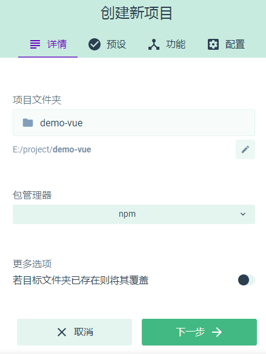
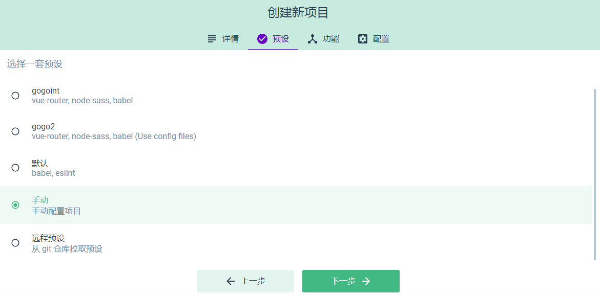
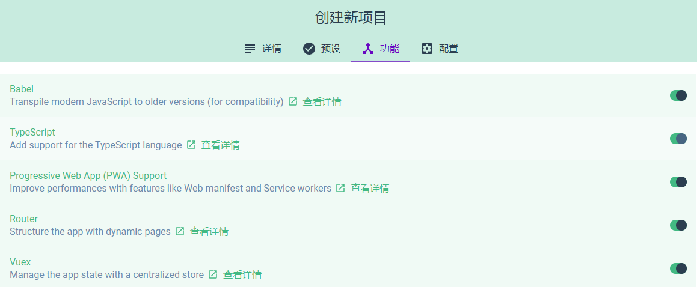
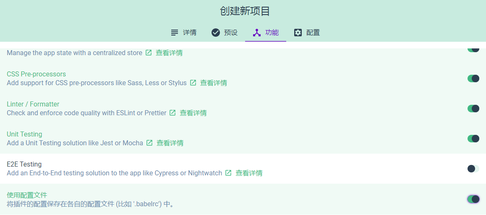
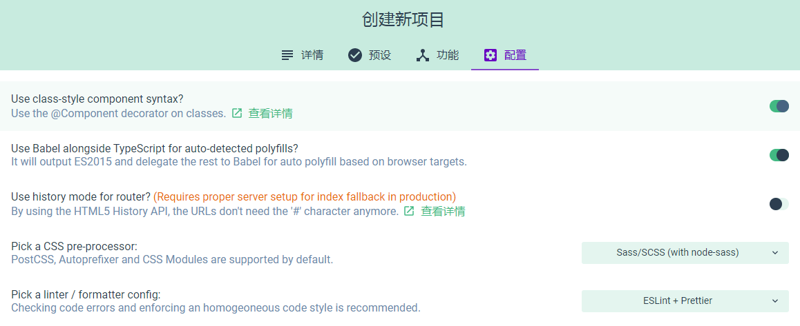
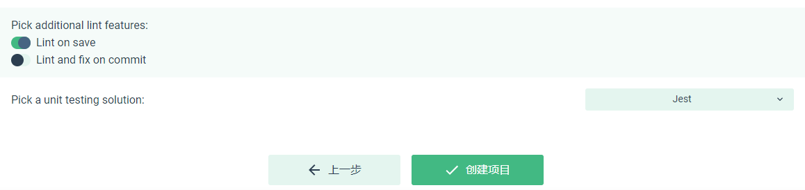

## TypeScript 与 Vue

### 安装 Vue Cli

这里为了快速初始化项目，首选 Vue 官网的 Cli

全局安装：

```ts
npm install -g @vue/cli
```

安装后查看版本：

```ts
vue -V
```

### 创建项目

命令行或图形化初始化项目：

```ts
// 命令行
vue create demo-vue

// 图形化
vue ui
```

下面是图形化的配置：













### 引入第三方库

一般在开发项目中，会用到内部或第三方组件库来完成开发

这里引入移动端 UI 库 Vant：

```ts
npm i vant -S
```

全组件库引入：

```ts
// src/main.ts
import Vant from 'vant';
import 'vant/lib/index.css';
Vue.use(Vant);
```

然而我们一般不会这样做，这会导致所有的代码都会打包进来，十分影响打包体积与性能。我们更多的是按需引入，如引入 Button：

```ts
import { Button } from 'vant';
import 'vant/lib/button/style';
Vue.use(Button);
```

当然，这样的编写方式可能比较繁琐，每次使用新的组件都需要这样手动引入样式

JavaScript 中可以利用 babel-plugin-import 插件自动帮我们按需引入

TypeScript 中可以利用 ts-import-plugin 插件帮助我们按需引入：

```ts
npm i -D ts-import-plugin
```

根目录下 vue.config.js：

```js
const merge = require("webpack-merge");
const tsImportPluginFactory = require("ts-import-plugin");

module.exports = {
    lintOnSave: true,
    chainWebpack: config => {
        config.module
        .rule("ts")
        .use("ts-loader")
        .tap(options => {
            options = merge(options, {
            transpileOnly: true,
            getCustomTransformers: () => ({
                before: [
                    tsImportPluginFactory({
                        libraryName: "vant",
                        libraryDirectory: "es",
                        style: true
                    })
                ]
            }),
            compilerOptions: {
                module: "es2015"
            }
            });
            return options;
        });
    }
};
```

使用如下，不需要再次引入样式：

```js
// src/main.ts
import { Button } from 'vant';
Vue.use(Button);
```

```html
// src/App.vue
<van-button type="default">默认按钮</van-button>
```

随后执行 **npm run serve** 启动项目即可

### vue-property-decorator

与 JavaScript 版的 vue 最大的不同在于引入了 **vue-property-decorator**

由于它的存在，我们可以使用基于类的注解装饰器进行开发，这是目前 ts + vue 的主流

除了vue-property-decorator 外，还有另一个库 **vue-class-component**，它是官方推出的一个支持使用 class 方式开发 vue 单文件组件的库

而 vue-property-decorator 正是基于此基础增加了装饰器功能，它同时拥有 vue-class-component 的功能

#### 主要功能

vue-class-component 功能：

- methods 可以直接声明为类的成员方法

- computed 计算属性可以被声明为类的属性访问器（getter、setter）

- 初始化的 data 可以被声明为类属性

- data、render 及所有 Vue 生命周期钩子可以作为类成员方法

- 所有其他属性，需要放在装饰器中


vue-property-decorator 主要提供多个装饰器和一个函数：

- @Prop

- @PropSync

- @Model

- @Watch

- @Provide

- @Inject

- @ProvideReactive

- @InjectReactive

- @Emit

- @Ref

- @Component (由 vue-class-component 提供)

- Mixins (由 vue-class-component 提供)

### vue-class-component 主要功能

#### @Component

Component 装饰器注明了此类为一个 Vue 组件，即使没有设置选项也不能省略

如果定义了如 name、components、filters、directives 及自定义属性，可以在 Component 装饰器中定义

示例：

```ts
// JavaScript 中
import { componentA, componentB } from '@/components';

export default{
    components: {
        componentA,
        componentB,
    },
    directives: {
        focus: {
            // 指令的定义
            inserted: function (el) {
                el.focus()
            }
        }
    }
}

// TypeScript 中
import { Component, Vue } from 'vue-property-decorator';
import { componentA, componentB } from '@/components';

@Component({
    components: {
        componentA,
        componentB,
    },
    directives: {
        focus: {
            // 指令的定义
            inserted: function (el) {
                el.focus()
            }
        }
    }
})
export default class YourCompoent extends Vue{

}
```

#### Computed、Data、Methods

```html
// <template>
<p>{{count}}</p>
<p>{{total}}</p>
<van-button type="default" @click="add">+</van-button>
```

```ts
// <script lang="ts">
import { Component, Vue } from 'vue-property-decorator';

@Component
export default class HelloWorld extends Vue {
    count: number = 123; // data
    add(): void { // methods
        this.count += 1;
    }

    get total() { // computed
        return this.count + 10;
    }

    set total(v: number) { // computed
        this.count = v;
    }
}
```

### vue-property-decorator 主要 API

#### @Prop

属性相关的修饰器，@Prop(options: (PropOptions | Constructor[] | Constructor) = {})

如果我们打开了 tsconfig.json 的 strictpropertyinitialize，则需要通过附加 ! 给定义的属性来赋值断言

示例：

```ts
// JavaScript 中
export default{
    props: {
        propA: String,
        propB: [String,Number],
        propC: {
            type: Array,
            default: () => ['a','b'], // 数组与对象需要以函数返回
            required: true,
            validator: value => value.indexOf('a') !== -1,
        }   
    }
}

// TypeScript 中
import { Component, Prop, Vue } from 'vue-property-decorator';

@Component
export default class HelloWorld extends Vue {
    @Prop(String)
    propA!: string;

    @Prop([String, Number])
    propB!: string | number;

    @Prop({
        type: Array,
        default: () => ['a', 'b'],
        required: true,
        validator: value => value.indexOf('a') !== -1,
    })
    propC!: Array<string>;
}
```

#### @Watch

Vue 中的监听器

示例：

```ts
// JavaScript 中
export default {
    watch: {
        child: [
            {
                handler: 'onChildChanged',
                immediate: false,
                deep: false,
            }
        ],
        person: [
            {
                handler: 'onPersonChanged1',
                immediate: true,
                deep: true,
            },
            {
                handler: 'onPersonChanged2',
                immediate: false,
                deep: false,
            }
        ]
    },
    methods: {
        onChildChanged(val, oldVal) {},
        onPersonChanged1(val, oldVal) {},
        onPersonChanged2(val, oldVal) {}
    }
}

// TypeScript 中
import { Component, Watch, Vue } from 'vue-property-decorator';

interface Person {
    id: number;
    name: string;
    children?: Person[];
}

@Component
export default class HelloWorld extends Vue {
    @Watch('child')
    onChildChanged(val: string, oldVal: string) {}

    @Watch('person', { immediate: true, deep: true })
    onPersonChange1(val: Person, oldVal: Person) {};

    @Watch('person')
    onPersonChange2(val: Person, oldVal: Person) {};
}
```

#### @Emit

Vue 中事件的监听与触发，提供了 $on 与 $emit

在 vue-property-decorator 需要使用 @Emit 装饰器

示例：

```ts
// JavaScript 中
export default {
    mounted(){
        this.$on('emit-todo', function(n) {
            console.log(n);
        })
        this.emitTodo('world');
    },
    methods: {
        emitTodo(n){
            console.log('hello');
            this.$emit('emit-todo', n);
        }
    }
}

// TypeScript 中
import { Component, Emit, Vue } from "vue-property-decorator";

@Component
export default class HelloWorld extends Vue {
    mounted() {
        this.$on('emit-todo', function(n: string) {
            console.log(n);
        });
        this.emitTodo('v');
    }
    @Emit()
    emitTodo(n: string) {}
}
```

当调用被 @Emit 修饰的函数时，将会触发 emit 事件，被触发事件名为函数名（驼峰会转横杠写法），如上 调用 emitTodo，就会 this.$emit 触发 'emit-todo' 的事件

还有一种是在 @Emit 中设置事件名，如上可以改为：

```ts
mounted() {
    this.$on('emit-todo', function(n: string) {
        console.log(n);
    });
    this.todo('v');
}
@Emit('emit-todo')
todo(n: string) {}
```

小节，两种 @Emit 用法：

- @Emit() 不传参数,那么它触发的事件名就是它所修饰的函数名

- @Emit(name: string) 里面传递一个字符串,该字符串为要触发的事件名

#### @Model

Vue 提供了 model: {prop?: string, event?: string} 定制 prop 与 event

默认情况下，使用 v-model 时，会将 value 作为 prop，input 事件作为 event

model: {prop?: string, event?: string} 一般用于其他如单选框来达到不同的效果

示例：

```html
// src/HelloWorld.vue
<template>
    <input type="checkbox" :checked="checked" @change="$emit('change', $event.target.checked)">
</template>
```

```ts
<script>
    export default {
        name: 'HelloWorld',
        model: {
            prop: 'checked',
            event: 'change',
        },
        props: {
            checked: {
                type: Boolean,
                default: false,
            }
        },
    }
</script>
```

在模板中使用：

```html
// src/App.vue
<template>
    <hello-world v-model="selected" />
    Selected Status: {{ selected }}
</template>
```

```ts
<script>
    export default {
        data() {
            return {
                selected: false,
            }
        }
    }
</script>
```

此模板相当于：

```html
<hello-world :checked="selected" @change="v => selected = v" />
```

在 TypeScript 版的 vue-property-decorator 上使用等同于：

```html
<template>
    <input type="checkbox" :checked="checked" @change="$emit('change', $event.target.checked)">
</template>
```

```ts
<script lang="ts">
    import { Component, Model, Vue } from "vue-property-decorator";

    @Component
    export default class HelloWorld extends Vue {
        @Model('change', { type: Boolean })
        checked!: boolean;
    }
</script>
```

@Model() 接收两个参数, 第一个是 event 值, 第二个是prop 的类型说明

### Vuex

TypeScript 下的 Vuex 往往要与 vuex-class 配合，它提供了多个装饰器

```ts
npm install vuex --save
npm i vuex-class -S
```

基本使用：

```ts
// src/store/index.ts
import Vue from 'vue';
import Vuex from 'vuex';

Vue.use(Vuex);

export default new Vuex.Store({
    state: {
        count: 100,
    },
    mutations: {
    },
    actions: {
    },
    modules: {
    },
});

// src/main.ts
import store from './store'

new Vue({
    store,
    ...
}).$mount('#app')
```

```html
// src/App.vue
<template>
    <div>
        {{$store.state.count}}
    </div>
</template>
```

#### State

```ts
// src/store/state.ts
export interface ITodo {
    id: number;
    name: string;
    isDone: boolean;
}

export interface State {
    todoList: Array<ITodo>;
}

export const state: State = {
    todoList: [],
}
```

```html
// src/HelloWorld.vue
<template>
    <div>
        <p>todoList: {{todoList}}</p>
    </div>
</template>
```

```ts
<script lang="ts">
    import { Component, Vue } from "vue-property-decorator";
    import { State } from 'vuex-class';
    import { ITodo } from '../store/state';

    @Component
    export default class HelloWorld extends Vue {
        /** 可以有如下几种写法 **/
        @State private todoList!: ITodo[];
        // @State('todoList') private todos!: ITodo[];
        // @State(state => state.todoList) private todos!: ITodo[];
    }
</script>
```

#### Mutations

```ts
// src/store/mutations.ts
import { MutationTree } from 'vuex';
import { State, ITodo } from './state';

export const mutations: MutationTree<State> = {
    createTodo(state, todo: ITodo) {
        state.todoList.push(todo);
    }
}
```

使用：

```html
// src/HelloWorld.vue
<template>
    <div>
        <p>todoList: {{todoList}}</p>
        <van-button type="primary" @click="createTodoHandler">add todo</van-button>
    </div>
</template>
```

```ts
<script lang="ts">
    import { Component, Vue } from "vue-property-decorator";
    import { State, Mutation } from 'vuex-class';
    import { ITodo } from '../store/state';

    @Component
    export default class HelloWorld extends Vue {
        @State private todoList!: ITodo[];

        /** 可以有如下几种写法，getters 与 actions 相似 **/
        @Mutation private createTodo!: (todo: ITodo) => void;
        // @Mutation('createTodo') private create!: (todo: ITodo) => void;

        private createTodoHandler() {
            this.createTodo({
                id: Date.now(),
                name: 'new task',
                isDone: false,
            });
        }
    }
</script>
```

#### Getters

getter 的泛型还需要传递一个 rootState，这是在后面使用到 modules 时需要用到的 state，即根状态

在没有使用 modules 时，即现在使用的一直是根 state:

```ts
// src/store/index.ts
import { State } from './state';
export type RootState = State;

// src/store/getters.ts
import { GetterTree } from 'vuex';
import { State } from './state';
import { RootState } from '.';

export const getters: GetterTree<State, RootState> = {
    todoCount(state): number {
        return state.todoList.length;
    }
}
```

```html
// src/HelloWorld.vue
<template>
    <div>
        <p>todoCount: {{todoCount}}</p>
    </div>
</template>
```

```ts
<script lang="ts">
    import { Component, Vue } from "vue-property-decorator";
    import { Getter } from 'vuex-class';

    @Component
    export default class HelloWorld extends Vue {
        @Getter private todoCount!: number;
    }
</script>
```

#### Actions

```ts
// src/store/actions.ts
import { ActionTree, Commit, ActionContext } from 'vuex';
import { ITodo, State } from './state';
import { RootState } from './index';

export const actions: ActionTree<State, RootState> = {
    doubleCreate(context: ActionContext<State, RootState>, todo: ITodo) {
        for(let i = 0; i < 2; i++) {
            context.commit('createTodo', todo);
        }
    }
}
```

```html
// src/HelloWorld.vue
<template>
    <div>
        <p>todoList: {{todos}}</p>
        <van-button type="primary" @click="createTodoHandler">add todo</van-button>
    </div>
</template>
```

```ts
<script lang="ts">
    import { Component, Vue } from "vue-property-decorator";
    import { State, Action } from 'vuex-class';

    @Component
    export default class HelloWorld extends Vue {
        @State(state => state.todoList) private todos!: ITodo[];
        @Action('doubleCreate') private doubleCreate!: (todo: ITodo) => void;

        private createTodoHandler() {
            this.doubleCreate({
                id: Date.now(),
                name: 'new task',
                isDone: false,
            });
        }
    }
</script>
```

#### modules

Vuex 里还有 module 的概念

当有多种全局 State 时，我们不可能全部放到根 State 下，这样会导致 State 逻辑不解耦

例如有用户信息与购物车的相关 State，更好的做法应该是区分开，而不是混合在一起，这时就需要用到 module

下面建立一个 cart module：

```ts
// src/store/cart/index.ts
import { MutationTree, ActionTree, Commit, ActionContext, GetterTree } from 'vuex';
import { RootState } from '../../index';

export interface IFood {
    id: number;
    name: string;
    price: number;
}

export interface State {
    foodList: Array<IFood>;
}

const state: State = {
    foodList: [{
        id: 1,
        name: 'apple',
        price: 3,
    }]
}

const mutations: MutationTree<State> = {
    addFood(state, food: IFood) {
        state.foodList.push(food);
    }
}

const actions: ActionTree<State, RootState> = {
    doubleAdd(context: ActionContext<State, RootState>, food: IFood) {
        for(let i = 0; i < 2; i++) {
            context.commit('addFood', food);
        }
    }
}

const getters: GetterTree<State, RootState> = {
    foodCount(state): number {
        console.log(state);
        return state.foodList.length;
    }
}

export default {
    state,
    mutations,
    actions,
    getters,
}

// src/store/index.ts
import Vue from 'vue';
import Vuex from 'vuex';
import { mutations } from './mutations';
import { state, State } from './state';
import { getters } from './getters';
import { actions } from './actions';
import cart from './modules/cart';

Vue.use(Vuex);

export type RootState = State;

export default new Vuex.Store({
    state,
    mutations,
    getters,
    actions,
    modules: {
        cart,
    },
})
```

```html
// src/HelloWorld.vue
<template>
    <div>
        <p>Foods: {{foods}}</p>
        <p>FoodCount: {{foodCount}}</p>
        <van-button type="primary" @click="addFoodHandler">add food</van-button>
    </div>
</template>
```

```ts
<script lang="ts">
    import { Component, Vue } from "vue-property-decorator";
    import { State, Mutation, Action, Getter } from 'vuex-class';

    @Component
    export default class HelloWorld extends Vue {
        @State(state => state.cart.foodList) private foods!: IFood[];
        @Mutation('addFood') private addF!: (food: IFood) => void;
        @Action('doubleAdd') private doubleA!: (food: IFood) => void;
        @Getter('foodCount') private foodCount!: number;
        
        private addFoodHandler() {
            this.addF({
                id: Date.now(),
                name: 'banana',
                price: 10,
            })
            /* this.doubleA({
                id: Date.now(),
                name: 'banana',
                price: 10,
            }) */
        }
    }
</script>
```

值得注意的是，现在 **State 是局部的**，只属于模块本身，需要使用 state.moduleName.XX 来访问

但是 **mutations、action、getter 是全局的**，多个模块能够对同一 mutation 或 action 作出相应

也就说 Store 根 action 在 commit 时，可以调用如 cart module 的 mutation

那由于 State 是局部的，我们要**如何在 cart module 里获取根 State**：

- getter 中可以利用第三个参数来获取 rootState

- action 的 context 对象包含了 rootState

```ts
// src/store/cart/index.ts
const actions: ActionTree<State, RootState> = {
    doubleAdd(context: ActionContext<State, RootState>, food: IFood) {
        console.log(context.rootState);
        
        for(let i = 0; i < 2; i++) {
            context.commit('addFood', food);
        }
    }
}

const getters: GetterTree<State, RootState> = {
    foodCount(state, getters, rootState): number {
        console.log(rootState);
        
        return state.foodList.length;
    }
}

```

#### 命名空间

前面可以知道 mutations、action、getter 默认是注册全局命名空间的，如果希望它只在当前 module 生效，可以添加 **namespaced: true** 使其成为带命名空间的模块:

```ts
// src/store/cart/index.ts
import { MutationTree, ActionTree, Commit, ActionContext, GetterTree } from 'vuex';
import { RootState } from '../../index';

export interface IFood {
    id: number;
    name: string;
    price: number;
}

export interface State {
    foodList: Array<IFood>;
}

const state: State = {
    foodList: [{
        id: 1,
        name: 'apple',
        price: 3,
    }]
}

const mutations: MutationTree<State> = {
    addFood(state, food: IFood) {
        state.foodList.push(food);
    }
}

const actions: ActionTree<State, RootState> = {
    doubleAdd(context: ActionContext<State, RootState>, food: IFood) {
        console.log(context.rootState);
        
        for(let i = 0; i < 2; i++) {
            context.commit('addFood', food);
        }
    }
}

const getters: GetterTree<State, RootState> = {
    foodCount(state, getters, rootState): number {
        console.log(rootState);
        
        return state.foodList.length;
    }
}

export default {
    namespaced: true,
    state,
    mutations,
    actions,
    getters,
}
```

```html
// src/HelloWorld.vue
<template>
    <div>
        <p>Foods: {{foods}}</p>
        <p>FoodCount: {{foodCount}}</p>
        <van-button type="primary" @click="addFoodHandler">add food</van-button>
    </div>
</template>
```

```ts
<script lang="ts">
    import { Component, Vue } from "vue-property-decorator";
    import { State, Mutation, Action, Getter } from 'vuex-class';

    @Component
    export default class HelloWorld extends Vue {
        @State(state => state.cart.foodList) private foods!: IFood[];
        @Mutation('cart/addFood') private addF!: (food: IFood) => void;
        @Action('cart/doubleAdd') private doubleA!: (food: IFood) => void;
        @Getter('cart/foodCount') private foodCount!: number;
        
        private addFoodHandler() {
            this.addF({
                id: Date.now(),
                name: 'banana',
                price: 10,
            })
            /* this.doubleA({
                id: Date.now(),
                name: 'banana',
                price: 10,
            }) */
        }
    }
</script>
```

使用 namespaced 修饰的 module 后 mutations、action、getter 将作用于当前模块内，修饰器中需要使用 **moduleName/XXX** 的形式来获取

那么**如何在带命名空间的模块内访问全局内容**：

- rootState（前面提过）与 rootGetter 会作为第 3、4 个参数作用于 getters

- rootState 与 rootGetter 同样存在于 action 的 context 对象中

```ts
// src/store/cart/index.ts
const actions: ActionTree<State, RootState> = {
    doubleAdd(context: ActionContext<State, RootState>, food: IFood) {
        console.log(context.state, context.getters, context.rootState, context.rootGetters);
        
        for(let i = 0; i < 2; i++) {
            context.commit('addFood', food);
        }
    }
}

const getters: GetterTree<State, RootState> = {
    foodCount(state, getters, rootState, rootGetters): number {
        console.log(state, getters, rootState, rootGetters);
        
        return state.foodList.length;
    }
}
```

假如我们想要**在全局命名空间内分发 action 或提交 mutation** 的话，如在 cart module 的 action 中 context.commit 根 mutation 的 createTodo，那么我们可以将 { root: true } 作为第三个参数传给 dispatch 或 commit 即可：

```ts
// src/store/cart/index.ts
const actions: ActionTree<State, RootState> = {
    doubleAdd(context: ActionContext<State, RootState>, food: IFood) {
        console.log(context.state, context.getters, context.rootState, context.rootGetters);
        
        for(let i = 0; i < 2; i++) {
            context.commit('createTodo', food, { root: true });
        }
    }
}
```

接着**如何在带命名空间的模块内注册全局 action？**

在 action 中添加 **root: true** 即可：

```ts
// src/store/cart/index.ts
const actions: ActionTree<State, RootState> = {
    doubleAdd: {
        root: true,
        handler(context: ActionContext<State, RootState>, food: IFood) {
            console.log(context.getters, context.rootGetters);
            for(let i = 0; i < 2; i++) {
                context.commit('addFood', food);
            }
        }
    }
}

这时 action 将变成全局下的，需要将装饰器参数从 cart/doubleAdd 变为 doubleAdd：

// src/HelloWorld.vue
<script lang="ts">
    import { Component, Vue } from "vue-property-decorator";
    import { State, Mutation, Action, Getter } from 'vuex-class';

    @Component
    export default class HelloWorld extends Vue {
        @Action('cart/doubleAdd') private doubleA!: (food: IFood) => void;

        ...
    }
</script>
```
