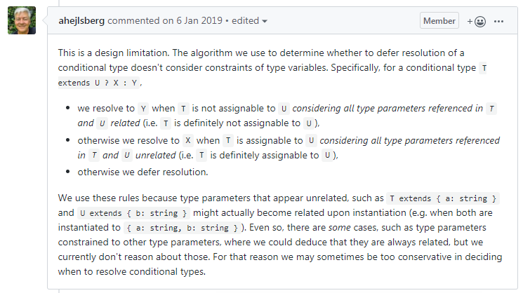

## 来源

学习自掘金文章 [TS 常见问题整理](https://juejin.im/post/5e33fcd06fb9a02fc767c427#heading-32)

## 常规问题

### 如何对 JS 文件进行类型检查

- tsconfig.json 中设置 **checkJs:true**，对 .js 文件进行类型检查和错误提示

- .js 文件顶部添加 **// @ts-nocheck** 注释，让编译器忽略当前文件检查

- .js 文件顶部添加 **// @ts-check** 注释，让编译器检查当前文件

- tsconfig.json 配置 **include/exclude**，选择/排除对某些文件进行类型检查 

- **// @ts-ignore** 忽略本行的错误

- .js 文件类型可以和在 .ts 文件里一样被推断，当不能被推断时，可以通过 [JSDoc](https://jsdoc.zcopy.site/) 指定类型

```ts
/** @type {number} */
var x;

x = 0;      // OK
x = false;  // Error: boolean is not assignable to number
```

### 如何在解构函数 function fn({ x: number }) { /* ... */ } 时，既能给变量声明类型，又能给变量设置默认值

```ts
// Error
function fn({x: number}) {
    console.log(x);
}

// ok
function fn({x}: {x: number} = {x: 0}) {
    console.log(x);
}
```

### 无法使用 for of 遍历 map 数据

```ts
const map = new Map([
    ['F', 'no'],
    ['T', 'yes'],
]);
for (let key of map.keys()) {
    console.log(key);
}
```

设置 target: es6 时可以正常执行

设置 target: es5 时将报错：

Type 'IterableIterator\<string>' is not an array type or a string type. Use compiler option '--downlevelIteration' to allow iterating of iterators

需要配置 **dom.iterable、 downlevelIteration**：

```ts
{
    /*当目标是ES5或ES3的时候提供对for-of、扩展运算符和解构赋值中对于迭代器的完整支持*/
    "downlevelIteration": true,
    "lib": [
        "dom",
        "es5",
        "es6",
        "es7",
        "dom.iterable"
    ]
}
```

如何未指定 lib，则会注入默认的库列表：

- target ES5: DOM,ES5,ScriptHost

- target ES6: DOM,ES6,DOM.Iterable,ScriptHost

### 为什么在 exclude 列表里的模块还会被编译器使用

- 优先级 **files > exclude > include**，可能在 files 中有包含

- 这个文件可能被 import 导入或三斜杠指令引入

### 泛型与条件类型 extends 的保守推导问题

**示例一：**

```ts
interface IUser {
    id: number;
}
function ep<S extends IUser>() {
    let v: S extends IUser ? true : false;
    v = true; // Error
    v = false; // Error
}
```

我们发现不管我们将 v 赋值给 true 还是 false，都会报错

但是我们很明确的知道，S extends IUser 是成立的，因为我们在泛型函数上就是这样定义的

查看 v 的类型可以看到，v 的推导结果是：

```ts
let v: S extends IUser ? true : false
```

而不是：

```ts
let v: true
或
let v: false
```

**示例二：**

```ts
interface IUser {
    id: string;
    name: string;
}

function create<P extends IUser>(t: IUser, o: Omit<P, keyof IUser>) {
    let assign = {
        ...t,
        ...o,
    };

    let p: P = assign; // Error
}
```

泛型 P 是个对象，带有 id 和 name 属性

参数 t 是 IUser 类型，带有 id、name

参数 o 是 P 对象 剔除掉 id、name 属性后的结果

我们很容易看出 assign 通过 t 与 o 合并，结果应该就是 P 类型，但是当赋值给 P 类型的变量时却报错了

**解析：**

根据该 [Ts Issues](https://github.com/microsoft/TypeScript/issues/29225) 下方 TypeScript 作者回答：



可以知道 TypeScript 目前对约束的一些**类型推理是比较保守**的

**我们人脑可以清楚的知道类型结果，类型推导可能并不行**

**解决：**

可以自己用类型断言帮助 TypeScript 了解到类型结果，如上例可以改为：

```ts
function create<P extends IUser>(t: IUser, o: Omit<P, keyof IUser>) {
    let assign = {
        ...t,
        ...o,
    };

    let p: P = assign as P;
}
```

## tsconfig.json 问题

### "esModuleInterop" 具体作用是什么

如果一个模块遵循 ES6 模块规范，当默认导出（export default XXX），ES6 模块系统会自动给当前模块的顶层对象加上 default 属性，指定导出内容

当一个 ES6 模块引入该模块（import moduleName from 'XXX'），ES6 模块系统**默认**自动去该模块中顶层对象上**查找 default** 属性并将值赋值给 moduleName

当一个非 ES6 规范的模块引入 ES6 模块直接使用时（var moduleName = require('XXX')），就会报错，需要通过 moduleName.default 来使用

TypeScript 为了兼容，引入 **esModuleInterop** 配置，当设为 true 时，在编译时自动给该模块添加 **default** 属性，就可以通过 **import moduleName from 'XXX'** 的形式导入非 ES6 模块，不再需要使用  import moduleName = require('XXX') 的形式

### "allowSyntheticDefaultImports" 具体作用是什么

允许 默认导入 没有设置默认导出（export default XXX）的模块，可以以 import XXX from 'XXX' 的形式来引入模块

```ts
// 配置前
import * as React from 'react';
import * as ReactDOM from 'react-dom';

// 配置后
import React from 'react';
import ReactDOM from 'react-dom';
```

### "paths" 配置路径映射集合时，需要注意的问题

```ts
{
    "paths": {
        // 这里的路径后面必须跟着 "/*"
        "@public/*": [
            // 这里的路径后面必须跟着 "/*"
            "public/*"
        ],
        "@src/*": [
            "src/*"
        ],
        "@assets/*":[
            "src/assets/*"
        ],
        "@components/*": [
            "src/components/*"
        ]
    }
}
```

## React + TS 常见问题

### import 引入非 JS 模块会报错

```ts
import img from './assets/imgs/logo.png'; // Error
```

解决：

定义一个声明文件

```ts
// types/index.ts
declare module '*.svg'
declare module '*.png'
declare module '*.jpg'
declare module '*.jpeg'
declare module '*.gif'
declare module '*.bmp'
```

### import * as React from 'react' 和 import React from 'react' 

第一种写法是将所有用 export 导出的成员赋值给 React ，导入后用 React.xxx 访问

第二种写法仅是将默认导出（export default）的内容赋值给 React

### 使用 webpack 的 module.hot 会警告没有类型定义

```ts
npm install --save @types/webpack-env

// src/index.tsx
if (process.env.NODE_ENV !== 'production') {
    if (module.hot) {
        module.hot.accept('./reducers', () => store.replaceReducer(rootReducer));
    }
}
```

