## 学习来源

整理自掘金文章 [24 个实例入门并掌握「Webpack4」](https://juejin.im/post/5cae0f616fb9a068a93f0613)

## webpack基本搭建与打包

### 环境

下载并安装[node环境](https://nodejs.org/zh-cn/)，会自动装上npm

可以在电脑cmd中输入**npm -v**查看npm版本

 

### 初始化package.json配置文件
    
```text
新建一个空文件夹，进入后运行以下命令初始化一个package.json文件：
npm init

输入后控制台会有一系列配置提问，一般一路回车就行，或者直接输入：
npm init -y直接生成
```
    
 

```text
再执行npm i webpack webpack-cli --save-dev安装webpack4
安装后package.json会出现devDependencies的配置项
在scripts处加上build命令来运行webpack

运行npm run build
```

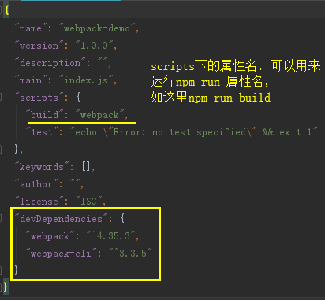

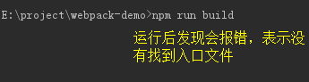

```text
webpack4默认会以src下的index.js作为入口，我们在项目下新建src/index.js后再重新执行npm run build
```
    
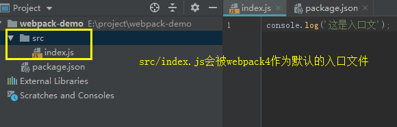

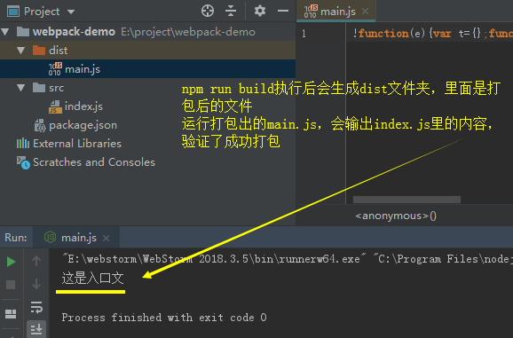

> 安装后可以看到版本号为 ^4.35.3，^ 的意思的会匹配这个库 4.x.x 里最新的，不会到 5.x.x；此外，还有 ~4.35.3，表示会更新到 4.35.x 最新的一版

## 开发模式、生产模式

在项目开发中，通常至少需要2个webpack.config的配置文件

- 开发环境配置文件：热更新、跨域代理、本地服务器等

- 生产环境配置文件：代码拆分、压缩JS等

在webpack4中，我们可以在没有配置文件的情况下实现不同模式**最基本**的打包

```text
1、补充package.json的scripts
```
    
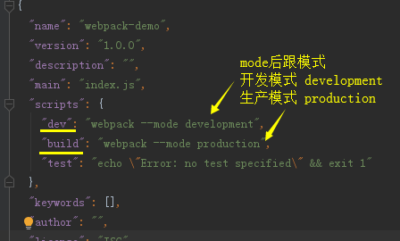

```text
2、执行npm run dev
```
    
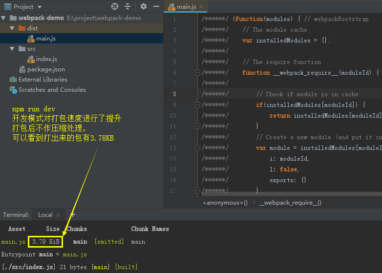 

```text
3、执行npm run build
```

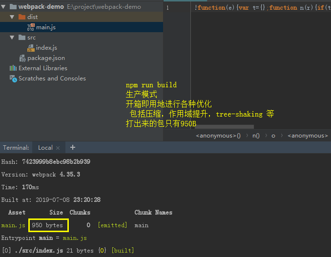 

## webpack支持的规范

webpack 支持 ES6, CommonJS, AMD 规范

```js
创建vendor文件夹，新建es6.js、commonJS.js、amd.js

// 1、es6.js
export default function(a, b) {
    return a + b
}

// 2、commonJS.js
module.exports = function(a, b) {
    return a - b
}

// 3、amd.js
define(function(require, factory) {
    'use strict'
    return function(a, b) {
        return a * b
    }
})

// 4、index.js
    // ES6
import sum from '../vendor/es6'
console.log('sum(1, 2) = ', sum(1, 2))

    // CommonJS
const minus = require('../vendor/commonJS')
console.log('minus(1, 2) = ', minus(1, 2))

    // AMD
require(['../vendor/amd'], function(multi) {
    console.log('multi(1, 2) = ', multi(1, 2))
})

// 5、运行npm run build
打包后出现2个js文件(使用AMD引入方式的原因，如果去除AMD引入，只会有一个main.js，且可以直接运行，有AMD方式需要在html中引入)
```
    
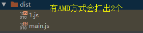
 
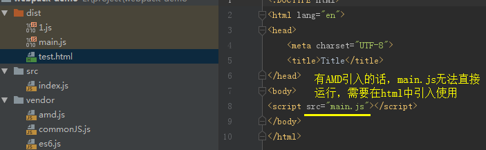

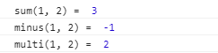
    

## 入口entry、输出output

webpack默认配置文件是根目录下的webpack.config.js，可以在配置文件中修改默认入口、输出

```js
// 在根目录下新建webpack.config.js
const path = require('path')

console.log('__dirname: ', __dirname)
console.log('path.resolve: ', path.resolve(__dirname, 'dist'))

module.exports = {
    entry: {
        app: './app.js' // 需要打包的文件入口
    },
    output: {
        publicPath: __dirname + '/dist/', // js 引用的路径或者 CDN 地址
        path: path.resolve(__dirname, 'dist'), // 打包文件的输出目录
        filename: 'bundle.js' // 打包后生产的 js 文件
    }
}

    注：
    path.resolve() 方法会把一个路径或路径片段的序列解析为一个绝对路径
    __dirname: 当前模块的文件夹名称
```

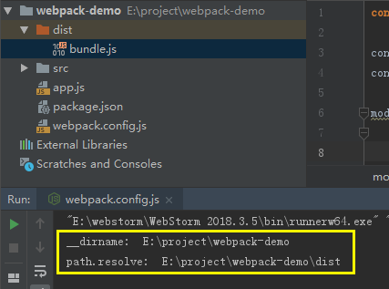


### 多入口

上面我们演示的是单入口，webpack允许我们使用有多个入口
    
```js
// webpack.config.js
const path = require('path')
    
console.log('__dirname: ', __dirname)
console.log('path.resolve: ', path.resolve(__dirname, 'dist'))

module.exports = {
    entry: {
        a: './src/a.js', // 1、入口a
        b: './src/b.js', // 2、入口b
    },
    output: {
        publicPath: __dirname + '/dist/',
        path: path.resolve(__dirname, 'dist'),
        filename: '[name].bundle.js' // 3、打包后的文件用name命名
}

// a.js
console.log('a');

// b.js
console.log('b');
```
    
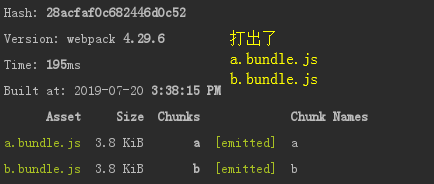

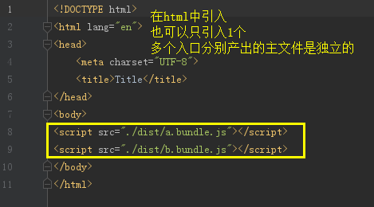
    

## 清理文件clean-webpack-plugin

每次打包时，应该先清理原来的dist文件夹，否则打出不同文件名的文件，会都堆积在dist文件夹中

```js
// 1、执行 npm install clean-webpack-plugin --save-dev
    
// 2、配置webpack.config.js，这样每次npm run build，都会清除dist文件夹里的文件
const path = require('path')
const { CleanWebpackPlugin } = require('clean-webpack-plugin')

module.exports = {
    entry: {
        app: './app.js' // 需要打包的文件入口
    },
    output: {
        publicPath: __dirname + '/dist/', // js 引用的路径或者 CDN 地址
        path: path.resolve(__dirname, 'dist'), // 打包文件的输出目录
        filename: 'bundle.js' // 打包后生产的 js 文件
    },
    plugins: [
        new CleanWebpackPlugin() // 默认情况下，此插件将删除 webpack output.path目录中的所有文件，以及每次成功重建后所有未使用的 webpack 资产，也可以new CleanWebpackPlugin(['dist'])
    ]
}
```
