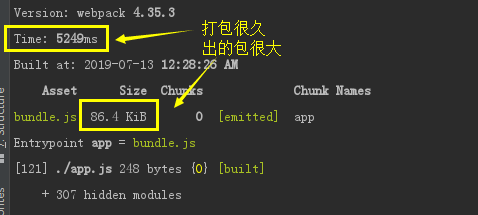

## Babel7转译ES6

### 了解Babel

现代 Javascript 主要是用 ES6 编写的。但并非每个浏览器都知道如何处理 ES6。 我们需要某种转换，这个转换步骤称为 transpiling(转译)。transpiling(转译) 是指采用 ES6 语法，转译为旧浏览器可以理解的行为

Webpack并不知道如何转换，但是可以使用loader

**babel-loader**是一个webpack的loader，用于将ES6及以上版本转化ES5

使用需要安装一些依赖项，以Babel7为主

- @babel/core: 核心库
- @babel/preset-env: 包含 ES6、7 等版本的语法转化规则
- @babel/plugin-transform-runtime: 避免 polyfill 污染全局变量，减小打包体积
- @babel/polyfill: ES6 内置方法和函数转化垫片
- babel-loader: 负责 ES6 语法转化

> 要安装@babel/core、@babel/preset-env 和 @babel/plugin-transform-runtime，而不是 babel-core、babel-preset-env 和 babel-plugin-transform-runtime，这些是babel6的


> @babel/plugin-transform-runtime 的作用：Babel 使用非常小的助手来完成常见功能。默认情况下，这将添加到需要它的每个文件中。这种重复有时是不必要的，尤其是当你的应用程序分布在多个文件上的时候。 transform-runtime 可以重复使用 Babel 注入的程序代码来节省代码，减小体积


> @babel/polyfill 的作用：Babel 默认只转换新的 JavaScript 句法（syntax），而不转换新的 API，比如 Iterator、Generator、Set、Maps、Proxy、Reflect、Symbol、Promise 等全局对象，以及一些定义在全局对象上的方法（比如 Object.assign）都不会转码。必须使用 @babel/polyfill，为当前环境提供一个垫片。所谓垫片也就是垫平不同浏览器或者不同环境下的差异
     

### 安装依赖与配置
    
```js
// 1、安装依赖
npm i @babel/core babel-loader @babel/preset-env @babel/plugin-transform-runtime --save-dev
npm i @babel/polyfill @babel/runtime

// 2、根目录新建.babelrc文件配置Babel
{
    "presets": ["@babel/preset-env"],
    "plugins": ["@babel/plugin-transform-runtime"]
}

注：如果遇到错误
WARNING: We noticed you're using the `useBuiltIns` option without declaring a core-js version. Currently, we assume version 2.x when no version is passed. Since this default version will likely change in future versions of Babel, we recommend explicitly setting the core-js version you are using via the `corejs` option. 
    
You should also be sure that the version you pass to the `corejs` option matches the version specified in your `package.json`'s `dependencies` section. If it doesn't, you need to run one of the following commands: 
    
    npm install --save core-js@2    npm install --save core-js@3 
    yarn add core-js@2              yarn add core-js@3
    
则修改安装npm install --save core-js@3，并配置：
{
    "presets": [
    [
        "@babel/preset-env",
        {
        "corejs": 3
        }
    ]
    ],
    "plugins": ["@babel/plugin-transform-runtime"]
}

// 3、webpack配置loader
module: {
    rules: [
    {
        test: /\.js$/, // 使用正则来匹配 js 文件
        exclude: /node_modules/, // 排除依赖包文件夹
        use: {
        loader: 'babel-loader', // 使用 babel-loader
        }
    }
    ]
}
```
    


```js
// 4、app.js 全局引入@babel/polyfill，使用ES6语法，npm run build打包
import '@babel/polyfill'

// ES6 扩展运算符...
console.log(...[1, 2, 3]);

// ES6 Promise
new Promise(resolve => {
    setTimeout(resolve, 2000);
}).then(() => console.log('support'))
```
    


```js
// 5、更改.babelrc配置
原因：全局import '@babel/polyfill'，会导入不需要的polyfill，使得打包体积大，时间长

更改.babelrc:
{
    "presets": [
    [
        "@babel/preset-env",
        {
        "useBuiltIns": "usage",
        "corejs": 3
        }
    ]
    ],
    "plugins": ["@babel/plugin-transform-runtime"]
}

去除app.js的import '@babel/polyfill':
// import '@babel/polyfill'
    
// ES6 扩展运算符...
console.log(...[1, 2, 3]);

// ES6 Promise
new Promise(resolve => {
    setTimeout(resolve, 2000);
}).then(() => console.log('support'))
```
    

    

### .browserslistrc配置文件

browserslistrc 用于在不同前端工具之间共享目标浏览器和 Node.js 版本的配置

可以看看 browserslist [兼容浏览器的页面](https://browserl.ist/)

```js
// 在我们在package.json添加以下内容时，所有工具都会自动找到目标浏览器
"browserslist": [
    "> 1%",
    "last 2 version",
    "not ie <= 8"
]
```


```js
也可以单独创建 .browserslistrc 文件单独写配置:

# 所支持的浏览器版本

> 1% # 全球使用情况统计选择的浏览器版本

last 2 version # 每个浏览器的最后两个版本

not ie <= 8 # 排除小于 ie8 以下的浏览器
```

    