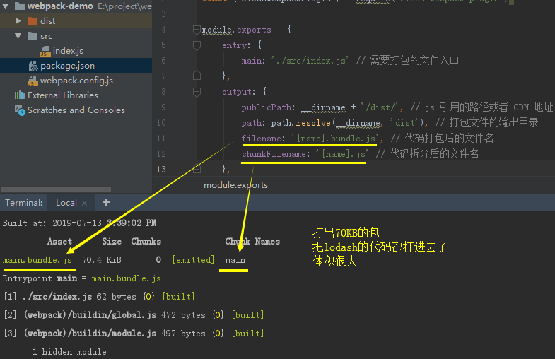
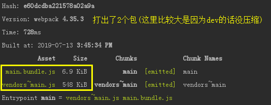
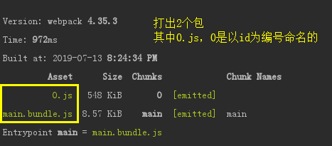
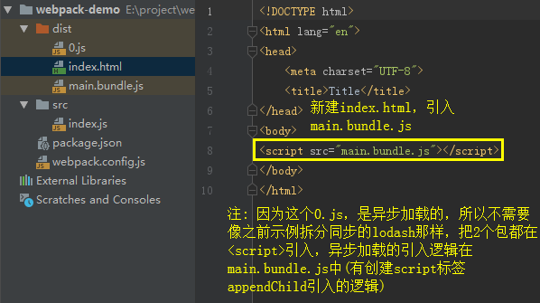
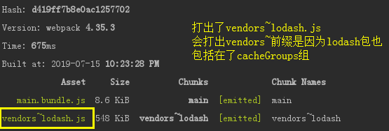
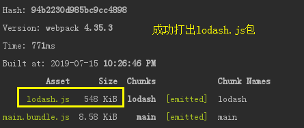
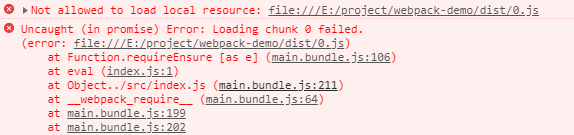
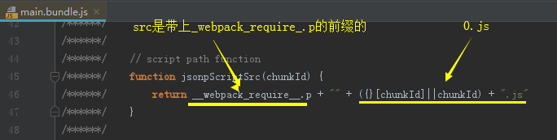

## Code Splitting

**注：**
为了更好的示例Code Splitting，先把babel代码与配置移除，入口改为src/index.js，之后每一个新功能点可能都会这样处理

### 常规打包结果

```js
// 1、安装loadsh(项目开发中一般用lodash-es，这里我们以lodash为示例)
npm i lodash --save

// 2、src/index.js中使用lodash
import _ from 'lodash'

console.log(_.join(['a', 'b', 'c']))

// 3、配置webpack.config.js，运行npm run build
const path = require('path')
const { CleanWebpackPlugin } = require('clean-webpack-plugin')

module.exports = {
    entry: {
        main: './src/index.js' // 需要打包的文件入口
    },
    output: {
        publicPath: __dirname + '/dist/', // js 引用的路径或者 CDN 地址
        path: path.resolve(__dirname, 'dist'), // 打包文件的输出目录
        filename: '[name].bundle.js', // 代码打包后的文件名
    },
    plugins: [
        new CleanWebpackPlugin() // 默认情况下，此插件将删除 webpack output.path目录中的所有文件，以及每次成功重建后所有未使用的 webpack 资产。
    ],
}
```
    


### 存在的问题

**将第三方包与我们业务代码一起打包，会有什么问题？**

假如lodash 1M，业务代码1M，打包后2M

浏览器每次打开页面，都要先加载2M的文件，才能显示业务逻辑，导致加载时间长

业务代码更新较为频繁，但第三方代码基本不会改变，浏览器是有缓存的，如果第三方代码没有改动，这部分代码不发起HTTP请求，而是从缓存中获取，这样体验会更友好，可以在刷新或第二次进去入页面时加快网页加载速度

webpack4之前使用**commonsChunkPlugin**拆分公共代码，现在使用**splitChunksPlugins**

### splitChunksPlugins拆分出第三方库vendors包
    
```js
// src/index.js
import _ from 'lodash'
    
console.log(_.join(['a', 'b', 'c']))

// 给webpack.config.js添加 optimization 配置

const path = require('path')
const { CleanWebpackPlugin } = require('clean-webpack-plugin')

module.exports = {
    entry: {
        main: './src/index.js' // 需要打包的文件入口
    },
    output: {
        publicPath: __dirname + '/dist/', // js 引用的路径或者 CDN 地址
        path: path.resolve(__dirname, 'dist'), // 打包文件的输出目录
        filename: '[name].bundle.js', // 代码打包后的文件名
        chunkFilename: '[name].js' // 代码拆分后的文件名
    },
    optimization: {
        splitChunks: {
            chunks: 'all'
        }
    },
    plugins: [
        new CleanWebpackPlugin() // 默认情况下，此插件将删除 webpack output.path目录中的所有文件，以及每次成功重建后所有未使用的 webpack 资产。
    ],
}
```
    
上方**optimization**处的配置，表示要做代码分割，**chunks: 'all'** 是分割所有代码，包括同步、异步代码，webpack默认是 **chunks: 'async'** 分割异步

```js
// 执行npm run dev(dev下代码不压缩，方便查看)
```
    



**为什么打出的包名是vendors~main:**

webpack默认在cacheGroups中有vendors组，这个组匹配的是node_modules第三方库，都会打在这个组中

而vendors组默认没有加name名称，因为lodash在index.js中引入的，index.js作为入口打出的是main.bundle.js，所以衔接在一起是**vendors~main**

下面我们修改vendors组的name:

```js
// 配置打出来的vendor包的名称
optimization: {
    splitChunks: {
        chunks: 'all',
        cacheGroups: {
            vendors: {
                name: 'vendors'
            }
        }
    }
},
```
    


### splitChunks cacheGroups默认配置异步chunks

cacheGroups 的默认配置会定义 vendors 和 default，下图是splitChunks的默认配置:


这里我们先不看其他配置，主要看chunks: 'async'和vendors组部分

vendors组的 test: /[\\\\/]node_modules[\\\\/]/ 是正则过滤，表示只有node_modules引入的第三方库会被分割
    
并且我们看到splitChunks下的chunks是'async'，表示只有异步才会被分割，为了验证，我们去除webpack.config.js中splitChunks下的内容(去除后会使用默认配置)，运行npm run build
    
```js
// src/index.js
import _ from 'lodash'

console.log(_.join(['a', 'b', 'c']))

// webpack.config.js

const path = require('path')
const { CleanWebpackPlugin } = require('clean-webpack-plugin')

module.exports = {
    entry: {
        main: './src/index.js' // 需要打包的文件入口
    },
    output: {
        publicPath: __dirname + '/dist/', // js 引用的路径或者 CDN 地址
        path: path.resolve(__dirname, 'dist'), // 打包文件的输出目录
        filename: '[name].bundle.js', // 代码打包后的文件名
        chunkFilename: '[name].js' // 代码拆分后的文件名
    },
    optimization: {
        splitChunks: { // 去除splitChunks下的内容
        }
    },
    plugins: [
        new CleanWebpackPlugin() // 默认情况下，此插件将删除 webpack output.path目录中的所有文件，以及每次成功重建后所有未使用的 webpack 资产。
    ],
}
```
    


这时我们改用异步引入的方式，npm run dev

```js
// src/index.js
import('lodash').then(({ default: _ }) => {
    // 使用 异步的形式导入 lodash，default: _ 表示用 _ 代指 lodash
    console.log(_.join(['hello', 'world'], '-'));
})
```
    




### webpackChunkName修改dynamicImport打包的包名

因为异步import，默认是以id为名打出包的，可以看到，上例中打出了0.js

我们可以通过注释的方式手动修改异步import打出的包名:
    
```js
// 以/* webpackChunkName: 'lodash'*/为前缀注释，webpack可以读懂这个注释将其作为该包打出的名称
import(/* webpackChunkName: 'lodash'*/ 'lodash').then(({ default: _ }) => {
    console.log(_.join(['hello', 'world'], '-'));
})

执行npm run dev
```
    


```js
如上图表述，因为lodash包也算vendors组的，且vendors组没有设置name(这个要注意，下面会示例设置name的情况)
如果我们将cacheGroups的vendors组去掉，就可以得到我们想要的lodash.js包了:

optimization: {
    splitChunks: {
        cacheGroups: {
            vendors: false, // 去除vendors组
        }
    }
},
```
    
    



如果匹配的组设置了name，则webpackChunkName就会无效

```js
optimization: {
    splitChunks: {
        cacheGroups: {
            vendors: {
                name: 'vendors', // 给vendors组设置了name
                test: /[\\/]node_modules[\\/]/,
                priority: -10
            },
        }
    }
},
```
    


```js
// 总结
异步import:
1、cacheGroups里匹配的组没有设置name，且没有设置webpackChunkName，打出的包会以id为编号，如0.js
2、cacheGroups里匹配的组没有设置name，但设置webpackChunkName，打出的包以groupKey~webpackChunkName为名
3、cacheGroups里匹配的组有设置name，且设置webpackChunkName，打出的包以设置cacheGroups的name为主
```
    
### dynamicImport 打包可能会报错的问题

如果打包有报错 **Support for the experimental syntax ‘dynamicImport’ isn't currently enabled** ，这是因为异步加载**dynamicImport**还是实验性的语法，webpack 不支持，需要安装插件来支持

具体可参考[webpack4 动态导入文件 dynamic-import](https://www.cnblogs.com/chaoyueqi/p/9996369.html)


### dynamicImport 打包后打开index.html可能遇到的问题

如果是在编辑器如webstorm打开index.html，打开后可以会发现加载0.js失败



这是因为webstorm打开的html会默认启动端口是63342的服务器，不能去直接访问我们本地磁盘

而0.js的路径前缀是file://E:/XXX，是因为publicPath: __dirname + '/dist/'设置了js的引用路径

我们打开main.bundle.js看它是如何去加载0.js的:





**解决方法:**

方法一: 本地打开html，不在编辑器中用服务器的方式打开

方法二: publicPath修改为./


### chunkFilename

示例中我们在output设置了chunkFilename属性，这个属性用来配置打出的chunk包的名称
    
```js
// src/index.js
import('lodash')

// 1、不配置chunkFilename
output: {
    publicPath: __dirname + '/dist/',
    path: path.resolve(__dirname, 'dist'),
    filename: '[name].bundle.js',
},

执行npm run build
```
    


```js
// 2、配置chunkFilename
output: {
    publicPath: __dirname + '/dist/',
    path: path.resolve(__dirname, 'dist'),
    filename: '[name].bundle.js',
    chunkFilename: '[name].chunk.js', // 代码拆分后的文件名
},

执行npm run build
```
    


```js
// 3、异步import加webpackChunkName配置解析
    // src/index.js
    import(/* webpackChunkName: 'lodash'*/  'lodash')
    
执行npm run build
```
    


可以看出，chunkFilename主要作用于为被拆分的包命名，当没有配置这个属性时，拆分的包与主文件共用filename，配置后遵循chunkFilename
    

### 进一步拆分第三方包

现在我们将默认配置拷贝至webpack.config.js中进行分析

```js
optimization: {
    splitChunks: {
        chunks: 'async',
        minSize: 30000, // 抽取出来的文件在压缩前的最小大小（其实就是超过30Kb才拆分这个包）
        maxSize: 0, // 抽取出来的文件在压缩前的最大大小(默认0，表示不限制最大大小，超过30KB就拆包)
        minChunks: 1, // 被引用次数(分割前必须共享模块的最小块数，注意: 是不同entry引用次数，之后会示例解释)
        maxAsyncRequests: 5, // 最大的异步并行请求数，下面会示例
        maxInitialRequests: 3, // entry文件请求的chunks不应该超过此值，下面会示例
        automaticNameDelimiter: '~', // 名称拼接的符号，如vendors和main合集的包会是vendors~main.bundle.js
        automaticNameMaxLength: 30,
        name: true,
        cacheGroups: {
            vendors: {
                test: /[\\/]node_modules[\\/]/,
                priority: -10
            },
            default: {
                minChunks: 2,
                priority: -20,
                reuseExistingChunk: true
            }
        }
    }
},
```
    
**webpack代码分割的配置:**

如我们要分割jQuery、lodash第三方库，会先经过**chunks、minSize、maxSize、minChunks**等，满足条件后生成jQuery、lodash两个文件，放入**cacheGroup**中缓存

根据**cacheGroup**配置的组决定将两个文件合并到一个文件打包，还是单独分开打包

例如默认配置中的vendors组，是将**node_modules**中所有第三方库打包到**vendors.js**中

我们也可以继续分割，单独把lodash分割出一个包
    
```js
// src/index.js
import('lodash').then(({ default: _ }) => {
    console.log(_.join(['hello', 'world'], '-'));
})

// webpack.config.js
cacheGroups: {
    lodash: {
        name: 'lodash',
        test: /[\\/]node_modules[\\/]lodash[\\/]/, // 如果用cnpm install安装的包，可能会有镜像有问题这种test匹配不了的问题，建议用npm安装依赖，有问题可以用下面这种test
        // test: /lodash/,
        priority: 5 // 优先级要大于vendors组，不然会被打入vendors中
    },
    vendors: {
        test: /[\\/]node_modules[\\/]/,
        priority: -10
    },
    default: {
        minChunks: 2,
        priority: -20,
        reuseExistingChunk: true
    }
}

执行npm run dev
```
    


**注意:**

这里打出了一个0.js，网上说这是我们lodash业务部分代码，我觉得不是很正确，我们的业务部分代码console.log(_.join(\['hello', 'world'], '-'))是在main.bundle.js中的

我的理解是这个0.js是因为lodash内部引用了node_modules/lodash/之外的内容，这部分内容与我们test不匹配，导致生成的文件

为了试验，我们将import添加webpackChunkName:

```js
// src/index.js
import(/* webpackChunkName: 'lodash-chunk'*/ 'lodash').then(({ default: _ }) => {
    console.log(_.join(['hello', 'world'], '-'));
})

运行npm run dev
```


我们换jquery来试验

```js
执行 npm install jquery --save

// src/index.js
import(/* webpackChunkName: 'jquery-chunk'*/ 'jquery').then(({ default: $ }) => {
    console.log($);
})

// webpack.config.js
cacheGroups: {
    jquery: {
        name: 'jquery',
        test: /[\\/]node_modules[\\/]jquery[\\/]/,
        priority: 5
    },
    vendors: {
        test: /[\\/]node_modules[\\/]/,
        priority: -10
    },
    default: {
        minChunks: 2,
        priority: -20,
        reuseExistingChunk: true
    }
}

执行 npm run dev
```
    


### 配置解析

| 配置项 | 说明 | 示例 |
| ------ | ------ | ------ |
| chunks | 匹配的块的类型 | initial（初始块），async（按需加载的异步块），all（所有块） |
| name | 用以控制分离后代码块的命名 | name: 'common' |
| test | 用于规定缓存组匹配的文件位置 | test: /\[\\\\/]node_modules\[\\\\/]/ |
| priority | 分离规则的优先级，优先级越高，则优先匹配 | priority: 5 |
| minSize | 模块超过多少大小，就拆分、分组 | minSize: 30000，默认值是 30kb |
| minChunks | 最少被chunks的引用次数 | minChunks: 2 |
| reuseExistingChunk | 如果当前块已从主模块拆分出来，则将重用它而不是生成新的块，一般公共组要设为true | reuseExistingChunk: true |

**注意:**

cacheGroups 会继承和覆盖splitChunks的配置项，但是**test、priorty和reuseExistingChunk**只能用于配置缓存组

更多的配置可了解 [官方文档](https://webpack.js.org/plugins/split-chunks-plugin/)

#### name

cacheGroups里的组设置name与否影响了该组打出的包是否会整合在一起
    
```js
// 1、没有设置name的情况
// pageA.js
import './a.js';
import './b.js';

// pageB.js
import './b.js';
import './c.js';

// pageC.js
import './b.js';
import './c.js';

module.exports = {
    entry: {
        pageA: './src/pageA.js', // 入口pageA
        pageB: './src/pageB.js', // 入口pageB
        pageC: './src/pageC.js', // 入口pageC
    },
    optimization: {
        splitChunks: {
            chunks: "all",
            minSize: 0, // 设置最小0就拆，否则默认30kb
            cacheGroups: {
                common: {
                    test: /[\\/]src[\\/]/,
                    minChunks: 2, // 被引用2次则被分到common组
                    priority: 5,
                },
            }
        }
    },
}

执行npm run dev
```
    


```js
// 2、设置name的情况
optimization: {
    splitChunks: {
        chunks: "all",
        minSize: 0, // 设置最小0就拆，否则默认30kb
        cacheGroups: {
            common: {
                test: /[\\/]src[\\/]/,
                name: 'common', // 设置了name
                minChunks: 2, // 被引用2次则被分到common组
                priority: 5,
            },
        }
    }
},
```
    

    

#### minChunks

很重要，但网上解释的简单模糊的一个属性

minChunks表示一个模块被引用一定次数，就会被拆包

也就是说: a.js与b.js同时引入了c.js，那c.js就会被单独拆出一个包

可是，真的仅仅是这样吗？
    
```js
示例: index.js引入a.js、b.js，其中a.js与b.js同时引入c.js

// index.js
import './a.js'
import './b.js'

// a.js
import './c.js';
console.log('a');

// b.js
import './c.js';
console.log('b');

// c.js
console.log('common');

// webpack.config.js
optimization: {
    splitChunks: {
        chunks: "all",
        minSize: 0, // 设置最小0就拆，否则默认30kb
        cacheGroups: {
            common: {
                name: 'common',
                minChunks: 2, // 被引用2次则被分到common组
                priority: 5,
            }
        }
    }
},

执行npm run dev
按理解而言，这时c.js被引用了2次，会被分入common组，拆出一个common.js的包供引用
```
    


```js
???????????????
为什么只有一个包，c.js是被引用了2次的，chunks也设成'all'，minSize也是0，为什么没有被分入common.js?
```

minChunks表示一个模块被引用一定次数，这个解释并不是非常准确

minChunks更进一步的定义，应该是指被**不同chunk包**引用的次数

```js
示例: a.js与b.js同时引入c.js，且以a.js与b.js作为入口

// a.js
import './c.js';
console.log('a');

// b.js
import './c.js';
console.log('b');

// c.js
console.log('common');

// webpack.config.js
module.exports = {
    entry: {
        a: './src/a.js', // 需要打包的文件入口1
        b: './src/b.js', // 需要打包的文件入口2
    },
    optimization: {
        splitChunks: {
            chunks: "all",
            minSize: 0, // 设置最小0就拆，否则默认30kb
            cacheGroups: {
                common: {
                    name: 'common',
                    minChunks: 2, // 被引用2次则被分到common组
                    priority: 5,
                }
            }
        }
    },
    ...
}

执行npm run dev
```
    


(可见，minChunks指的应该是被chunk引用的次数，这里被chunk a和b同时引用)

也就是表示，需要多入口才能打出minChunks: 2的组吗？

并不是，再看下面这个示例

```js
示例: index.js异步引入a.js、b.js，其中a.js与b.js同时引入c.js
// index.js
import('./a.js')
import('./b.js')

// a.js
import './c.js';
console.log('a');

// b.js
import './c.js';
console.log('b');

// c.js
console.log('common');

// webpack.config.js
module.exports = {
    entry: {
        main: './src/index.js', // 需要打包的文件入口
    },
    optimization: {
        splitChunks: {
            chunks: "all",
            minSize: 0, // 设置最小0就拆，否则默认30kb
            cacheGroups: {
                common: {
                    name: 'common',
                    minChunks: 2, // 被引用2次则被分到common组
                    priority: 5,
                }
            }
        }
    },
    ...
}
```
    


```js
总结: minChunks并不是单单指被模块引用2次，而是被Chunks最小引用次数
```
    
#### maxAsyncRequests

这是比较让人比较难以捉摸的配置，网上很少有清楚的介绍

maxAsyncRequests是最大的按需(异步)加载次数，默认为 5，可以设置Infinity

很少需要对maxAsyncRequests和maxInitialRequests进行修改，这里我们稍作了解，以免遇到与之相关的问题

```js
// src/index.js
import('./a.js');
import('./b.js');
import('./c.js');
import('./d.js');

// a.js
console.log('a');
import './b.js'

// b.js
console.log('b');
import './c.js'

// c.js
console.log('c');
import './d.js'

// d.js
console.log('d');

// webpack.config.js
optimization: {
    splitChunks: {
        maxAsyncRequests: 5,
        minSize: 0, // 设置最小0就拆，否则默认30kb
    }
}

当maxAsyncRequests: 5时:
执行 npm run dev
```
    

    
```js
注:
打出4个文件，是因为我们入口4个异步的import，和maxAsyncRequests无关

可以看到这4个文件大小较小的，我们可以依次打开这4个文件进行分析:
0.js中含有我们d.js中的 console.log('d')
1.js中含有我们c.js中的 console.log('c')
2.js中含有我们b.js中的 console.log('b')
3.js中含有我们a.js中的 console.log('a')

即a、b、c、d.js这4个文件被拆成了4份:
按需加载import('a.js')时，需要并发请求4个文件(0.js、1.js、2.js、3.js)
按需加载import('b.js')时，需要并发请求3个文件(0.js、1.js、2.js)
按需加载import('c.js')时，需要并发请求2个文件(0.js、1.js)
按需加载import('d.js')时，需要并发请求1个文件(0.js)


接着我们设置maxAsyncRequests: 1
// webpack.config.js
optimization: {
    splitChunks: {
        maxAsyncRequests: 1,
        minSize: 0,
    }
}

执行 npm run dev
```
    


```js
再次打开这4个文件进行分析:
打开0.js，里面同时含有4个文件a、b、c、d.js中的console.log('a')/log('b')/log('c')/log('d')
打开1.js，里面同时含有3个文件b、c、d.js中的console.log('b')/log('c')/log('d')
打开2.js，里面同时含有2个文件c、d.js中的console.log('c')/log('d')
打开3.js，里面同时含有1个文件d.js中的console.log('d')

即a、b、c、d.js这4个文件被重复打包了:
按需加载import('./a.js')时,只会并发请求1个文件(0.js)，这个文件同时包含了a、b、c、d.js的内容
按需加载import('./b.js')时,只会并发请求1个文件(1.js)，这个文件同时包含了b、c、d.js的内容
按需加载import('./c.js')时,只会并发请求1个文件(2.js)，这个文件同时包含了c、d.js的内容
按需加载import('./d.js')时,只会并发请求1个文件(3.js)，这个文件同时包含了d.js的内容

可以看到maxAsyncRequests: 1 限制了公共代码的分离，使得只能并发请求1个文件

maxAsyncRequests起的便是这样的作用:
当maxAsyncRequests: 1时，公共代码没有分离，虽然只请求了1次，但是重复加载了公共的代码，严重冗余
当maxAsyncRequests: 5时，代码没有冗余，但请求a.js时发起4次请求，以增加请求数换取代码冗余

一般而言，以增加请求来公共代码分离是更优的，不过没有最好的方案，只有最合适的做法
```

#### maxInitialRequests

与maxAsyncRequests有所不同，maxInitialRequests是指**entry文件请求的chunk数不应超过的值**，默认是3

```js
// a.js(入口1)，引入了c.js与jquery
import './c.js';
import 'jquery';
console.log('a');

// b.js(入口2)，也引入了c.js与jquery
import './c.js';
import 'jquery';
console.log('b');

// c.js
console.log('common');

// webpack.config.js
module.exports = {
    entry: {
        a: './src/a.js',
        b: './src/b.js',
    },
    optimization: {
        splitChunks: {
            chunks: "all",
            minSize: 0,
            maxInitialRequests: 3, // 入口请求的最大chunks数是3
            cacheGroups: {
                vendors: {
                    test: /[\\/]node_modules[\\/]/,
                    name: 'vendors',
                    priority: -10
                },
                common: {
                    test: /[\\/]src[\\/]/,
                    name: 'common',
                    minChunks: 2,
                    priority: 5,
                }
            }
        }
    },
    ...
}

执行npm run dev
```
    


这时我们将maxInitialRequests修改为1，再打包


这就是maxInitialRequests的作用，限制入口最多请求的**chunks**

原来maxInitialRequests是3，可以正常的打出4个chunk，每个入口都引用了3个，没有超过maxInitialRequests的限制

而maxInitialRequests改变为1时，原本应该打出的4个chunk，导致每个入口引用数为3，超过1，所以包没有分离，而是被打到了一起


### runtimeChunk

webpack打出的包，含有一小部分管理模块执行的代码，这小部分代码在chunk id和匹配的文件之间生成一个映射

为了充分利用浏览器的缓存策略，可以把它单独抽出，否则可能导致: 一个文件内容发生改动，另一个文件并没有修改，却导致没有修改的文件hash值也发生改变

```js
// webpack.config.js
entry: {
    main: './src/index.js', // 需要打包的文件入口
},
output: {
    publicPath: './dist/',
    path: path.resolve(__dirname, 'dist'),
    filename: '[name].[contentHash].bundle.js',
    chunkFilename: '[name].[contentHash].js'
},
    注：以contentHash作为文件名，内容没有修改，打出的文件名不变，充分利用浏览器环境

// src/index.js
import (/* webpackChunkName: 'a'*/ './a.js')
import (/* webpackChunkName: 'b'*/ './b.js')

// a.js
console.log('a');

// b.js
console.log('b');

执行npm run dev    
```
    


```js
这时我们修改a.js
// a.js
console.log('aaaaaaa');
```
    


```js
存在的问题:
我们只修改了a.js，而index.js是没有做修改的，但是却导致index.js打出的main.bundle.js的hash值发生了变化
这样对于浏览器缓存策略来说，就要重新请求一次根本没有发生变化的main.bundle.js

原因:
我们打开main.bundle.js可以看到如下部分代码
```
    


```js
解决:
我们应该把文件清单的这部分代码单独抽离出来
webpack4允许我们在optimization配置runtimeChunk

// webpack.config.js
optimization: {
    runtimeChunk: {
        name: 'manifest'
    },
    // runtimeChunk: true, 或者这样配置
},

执行npm run dev
```
    


```js
这时我们修改a.js
// a.js
console.log('aaaaaaabbb');
```
    


**注:**

这里我们将runtime单独拆成一个包，可以看到这部分代码很小，可以考虑内联到html中

实现方法可以了解 [内联runtimeChunk](./4、懒加载、预加载、html-webpack-plugin.md)