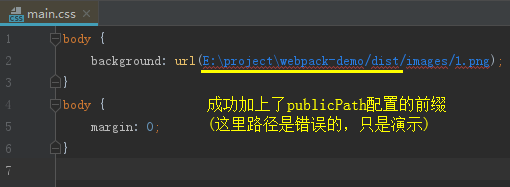

## 处理CSS、SCSS

CSS在HTML中一般使用\<link>标签引入或内联在\<style>标签中

webpack本身是不知道如何去提取CSS的，这时就需要相应的loader来实现

**CSS-loader:** 解析CSS，主要处理CSS依赖，如 @import、url()等引用外部文件的声明

**style-loader:** 将css-loader解析的结果转变为JS代码，运行时**动态插入style标签**

### 处理CSS

```js
// 1、安装依赖
npm i css-loader style-loader --save-dev

// 2、配置webpack.config.js
module.exports = {
    ...
    module: {
        rules: [
            {
                test: /\.css$/, // 针对 .css 后缀的文件设置 loader
                use: ['style-loader', 'css-loader']
            }
        ]
    },
    ...
}

在src下新建style文件夹
// src/style/1.css
body {
    background-color: cornflowerblue;
}

// src/style/base.css
@import '1.css';
body {
    margin: 0;
}

// src/index.js
import './style/base.css'

执行npm run build
```
    


### 单独分离CSS

可以看到，style-load、css-loader最终是将样式内联到\<style>标签中

如果我们需要将CSS分离，可以使用**mini-css-extract-plugin**

**注：**

mini-css-extract-plugin分离CSS，一般只在生产环境使用，因为这个插件暂时不支持HMR

```js
// 1、安装依赖
npm i mini-css-extract-plugin --save-dev

// 2、配置webpack.config.js
const MiniCssExtractPlugin = require('mini-css-extract-plugin')
...

module.exports = {
    ...
    module: {
        rules: [
            {
                test: /\.css$/,
                use: [
                    {
                        loader: MiniCssExtractPlugin.loader, // 'style-loader'替换为MiniCssExtractPlugin
                    },
                    'css-loader'
                ]
            }
        ]
    },
    ...
    plugins: [
        ...
        new MiniCssExtractPlugin({
            filename: 'style/[name].css', // 在dist文件夹下建立style文件夹放置分离的css
            chunkFilename: 'style/[id].css'
        })
    ],
}

执行npm run build
```
    


### publicPath

mini-css-extract-plugin的loader允许配置publicPath，通常作用于background: url引入外部图片的路径矫正

这里我们提前使用下图片处理的loader来演示publicPath

```js
// 1、安装处理图片的依赖
npm install url-loader file-loader --save-dev

// 2、配置webpack.config.js
rules: [
    {
        test: /\.css$/,
        use: [
            {
                loader: MiniCssExtractPlugin.loader,
                options: {
                    // 这里可以指定一个 publicPath
                    // 默认使用 webpackOptions.output中的publicPath
                    publicPath: __dirname + '/dist/'
                },
            },
            'css-loader'
        ]
    },
    {
        test: /\.(png|jpg|jpeg|gif)$/, // 处理图片，此处先不详谈
        use: [
            {
                loader: 'url-loader',
                options: {
                    name: '[name].[ext]',
                    outputPath: 'images/', //输出到 images 文件夹
                    limit: 0,
                }
            }
        ]
    }
]

// 3、在1.css中引入图片
body {
    background: url("../imgs/1.png");
}

执行npm run build
```
    


### HMR

mini-css-extract-plugin可以配置hmr功能，一般作用于开发环境开启，此处不演示
    
```js
{
    test: /\.css$/,
    use: [
        {
            loader: MiniCssExtractPlugin.loader,
            options: {
                // only enable hot in development
                hmr: process.env.NODE_ENV === 'development', // development环境开启
                // if hmr does not work, this is a forceful method.
                reloadAll: true,
            },
        },
        'css-loader'
    ]
}
```
    
### 压缩CSS

可以看到，单独分离出来的CSS文件是没有被压缩的

可以引入**optimize-css-assets-webpack-plugin**来实现CSS的压缩

```js
// 1、安装依赖
npm install optimize-css-assets-webpack-plugin --save-dev

// 2、配置webpack.config.js
...
const OptimizeCssAssetsPlugin = require('optimize-css-assets-webpack-plugin') // 压缩 css

module.exports = {
    ...
    plugins: [
        ...
        new OptimizeCssAssetsPlugin({
            assetNameRegExp: /\.css$/g,
            cssProcessor: require('cssnano'), //用于优化\最小化 CSS 的 CSS处理器，默认为 cssnano
            cssProcessorOptions: { safe: true, discardComments: { removeAll: true } }, //传递给 cssProcessor 的选项，默认为{}
            canPrint: true //布尔值，指示插件是否可以将消息打印到控制台，默认为 true
        }),
    ],
}

执行npm run build
```


### 处理SCSS

```js
// 1、安装依赖
npm i node-sass sass-loader --save-dev

// 2、配置webpack.config.js
{
    test: /\.(scss|css)$/, // 针对 .css 后缀的文件设置 loader
    use: [
        {
            loader: MiniCssExtractPlugin.loader,
        },
        'css-loader',
        'sass-loader' // 使用 sass-loader 将 scss 转为 css
    ]
},

    注：
    webpack解析顺序是从后往前: sass-loader => css-loader => MiniCssExtractPlugin.loader
    
// 3、修改.css为.scss
// base.scss
@import '1.scss';
body {
    margin: 0;
}

// 1.scss
$theme: #1394ff;
body {
    background-color: $theme;
}

执行npm run build
```
    


### CSS浏览器兼容前缀

```js
// 1、安装依赖
npm install postcss-loader autoprefixer --save-dev

// 2、修改1.scss
$theme: #1394ff;
div {
    background-color: $theme;
    user-select: none;
}


配置postcss有两种方式

方式一:
// 配置webpack.config.js
{
    test: /\.(scss|css)$/,
    use: [
        {
            loader: MiniCssExtractPlugin.loader,
        },
        'css-loader',
        // 使用 postcss 为 css 加上浏览器前缀
        {
            loader: 'postcss-loader',
            options: {
                plugins: [require('autoprefixer')]
            }
        },
        'sass-loader'
    ]
},

方式二:
// 在 webpack.config.js 同级目录下，新建 postcss.config.js 配置文件
module.exports = {
    plugins: [require('autoprefixer')]
}
```
    


```js
// 配置webpack.config.js
{
    test: /\.(scss|css)$/,
    use: [
        {
            loader: MiniCssExtractPlugin.loader,
        },
        'css-loader',
        'postcss-loader', // 使用 postcss 为 css 加上浏览器前缀
        'sass-loader'
    ]
},

执行npm run build
```
    


### importLoaders

在上例的配置中:

```js
{
    test: /\.(scss|css)$/,
    use: [
        {
            loader: MiniCssExtractPlugin.loader,
        },
        'css-loader',
        'postcss-loader', // 使用 postcss 为 css 加上浏览器前缀
        'sass-loader'
    ]
},
```
    
如果我们的样式不是SCSS，而是普通的CSS:

```js
// base.css
@import '1.css';
body {
    margin: 0;
}

// 1.css
div {
    background-color: #1394ff;
    user-select: none;
}

执行npm run build
```
    


**解决方案:**

配置**importLoaders**

```js
{
    test: /\.(scss|css)$/,
    use: [
        {
            loader: MiniCssExtractPlugin.loader,
        },
        {
            loader: 'css-loader',
            options: {
                importLoaders: 1, // 配置importLoaders
            }
        },
        'postcss-loader',
        'sass-loader'
    ]
},

importLoaders: n 表示：在一个css中引入了另一个css，也会执行之前n个loader，这里importLoaders: 1，即postcss-loader，如果是2，则是postcss-loader和sass-loader


执行npm run build
```
    
