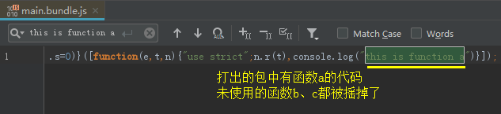
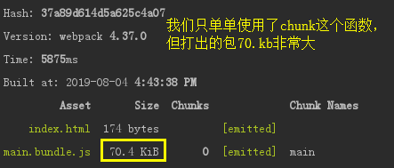
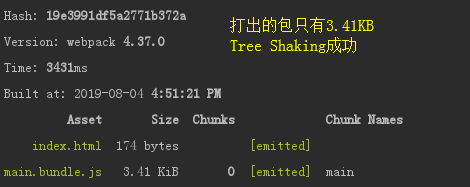
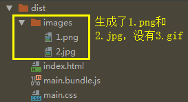
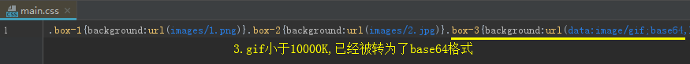
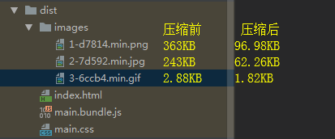
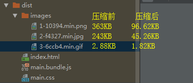
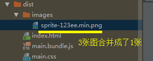
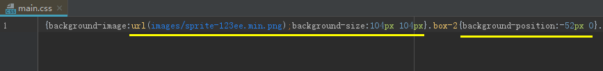

## JS Tree Shaking

### 常规Tree Shaking

Tree Shaking即摇树优化，项目中没有使用的代码会在打包时被去除

**JS Tree Shaking**依赖的是ES6的import、export

    // 1、在src下新建utils.js
    export function a() {
        return 'this is function a'
    }
    
    export function b() {
        return 'this is function b'
    }
    
    export function c() {
        return 'this is function c'
    }
    
    // 2、在入口文件src/index.js引入
    import { a } from "./utils";
    
    console.log(a());
    
    执行npm run build
    


> build生成模式会JS摇树，如果是dev，并不会摇树，打出的包依旧有b、c的代码

### 第三方JS Tree Shaking

对于常用的第三方包，如何进行Tree Shaking

以lodash为例:

    // src/index.js
    import { chunk } from 'lodash'
    
    console.log(chunk([1, 2, 3], 2));
    
    执行npm run build
    


很明显，除了chunk函数，所有无用的代码都被打了进来

**解决：**

前面提到，js tree shaking依赖的是ES模块系统，而lodash.js使用的是CommonJS而不是ES模块写法

所以安装对应的模块系统即可

安装lodash.js的ES版本: **npm install lodash-es --save**

    // 修改src/index.js
    import { chunk } from 'lodash-es'
    
    console.log(chunk([1, 2, 3], 2));
    
    执行npm run build
    


> 尽量选择拥有ES模块系统的第三方库

## CSS Tree Shaking

webpack4的CSS抽取，从extract-text-webpack-plugin改为了MiniCssExtractPlugin

CSS Tree Shaking与JS Tree Shaking不同，需要依赖第三方库PurifyCSS去实现，而这个包又与extract-text-webpack-plugin有关，所以如果使用的MiniCssExtractPlugin，可能不能很好的让PurifyCSS启动作用

可以使用 extract-text-webpack-plugin@next去替代extract-text-webpack-plugin，不过个人还是建议用MiniCssExtractPlugin去分离CSS

以下CSS Tree Shaking以了解为目的即可(个人还是用MiniCssExtractPlugin，这个插件视乎不能很好的配合PurifyCSS)

此处不详谈，可了解 [CSS Tree Shaking](https://juejin.im/post/5cb01ab0e51d456e3428c0ca#heading-1)

## 图片处理

### 配置

webpack的图片处理主要依赖url-loader与file-loader这2个loader

    // 1、安装依赖
    npm install url-loader file-loader --save-dev
    
    // 2、src下新建imgs文件夹，放入图片
    1.png   363KB
    2.jpg   243KB
    3.gif   2.88KB
    
    // 3、src/style/base.css
    .box-1 {
        background: url("../imgs/1.png");
    }
    .box-2 {
        background: url("../imgs/2.jpg");
    }
    .box-3 {
        background: url("../imgs/3.gif");
    }
    
    // 4、入口文件src/index.js
    import './style/base.css'
    
    // 5、webpack.config.js
    module: {
        rules: [
            ...
            {
                test: /\.(png|jpg|jpeg|gif)$/,
                use: [
                    {
                        loader: 'url-loader',
                        options: {
                            name: '[name].[ext]',
                            outputPath: 'images/', // 输出到 images 文件夹
                            limit: 10000, // 小于10000K的文件会被转为base64格式
                        }
                    }
                ]
            }
        ]
    },
    
    执行npm run build
    





**小图片base64转码的优势:**

如果图片较多，会发出非常多的http请求，降低页面性能

转为base64字符串，可以**节省请求数**

但是如果图片太大，则不适合转为base64，**编码会消耗性能**

### 压缩图片

#### 方式一

使用**img-loader**插件

**针对不同图片类型，还要引不同的插件**:

- png需要**imagemin-pngquant**插件

- jpg/jpeg需要**imagemin-mozjpeg**插件

- gif需要**imagemin-gifsicle**插件

``````
    // 1、安装依赖
    npm i img-loader imagemin imagemin-pngquant imagemin-mozjpeg --save-dev
    
    注：这个插件会有版本不匹配的问题导致png压缩出错，需要重新安装依赖版本如下
    npm i imagemin-pngquant@6.0.0 --save-dev
    
    // 2、配置webpack.config.js
    {
        test: /\.(png|jpg|jpeg|gif)$/,
        use: [
            {
                loader: 'url-loader',
                options: {
                    name: '[name]-[hash:5].min.[ext]',
                    outputPath: 'images/', // 输出到 images 文件夹
                    limit: 1000, // 这里配置1000K，不让那个gif被转base64，方便看压缩结果
                }
            },
            {
                loader: 'img-loader',
                options: {
                    plugins: [
                        require('imagemin-pngquant')({
                            quality: '80' // the quality of zip
                        }),
                        require('imagemin-mozjpeg')({
                            quality: '80'
                        }),
                        require('imagemin-gifsicle')({
                            quality: '80'
                        })
                    ]
                }
            }
        ]
    },
    
    执行npm run build
``````




#### 方式二

使用**image-webpack-loader**插件

    // 1、安装依赖
    npm i image-webpack-loader --save-dev
    
    // 2、配置webpack.config.js
    {
        test: /\.(png|jpg|jpeg|gif)$/,
        use: [
            {
                loader: 'url-loader',
                options: {
                    name: '[name]-[hash:5].min.[ext]',
                    outputPath: 'images/',
                    limit: 1000, // 这里配置1000K，不让那个gif被转base64，方便看压缩结果
                }
            },
            {
                loader: 'image-webpack-loader',
                options: {
                    // 压缩 jpg/jpeg 图片
                    mozjpeg: {
                        progressive: true,
                        quality: 65 // 压缩率
                    },
                    // 压缩 png 图片
                    pngquant: {
                        quality: '65-90',
                        speed: 4
                    },
                    // 压缩 gif 图片
                    gifsicle: {
                        quality: '65-90',
                        speed: 4
                    }
                }
            },
        ]
    },
    
    执行npm run build
    



image-webpack-loader本身也是使用了imagemin等插件，做了进一步的封装

### sprites雪碧图

    // 1、安装依赖
    npm i postcss-loader postcss-sprites --save-dev
    
    // 2、src/imgs替换3张测试用的小图片，修改src/style/base.css
    .box-1 {
        background: url("../imgs/compute.png");
    }
    .box-2 {
        background: url("../imgs/network.png");
    }
    .box-3 {
        background: url("../imgs/storage.png");
    }
    
    // 3、配置webpack.config.js
    const path = require('path')
    const { CleanWebpackPlugin } = require('clean-webpack-plugin')
    const HtmlWebpackPlugin = require('html-webpack-plugin')
    const MiniCssExtractPlugin = require('mini-css-extract-plugin')
    const OptimizeCssAssetsPlugin = require('optimize-css-assets-webpack-plugin')
    
    module.exports = {
        entry: {
            main: './src/index.js',
        },
        output: {
            path: path.resolve(__dirname, 'dist'),
            filename: '[name].bundle.js',
            chunkFilename: '[name].chunk.js',
        },
        module: {
            rules: [
                {
                    test: /\.(scss|css)$/,
                    use: [
                        {
                            loader: MiniCssExtractPlugin.loader,
                        },
                        {
                            loader: 'css-loader',
                            options: {
                                importLoaders: 1
                            }
                        },
                        {
                            loader: 'postcss-loader',
                            options: {
                                ident: 'postcss',
                                plugins: [require('postcss-sprites')({ // 配置postcss-sprites
                                    spritePath: './dist/images',
                                })]
                            }
                        },
                        'sass-loader'
                    ]
                },
                {
                    test: /\.(png|jpg|jpeg|gif)$/,
                    use: [
                        {
                            loader: 'url-loader',
                            options: {
                                name: '[name]-[hash:5].min.[ext]',
                                outputPath: 'images/',
                                limit: 1000, // 配置1000K，为了测试不让图片被转base64
                            }
                        },
                        {
                            loader: 'image-webpack-loader',
                            options: {
                                mozjpeg: {
                                    progressive: true,
                                    quality: 65 // 压缩率
                                },
                                pngquant: {
                                    quality: '65-90',
                                    speed: 4
                                },
                                gifsicle: {
                                    quality: '65-90',
                                    speed: 4
                                }
                            }
                        },
                    ]
                },
            ]
        },
        plugins: [
            new CleanWebpackPlugin(),
            new HtmlWebpackPlugin({
                title: 'webpack-demo',
                minify: {
                    // 压缩 HTML 文件
                    removeComments: true,
                    collapseWhitespace: true,
                    minifyCSS: true，
                },
                filename: 'index.html',
                template: 'index.html',
            }),
            new MiniCssExtractPlugin({
                filename: '[name].css',
                chunkFilename: '[id].css'
            }),
            new OptimizeCssAssetsPlugin({
                assetNameRegExp: /\.css$/g,
                cssProcessor: require('cssnano'),
                cssProcessorOptions: { safe: true, discardComments: { removeAll: true } },
                canPrint: true,
            }),
        ],
    }
    
    执行npm run build
    






sprites雪碧图可以减少请求数，把多张图的多次请求，合并成一次请求

一般是各式各样的**logo**和**大小相等**的**小**图片

大图片不推荐用sprites图


    

    
        