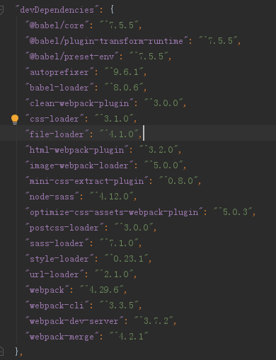
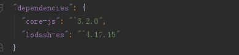
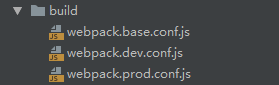

## 开发环境、生产环境配置整理

### 依赖安装

    // ---------
    拆分内联runtime

    // 新建项目，初始化package.json
    npm init -y
    
    // 安装webpack依赖
    npm i webpack webpack-cli webpack-dev-server --save-dev
    
    // 安装babel依赖
    npm i @babel/core babel-loader @babel/preset-env @babel/plugin-transform-runtime --save-dev
    npm i @babel/polyfill @babel/runtime
    npm i --save core-js@3
    
    // 配置babel
    根目录新建 .babelrc 文件
    {
      "presets": [
        [
          "@babel/preset-env",
          {
            "useBuiltIns": "usage",
            "corejs": 3
          }
        ]
      ],
      "plugins": ["@babel/plugin-transform-runtime"]
    }
    
    根目录新建 .browserslistrc 文件
    "browserslist": [
      "> 1%",
      "last 2 version",
      "not ie <= 8"
    ]

    
    // 安装html依赖
    npm i html-webpack-plugin clean-webpack-plugin --save-dev
    
    // 安装CSS依赖
    npm i css-loader style-loader mini-css-extract-plugin optimize-css-assets-webpack-plugin --save-dev
    
    // 安装SCSS依赖
    npm i node-sass sass-loader --save-dev
    
    // 安装postcss
    npm install postcss-loader autoprefixer --save-dev
    
    // 配置postcss
    在根目录下新建postcss.config.js
    module.exports = {
        plugins: [require('autoprefixer')]
    }
    
    // 安装图片/字体依赖
    npm i url-loader file-loader image-webpack-loader --save-dev
    
    // 安装第三方库
    npm i lodash-es --save
    

### 配置分析

在项目开发中，我们需要在本地调试的**开发环境**，与打包上线的**生产环境**

**开发环境:**

需要加快编译速度、热更新、跨域请求代理、source-map代码调试等

**生产环境:**

拆分公共JS代码、抽离CSS、压缩JS/CSS、拆分第三方库等

我们需要**3个配置文件**: 

- webpack.base.conf.js 基础配置，开发/生产环境公共部分

- webpack.dev.conf.js 开发环境配置

- webpack.prod.conf.js 生产环境配置

webpack.dev.config.js、webpack.prod.config.js都需要合并webpack.base.js，通常使用插件**webpack-merge**来实现配置文件的合并

    npm i webpack-merge --save-dev
    
在根目录下新建**build文件夹**放置3个配置文件:

配置**package.json**的**scripts**:

    "scripts": {
        "dev": "webpack-dev-server --progress --config build/webpack.dev.conf.js",
        "build": "webpack --progress --config build/webpack.prod.conf.js"
    }
    
### 基础配置

    // build/webpack.base.conf.js
    const path = require('path');
    const HtmlWebpackPlugin = require('html-webpack-plugin')
    const { CleanWebpackPlugin } = require('clean-webpack-plugin')
    
    module.exports = {
        context: path.resolve(__dirname, '../'), // 配置上下文，当遇到相对路径时，会以context为根目录
        entry: {
            main: './src/index.js', // 需要打包的文件入口，这里不用 '../src/index.js' 是因为context矫正路径了
        },
        output: {
            path: path.resolve(__dirname, '..', 'dist'),
        },
        resolve: {
            extensions: ['.js', '.json', '.scss', '.css'],
            alias: {
                '@': path.join(__dirname, '..', 'src'), // 开发项目中常用 @ 来指向src路径，如import XX from '@/components/...'
            },
        },
        module: {
            rules: [
                {
                    test: /\.js$/, // 使用正则来匹配 js 文件
                    exclude: /node_modules/, // 排除依赖包文件夹
                    use: {
                        loader: 'babel-loader', // 使用 babel-loader
                    }
                },
                {
                    test: /\.(png|jpg|jpeg|gif)$/,
                    use: [
                        {
                            loader: 'url-loader',
                            options: {
                                name: '[name]-[hash:5].min.[ext]',
                                outputPath: 'images/', // 输出到 images 文件夹
                                limit: 10000, // 小于10000K的文件会被转为base64格式
                            }
                        },
                    ]
                },
                {
                    test: /\.(eot|woff2?|ttf|svg)$/,
                    use: [
                        {
                            loader: 'url-loader',
                            options: {
                                name: '[name]-[hash:5].min.[ext]',
                                limit: 5000,
                                publicPath: 'fonts/',
                                outputPath: 'fonts/'
                            }
                        }
                    ]
                },
            ]
        },
        plugins: [
            new CleanWebpackPlugin(), // 清空output.path目录文件
            new HtmlWebpackPlugin({
                title: 'webpack-demo', // HTML中的title
                minify: {
                    // 压缩 HTML 文件
                    removeComments: true, // 移除 HTML 中的注释
                    collapseWhitespace: true, // 删除空白符与换行符
                    minifyCSS: true // 压缩内联 css
                },
                filename: 'index.html', // 生成后的文件名
                template: path.resolve(__dirname, '..', 'index.html'), // 根据此模版生成 HTML 文件
            }),
        ]
    }
    
### 开发环境配置

    // build/webpack.dev.conf.js
    const webpack = require('webpack')
    const merge = require('webpack-merge');
    const baseConfig = require('./webpack.base.conf');
    
    module.exports = merge(baseConfig, { // merge合并webpack.base.conf.js
        mode: "development",
        devtool: 'source-map', // 开启source-map调试
        output: {
            publicPath: '/', // 开发环境publicPath为 '/'
            filename: '[name].bundle.js',
            chunkFilename: '[name].chunk.js'
        },
        devServer: {
            port: 8080, // 本地服务器端口号
            hot: true, // 热重载
            overlay: true, // 如果代码出错，会在浏览器页面弹出“浮动层”。类似于 vue-cli 等脚手架
            proxy: {
                // 跨域代理转发
                '/help': {
                    target: 'https://www.wangsucloud.com/base-portal/frontpages/help/menu/HELP',
                    changeOrigin: true,
                    ws: false,
                    pathRewrite: {
                        [`^/help`]: '/'
                    },
                    logLevel: 'debug',
                    headers: {
                        Cookie: ''
                    }
                }
            },
        },
        module: {
            rules: [
                {
                    test: /\.(sa|sc|c)ss$/, // 针对 .css 后缀的文件设置 loader
                    use: [
                        'style-loader', // 开发环境可以不抽离CSS
                        {
                            loader: 'css-loader',
                            options: {
                                importLoaders: 2,
                            }
                        },
                        'postcss-loader',
                        'sass-loader' // 使用 sass-loader 将 scss 转为 css
                    ]
                },
            ]
        },
        plugins: [
            new webpack.HotModuleReplacementPlugin(), // 热部署模块
            new webpack.NamedModulesPlugin(),
        ]
    })
    
### 生产环境配置

    // build/webpack.prod.conf.js
    const merge = require('webpack-merge');
    const baseConfig = require('./webpack.base.conf');
    const MiniCssExtractPlugin = require('mini-css-extract-plugin')
    const OptimizeCssAssetsPlugin = require('optimize-css-assets-webpack-plugin') // 压缩 css
    
    module.exports = merge(baseConfig, { // merge合并webpack.base.conf.js
        mode: "production",
        output: {
            publicPath: './', // 生产环境publicPath为 './'
            filename: '[name]-[contentHash:5].bundle.js', // 生产环境可以加contentHash充分利用浏览器缓存
            chunkFilename: '[name]-[contentHash:5].chunk.js'
        },
        module: {
            rules: [
                {
                    test: /\.(sa|sc|c)ss$/, // 针对 .css 后缀的文件设置 loader
                    use: [
                        {
                            loader: MiniCssExtractPlugin.loader, // 生产环境抽离CSS
                        },
                        {
                            loader: 'css-loader',
                            options: {
                                importLoaders: 2,
                            }
                        },
                        'postcss-loader',
                        'sass-loader' // 使用 sass-loader 将 scss 转为 css
                    ]
                },
                {
                    test: /\.(png|jpg|jpeg|gif)$/,
                    use: [
                        {
                            loader: 'image-webpack-loader', // 生产环境压缩图片
                            options: {
                                // 压缩 jpg/jpeg 图片
                                mozjpeg: {
                                    progressive: true,
                                    quality: 65 // 压缩率
                                },
                                // 压缩 png 图片
                                pngquant: {
                                    quality: '65-90',
                                    speed: 4
                                },
                                // 压缩 gif 图片
                                gifsicle: {
                                    quality: '65-90',
                                    speed: 4
                                }
                            }
                        },
                    ]
                },
            ]
        },
        optimization: {
            ... // 此处不具体配置代码拆分，根据自己需求
            runtimeChunk: {
                name: 'manifest'
            },
        },
        plugins: [
            new MiniCssExtractPlugin({
                filename: 'styles/[name].css',
                chunkFilename: 'styles/[id].css'
            }),
            new OptimizeCssAssetsPlugin({ // 生产环境压缩CSS
                assetNameRegExp: /\.css$/g,
                cssProcessor: require('cssnano'), //用于优化\最小化 CSS 的 CSS处理器，默认为 cssnano
                cssProcessorOptions: { safe: true, discardComments: { removeAll: true } }, //传递给 cssProcessor 的选项，默认为{}
                canPrint: true //布尔值，指示插件是否以将消息打印到控制台，默认为 true
            }),
        ],
    })
