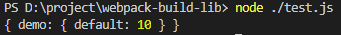
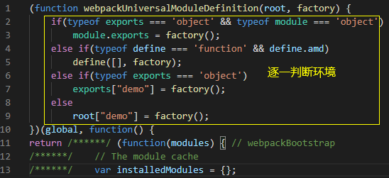
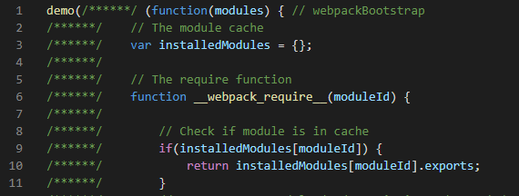

## output.library、output.libraryTarget

正常开发项目时，是用不到这 2 个属性的，但是如果是开发工具库、组件库等，那么这 2 个属性是非常重要的

试想一下，我们发布了一个 npm 包，当用户引入我们开发的库，可能会有哪些方式：

- script 标签引入

```html
<script src="./demo.js"></script>
<script>
    // script 引入 js 后生成全局变量 demo
    demo(...);
</script>
```

- AMD 方式

```js
define(['demo'], function(demo) {
    demo(...);
});
```

- commonjs 方式

```js
const demo = require('demo');

demo(...);
```

- ES Module

```js
import demo from 'demo';

demo(...);
```

为什么这个库可以支持不同的引入方式？亦或如何让这个库支持某一种引入方式？这就需要 output.library、output.libraryTarget 的配置了

### webpack 打包库架构配置

先简单搭建一个 build:lib 架构：

```js
// build/webpack.lib.conf.js
const { CleanWebpackPlugin } = require('clean-webpack-plugin');
const path = require('path');

module.exports = {
    mode: "development", // 使用 development 模式，方便解释打包后的代码
    context: path.resolve(__dirname, '../'),
    entry: './src/index.js', // 入口文件 src/index.js
    output: {
        path: path.resolve(__dirname, '..', 'lib'),
        filename: 'index.js',
    },
    resolve: {
        extensions: ['.js'],
    },
    module: {
        rules: [
            {
                test: /\.js(x?)$/,
                exclude: /node_modules/,
                use: {
                    loader: 'babel-loader', 
                }
            }
        ]
    },
    plugins: [
        new CleanWebpackPlugin(),
    ],
}

```

```js
// 打包文件 src/index.js
const a = 10;
export default a;
```

### output.library

output.library 支持 string 或 object（object 类型限于 libraryTarget: 'umd' 使用）类型的值

output.library 的值被**如何使用**，是根据 output.libraryTarget 的取值不同而不同

下面我们配合 output.libraryTarget 同时了解 output.library

### output.libraryTarget

output.libraryTarget 支持 string 类型的值

此配置的作用是控制 webpack 打包的内容是如何暴露的，通常需要和 output.library 的值一起产生作用

- libraryTarget: 'var'（默认值）

选项需要配合 library 使用，用于将数据暴露给一个指定变量

当配置为 var 时，打包后返回的值，将被绑定到 output.library 指定的变量上，并且 var xx 的形式存在，如下配置：

```js
// build/webpack.lib.conf.js
output: {
    path: path.resolve(__dirname, '..', 'lib'),
    filename: 'index.js',
    library: 'demo',
    libraryTarget: 'var',
},
```

接着执行 npm run build:lib 进行打包

可以看到，打包后文件的输出被放在了一个 demo 变量，以 var 定义：


将这个文件放置随意一个 index.html 旁引入：

```html
<!-- index.html -->
<script src="./lib/index.js"></script>
```


- libraryTarget: 'assign'

选项需要配合 library 使用，用于将数据暴露给一个指定变量

assign 将会把库的返回值分配给一个**没有使用 var 声明的变量**：

```js
output: {
    path: path.resolve(__dirname, '..', 'lib'),
    filename: 'index.js',
    library: 'demo',
    libraryTarget: 'assign',
},
```


同样，对于没有 var 声明的变量，直接在 html 中引入，也会作为全局变量来使用

- libraryTarget: 'this'

将库的返回值分配给 this 对象，由 library 指定属性

当没有设置 library 指定属性时，将直接分配给对象本身

```js
output: {
    path: path.resolve(__dirname, '..', 'lib'),
    filename: 'index.js',
    library: 'demo',
    libraryTarget: 'this',
},
```


如果在 html 中引入改文件，将会在全局作用域下执行 this['demo']，而由于全局环境下 this 是 window，所以同样会在 window 下有一个 demo 属性，结果同 'var' 与 'assign'

- libraryTarget: 'window'

将库的返回值分配给 window 对象，由 library 指定属性

当没有设置 library 指定属性时，将直接分配给对象本身

```js
output: {
    path: path.resolve(__dirname, '..', 'lib'),
    filename: 'index.js',
    library: 'demo',
    libraryTarget: 'window',
},
```


- libraryTarget: 'global'

将库的返回值分配给 global 对象，由 library 指定属性

当没有设置 library 指定属性时，将直接分配给对象本身

这个配置受 target 属性影响，如果 target 为 web（默认）,则会分配给 window，反之 target 为 node，则分配给 global

```js
module.exports = {
    ...
    target: 'node',
    output: {
        path: path.resolve(__dirname, '..', 'lib'),
        filename: 'index.js',
        library: 'demo',
        libraryTarget: 'global',
    },
}
```


- libraryTarget: 'commonjs'

将库的返回值分配给 exports 对象，由 library 指定属性

当没有设置 library 指定属性时，将直接分配给对象本身

```js
output: {
    path: path.resolve(__dirname, '..', 'lib'),
    filename: 'index.js',
    library: 'demo',
    libraryTarget: 'commonjs',
},
```


我们在 node 中进行测试

根目录新建 test.js：

```js
const demo = require('./lib/index.js'); // 引入打包后的文件
console.log(demo);
```

执行 node ./test.js



- libraryTarget: 'commonjs2'

[What is commonjs2](https://github.com/webpack/webpack/issues/1114)

将库的返回值分配给 module.exports 对象，这个选项**不需要 library**

```js
output: {
    path: path.resolve(__dirname, '..', 'lib'),
    filename: 'index.js',
    libraryTarget: 'commonjs2',
},
```


```js
// test.js
const demo = require('./lib/index.js'); // 引入打包后的文件
console.log(demo);
```

- libraryTarget: 'amd'

将库作为 AMD 模块导出

```js
output: {
    path: path.resolve(__dirname, '..', 'lib'),
    filename: 'index.js',
    library: 'demo',
    libraryTarget: 'amd',
},
```


在 require.js 中使用：

```html
<!-- index.html -->
<script data-main="require/main" src="https://cdn.bootcdn.net/ajax/libs/require.js/2.3.6/require.min.js"></script>
```

```js
// require/main.js
require.config({
    paths:{
        "demo": '../lib/index', // 指定为打包后的文件
    }
});

require(['demo'], function(demo) {
    console.log(demo);
});
```

如果没有配置 library，打包结果为：


- libraryTarget: 'umd'

将库的返回值分配给前面几种模块定义系统，使其和 commonjs、AMD 兼容或暴露为全局变量。**通常开发第三方库时会使用这个选项**

在该选项中，library 是必须的

```js
output: {
    path: path.resolve(__dirname, '..', 'lib'),
    filename: 'index.js',
    library: 'demo',
    libraryTarget: 'umd',
},
```



可以看到，umd 配置打出来的包，会去判断当前环境的适用，从而此该包可以适用 commonjs、AMD、全局变量

此外，当配置 umd 时，library 还可以用**对象的形式**分别配置各个环境指定的对象或属性

```js
output: {
    path: path.resolve(__dirname, '..', 'lib'),
    filename: 'index.js',
    library: {
        root: "demo",
        amd: "demo",
        commonjs: "demo",
    },
    libraryTarget: 'umd',
},
```

相当于

```js
output: {
    path: path.resolve(__dirname, '..', 'lib'),
    filename: 'index.js',
    library: 'demo',
    libraryTarget: 'global',
},

+

output: {
    path: path.resolve(__dirname, '..', 'lib'),
    filename: 'index.js',
    library: 'demo',
    libraryTarget: 'amd',
},

+

output: {
    path: path.resolve(__dirname, '..', 'lib'),
    filename: 'index.js',
    library: 'demo',
    libraryTarget: 'commonjs',
},

+

output: {
    path: path.resolve(__dirname, '..', 'lib'),
    filename: 'index.js',
    libraryTarget: 'commonjs2',
},
```

- libraryTarget: 'jsonp'

这个方法会使用 jsonp 方式把结果包裹起来

此处不做过多描述

```js
output: {
    path: path.resolve(__dirname, '..', 'lib'),
    filename: 'index.js',
    library: 'demo',
    libraryTarget: 'jsonp',
},
```

