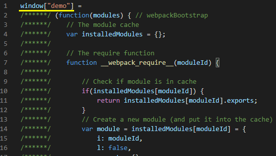
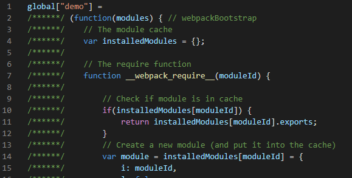
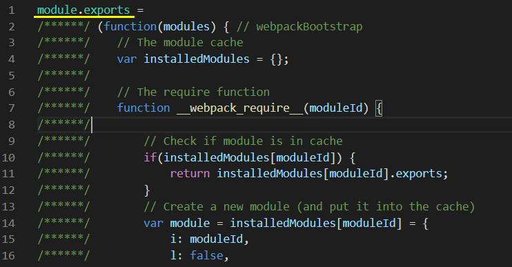

## 打包Library函数库

### 生成umd的Library

我们可以开发自己的函数库，发布到npm上，通过npm install的形式安装到自己的项目中使用，也可以供他人安装使用

    // 1、src下新建utils文件夹，新建src/utils/math.js
    export function add(a, b) {
        return a + b
    }
    
    export function minus(a, b) {
        return a - b
    }
    
    export function multiply(a, b) {
        return a * b
    }
    
    export function division(a, b) {
        return a / b
    }
    
    // 2、入口文件main.js
    import * as math from './utils/math'
    
    export default {
        math,
    }
    
    // 3、配置build/webpack.lib.conf.js
    const path = require('path');
    const { CleanWebpackPlugin } = require('clean-webpack-plugin')
    
    module.exports = {
        mode: 'production',
        context: path.resolve(__dirname, '../'), // 配置上下文，当遇到相对路径时，会以context为根目录
        entry: {
            main: './src/main.js', // 需要打包的文件入口
        },
        output: {
            path: path.resolve(__dirname, '..', 'lib'),
            filename: 'library.js',
        },
        module: {
            rules: [
                {
                    test: /\.js$/, // 使用正则来匹配 js 文件
                    exclude: /node_modules/, // 排除依赖包文件夹
                    use: {
                        loader: 'babel-loader', // 使用 babel-loader
                    }
                },
            ]
        },
        plugins: [
            new CleanWebpackPlugin(),
        ]
    }
    
    // 4、配置package.json的scripts
    "scripts": {
        "lib": "webpack --progress --config build/webpack.lib.conf.js",
    },
    
    
    执行npm run lib
    

这时打出的**library.js**就可以在项目中使用了

但是我们做开源库，用户可能会用这些方式去引用我们的library

    // ES module
    import library from 'library'
    
    // comnmonJS
    const library = require('library')
    
    // AMD
    require(['library'], function() {})
    
    
我们需要同时支持这些形式的引入，需要在webpack.lib.conf.js中加上**libraryTarget**的配置

    output: {
        path: path.resolve(__dirname, '..', 'lib'),
        filename: 'library.js',
        libraryTarget: 'umd', // 配置umd，能够在所有的模块定义下都可运行的方式
    },
    
    在执行npm run lib，这时打出的library.js在上面几种引入方式下，都可以使用了
    
### 本地引入Library得到undefined的常见问题

我们用前一节搭建的开发环境，在入口index.js引入我们打包生成的library.js

    // src/index.js
    import library from '../lib/library'
    
    console.log(library);

    执行npm run dev，在localhost:8080下控制台查看输出
    

非常奇怪的是，我们打出了umd格式的library，但是在本地引入时却引不进来

我们把这句 "object" == typeof exports 删除后，会发现控制台报了错

也就是因为一些原因,**exports**缺失了

经过不断测试，把.babelrc的配置删除以下部分

    // 原本的.babelrc
    {
      "presets": [
        [
          "@babel/preset-env",
          {
            "useBuiltIns": "usage",
            "corejs": 3
          }
        ]
      ],
      "plugins": ["@babel/plugin-transform-runtime"]
    }
    
    // 调整后的.babelrc
    {
      "presets": [
        [
          "@babel/preset-env"
        ]
      ]
    }
    

也就是说导致引入失败的原因，可能是@babel/plugin-transform-runtime在打补丁时导致

查询babel官方资料:

[官方文档babel-plugin-transform-runtime](https://www.babeljs.cn/docs/babel-plugin-transform-runtime)

了解后，我们发现可能是因为commonjs语义保留问题导致

    // 安装解决依赖
    npm i @babel/plugin-transform-modules-commonjs --save-dev
    
    // 配置.babelrc
    {
      "presets": [
        [
          "@babel/preset-env",
          {
            "useBuiltIns": "usage",
            "corejs": 3
          }
        ]
      ],
      "plugins": ["@babel/plugin-transform-runtime", "@babel/plugin-transform-modules-commonjs"]
    }
    
    重新npm run dev，会发现引入成功，不再是undefined了
    
### 生成可以script引入的Library

用户可能还会使用script标签的形式引入，需要在webpack.lib.conf.js中再配置一个**library**属性

    output: {
        path: path.resolve(__dirname, '..', 'lib'),
        filename: 'library.js',
        libraryTarget: 'umd',
        library: 'root', // root 可以随便更换，代表script标签引入后全局的名称
    },
    
    执行npm run lib，在一个html中引入打包有的library.js，就可以在window下看到root变量了
    

    libraryTarget也可以是this、window，node环境下也可以用global，不过一般都是使用umd
    
### externals排除包

**externals**是发布library包非常重要的配置，用于把我们库中所用到的第三方包排除，使之不被一起打入library包中

例如我们的library包引用了jQuery，正常打包后，生成的library.js是包含jQuery代码的，这就导致了，如果用户使用我们的包，并且他自己也引用了jQuery，将会存在两份jQuery的代码，这是非常冗余的，并且可能会引发一些问题(如vue未排除包可能造成组件安装出错)

所以我们需要配置**externals**，将jQuery包排除，使我们的library.js也去引用用户自己的jQuery，而不是一起打进包中

    // 配置webpack.lib.js
    const path = require('path');
    const { CleanWebpackPlugin } = require('clean-webpack-plugin')
    
     module.exports = {
        mode: 'production',
        entry: {
            main: './src/index.js', // 需要打包的文件入口
        },
        output: {
            path: path.resolve(__dirname, 'lib'),
            filename: 'library.js',
            libraryTarget: 'umd',
            library: 'lib',
        },
        externals: {
            "jquery": {
                commonjs: "jQuery",
                commonjs2: "jQuery",
                amd: "jQuery",
                root: "$"
            },
            //jquery: 'jQuery' // 也可以这样，那上方4个属性值对应的都是jQuery
        },
        module: {
            rules: [
                {
                    test: /\.js$/, // 使用正则来匹配 js 文件
                    exclude: /node_modules/, // 排除依赖包文件夹
                    use: {
                        loader: 'babel-loader', // 使用 babel-loader
                    }
                },
            ]
        },
        plugins: [
            new CleanWebpackPlugin(),
        ]
    }
        
        注: externals可以是数组、对象、函数等，其他配置具体可以在官网文档了解
    
    // 入口文件src/index.js
    import $ from 'jquery'
    
    const jQueryObj = (text) => {
        return $(text)
    }
    
    
    export default {
        jQueryObj,
    }
    
    执行npm run lib生成library.js
    

(有externals)

(没有externals)

接着我们将这个library.js包放到本地项目中

接着我们在本地项目中安装jquery，再重新启动项目

    npm i jquery --save
    

这就是做到了让library.js在使用jQuery时，使用的是我们本地安装的jQuery，而不把jQuery打进包中，导致存在2份jQuery代码

#### 分析externals配置

问题:

为什么配置externals，可以使library.js自动去引用本地项目的jQuery？

externals配置中的commonjs、commonjs2、amd、root是什么意思？

...