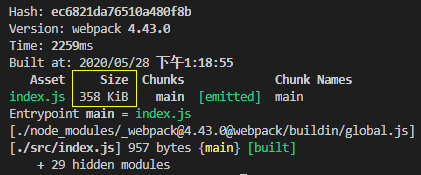
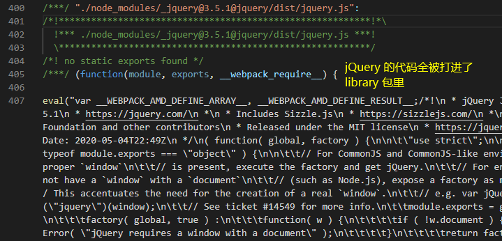
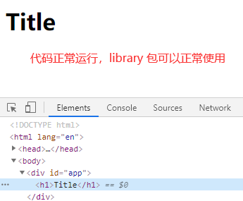
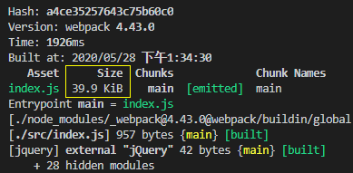
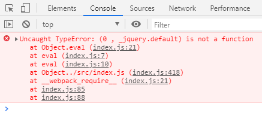

## PWA

我们先模拟将开发后打包的代码放于服务器的场景

    // 1、打包项目
    npm run build 打包项目，生成dist文件夹，里面是打包后的代码
    
    // 2、安装本地服务器
    npm i http-server -D
    
    // 3、配置package.json
    "scripts": {
        "start": "http-server dist", // 添加start执行
        "dev": "webpack-dev-server --progress --config build/webpack.dev.conf.js",
        "build": "webpack --progress --config build/webpack.prod.conf.js"
    },
    
    // 4、启动本地服务器
    npm run start
    

这时**Ctrl + C**关闭本地服务，模拟**服务器奔溃**，重新刷新页面

页面访问失败

而PWA，则可以在第一次访问成功时，做一个缓存，在服务器挂掉后依然可以访问这个页面

    // 安装插件
    npm i workbox-webpack-plugin -D
    
    // 配置webpack.prod.conf.js
    const WorkboxPlugin = require('workbox-webpack-plugin') // 引入 PWA 插件
    
    ...
    
    plugins: [
        ...
        // 配置 PWA
        new WorkboxPlugin.GenerateSW({
          clientsClaim: true,
          skipWaiting: true
        }),
        ...
    ]
    
    // 配置入口文件src/main.js
    加上:
    if ('serviceWorker' in navigator) {
        window.addEventListener('load', () => {
            navigator.serviceWorker
                .register('/service-worker.js')
                .then(registration => {
                    console.log('service-worker registed')
                })
                .catch(error => {
                    console.log('service-worker registed error')
                })
        })
    }
    
    执行npm run build打包项目

    执行npm run start启动本地服务

    Ctrl + C 关闭本地服务后再刷新页面，就可以发现页面做了缓存，不会提示“无法访问此网站”
    
    