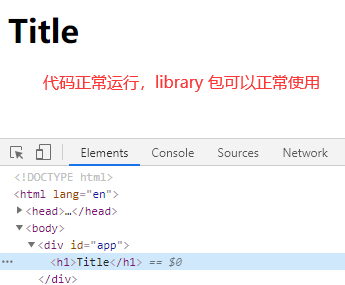
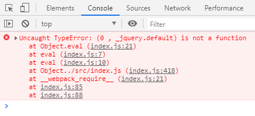

## PWA

我们先模拟将开发后打包的代码放于服务器的场景

    // 1、打包项目
    npm run build 打包项目，生成dist文件夹，里面是打包后的代码
    
    // 2、安装本地服务器
    npm i http-server -D
    
    // 3、配置package.json
    "scripts": {
        "start": "http-server dist", // 添加start执行
        "dev": "webpack-dev-server --progress --config build/webpack.dev.conf.js",
        "build": "webpack --progress --config build/webpack.prod.conf.js"
    },
    
    // 4、启动本地服务器
    npm run start
    

这时**Ctrl + C**关闭本地服务，模拟**服务器奔溃**，重新刷新页面

页面访问失败

而PWA，则可以在第一次访问成功时，做一个缓存，在服务器挂掉后依然可以访问这个页面

    // 安装插件
    npm i workbox-webpack-plugin -D
    
    // 配置webpack.prod.conf.js
    const WorkboxPlugin = require('workbox-webpack-plugin') // 引入 PWA 插件
    
    ...
    
    plugins: [
        ...
        // 配置 PWA
        new WorkboxPlugin.GenerateSW({
          clientsClaim: true,
          skipWaiting: true
        }),
        ...
    ]
    
    // 配置入口文件src/main.js
    加上:
    if ('serviceWorker' in navigator) {
        window.addEventListener('load', () => {
            navigator.serviceWorker
                .register('/service-worker.js')
                .then(registration => {
                    console.log('service-worker registed')
                })
                .catch(error => {
                    console.log('service-worker registed error')
                })
        })
    }
    
    执行npm run build打包项目

    执行npm run start启动本地服务

    Ctrl + C 关闭本地服务后再刷新页面，就可以发现页面做了缓存，不会提示“无法访问此网站”
    
## TypeScript

TypeScript是JavaScript的超集，可以编译成JavaScript，主要给JavaScript添加语言扩展，类型校验体系让代码更有规范性

### 常规配置

    // 1、安装依赖
    npm i ts-loader typescript --save-dev
    
    // 2、配置webpack.config.js
    const path = require('path')
    const { CleanWebpackPlugin } = require('clean-webpack-plugin')
    
    module.exports = {
        mode: 'production',
        entry: {
            index: './src/index.ts', // 需要打包的文件入口
        },
        output: {
            path: path.resolve(__dirname, '..', 'dist'),
            filename: '[name].js',
        },
        resolve: {
            extensions: ['.ts', '.js'],
            alias: {
                '@': path.join(__dirname, '..', 'src'),
            },
        },
        module: {
            rules: [
                {
                    test: /\.js$/, // 使用正则来匹配 js 文件
                    exclude: /node_modules/, // 排除依赖包文件夹
                    use: {
                        loader: 'babel-loader', // 使用 babel-loader
                    }
                },
                {
                    test: /\.ts?$/,
                    use: 'ts-loader',
                    exclude: /node_modules/
                },
            ]
        },
        plugins: [
            new CleanWebpackPlugin(),
        ]
    }
    
    // 3、在src下新建index.ts
    interface Ani {
        <T>(value: T): string;
    }
    
    const getAni:Ani = (value) => {
        return `${value}`;
    }
    
    console.log(getAni<number>(99));
    
    export {
        getAni,
    }
    
    // 4、在根目录下新建tsconfig.json
    {
        "compilerOptions": {
            "outDir": "./dist", // 输出路径，可以省略
            "module": "commonjs", // 指定生成哪个模块系统代码
            "target": "es5", // 打包成es5
            "allowJs": true, // 允许在ts中也能引入js的文件
            "lib": ["es2017", "es7", "es6", "dom"], // 编译过程要引入的库
        }
    }
    
    // 5、配置package.json
    "scripts": {
        "build": "webpack --progress"
    },
    
    执行npm run build就可以打包出dist/index.js
    
更多**tsconfig.json**配置参考: [选项配置 TypeScript](https://www.tslang.cn/docs/handbook/compiler-options.html)

### 引入第三方库

我们在ts中引入第三方库如: lodash-es

    // 1、安装依赖
    npm i lodash-es --save
    
    // 2、修改src/index.ts
    import { join } from 'lodash'
    
    console.log(join([1, 2, 3], 1));
    

typescript类型校验的优势没有体现

**解决方案:**

安装TypeScript的相应插件

    npm install --save @types/lodash-es
    
    安装后会发现类型提示出现了
    

**如何查询第三方库对应的TypeScript插件?**

在 [TypeSearch](https://microsoft.github.io/TypeSearch/) 中查询对应的第三方库，如搜索lodash-es

**注:**

如果导入的是lodash这种没有ES模块的库，要注意引入方式

    // 错误方式
    import _ from 'lodash'
    
    // 正确方式
    import * as _from 'lodash'

### 生成index.d.ts
    
我们在使用第三方拥有TypeScript的库时，会发现库中存在一个**index.d.ts**的文件

    // 配置tsconfig.json
    {
        "compilerOptions": {
            "outDir": "./dist", // 输出路径，可以省略
            "module": "commonjs", // 指定生成哪个模块系统代码
            "target": "es5", // 打包成es5
            "declaration": true, // 生成index.d.ts
            "declarationDir": "./dist"
            "lib": ["es2017", "es7", "es6", "dom"], // 编译过程要引入的库
        }
    }
    
    执行npm run build，可以看到生成了index.d.ts
    
    // 配置package.json
    {
        ...
        "main": "dist/index.js",
        "types": "dist/index.d.ts",
        ...
    }
    
    指定main和types，在发布包到npm后，用户引用你的包，types会告诉它去dist下找index.d.ts找类型定义文件
    

    