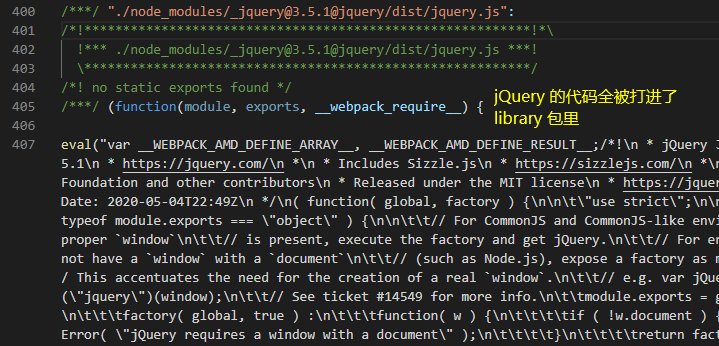
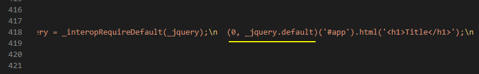

## externals

**externals** 是发布 library 包非常重要的配置，用于把我们库中所用到的第三方包排除，使之不被一起打入 library 包中

```js
import $ from 'jquery';
const utils = {
    createTitle() {
        $('#app').html('<h1>Title</h1>');
    }
};
export default utils;
```

上方代码假设是我们准备发布到 npm 的工具库，这个工具库用到了 JQuery 这个第三方包，正常打包后，生成的 library 包 index.js 是包含 jQuery 代码的，即连 jQuery 代码也一起打了进去

这就导致了，如果用户使用我们的包，并且他自己也有引用 jQuery，将会存在两份 jQuery 的代码，这显然是冗余的，并且可能会引发一些问题(如未排除 vue 可能造成组件安装出错)

而 externals 就是为了帮我们解决这个问题，它让我们可以配置：在打包时将 jQuery 包排除，**不一起打进 index.js 中，并保留引用**。而当用户在使用我们的 index.js 时，里面的 jQuery 则去使用用户环境下的 jQuery


### 不使用 externals

同样使用上一节配置的 webpack.lib.conf.js：

```js
// build/webpack.lib.conf.js
const { CleanWebpackPlugin } = require('clean-webpack-plugin');
const path = require('path');

module.exports = {
    mode: "development",
    context: path.resolve(__dirname, '../'),
    entry: './src/index.js',
    output: {
        path: path.resolve(__dirname, '..', 'lib'),
        filename: 'index.js', // 打包出 library 文件
        library: 'demo',
        libraryTarget: 'window', // 这里用 window 配置示例
    },
    resolve: {
        extensions: ['.js', '.jsx', '.json', '.scss', '.css'],
        alias: {
            '@': path.join(__dirname, '..', 'dist'),
        },
    },
    module: {
        rules: [
            {
                test: /\.js(x?)$/, // 使用正则来匹配 js 文件
                exclude: /node_modules/, // 排除依赖包文件夹
                use: {
                    loader: 'babel-loader', // 使用 babel-loader
                }
            }
        ]
    },
    plugins: [
        new CleanWebpackPlugin(),
    ],
}

```

```js
// src/index.js
import $ from 'jquery';
$('#app').html('<h1>Title</h1>');

const a = 10;
export default a;
```

执行 npm run build:lib 打包 library




可以看到，我们打出来的包还是比较大的，并且 jQuery 的源码全被打进了我们的 library 包里

由于我们配置的 libraryTarget 是 window，直接在随意一个 index.html 中试验即可：

```html
<!-- index.html -->
<body>
    <div id="app"></div>
</body>
<!-- 引入我们的 library 包 -->
<script src="./lib/index.js"></script>
```
打开 HTML 文件就可以看到包正常运转


### 使用 externals

就如前面提起的，我们不希望打出来的 library 包里包含 jQuery 代码，这样很明显存在问题：

- 一旦用户环境下也有 jQuery 包，这是多余的

- library 包很大

接着我们配置 externals 来解决这个问题：

```js
// build/webpack.lib.conf.js
module.exports = {
    externals: {
        jquery: "jQuery",
    },
    output: {
        path: path.resolve(__dirname, '..', 'lib'),
        filename: 'index.js',
        library: 'demo',
        libraryTarget: 'window',
    },
}
```

执行 npm run build:lib 打包 library


可以很清晰的看到，现在 library 包的大小缩小了非常多

同样是 index.html 中引入后打开页面，会发现页面报错


我们先不看打出的 library 包源码，先在 html 中引入 jQuery 库：

```html
<!-- index.html -->
<body>
    <div id="app"></div>
</body>
<!-- 引入 jQuery 库，cdn 或本地 js 文件 -->
<script src="https://cdn.bootcdn.net/ajax/libs/jquery/3.5.1/jquery.min.js"></script>
<script src="./lib/index.js"></script>
```

重新刷新页面，会发现正常运行不报错了

为什么用户方引入了自己的 jQuery 包后就可以正常运行了？

现在回过头看一下 library 源码，看看 externals 到底做了什么




查看 library 源码后，可以知道 jquery 并没有被打包进 library 包中，externals 属性对我们的 import $ from 'jquery' 做了保留，让我们 import 的 'jquery'，去使用 **window 下的 jQuery**

即 **externals 的 key 是我们 import XXX from 'YYY' 的 YYY，value 是用户方提供的包或变量名**（如全局下提供了 **jQuery** 变量）

一开始在我们未引入全局 jQuery 时，使用 library 库是报错的，因为 window 下找不到 jQuery 变量

而当我们引入全局 jQuery 后，图例中的 window[\\"jQuery\\"] 可以正确获取变量，便可以正常运行

### externals 与 libraryTarget

libraryTarget 决定了我们的 library 运行在哪个环境

而运行在哪个环境，同样也决定了我们这些被 externals 排除的模块是使用哪种模式去加载包（如上例中设置了 window 环境，可以看到被排除的 jQuery 去引用了 window 下的 jQuery 变量），**externals 应该和 libraryTarget 保持一致**，如果 library 运行在浏览器环境，我们 externals 的确实 commonjs 模式，那代码将运行出错

下面我们看看其他 libraryTarget 环境对 externals 的模块影响

- libraryTarget: 'global'

```js
// build/webpack.lib.conf.js
module.exports = {
    target: 'node', // node 环境，默认会在浏览器环境
    externals: {
        jquery: "jQuery",
    },
    output: {
        path: path.resolve(__dirname, '..', 'lib'),
        filename: 'index.js',
        library: 'demo',
        libraryTarget: 'global',
    },
}
```


在 global 下获取 jQuery 变量给被排除的 jquery 模块

- libraryTarget: 'commonjs(2?)'

```js
// build/webpack.lib.conf.js
module.exports = {
    externals: {
        jquery: "jQuery",
    },
    output: {
        path: path.resolve(__dirname, '..', 'lib'),
        filename: 'index.js',
        library: 'demo',
        libraryTarget: 'commonjs',
        // 或 libraryTarget: 'commonjs2',
    },
}
```


commonjs 环境使用 require 引入被打包时排除的 jquery 模块

- libraryTarget: 'amd'

```js
// build/webpack.lib.conf.js
module.exports = {
    externals: {
        jquery: "jQuery",
    },
    output: {
        path: path.resolve(__dirname, '..', 'lib'),
        filename: 'index.js',
        library: 'demo',
        libraryTarget: 'amd',
    },
}
```


AMD 环境使用 define 的依赖项参数引入被打包时排除的 jquery 模块

- libraryTarget: 'umd'

```js
// build/webpack.lib.conf.js
module.exports = {
    externals: {
        jquery: "jQuery",
    },
    output: {
        path: path.resolve(__dirname, '..', 'lib'),
        filename: 'index.js',
        library: 'demo',
        libraryTarget: 'umd',
    },
}
```


umd 打包后的 library，被排除的 jquery 模块根据当前环境逐一判断选择的引入方式

### externals 规定运行环境

除了用 libraryTarget 指定运行环境，也可以直接在 externals 上单独指定环境：

```js
// build/webpack.lib.conf.js
module.exports = {
    externals: {
        jquery: "commonjs jQuery", // 指定 commonjs 环境
    },
    output: {
        path: path.resolve(__dirname, '..', 'lib'),
        filename: 'index.js',
        library: 'demo',
        libraryTarget: 'window', // 指定 window 环境
    },
}
```


可以看到，即使 libraryTarget 指定了 window 是环境，但是对于被排除的包的引入方式，还是 externals 单独配置的环境优先级高

### externals 对象形式

除了配置字符串，externals 还可以是数组、对象、函数等，其他配置具体可以在官网文档了解，这里讲一下比较常用的对象形式

通常 externals 对象形式用于 libraryTarget: 'umd'，配置不同环境下，被排除的模块的引入方式

```js
// build/webpack.lib.conf.js
module.exports = {
    externals: {
        jquery: {
            commonjs: "jQuery",
            commonjs2: "jQuery",
            amd: "jQuery",
            root: "$", // 让全局环境下去取 $ 变量给打包时被排除的 jquery 模块
        },
    },
    output: {
        path: path.resolve(__dirname, '..', 'lib'),
        filename: 'index.js',
        library: 'demo',
        libraryTarget: 'umd',
    },
}
```


可以看到，现在全局环境下现在换成取 $ 变量来代替被排除的 jquery 模块

当然，如果在之前的 index.html 下引入还是可以正常工作的

```html
<!-- index.html -->
<body>
    <div id="app"></div>
</body>
<!-- 引入 jQuery 库，cdn 或本地 js 文件 -->
<script src="https://cdn.bootcdn.net/ajax/libs/jquery/3.5.1/jquery.min.js"></script>
<script src="./lib/index.js"></script>
```

因为引入的 jquery.min.js 不仅在全局环境下有 jQuery 变量，同时也有 $ 变量来兼容

### externals 键值疑问

前面说过：**externals 的 key 是我们 import XXX from 'YYY' 的 YYY，value 是用户方提供的包或变量名**

我们可能会思考，为什么不能是：

```js
externals: {
    "jquery": {
        commonjs: "jquery",
        commonjs2: "jquery",
        amd: "jquery",
        root: "jquery",
    }
},
```

这样的主要问题在于 **root: "jquery"**

因为全局引入的 jQuery.min.js 文件，挂载到 window 下的变量是 jQuery 与 $ ，就会导致删除导出的 library 中，最后的 factory(root[\"jquery\"]) 获取到的是 undefined

下面用一个小示例也演示一下

假设我们的打包配置如下：

```js
// build/webpack.lib.conf.js
module.exports = {
    externals: {
        jquery: {
            commonjs: "jQuery",
            commonjs2: "jQuery",
            amd: "jQuery",
            root: "KKK", // 配置为 KKK，用于等等测试
        },
    },
    output: {
        path: path.resolve(__dirname, '..', 'lib'),
        filename: 'index.js',
        library: 'demo',
        libraryTarget: 'umd',
    },
}
```

npm run build:lib 打包后在 index.html 引入

```html
<!-- index.html -->
<body>
    <div id="app"></div>
</body>
<script src="./lib/index.js"></script>
```

打开页面，这时显然是会报错的，因为全局环境下找不到 KKK 变量

我们手动创建：

```html
<!-- index.html -->
<body>
    <div id="app"></div>
</body>
<script>
    window.KKK = function() {
        return {
            html() {
                console.log('test');
            }
        }
    }
</script>
<script src="./lib/index.js"></script>
```

这时刷新页面，就会发现不报错了