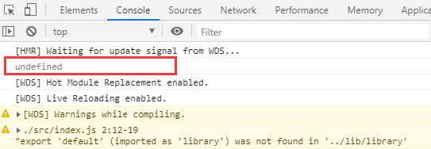

## eslint配置

为了让代码让规范，项目开发中通常会安装eslint来校验代码的格式

可以根据定制的规范去矫正代码写法，配置具体可了解 [eslint配置规则](https://cn.eslint.org)
    
    // 安装依赖
    npm i eslint eslint-loader --save-dev
    
    // 根目录下初始化一份.eslintrc.js文件
    执行npx eslint --init
    

    
    // 生成.eslintrc.js文件
    module.exports = {
        "env": {
            "browser": true,
            "es6": true
        },
        "extends": "eslint:recommended",
        "globals": {
            "Atomics": "readonly",
            "SharedArrayBuffer": "readonly"
        },
        "parserOptions": {
            "ecmaVersion": 2018,
            "sourceType": "module"
        },
        "rules": {
        }
    };
    
    // 配置webpack.config.js
    const path = require('path')
    const { CleanWebpackPlugin } = require('clean-webpack-plugin')
    
    module.exports = {
        mode: 'production',
        entry: {
            index: './src/index.js',
        },
        output: {
            path: path.resolve(__dirname, '..', 'dist'),
            filename: '[name].js',
        },
        resolve: {
            extensions: ['.ts', '.js'],
            alias: {
                '@': path.join(__dirname, '..', 'src'),
            },
        },
        module: {
            rules: [
                {
                    test: /\.js$/,
                    exclude: /node_modules/,
                    loader: ['babel-loader', 'eslint-loader'], // 配置eslint
                },
            ]
        },
        plugins: [
            new CleanWebpackPlugin(),
        ]
    }
