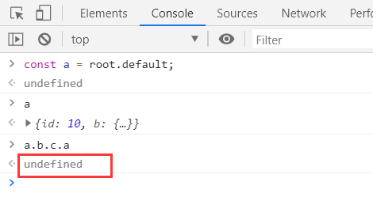

## eslint配置

为了让代码让规范，项目开发中通常会安装eslint来校验代码的格式

可以根据定制的规范去矫正代码写法，配置具体可了解 [eslint配置规则](https://cn.eslint.org)

### 常规配置

    // 1、安装依赖
    npm i eslint eslint-loader --save-dev
    
    // 2、根目录下初始化一份.eslintrc.js文件
    执行npx eslint --init
    

    
    // 3、生成.eslintrc.js文件
    module.exports = {
        "env": {
            "browser": true,
            "es6": true
        },
        "extends": "eslint:recommended",
        "globals": {
            "Atomics": "readonly",
            "SharedArrayBuffer": "readonly"
        },
        "parserOptions": {
            "ecmaVersion": 2018,
            "sourceType": "module"
        },
        "rules": {
        }
    };
    
    // 4、配置webpack.config.js
    const path = require('path')
    const { CleanWebpackPlugin } = require('clean-webpack-plugin')
    
    module.exports = {
        mode: 'production',
        entry: {
            index: './src/index.js',
        },
        output: {
            path: path.resolve(__dirname, '..', 'dist'),
            filename: '[name].js',
        },
        resolve: {
            extensions: ['.js'],
            alias: {
                '@': path.join(__dirname, '..', 'src'),
            },
        },
        module: {
            rules: [
                {
                    test: /\.js$/, // 使用正则来匹配 js 文件
                    exclude: /node_modules/, // 排除依赖包文件夹
                    use: [
                        'babel-loader',
                        {
                            loader: 'eslint-loader',
                            options: {
                                fix: true, // 自动修复一些可以修复的错误，不能修复的还是需要自己修复
                            }
                        }
                    ],
                },
            ]
        },
        plugins: [
            new CleanWebpackPlugin(),
        ]
    }
    
    // 5、编写src/index.js入口文件
    let a = 1
    
    console.log(1);
    
    // 6、配置package.json
    "scripts": {
        "lint": "eslint --ext .js src/"  // 编译 src下的js文件
    },
    
    执行npm run lint
    

### 编辑器开启eslint

我们还可以让自己的编辑器开启eslint去自动检测

以VSCode为例

## 打包dll库

在我们使用第三方库(如lodash、jquery)时，这些库的代码一般是不会改变的

但是在我们打包项目时，每次都会重新将这些库的代码打入生成的main.bundle.js或拆分出的vendors.bundle.js，不断的对第三方库进行打包显然是多余的

我们可以使用**DllPlugin**，将第三方库单独打包出**vendors.dll.js**，当在打包项目时，自动去引入我们单独打包的**vendors.dll.js**,而不是引入**node_modules**中的文件

    // 1、编写src/index.js入口文件，引入第三方库
    import $ from 'jquery'
    import _ from 'lodash'
    
    console.log($('body'));
    console.log(_.join([1, 2], '~'));

    // 2、build下新建webpack.dll.conf.js文件，专门打包第三方库
    const path = require('path')
    const webpack = require('webpack')
    const { CleanWebpackPlugin } = require('clean-webpack-plugin')
    
    module.exports = {
        mode: 'production',
        entry: {
            vendors: ['lodash', 'jquery']
        },
        output: {
            filename: '[name].dll.js',
            path: path.resolve(__dirname, '../dll'),
            library: '[name]', 
        },
        plugins: [
            new CleanWebpackPlugin(),
        ],
    }
    
    // 3、配置package.json
    "scripts": {
        "dev": "webpack-dev-server --progress --config build/webpack.dev.conf.js",
        "build": "webpack --progress --config build/webpack.prod.conf.js",
        "build:dll": "webpack --progress --config build/webpack.dll.conf.js",
    },
    
    执行pm run build:dll

