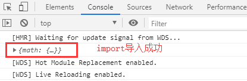

## eslint配置

为了让代码让规范，项目开发中通常会安装eslint来校验代码的格式

可以根据定制的规范去矫正代码写法，配置具体可了解 [eslint配置规则](https://cn.eslint.org)

### 常规配置
    
```text
// 1、安装依赖
npm i eslint eslint-loader --save-dev

// 2、根目录下初始化一份.eslintrc.js文件
执行npx eslint --init
```
    

    
```js
// 3、生成.eslintrc.js文件
module.exports = {
    "env": {
        "browser": true,
        "es6": true
    },
    "extends": "eslint:recommended",
    "globals": {
        "Atomics": "readonly",
        "SharedArrayBuffer": "readonly"
    },
    "parserOptions": {
        "ecmaVersion": 2018,
        "sourceType": "module"
    },
    "rules": {
    }
};

// 4、配置webpack.config.js
const path = require('path')
const { CleanWebpackPlugin } = require('clean-webpack-plugin')

module.exports = {
    mode: 'production',
    entry: {
        index: './src/index.js',
    },
    output: {
        path: path.resolve(__dirname, '..', 'dist'),
        filename: '[name].js',
    },
    resolve: {
        extensions: ['.js'],
        alias: {
            '@': path.join(__dirname, '..', 'src'),
        },
    },
    module: {
        rules: [
            {
                test: /\.js$/, // 使用正则来匹配 js 文件
                exclude: /node_modules/, // 排除依赖包文件夹
                use: [
                    'babel-loader',
                    {
                        loader: 'eslint-loader',
                        options: {
                            fix: true, // 自动修复一些可以修复的错误，不能修复的还是需要自己修复
                        }
                    }
                ],
            },
        ]
    },
    plugins: [
        new CleanWebpackPlugin(),
    ]
}

// 5、编写src/index.js入口文件
let a = 1

console.log(1);

// 6、配置package.json
"scripts": {
    "lint": "eslint --ext .js src/"  // 编译 src下的js文件
},

执行npm run lint
```
    


### 编辑器开启eslint

我们还可以让自己的编辑器开启eslint去自动检测

以VSCode为例


## 打包dll库

在我们使用第三方库(如lodash、jquery)时，这些库的代码一般是不会改变的

但是在我们打包项目时，每次都会重新将这些库的代码打入生成的main.bundle.js或拆分出的vendors.bundle.js，不断的对第三方库进行打包显然是多余的

我们可以使用**DllPlugin**，将第三方库单独打包出**vendors.dll.js**，当在打包项目时，自动去引入我们单独打包的**vendors.dll.js**,而不是引入**node_modules**中的文件

```js
// 1、编写src/index.js入口文件，引入第三方库
import $ from 'jquery'
import _ from 'lodash'

console.log($('body'));
console.log(_.join([1, 2], '~'));

// 2、build下新建webpack.dll.conf.js文件，专门打包第三方库
const path = require('path')
const webpack = require('webpack')
const { CleanWebpackPlugin } = require('clean-webpack-plugin')

module.exports = {
    mode: 'production',
    entry: {
        vendors: ['lodash', 'jquery']
    },
    output: {
        filename: '[name].dll.js',
        path: path.resolve(__dirname, '../dll'),
        library: '[name]', // 挂载全局对象，这里指入口文件名vendors作为全局变量
    },
    plugins: [
        new CleanWebpackPlugin(),
    ],
}

// 3、配置package.json
"scripts": {
    "dev": "webpack-dev-server --progress --config build/webpack.dev.conf.js",
    "build": "webpack --progress --config build/webpack.prod.conf.js",
    "build:dll": "webpack --progress --config build/webpack.dll.conf.js",
},

执行pm run build:dll
```


### 如何让项目使用vendors.dll.js?

```js
// 1、安装依赖
npm i add-asset-html-webpack-plugin

// 2、配置webpack.base.conf.js
const AddAssetHtmlWebpackPlugin = require('add-asset-html-webpack-plugin')
...

module.exports = {
    ...
    plugins: [
        ...
        // 让html自动引入vendors.dll.js文件
        new AddAssetHtmlWebpackPlugin({
            filepath: path.resolve(__dirname, '../dll/vendors.dll.js') // 对应的 dll 文件路径
        }),
    ]
}

执行npm run build，打开生成的index.html
```
    


### 如何让项目使用dll文件中的库，而不是node_modules中的?

```js
// 1、配置webpack.dll.conf.js文件
const path = require('path')
const webpack = require('webpack')
const { CleanWebpackPlugin } = require('clean-webpack-plugin')

module.exports = {
    mode: 'production',
    entry: {
        vendors: ['lodash', 'jquery']
    },
    output: {
        filename: '[name].dll.js',
        path: path.resolve(__dirname, '../dll'),
        library: '[name]'
    },
    plugins: [
        new CleanWebpackPlugin(),
        new webpack.DllPlugin({
            name: '[name]',
            // 用这个插件来分析打包后的这个库，把库里的第三方映射关系放在了这个 json 的文件下，这个文件在 dll 目录下
            path: path.resolve(__dirname, '../dll/[name].manifest.json')
        })
    ],
}

执行npm run build:dll重新生成vendors.dll.js，并且多生成了一份vendors.manifest.json存储映射关系
```
    

    
```js
// 2、配置webpack.base.conf.js，添加webpack.DllReferencePlugin 插件
const AddAssetHtmlWebpackPlugin = require('add-asset-html-webpack-plugin')
const webpack = require('webpack')
...

module.exports = {
    ...
    plugins: [
        ...
        // 让html自动引入vendors.dll.js文件
        new AddAssetHtmlWebpackPlugin({
            filepath: path.resolve(__dirname, '../dll/vendors.dll.js') // 对应的 dll 文件路径
        }),
        // 引入我们打包后的映射文件
        new webpack.DllReferencePlugin({
            manifest: path.resolve(__dirname, '../dll/vendors.manifest.json')
        }),
    ]
}

这样配置后，就可以结合全局变量vendors和新生成的vendors.manifest.json映射文件进行分析
一旦分析出使用的第三方库在vendors.dll.js中，就会去使用vendors.dll.js，不会使用node_modules的

执行npm run build
```
    


```js
注释掉webpack.base.conf.js中的webpack.DllReferencePlugin配置
const AddAssetHtmlWebpackPlugin = require('add-asset-html-webpack-plugin')
const webpack = require('webpack')
...

module.exports = {
    ...
    plugins: [
        ...
        // 让html自动引入vendors.dll.js文件
        new AddAssetHtmlWebpackPlugin({
            filepath: path.resolve(__dirname, '../dll/vendors.dll.js') // 对应的 dll 文件路径
        }),
        // 引入我们打包后的映射文件
        /*new webpack.DllReferencePlugin({
            manifest: path.resolve(__dirname, '../dll/vendors.manifest.json')
        }),*/
    ]
}
执行npm run build打包进行打包对比
```
    


虽然看起来差别只有400ms，但是当我们项目中引用的第三方库越来越多时，打包性能就会提升非常明显了

### 拆分dll库

```js
// 1、修改webpack.dll.conf.js
const path = require('path')
const webpack = require('webpack')
const { CleanWebpackPlugin } = require('clean-webpack-plugin')

module.exports = {
    mode: 'production',
    entry: {
        // 将lodash和jquery拆分 
        lodash: ['lodash'],
        jquery: ['jquery'],
    },
    output: {
        filename: '[name].dll.js',
        path: path.resolve(__dirname, '../dll'),
        library: '[name]'
    },
    plugins: [
        new CleanWebpackPlugin(),
        new webpack.DllPlugin({
            name: '[name]',
            // 用这个插件来分析打包后的这个库，把库里的第三方映射关系放在了这个 json 的文件下，这个文件在 dll 目录下
            path: path.resolve(__dirname, '../dll/[name].manifest.json')
        })
    ],
}

执行npm run build:dll
```
    

    
```js
配置webpack.base.conf.js:
module.exports = {
    ...
    plugins: [
        ...
        new AddAssetHtmlWebpackPlugin({
            filepath: path.resolve(__dirname, '../dll/lodash.dll.js')
        }),
        new AddAssetHtmlWebpackPlugin({
            filepath: path.resolve(__dirname, '../dll/jquery.dll.js')
        }),
        new webpack.DllReferencePlugin({
            manifest: path.resolve(__dirname, '../dll/lodash.manifest.json')
        }),
        new webpack.DllReferencePlugin({
            manifest: path.resolve(__dirname, '../dll/jquery.manifest.json')
        })
    ]
}

显而易见，当引用大量的第三库时，这样依次去配置是非常不友好的

// 2、在webpack.base.conf.js中使用node的fs模块读取dll文件夹下的dll.js与manifest.json
const AddAssetHtmlWebpackPlugin = require('add-asset-html-webpack-plugin')
const webpack = require('webpack')
const fs = require('fs')
...

const files = fs.readdirSync(path.resolve(__dirname, '../dll'))
const dllPlugins = [];
files.forEach(file => {
    /.*\.dll.js/.test(file) && dllPlugins.push(
        new AddAssetHtmlWebpackPlugin({
            filepath: path.resolve(__dirname, '../dll', file)
        })
    );
    /.*\.manifest.json/.test(file) && dllPlugins.push(
        new webpack.DllReferencePlugin({
            manifest: path.resolve(__dirname, '../dll', file)
        })
    )
})

module.exports = {
    ...
    plugins: [
        ...
        ...dllPlugins,
    ]
}

执行npm run build，打开生成的index.html
```
    
