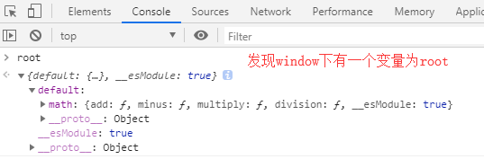

## 打包 Library 函数库

### 生成 umd 的 library

我们可以开发自己的函数库，发布到 npm 上，通过npm install 的形式安装到自己的项目中使用，也可以供他人安装使用

打包 library 的流程其实前面都已经讲过，这里再过一下并举些常见问题

```js
// 1、src 下新建utils文件夹，新建 src/utils/math.js
export function add(a, b) {
    return a + b
}

export function minus(a, b) {
    return a - b
}

export function multiply(a, b) {
    return a * b
}

export function division(a, b) {
    return a / b
}
```

```js
// 2、打包入口文件 src/index.js
import * as math from './utils/math'

export default {
    math,
}
```

```js
// 3、配置build/webpack.lib.conf.js
const path = require('path');
const { CleanWebpackPlugin } = require('clean-webpack-plugin')

module.exports = {
    mode: 'production',
    context: path.resolve(__dirname, '../'), // 配置上下文，当遇到相对路径时，会以context为根目录
    entry: {
        main: './src/index.js', // 需要打包的文件入口
    },
    output: {
        path: path.resolve(__dirname, '..', 'lib'),
        filename: 'library.js',
    },
    module: {
        rules: [
            {
                test: /\.js$/, // 使用正则来匹配 js 文件
                exclude: /node_modules/, // 排除依赖包文件夹
                use: {
                    loader: 'babel-loader', // 使用 babel-loader
                }
            },
        ]
    },
    plugins: [
        new CleanWebpackPlugin(),
    ]
}
```

```js
// 4、配置package.json的scripts
"scripts": {
    "build:lib": "webpack --progress --config build/webpack.lib.conf.js"
},
```

执行 npm run build:lib

这时打出的 **library** 就可以在项目中使用了

但是前面我们说过，做开源库，用户可能会用这些方式去引用我们的 library：

```js
// ES module
import library from 'library'

// comnmonJS
const library = require('library')

// AMD
require(['library'], function() {})
```
    
    
我们需要同时支持这些形式的引入，那么就要加上 **libraryTarget** 的配置

```js
output: {
    path: path.resolve(__dirname, '..', 'lib'),
    filename: 'library.js',
    libraryTarget: 'umd', // 配置 umd，能够在所有的模块定义下都可运行的方式
},
```

在执行 npm run build:lib ，这时打出的 library 在上面几种引入方式下，都可以使用了

### 本地引入 library 得到 undefined 的常见问题

我们简单搭建一个开发环境，引入我们的 library

```js
// build/webpack.base.conf.js
const path = require('path');
const HtmlWebpackPlugin = require('html-webpack-plugin');
const { CleanWebpackPlugin } = require('clean-webpack-plugin');
const CopyWebpackPlugin = require('copy-webpack-plugin');
const HappyPack = require('happypack'); // 开启子线程并发处理任务
const os = require('os');
const HappyPackThreadPool = HappyPack.ThreadPool({ size: os.cpus().length });

module.exports = {
    context: path.resolve(__dirname, '../'), // 配置上下文，当遇到相对路径时，会以context为根目录
    entry: ['./src/entry.js'],
    resolve: {
        extensions: ['.js'],
        alias: {
            '@': path.join(__dirname, '..', 'src'),
        },
    },
    module: {
        rules: [
            {
                test: /\.js(x?)$/, // 使用正则来匹配 js 文件
                exclude: /node_modules/, // 排除依赖包文件夹
                use: [
                    {
                        // 一个loader对应一个id
                        loader: "happypack/loader?id=hpBabel"
                    }
                ]
            }
        ]
    },
    plugins: [
        new CleanWebpackPlugin(),
        new HtmlWebpackPlugin({
            title: 'kealm-react-components', // HTML中的title
            minify: {
                // 压缩 HTML 文件
                removeComments: true, // 移除 HTML 中的注释
                collapseWhitespace: true, // 删除空白符与换行符
                minifyCSS: true // 压缩内联 css
            },
            favicon: path.resolve(__dirname, '..', 'favicon.ico'),
            filename: 'index.html', // 生成后的文件名
            template: path.resolve(__dirname, '..', 'index.html'), // 根据此模版生成 HTML 文件
        }),
        new CopyWebpackPlugin([
            {
                from: path.resolve(__dirname, '..', 'favicon.ico'),
                to: path.resolve(__dirname, '..', 'dist', 'favicon.ico'),
            }
        ]),
        new HappyPack({
            // 用唯一的标识符id，来代表当前的HappyPack是用来处理一类特定的文件
            id:'hpBabel',
            // 如何处理.js文件，用法和Loader配置中一样
            loaders:['babel-loader?cacheDirectory'],
            threadPool: HappyPackThreadPool,
        }),
    ]
}
```

```js
// build/webpack.dev.conf.js
const webpack = require('webpack');
const path = require('path');
const merge = require('webpack-merge');
const baseConfig = require('./webpack.base.conf');

module.exports = merge(baseConfig, {
    mode: "development",
    devtool: 'cheap-module-eval-source-map', // 开启development调试
    output: {
        path: path.resolve(__dirname, '..', 'dev'),
        publicPath: '/',
        filename: '[name].bundle.js',
        chunkFilename: '[name].chunk.js'
    },
    devServer: {
        port: 8080, // 本地服务器端口号
        hot: true, // 热重载
        overlay: true, // 如果代码出错，会在浏览器页面弹出“浮动层”。类似于 vue-cli 等脚手架
        historyApiFallback: true,
    },
    plugins: [
        new webpack.HotModuleReplacementPlugin(), // 热部署模块
        new webpack.NamedModulesPlugin(),
    ]
})
```

```js
// package.json
{
    "scripts": {
        "dev": "cross-env NODE_ENV=dev webpack-dev-server --progress --config build/webpack.dev.conf.js",
        "build:lib": "webpack --progress --config build/webpack.lib.conf.js"
    },
    "devDependencies": {
        "@babel/core": "^7.5.5",
        "@babel/plugin-proposal-class-properties": "^7.5.5",
        "@babel/plugin-transform-modules-umd": "^7.7.4",
        "@babel/plugin-transform-runtime": "^7.5.5",
        "@babel/preset-env": "^7.5.5",
        "babel-loader": "^8.0.6",
        "clean-webpack-plugin": "^3.0.0",
        "copy-webpack-plugin": "^5.0.4",
        "cross-env": "^5.2.0",
        "happypack": "^5.0.1",
        "html-webpack-plugin": "^4.3.0",
        "resolve-url-loader": "^3.1.0",
        "webpack": "^4.29.6",
        "webpack-cli": "^3.3.5",
        "webpack-dev-server": "^3.7.2",
        "webpack-merge": "^4.2.1"
    },
    "dependencies": {
        "@babel/polyfill": "^7.4.4",
        "@babel/runtime": "^7.5.5",
        "@babel/runtime-corejs3": "^7.7.7",
        "core-js": "^3.2.0"
    }
}
```

```js
// .babelrc
{
    "presets": [
        "@babel/preset-env"
    ],
    "plugins": [[
        "@babel/plugin-transform-runtime",{
            "corejs": 3
        }
    ]]
}
```

```js
// 入口文件 src/entry.js
import library from '../lib/library'

console.log(library);
```

执行 npm run dev，在 localhost:8080 下控制台查看输出
    


奇怪的是，我们打出了 umd 格式的 library，但是在本地引入时却引不进来

经过不断测试，把 .babelrc 的配置删除以下部分

```js
// 原本的.babelrc
{
    "presets": [
        "@babel/preset-env"
    ],
    "plugins": [[
        "@babel/plugin-transform-runtime",{
            "corejs": 3
        }
    ]]
}

// 调整后的.babelrc
{
    "presets": [
        [
            "@babel/preset-env"
        ]
    ]
}
```
    


也就是说导致引入失败的原因，可能是 @babel/plugin-transform-runtime 在打补丁时导致

查询babel官方资料:

[官方文档 babel-plugin-transform-runtime](https://www.babeljs.cn/docs/babel-plugin-transform-runtime)


了解后，我们发现可能是因为 commonjs 语义保留问题导致

那么为什么我们使用 npm 包时，那些包也很多是 umd 包，我们在 import 导入时却可以成功引入呢？

原因在于：**我们在配置 webpack 时，babel 都会 exclude 排除对 node_modules 下的编译，当然 babel-plugin-transform-runtime 就不会影响到它了，而直接放在本地环境下的文件，如我们放在本地环境下 lib/library，在编译时是会被 babel 处理的，但是我们的 library 本身在打包时已经让 babel 处理过了，在开发环境使用又再次让 babel 处理到它，这显然是多余的，而且还导致了这个问题**

为了解决这个问题，我们可以引入一些 babel 插件：

- @babel/plugin-transform-modules-commonjs

- @babel/plugin-transform-modules-umd

上面插件 2 选 1 即可

```js
// 安装解决依赖
npm i @babel/plugin-transform-modules-commonjs --save-dev

// 配置.babelrc
{
    "presets": [
        "@babel/preset-env"
    ],
    "plugins": [[
        "@babel/plugin-transform-runtime",{
            "corejs": 3
        }
    ], "@babel/plugin-transform-modules-commonjs"]
}
```

重新npm run dev，会发现引入成功，不再是undefined了
    
### script 引入的 library

umd 格式的 library，用户还可以使用 script 标签的形式引入，那么还需要在 webpack.lib.conf.js 中再配置一个 **library** 属性

```js
output: {
    path: path.resolve(__dirname, '..', 'lib'),
    filename: 'library.js',
    libraryTarget: 'umd',
    library: 'root', // root 可以随便更换，代表script标签引入后全局的名称
},
```

执行 npm run build:lib，在任意 index.html 中引入打包后的 library.js，就可以在 window 下看到 root 变量了
    


### 关于 library 是否删除 package.json 中的 dependencies 与 devDependencies

假设 library 库为 Kealm-lib，是一个 vue 组件库，发布到了 npm

我们都知道打包时会 externals 排除 vue 包，让用户组件库中的 vue 用的是用户环境的 vue

用户安装了 Kealm-lib 后，项目结构如下：

```js
- node_modules

    - vue

    - kealm-lib

        - node_modules

        - package.json

        - button.js

        - index.js

- src

    - main.js
```

问题一：**发布 npm 包是否要删除 dependencies 里的 vue**

要的，如果没有删除，项目结构会变成这种样子：

```js
- node_modules

    - vue

    - kealm-lib

        - node_modules

            - vue

            - popper.js

            ...

        - package.json

        - button.js

        - index.js

- src

    - main.js
```

当用户环境和 npm 包里同时在 kealm-lib 的 node_modules 中有 vue 时，**kealm-lib 会用自己的，没有才用外面用户的**

这意味着一旦组件库内部如 button.js 有：

```js
import Vue from 'vue'
```

它在上面结构中，会去引入自己 kealm-lib/node_modules/vue，而不是用户 node_modules/vue，这会导致存在 2 个 vue 模块

所以发布前应该删除 dependencies 中的 vue 项，这样 kealm-lib/node_modules 下就不会有 vue 模块，结构如下：

```js
- node_modules

    - vue

    - kealm-lib

        - node_modules

            - popper.js

            ...

        - package.json

        - button.js

        - index.js

- src

    - main.js
```

问题二：**发布 npm 包是否要删除 devDependencies**

可以比删除，用户安装 npm 包时，包中的 node_modules 只会安装 dependencies 中的项

即假设 kealm-lib 的 package.json 如下结构：

```json
{
    "dependencies": {
        "popper.js": "16.13.1"
    },
    "devDependencies": {
        "file-loader": "^1.1.11"
    }
}
```

则 kealm-lib 下的 node_modules 结构会是：

```js
- node_modules

    - vue

    - kealm-lib

        - node_modules

            - popper.js

        - package.json

        - button.js

        - index.js

- src

    - main.js
```

不会安装 file-loader，因为只会去安装 dependencies 中的项

## 模块互相依赖的思考

我们都知道，webpack 根据我们模块之间的引入关系形成依赖树，最终根据这棵依赖树打包生成文件

有没有思考过一个问题：**如果模块存在互相引用会发生什么**

这确实是可能存在的问题：a 引入了 b，b 引入了 c，c 引入了 a

那么这种情况 webpack 会如何处理呢？

下面进行试验：

```js
// 入口文件 packages/index.js

import a from './a';

export default a;

// packages/a.js
import b from './b';

const a = {
    id: 10,
    b,
};

export default a;

// packages/b.js
import c from './c';

const b = {
    id: 100,
    c,
};

export default b;

// packages/c.js
import a from './a';

const c = {
    id: 1000,
    a,
};

export default c;
```

```js
// build/webpack.lib.conf.js
const { CleanWebpackPlugin } = require('clean-webpack-plugin');
const path = require('path');

module.exports = {
    mode: "production",
    context: path.resolve(__dirname, '../'), // 配置上下文，当遇到相对路径时，会以context为根目录
    entry: './packages/index.js',
    output: {
        path: path.resolve(__dirname, '..', 'lib'),
        filename: 'library.js',
        library: 'root',
        libraryTarget: 'umd',
    },
    resolve: {
        extensions: ['.js'],
        alias: {
            '@': path.join(__dirname, '..', 'src'),
        },
    },
    module: {
        rules: [
            {
                test: /\.js(x?)$/, // 使用正则来匹配 js 文件
                exclude: /node_modules/, // 排除依赖包文件夹
                use: {
                    loader: 'babel-loader', // 使用 babel-loader
                }
            }
        ]
    },
    plugins: [
        new CleanWebpackPlugin(),
    ],
}
```

执行 npm run build:lib，在任意 index.html 引入：

```html
<!-- index.html -->
<body>
    <div id="app"></div>
</body>
<script src='./lib/library.js'></script>
```


可以看到，对于这种互相依赖的模块，**webpack 是会以 undefined 处理的**