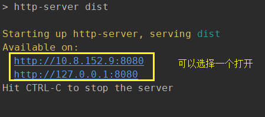

## 多页面打包

多页面的打包，之前也有提过，主要是用**HtmlWebpackPlugin的chunk**与入口**entry**对应实现多页面打包

假如我们有2个入口文件:

- src/index.js

- src/list.js

期望:

- 生成index.html，引入index.js

- 生成list.html，引入list.js

``````
// 1、新建2个入口文件
src/index.js:
import $ from 'jquery'

console.log('index');
console.log($('body'));


src/list.js
import $ from 'jquery'

console.log('list');
console.log($('div'));


// 2、配置webpack.config.js
const path = require('path');
const HtmlWebpackPlugin = require('html-webpack-plugin')
const { CleanWebpackPlugin } = require('clean-webpack-plugin')

module.exports = {
    mode: "production",
    entry: {
        index: './src/index.js', // 多入口文件
        list: './src/list.js',
    },
    output: {
        path: path.resolve(__dirname, 'dist'),
        filename: '[name].js',
    },
    resolve: {
        extensions: ['.js'],
        alias: {
            '@': path.join(__dirname, 'src'),
        },
    },
    module: {
        rules: [
            {
                test: /\.js$/,
                exclude: /node_modules/,
                loader: 'babel-loader',
            },
        ]
    },
    optimization: {
        splitChunks: {
            chunks: 'all',
            cacheGroups: { // 拆分出vendors包
                vendors: {
                    test: /[\\/]node_modules[\\/]/,
                    name: 'vendors'
                },
            }
        }
    },
    plugins: [
        new CleanWebpackPlugin(),
        new HtmlWebpackPlugin({ // 生成index.html文件
            title: 'webpack-index',
            minify: {
                removeComments: true,
                collapseWhitespace: true,
                minifyCSS: true,
            },
            filename: 'index.html',
            template: path.resolve(__dirname, 'index.html'),
            chunks: ['index', 'vendors'], // 与entry对应
        }),
        new HtmlWebpackPlugin({ // 生成list.html文件
            title: 'webpack-list',
            minify: {
                removeComments: true,
                collapseWhitespace: true,
                minifyCSS: true,
            },
            filename: 'list.html',
            template: path.resolve(__dirname, 'index.html'),
            chunks: ['list', 'vendors'], // 与entry对应
        }),
    ]
}
    
// 3、配置package.json
"scripts": {
    "build": "webpack --progress",
},

执行npm run build

``````



打开html中可以发现:

index.html引入的是index.js

list.html引入的是list.js

这就是 **HtmlWebpackPlugin** 插件的 **chunks** 属性，自定义引入的 js


